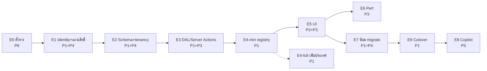

# backlog.md — P8-PM/BA

> 🟢 **ระยะสร้าง (ตั้งแต่ `D33` · 18 ส.ค. 2026)** — เอกสารนี้เป็นแผน ไม่ใช่โค้ด แต่ **งานที่มันอธิบายเดินอยู่จริงแล้ว** บน branch `platform`
> · อ่าน `docs/engine/README.md` ก่อน · ⚠️ **หัวเรื่องเดิมเขียนว่า "ระยะออกแบบเท่านั้น" ซึ่งหมดอายุตั้งแต่ 18 ส.ค. — ผมเพิ่งมาเจอของตัวเองวันที่ 24**
> เขียนโดย P8-PM/BA · 17 ส.ค. 2026 · ตัวเลขทุกตัวในไฟล์นี้นับจากโค้ดจริงเอง ไม่ได้ลอกจากบรีฟ
>
> **`PLAN.md` เป็นโซนของ P1** — ทุกอย่างในไฟล์นี้คือ *ข้อเสนอ* ที่รอ P1 ตัดสินก่อนย้ายเข้า `PLAN.md`
>
> **รอบแก้ที่ 1 (17 ส.ค. 2026)** — P1 รีวิวแล้ว **รับข้อแย้งทั้ง 3 ข้อ** (→ `README.md` D10 · D12 · D13)
> และรับ E9 Cutover · โหมดหน้างาน · DoD `npm run build` + D4
> · ข้อแย้งใหม่จาก D3 (ระเบิดเวลา i18n) → หัวข้อ [2.6](#26---i18n-เลื่อนไป-m2--ตัดสินแล้ว-d20--p2-เห็นด้วย)
>
> **รอบแก้ที่ 54 (26 ส.ค. 2026) — `E0` ทั้งเฟสเป็น `E2-AC14` ซ้ำในสเกลใหญ่กว่า (P1 ตรวจของจริงส่งมา · P8 ตัดสิน ไม่ติ๊กแทนกัน) · `R11` เหตุการณ์ที่ 2 (กติกาสองข้อดันกันเอง) · `P-76` เหตุการณ์ที่ 4 เติมมุมกระจกจาก P4 (ไม่ใช่เหตุการณ์ที่ 5):**
> · 🔴 **`E0` แก้เป็น 10/10** — เนื้อหาพิสูจน์เสร็จมานานแล้ว checkbox ไม่เคยถูกติ๊ก (`E2-AC14` แต่ที่สเกลเฟสทั้งเฟส) แยกยืนยันสด (AC1/AC5/AC9 — branch `platform` · CI 4 job เขียว · gitleaks ทำงานจริง) จากปิดตามบริบทไม่ได้ยิงสดรอบนี้ (AC2/AC3/AC7/AC10/AC6) · แก้ข้อความ `E0-AC4` ขีดฆ่าเลข "14 ตารางจาก 0001–0031" ที่ล้าสมัยแล้ว (ตอนนี้ 70 migration ไฟล์ 22+ ตาราง เจตนาเกินแล้วแต่เลขเดิมอ้างอิงไม่ได้)
> · 🔴 **`R11` เหตุการณ์ที่ 2:** ชุดเต็ม 4 รอบใน ~20 นาที แดง 2 เคสเดิมเป๊ะ รันไฟล์เดี่ยวเขียว ไม่ใช่ regression — P4 ขยับเส้นจากข้อเท็จจริงใหม่: `D72` บังคับรันชุดเต็มก่อน push + 8 เซสชันรันได้ = ยิ่งทำตามกติกายิ่งชนบ่อยขึ้น (กติกาสองข้อดันกันเอง) · P4 ลง nudge ที่ reporter แล้ว (`89ecd31`+`2e68269`) ไม่กันการชน แค่แยกชนจากพัง · P1 push แล้ว (`4e35aca`) หลังยืนยันหัวเขียวตาม `D72`
> · 🔴 **`P-76` เหตุการณ์ที่ 4 เติมของใหม่ (P1 ส่งมาเรียก "เหตุการณ์ที่ 5" — ตรวจแล้วเป็นเหตุการณ์เดิม ไม่มินท์เลขใหม่):** P4 จับคู่กระจกกับเหตุการณ์ที่ 1 — เช้านี้ P4 เกือบรายงาน "กันได้" จากช่องที่ไม่ทำงาน / รอบนี้ P1 เกือบรายงาน "บั๊กจริง" จากการชนที่บังเอิญซ้ำ ทิศตรงข้ามกัน กลไกเดียวกัน ยืนยันว่า `P-76` ไม่ใช่อคติทางเดียว
>
> **รอบแก้ที่ 53 (26 ส.ค. 2026) — `E3-AC4` ปิดครบตามถ้อยคำ (`guardedStorage.ts` รวมด่าน) · `P-76` เหตุการณ์ที่ 4 (P1 เอง แดงซ้ำไม่เท่ากับกำหนดได้):**
> · ✅ **`E3-AC4` ปิด** — `guardedStorage.ts` ห่อ `writeGuard` ในตัวเอง ทำให้ "อยู่ที่ไหน" กับ "ห่อหรือไม่" เป็นคำถามเดียว วัดจริง `ALLOWED_FILES` เหลือไฟล์เดียว 2 จุดเขียนทั้งรีโปอยู่ในนั้นทั้งคู่ · เขียนกำกับหนี้ใหม่ (`getPublicUrl` หายแล้วแต่ฟอร์แมตเก่ายังงอกทุกอัปโหลด รอ `E7`) และกับดักไฟล์หัว (`guardedStorage.ts` ห้ามมี `import "server-only"` ต่างจาก `db.ts`)
> · 🔴 **`P-76` เหตุการณ์ที่ 4:** P1 เห็นแดงซ้ำ 2 รอบสรุปว่าเป็นบั๊กจริง เกือบรายงาน P4 — รันอีกรอบเขียว "ซ้ำ" ไม่เท่ากับ "กำหนดได้" ส่งเลขให้ P4 ตัดสินว่าถึงเส้น `R11` หรือยัง · แยกกรณีคู่กัน (canary ยึดไฟล์ที่ย้าย) ออกจาก `P-76` เพราะสาเหตุถูกระบุถูกต้องตั้งแต่แรก ไม่ใช่รูปที่ `P-76` นิยามไว้
>
> **รอบแก้ที่ 52 (26 ส.ค. 2026) — `P-76`: "เห็นกลไกที่อธิบายอาการได้" ≠ "นั่นคือสิ่งที่เกิดจริง" เกิด 3 ครั้งวันเดียว · `E3-AC4` เลขผิด (`P-61`) และยังไม่ครบตามถ้อยคำ:**
> · 🔴 **`P-76` มินท์แล้ว** (P6 แยกจาก `D82`) — ข้ามขั้น "เงื่อนไขนำของกลไกเป็นจริงจริงไหม" เกิดกับ P4 (id ปลอม ล้มที่ lookup ไม่ใช่ trigger) และ P1 สองครั้ง (`D83` ไม่ตรวจซ้ำก่อนมินท์ · `linked-project.json` สรุปผิดว่า `db push` จะรันใส่ engine-dev ทั้งที่ P6 ยิงจริงพบ CLI หยุดเองก่อน) — คนละชนิดจาก `D82` (เครื่องมือพังเงียบ) เพราะ `P-76` คือคำอธิบายที่ไม่เคยถูกยิงเลย
> · 🔴 **`E3-AC4`:** เลข "0/9→19/19" ผิด แก้เป็น 16/16 (เขียนจริง 6 จุด อ่าน 2 จุดไม่ควรนับ) — `P-61` อีกครั้ง คราวนี้ P1 เป็นคนส่งต่อเอง · **ยังไม่ปิด** เกณฑ์ขอเทสต์ที่พิสูจน์ "ห่อ guard หรือไม่" แต่ด่านที่มีคุมแค่ "เขียนได้ที่ไหน" รอ P2 ตอบข้อเสนอรวมโมดูลก่อนปิด
>
> **รอบแก้ที่ 51 (26 ส.ค. 2026) — `Q9` เปิด: read-only monitoring ปลอดภัยเพราะยังไม่มีผู้ใช้ ไม่ใช่เพราะกันได้ (P4 · P6 ตรวจ scope):**
> · 🔴 **มินท์ `Q9` ใน `README.md` เอง** (self-serve ตามดีไซน์ของ `§9`) — `check-readonly-mode.py` เห็น "โหมดค้าง" ได้เฉพาะตอนมี CI run วันนี้พอเพราะโหมดค้าง = งานพัฒนาหยุด (รับได้) แต่วันที่ `platform` มีผู้ใช้จริงจะกลายเป็นผู้ใช้เขียนไม่ได้จนมีคนสังเกต (อาจรับไม่ได้)
> · **เหตุผลที่ต้องอยู่ในทะเบียน ไม่ใช่แค่คอมเมนต์ไฟล์ (P4 ชี้ตรง):** คนที่ต้องรู้คือคนกด ship `platform` ขึ้น prod — เขาไม่เปิด `check-readonly-mode.py` ตอนตัดสินใจ เขาเปิดทะเบียนคำถามเปิด
> · **รูปแบบเดียวกับ 2 เรื่องที่ปิดไปแล้ววันนี้แต่จริงๆ คือเลื่อน:** `E2-AC1` วัด REST ไม่วัด Realtime · pin publication=0 — "ปลอดภัยเพราะยังไม่มีคนเปิดใช้ ไม่ใช่ปลอดภัยเพราะกันได้" ผูก `Q9` เข้า `E3-AC7` ในบันทึกแล้ว ห้ามอ่านว่า `AC7` ปิดเรื่อง monitoring สนิท
>
> **รอบแก้ที่ 50 (26 ส.ค. 2026) — `E3-AC3` เขียนใหม่ทั้งข้อ: วัดสิทธิ์จริงแทนคีย์ใน bundle · Realtime/RLS กลายเป็นเกณฑ์หลัก · `D83` ปิดจบ P1 ยอมรับเอง:**
> · 🔴 **`E3-AC3` เกณฑ์เดิมวัดตัวแทนที่ผิด — คีย์เป็นของสาธารณะโดยดีไซน์ (`sb_publishable_...`) P1 ยิงจริงคีย์ที่หลุดได้ 401 ทุกตาราง** ไล่ตาม "0 ใน bundle" ต่อไปคือไล่ของที่ Auth ปิดไม่ได้ตลอดกาลโดยนิยาม (ต้องมีคีย์ถึงล็อกอินได้)
> · ✅ **เขียนเกณฑ์ใหม่ (P8 ตัดสิน):** วัด "ไคลเอนต์ทำอะไรเกินสิทธิ์ไหม" แทน — ปิดไปมากแล้วโดย `E3-AC1` · 3 กลุ่มข้อยกเว้น (Auth/Storage/Realtime) ต้องมีเหตุผลกำกับตามที่ AC เดิมเรียกร้องเอง
> · 🔴 **เกณฑ์หลักตัวใหม่ที่มีค่ากว่าเรื่องคีย์ทั้งหมด: `postgres_changes` เคารพ RLS จริงไหม — ยังไม่เคยวัด** ถ้าไม่เคารพ คือรูใหญ่กว่าเรื่องคีย์รวมกันทั้งหมด (C subscribe ทริปของ A ได้ไหม) ส่ง P4 ยิงแล้ว ห้ามปิด `AC3` จนกว่าจะมีผล
> · ✅ **`D83` ปิดจบ — P1 ยอมรับเองว่าอ่านหลักฐานผิดทาง** ด่านทำงานถูกในขอบเขตของมัน ไม่ใช่หลักฐานให้ขยาย ไม่มีอะไรค้างต่อ
>
> **รอบแก้ที่ 49 (26 ส.ค. 2026) — `E3-AC7` ปิด (สวิตช์ read-only 2 ชั้นพิสูจน์จริง) แก้ถ้อยคำผิดเรื่อง RPC · `D83` ชนซ้ำแต่ด่านจับได้เอง:**
> · ✅ **`E3-AC7` ปิด** — DB (trigger `zz_read_only_guard`) + DAL/UI (`PT503`/banner) พิสูจน์จริงทั้งคู่ · แก้ถ้อยคำเดิมที่ผิด (`revoke` กัน RPC ไม่ได้เพราะเป็น `security definer` — ใช้ trigger แทน) · เขียนกำกับ 2 จุดที่ยังไม่พิสูจน์ชัดเจน (ชั้นในของ `set_system_mode` ยิงไม่ถึง · เคสสดถาวรยังลงไม่ได้เพราะ `R11`) และของที่ตัดสินไม่ทำ (ปิดปุ่มเขียน ~67 จุด — UX แย่กว่า ไม่ใช่ช่องโหว่)
> · 🔴 **`D83` ชนซ้ำจริง — แต่คราวนี้ด่านจับเอง ไม่ใช่คนสังเกต:** P1 มินท์ซ้ำทั้งที่ตัดสิน `D83` จริงเองมาก่อนในวันเดียวกัน ย้ายเป็น `D85` — **ต่างจาก `P-72`/`P-73` ตรงที่ทั้งสองมินท์อยู่ไฟล์เดียว `decision-refs` เลยจับได้ทันที** ยืนยันข้อสรุปเมื่อคืน (ด่านไฟล์เดียวทำงานได้จริงในขอบเขตของมัน ปัญหาที่เหลือคือข้ามไฟล์) ไม่ใช่หลักฐานให้ขยาย
>
> **รอบแก้ที่ 48 (26 ส.ค. 2026) — `E2-AC13` ปิดครบทั้ง ①②③ (P3 ยืนยัน) · โค้ดตายลบแล้ว:**
> · ✅ **③ ปิด (`4445e19`)** — แก้ที่ `lib/engine/files.ts` ไม่ใช่ `sw.js` ตามที่คาดไว้เดิม (`signStoredFile`/`signStoredFiles` fetch เอง cache เอง คืน object URL) สัญญาฟังก์ชันเดิมทุกประการ ไม่แตะ consumer · ปิดครบ 3 ข้อที่ P1 สั่งก่อนเขียนโค้ด (CORS วัดจริง · `revokeObjectURL` · LRU eviction 40 ไฟล์) · verified ครบ (`tsc`/`eslint`/636 เทสต์/`guards.sh`/`next build`)
> · ✅ **`/api/booking-file/[...path]` ลบแล้วตามที่บันทึกไว้ว่าจะทำ** พื้นผิวโจมตีที่ไม่มีใครดูปิดแล้ว
> · 📊 **`E2` ทุกเกณฑ์ที่เคยเปิดจาก `E3` ย้อนกลับมาปิดครบแล้ว**
>
> **รอบแก้ที่ 47 (26 ส.ค. 2026) — `E2-AC13`② บันทึกกลไกผิด แม้ผลลัพธ์จริง (`P-75`) · สมมติฐานผิดส่งต่อไปเป็นคำสั่งงานของ ③ · P3 กู้คืนด้วยการตรวจซอร์สเอง:**
> · 🔴 **`P-75`:** ② เขียนว่าใช้ proxy `/api/booking-file/[...path]` — **ไม่จริง** ไม่มีจุดไหนในเว็บเรียก route นี้เลย ทั้ง 6 ไฟล์เรียก `signStoredFile()` (คนละกลไก) route ที่สร้างไว้เป็นโค้ดตายตั้งแต่วันแรก **ผลลัพธ์ (เปิดไฟล์ได้จริง) ยังยืนอยู่ เช็คบ็อกซ์ถูก แค่คำอธิบายกลไกผิด** — อันตรายกว่าเช็คบ็อกซ์ผิดตรงๆ เพราะ P1 เอาไปสร้างสมมติฐานผิดต่อให้ P3 ก่อนมีใครตรวจซอร์ส
> · ✅ **P3 ไม่เชื่อบันทึกที่ส่งไป ไปตรวจซอร์สเอง — เป็นด่านเดียวที่หยุดมันไว้ ไม่มีเครื่องมือไหนจับได้เลย** ผลคือ "กรณี B": สมมติฐานเดิมของ `E2-AC13`③ ยังจริงทั้งหมด ไม่ต้องแก้ถ้อยคำ — P3 เสนอทางที่ดีกว่าไม่ต้องใช้ proxy P1 รับแล้ว สั่งปิด CORS (วัดจริง ไม่ใช่สมมติ) + `revokeObjectURL` + โควตา Cache Storage ก่อนเขียนโค้ด
> · 📌 **`/api/booking-file/[...path]` ค้างไว้เป็นโค้ดตายจนข้อเสนอ P3 ลง แล้วลบทิ้ง** — พื้นผิวโจมตีที่ไม่มีใครดูระหว่างนี้ บันทึกไว้กันลืม
>
> **รอบแก้ที่ 46 (26 ส.ค. 2026) — `E2-AC9` ปิด (ไม่ใช่การอุดรู) · `P-74` (`hidden_places` รอดจาก freeze + ด่าน 2 ตัวต่างวิธีค้น) · `E2-AC13`③ อาจต้องเขียนใหม่:**
> · ✅ **`E2-AC9` ปิด — เขียนกำกับชัดว่า "0" ไม่ใช่การอุดช่องโหว่** เพราะ column grant ปิดฝั่งเขียนของ client ไปแล้วตั้งแต่ 25 ส.ค. งานนี้คือความถูกต้องของค่าที่แสดง
> · 🔴 **`P-74`:** `hidden_places` รอดจาก freeze เพราะ grant ระดับตาราง (ไม่ใช่ column) ทำให้ client ปลอม `hidden_by_user` ได้ — ปิดแล้ว ยืนยันกับฐานจริง มี 2 ส่วนย่อย: ① คำเตือนที่ถูกอยู่ในคอมเมนต์ migration แต่ไม่มีใครเดินผ่านตอนสร้างตารางใหม่ (ตัดสินว่า**ไม่ใช่ `D82`** เพราะไม่มีอะไรขัดกันเอง แค่อยู่ผิดที่ — ไม่มินท์เลขแยกตามกติกาที่ 4 ของ `§10`) ② ด่าน 2 ตัวของ P4 ต่างกันแค่ค้นด้วยรายชื่อ vs แพตเทิร์น ตัวหนึ่งพลาดตัวหนึ่งไม่พลาด — ส่งให้ P4 ตัดสินเรื่องขยาย ไม่แก้เอง
> · 🔴 **`E2-AC13`③ อาจต้องเขียนใหม่ทั้งข้อ ไม่ใช่แค่ติ๊ก** — proxy ของ ② อาจเปลี่ยนพื้นใต้ ③ ไปแล้ว (จาก "แก้ `sw.js`" เป็น "ยืนยันไม่มีเส้นทางหลงเหลือ") รอ P3 ยืนยัน
>
> **รอบแก้ที่ 45 (26 ส.ค. 2026) — `E3-AC1`/`AC2` ปิด (DAL 10/10 hooks) · `E2-AC9`/`AC13`③ ถึงคิว · `updateStopPlace` บันทึกเป็นของค้างที่ตั้งใจให้ดัง:**
> · ✅ **`E3-AC2` ปิด — 10/10 hooks แปลงครบ** (`useStops` ตัวสุดท้าย `de8798e`)
> · ✅ **`E3-AC1` ปิดตามเจตนา ไม่ใช่ตามตัวเลขดิบ (P8 ตัดสิน แก้ถ้อยคำกันชนแบบ `P-61`):** ดิบเหลือ 8 บรรทัด/4 ไฟล์ แต่ **ที่รันฝั่ง client = 0** (7 จุดอยู่ใน `app/api/*` เซิร์ฟเวอร์อยู่แล้ว 1 จุดในคอมเมนต์) — แยกตารางในเกณฑ์ให้ชัดว่า "ดิบ" กับ "ที่รันฝั่ง client" เป็นคนละตัวเลข พร้อมหมายเหตุว่ายังไม่ใช่ "ชั้นเดียวจริง" ตามอุดมคติของ `US-E3` (มี 2 เส้นทางเซิร์ฟเวอร์คือ DAL กับ route) — ปลอดภัยเท่ากันแต่ไม่รวมศูนย์ จดเป็นข้อสังเกตสถาปัตยกรรม ไม่ใช่ของค้างความปลอดภัย
> · 🔴 **`E2-AC9` (ครึ่งโค้ด) และ `E2-AC13`③ (`sw.js`) ถึงคิวแล้ว** — แนะนำ `AC9` ไปก่อน (โซน P1 ทำได้ทันที) ส่วน ③ ส่งขนานให้ P3 ได้เลย คนละไฟล์คนละโซนไม่ต้องรอกัน
> · 📌 **`updateStopPlace` ข้ามชนิด (catalog↔custom) ยังไม่รองรับ** — ตั้งใจให้ `console.error` ดังแทนเงียบ บันทึกเป็นของที่รอการตัดสินใจ (แปลง/ลบสร้างใหม่/ห้ามข้าม) ไม่ใช่บั๊กที่รอแก้
>
> **รอบแก้ที่ 44 (26 ส.ค. 2026) — เลขจัดเรียงถูกใน `README.md` แล้ว (ไม่ต้องแก้ฝั่งผม) · ด่าน "หนึ่งเลขหนึ่งนิยาม" กันได้แค่ครึ่ง (อ่านไฟล์เดียว) · `P-72` ได้เนื้อเต็มครั้งแรก:**
> · ✅ **เช็คแล้วเลขของผมตรงกับที่ P1 จัดสุดท้าย** (`P-72`=`P-63` ครั้งที่ 3 · `P-73`=`Day`/`legacy_slug`) ไม่ต้องแก้
> · 🔴 **ด่าน `decision-refs` "หนึ่งเลขหนึ่งนิยาม" เขียวตลอดตอนที่ `P-72`/`P-73` กำลังชนกัน — เพราะอ่านแค่ `README.md`** การชนจริงอยู่ระหว่าง `README.md` กับ `backlog.md` (`D46` ตรงรอยต่อระหว่างเอกสาร ไม่ใช่ในเอกสาร) จับได้เพราะคนสังเกต ไม่ใช่ด่าน — ครั้งที่ 2 ในคืนเดียว
> · **กลไกจริงของการชน:** `P-72` เดิมอยู่แค่ในคอมเมนต์ migration + commit message ที่ไม่มีใคร `grep` เจอ — finding ไม่มีที่อยู่ทางการก่อนถูกอ้าง จึงได้เลขจากคนละทะเบียน ตรงกับหลักการข้อ 1 ของ `§10` เป๊ะ
> · **ความเห็นต่อคำถามขยายด่านข้ามไฟล์:** ไม่ขยาย — ปัญหาคือวินัยการมินท์เลข ไม่ใช่ด่านตรวจไม่ครบไฟล์ ด่านข้ามไฟล์จะเจอปัญหาเดิมที่ P6 ปฏิเสธการตรวจ*การอ้างถึง*ไปแล้ว วิธีที่ได้ผลจริง 2 ครั้ง (อ่านแล้วทัก) พอสำหรับอัตราการชนที่เจอ
> · ✅ **`P-72` ลงทะเบียนเนื้อเต็มแล้ว** พร้อมคำเตือนใหม่: `do $verify$` ในไฟล์เดียวกับ DDL จับ "พิมพ์ผิด" ได้ จับ "ตั้งใจผิด" ไม่ได้เลย ห้ามอ่านเป็นการรับประกัน
>
> **รอบแก้ที่ 43 (26 ส.ค. 2026) — P1 ถอนรายงานรอบก่อน: ดูผิดตาราง `AC15` ไม่มีปัญหา · เจอของจริงคนละเรื่องแทน (`P-73`) · เกือบรื้อด่านที่ถูก:**
> · ✅ **ถอนแล้ว: `Day` มี 2 ตารางในเอกสาร P1 เปิดตารางสรุปเก่า (11 แถว) ไม่ใช่ตาราง `Day` เต็ม (13 แถว มี `id`/`date` ครบ)** — ตัวตรวจ `941014f` ถูกทุกอย่าง เขียวเพราะถูก ไม่ใช่เพราะมองไม่เห็น **ลบข้อสรุปเดิมออกจาก `E2-AC15` ไม่ต้องพิจารณาใหม่**
> · 🔴 **เกือบรื้อด่านที่ทำงานถูก:** ไล่กลไกแล้วเจอจุดอ่อนจริงข้อหนึ่ง (รวมโทเคนข้ามชนิด) แล้วสรุปเร็วเกินไปว่านั่นคือสาเหตุ — "เจอกลไกที่อธิบายอาการได้" ≠ "นั่นคือสาเหตุ" สิ่งที่กันไว้คือคำถามกลับของผม ไม่ใช่ด่านไหน
> · ✅ **`P-73` (ของจริงที่เจอระหว่างทาง, คนละเรื่องกับ `P-72` เดิม):** คำตอบของ `Day.id` ชี้ไป `trip_days.legacy_slug` ซึ่ง**ไม่มีคอลัมน์นี้เลย** (400 จริง) — ตระกูล "คำตอบชี้ไปของที่ไม่มีอยู่" แก้แล้วโดยไม่ต้องเพิ่มคอลัมน์ (`date` เป็นคีย์ธรรมชาติอยู่แล้ว) `dayBridge.ts` ยังถูก — นี่คือเกณฑ์ที่ควรเพิ่มให้ `AC15` จริงๆ (ตรวจว่าคำตอบชี้ไปที่มีอยู่จริง ไม่ใช่แค่มีคำตอบ)
> · 📌 **บทเรียนแก้ใหม่:** ไม่ใช่ "เลขในหัวข้อไม่ถูกตรวจ" แต่คือ**นับจากตารางแรกที่เจอ เทียบกับเลขที่พูดถึงทั้งหัวข้อ — คนละขอบเขต** ตรงกับ `P-61` ที่ P1 เป็นทั้งคนเขียนกฎและคนละเมิดเอง
>
> **รอบแก้ที่ 42 (26 ส.ค. 2026) — `E2-AC15` มีรูจริง (`Day.id`/`date` หายจากเอกสารตั้งแต่ต้น) · `Day.id` ทิ้ง กระทบ `E3-AC2` · `Q6` ปิด · `P-72` (`P-63` รอบ 3 แม้มีเทคนิคกันแล้ว):**
> · 🔴 **`E2-AC15` เจอรูจริงระหว่างงาน `E3`:** หัวข้อ `Day` เขียนว่า 13 ฟิลด์ ตารางมีแค่ 11 แถว `id`/`date` หายทั้งคู่ ไม่มีใครนับรวมทั้งคนเขียนเอง — ใส่เป็นหลักฐานในตัว AC ตามที่ขอ พร้อมคำถามที่ยังไม่มีคำตอบ (ตัวตรวจที่ลงแล้วน่าจะต้องจับสิ่งนี้ได้ ทำไมไม่จับ — ยังไม่ฟันธง)
> · ✅ **`Day.id` ("d0") ทิ้งทั้งคอลัมน์ จับคู่ด้วย `date` ตอน `E7`** — เพิ่มเกณฑ์ใหม่ใน `E3-AC2`: ทุก hook ที่คีย์ด้วยวันต้องมีสะพาน `"d0"→date→uuid` ที่เดียว ก่อนแปลง hook ตัวที่สอง
> · ✅ **`Q6` ปิดแล้ว ไม่ต้องยกให้ผู้ใช้อีก** — `custom_places.description` แยกเข้า `custom_place_descriptions` + drop คอลัมน์เดิม
> · 🔴 **`P-72`: `P-63` เกิดครั้งที่ 3 — เทคนิคกันเอง (เทียบชื่อ) ก็ไม่กัน เพราะรายชื่อ "ควรเป็น" มาจากลิสต์ผิดใบเดียวกัน** เทียบชื่อแก้ปัญหาหน่วยวัดได้ ไม่แก้ปัญหาแหล่งที่มา — จับได้ด้วยด่านของ P4 ที่ไม่มีค่าคาดหวังจาก P1 เลย บทเรียน: **ตัวตรวจต้องมีเจ้าของคนละคนกับของที่ถูกตรวจ**
> · 📊 **`E3`:** `AC1` 68→66 · `AC2` 1/10 hooks
>
> **รอบแก้ที่ 41 (26 ส.ค. 2026) — แก้การจัดหมวดของตัวเอง: `P-68` ย้ายจาก `R2` เหตุการณ์ที่ 5 ไปเป็น `R11` ใหม่ (P4 แย้งชนะ):**
> · 🔴 **P4 ใช้เกณฑ์คมกว่าที่ผมใช้ตอนจัด `P-68` เข้า `R2`:** "คนเจอปัญหานี้ อ่าน `R2` แล้วเจอทางแก้ไหม" — ไม่เจอเลย ทางลด 3 ข้อของ `R2` เป็นกติกา `git` ล้วน ไม่แตะฐานข้อมูล และ `P-68` เกิดตอนทรีสะอาดไม่มีใคร commit/checkout ชนกัน — กติกาทั้ง 3 ทำงานถูกแล้วมันก็ยังเกิด **ทรัพยากรที่แชร์กันคนละตัว: `R2`=ทรี · นี่=ฐานข้อมูล**
> · ✅ **สร้าง `R11` แยก** พร้อมทางลดที่เขียนตรงๆ ว่ายังไม่มีกลไก มีแค่ "ถามก่อนรัน" ตามที่ P4 ขอ ไม่ให้อ่านเหมือนมีคนกันไว้แล้ว — ย้ายเนื้อหา `P-68` ทั้งหมดจาก `R2` มาที่นี่
> · 🎯 **เหตุผลเดียวกับที่แยก `R10` ออกจาก `R2` เอง** (P4 ชี้ตรงๆ ว่าผมใช้เหตุผลนี้เองมาก่อน) — รากร่วมกันได้ (ทรัพยากรแชร์ + เครื่องมือสมมติว่าไม่มีใครอื่น) แต่ทางลดต้องแยก เพราะความเสี่ยงไม่มีทางลดของตัวเองจะถูกอ่านว่ามีทางลดแล้วถ้านั่งอยู่ใต้หัวข้อที่มี 3 ข้อ
>
> **รอบแก้ที่ 40 (26 ส.ค. 2026) — `P-68` เต็ม: 2 อาการรากเดียวกัน (fixture ชนกันข้ามรอบเทสต์) · แดงปลอมเจอแล้ว เขียวปลอมแก้ก่อนเจอ · `R2` เหตุการณ์ที่ 5:**
> · 🔴 **`TEST_COUNTRY_CODES` ตายตัวต่อบล็อก → 2 รอบพร้อมกันชนรหัสเดียวกันเสมอ (100% ไม่ใช่บางครั้ง)** P1 เจอ "ไม่มี fixture" (หายก่อนเคสเริ่ม) P4 เจอ "คนนอกลบได้" (หายระหว่างเคสนับ) — คนละอาการ รากเดียวกัน
> · 🎯 **แดงปลอมคือของที่เจอ (เสียเวลาแต่ไม่มีใครเชื่อผิด) — ทิศตรงข้ามอันตรายกว่ามากและเงียบสนิท:** ถ้า fixture หายจังหวะอื่น เคส "คนนอกเห็น 0 แถว" จะเขียวเพราะตารางว่าง ไม่ใช่เพราะป้องกันทำงาน — **แก้แล้วก่อนจะเจอจริง** ด้วยการอ่านทั้งเจ้าของและคนนอกรอบเดียวกัน ตารางว่าง = สรุปไม่ได้ ไม่ใช่ผ่าน
> · 📌 **เงื่อนไขแก้ถาวร:** ทำเมื่อคนเริ่มไม่เชื่อผลแดงจนต้องรันซ้ำ (`R9` ในรูปความไว้ใจ) — คืนนี้เกิด 1 ครั้ง ยังไม่ถึงเส้น มีทางแก้เตรียมไว้แล้ว (จองรหัสด้วย insert) แต่มีหางที่ยังไม่มีคำตอบ (รอบตายกลางคันไม่คืนรหัส → รั่วทีละตัว)
> · 🎯 **บทเรียนที่ P4 ให้และมีค่าที่สุด:** เครื่องมือคืนนี้ทั้ง 3 ตัวถามแค่ "ฐานตรงกับ commit ไหม" ไม่มีตัวไหนถามว่า "มีใครกำลังเขียนอยู่หรือเปล่า" — เข้า `R2` เป็นเหตุการณ์ที่ 5 ตรงๆ (เครื่องมือออกแบบโดยสมมติว่ามีเราคนเดียว ซึ่งเป็นสมมติฐานที่ `TEAM.md` ทั้งไฟล์เขียนมาเพื่อบอกว่าไม่จริง)
>
> **รอบแก้ที่ 39 (26 ส.ค. 2026) — เลข `P` ชนซ้อนสองรอบในคืนเดียว · หลักฐานว่า `D<n>` ไม่ชนเพราะมีด่าน `P<n>` ไม่มี:**
> · 🔴 **`P-67` ที่ผมย้ายให้ ชนอีกรอบกับ `P-67` อิสระของ P1 เอง** — จัดใหม่ใน `README.md` แล้ว (`48a5cd2`): `P-66`=`decision-refs` (คงเดิม ถูกแล้ว) · `P-67`=LIKE wildcard (เลขที่ผมย้ายให้ตรงกับที่จัดสุดท้ายพอดี) · `P-68`=finding ใหม่ (รันชุดสดซ้อนสองเซสชัน รอรายละเอียด) · `P-66` มีนิยามใน `README.md` แล้วด้วย
> · 🔴 **หลักฐานคม: คืนเดียวชน 3 ครั้ง (`D71`/`P-66`×2/`P-67`×2) ขณะที่ `D<n>` ไม่ชนเลยทั้งคืนแม้ออกเลขถี่พอกัน** — ต่างกันแค่ `decision-refs` ตรวจ `D<n>` อย่างเดียว ไม่ครอบ `P<n>` เลย · P1 ส่งเป็นข้อเสนอให้ P6 ตัดสิน (ไม่สั่ง) พร้อมชี้ว่าต้องมีเคส "หนึ่งเลขหนึ่งนิยาม" ไม่ใช่แค่ขยาย prefix
> · ✅ **ยืนยันวิธีทำงาน: เลขชนที่มั่นใจแล้วให้แก้ทันทีแล้วรายงาน ไม่ต้องรออนุมัติก่อน** — P1 ยืนยันชัดว่านี่คือทางที่ถูกต่อไป
>
> **รอบแก้ที่ 38 (26 ส.ค. 2026) — `E2` จบเชิงปฏิบัติ (P8 ตัดสิน) · `E3-AC7` แก้เป็น 2 ชั้น · `P-67` เลข `P` ชนกันจริงสด ๆ:**
> · ✅ **ประกาศ `E2` จบเชิงปฏิบัติ พร้อมเริ่ม `E3`** — `AC9`/`AC13` ③ ที่เหลือเป็นงานของ `E3` โดยนิยาม ไม่ใช่ของค้าง เช็คบ็อกซ์ยังเป็น `[ ]` ตามจริง แต่ไม่บล็อกการเริ่มเฟสถัดไป
> · 🔴 **`E3-AC7` แก้ถ้อยคำก่อนมีคนทำตามผิด — read-only ต้อง 2 ชั้น:** DB (`revoke`/policy) บังคับจริง + DAL บอกเหตุผลที่คนอ่านออก (DB คืนแค่ `42501`) — สวิตช์อยู่ใน DAL อย่างเดียว = ปุ่มที่ซ่อนยากขึ้น ไม่ใช่ read-only จริง (ตระกูล `P-30`/`D38`) ต้องถาม P6 (คนกดตอน cutover) และ P7 (คิวออฟไลน์ตอน read-only จะเกิดอะไร — คมที่สุด) ก่อนเริ่มเขียนจริง
> · ✅ **`E2-AC14` self-critique ของ P1 บันทึกแล้ว:** "ไม่ติ๊กเพราะกลัว" กับ "ไม่ติ๊กเพราะยังไม่ผ่าน" หน้าตาเหมือนกันในไฟล์ — เข้า `DoD-8` ตรงๆ
> · 🔴 **`P-67` — เลข `P` ชนกันจริงระหว่างที่กำลังคุยเรื่องเลขชนกัน:** P1 ส่งของใหม่มาเป็น `"P-66"` ซึ่งผมใช้ไปแล้วเมื่อรอบก่อนหน้า (decision-refs) — แก้เป็น `P-67` ทันทีไม่รอถาม (`search_place_names` ไม่ escape wildcard `%` ทำให้ด่านกันคำค้นว่างไม่ครอบเคสนี้ แก้แล้ว `5f8c8be`) **หลักฐานสดของ `§10` เกิดขึ้นในบทสนทนาที่กำลังพูดถึง `§10` เอง**
>
> **รอบแก้ที่ 37 (26 ส.ค. 2026) — `E2-AC15`/`AC14` ปิด · `E2-AC13` เหลือ ③ รอ `E3` · `P-66` (`decision-refs` ตรวจโครงสร้างไม่ตรวจเนื้อหา) · `E2` ณ ตอนนี้ 11 ปิด/2 เปิด:**
> · ✅ **`E2-AC15` ปิด (`941014f`)** — ตัวตรวจจับ P1 เอง 3 รอบก่อนเขียว รอบที่มีค่าที่สุดคือ `Slot.candidateIds` เขียนถูกในย่อหน้าแต่ไม่ใช่แถวตาราง (**"เขียนถึงแล้ว" ≠ "ตัดสินแล้ว"** — รากของ `P-57`) เขียนขอบเขตกำกับชัดว่าครอบน้อยกว่า `AC6` โดยเจตนา (ตรวจมีคำตอบ ไม่ตรวจคำตอบใช้ได้)
> · ✅ **`E2-AC14` ปิด** — เนื้อผ่านมาตั้งแต่ `D78` แต่ช่องค้าง P1 ชี้ตาม `PLAN.md` (ย้ายออกจากกล่อง 🔴 ทันทีที่เสร็จ)
> · 🔴 **`E2-AC13` ② ปิดจริง (`/api/booking-file/[...path]` + P2 ต่อสายครบ) ③ ตั้งใจเลื่อนไป `E3` ตามที่ P3 สัญญาไว้** ไม่ใช่ของค้างใหม่
> · 🔴 **`P-66`:** `decision-refs` (`§10`) เขียวได้ทั้งที่ป้ายผิดเรื่อง เพราะตรวจแค่ "เลขมีนิยามไหม" ไม่ตรวจ "นิยามพูดเรื่องเดียวกับที่อ้างไหม" — ญาติ `P-64` เป๊ะ · ยอมรับเป็นข้อจำกัด ไม่ใช่บั๊กที่ต้องรีบแก้ (ทางแก้จริงคือคนอ่าน ซึ่งเกิดแล้ววันนี้)
> · 📊 **`E2` ตอนนี้ 11 ปิด / 2 เปิด** (`AC9` ครึ่งโค้ดรอ `E3` · `AC13` ③ รอ `E3`)
>
> **รอบแก้ที่ 36 (26 ส.ค. 2026) — คอมไพเลอร์เจอ 6 ฟิลด์ที่ไม่เคยมีคำตอบตั้งแต่รันแรก · `E2-AC15` เอกสารครบ ตัวตรวจยังไม่ลง · `P-65` เลขชนจริง แก้ด้วย `D83`:**
> · 🔴 **`ts.getPropertiesOfType()` เจอ 6 ฟิลด์ของ `Day` ที่ไม่เคยมีใครไล่ครบทั้ง 13 ช่องพร้อมกัน** (`weekdayTh/En` · `cityTh/En` · `overnightOptions` · `slots`) — ตัดสินครบ "ไม่เก็บ" ทั้ง 6 พร้อมเหตุผล · เจอเพิ่ม `noHotel` ไม่ใช่ boolean แต่คือ `overnight_kind='none'`
> · 🔴 **`E2-AC15` เอกสารครบทุกไฟล์แล้ว แต่ตัวตรวจยังไม่ commit** — สถานะเดียวกับที่ `AC6` เคยอยู่เมื่อวานพอดี ถือไว้เหมือน `D81` ⑦.๕: ไม่ลงรอบหน้า ยกเป็น `D73` เองได้เลย
> · ✅ **`P-65` — เลขชนกันจริงไม่ใช่ทฤษฎี ปิดฝั่งเอกสารแล้ว:** ป้าย `D71` ในมติ TTL ของ `ux-flows.md` ชนกับ `D71` จริงที่ใช้ไปแล้ว (`README.md:266` เตือนกฎนี้เอง ไม่มีใครขอ) ตรวจแล้ว `D82` สูงสุด → เสนอ `D83` **P2 แก้ป้ายแล้ว (`328f3fc`)** เหลือรอ P1 ลงบันทึกจริงใน `README.md`
>
> **รอบแก้ที่ 35 (26 ส.ค. 2026) — แก้ข้อเท็จจริง `E2-AC15` (DDL มีแล้ว ไม่ใช่ยังไม่มี) · เลือกตัวตรวจแบบคอมไพเลอร์ ไม่ใช่ regex:**
> · 🔴 **แก้ข้อเท็จจริง (P1 ยิง PostgREST ยืนยัน):** 4 คอลัมน์ใหม่ที่รอบก่อนเขียนว่า "ยังไม่มี DDL" มีอยู่แล้วจริงตั้งแต่ 25 ส.ค. — DDL มาก่อนเอกสารด้วยซ้ำ **ขอบเขต `E2-AC15` เล็กลงเหลือแค่เขียนตัวตรวจ ไม่ต้องสร้าง DDL อะไรเลย**
> · ✅ **ตัดสิน: ตัวตรวจ `E2-AC15` ใช้คอมไพเลอร์ TS ไม่ใช่ regex** แม้แพงกว่า — P1 ให้ตารางราคา/จุดบอดมาสองทาง regex พลาดในทิศ "มองไม่เห็น=ผ่าน" เดียวกับที่ `.from(` เคยพลาด (`P-61`) · เลือกทางที่แพงกว่าเพราะ `E2-AC15` เกิดจากตัวตรวจแบบเบาให้ความมั่นใจปลอมมาแล้ว 2 รอบติด (สคริปต์ไม่เคย commit + `P-63`)
>
> **รอบแก้ที่ 34 (26 ส.ค. 2026) — ตัวตรวจของ `E2-AC6` ไม่เคยมีอยู่จริง แก้เป็นเทสต์คอมมิตแล้ว · `E2-AC6` ปิดตามถ้อยคำ (P8 ตัดสิน) · แยก `E2-AC15` · `P-64`:**
> · 🔴 **`111/111` เดิมคือตัวเลข ไม่ใช่การตรวจ** — สคริปต์ที่อ้างไม่เคยถูก commit (`D82` เคสที่ 5 ยืนยันตัวเอง) แก้เป็น `columnMapCoverage.test.ts` จริงแล้ว แยก 2 แหล่ง (ถูกตรวจ vs ใช้ตรวจ) พร้อมเคสด้านบวกที่จับบั๊กของสคริปต์เองได้จริง (97 ไม่ใช่ 111 ตอนแรก)
> · 🔴 **ผมเลือกปิด `E2-AC6` ตามตัวอักษร (14 ตาราง/111 คอลัมน์) แยก `data/*.ts` เป็น `E2-AC15` ใหม่** แทนขยาย `AC6` — เหตุผล: ทั้งวันนี้ทุกครั้งที่เกณฑ์เดียวพยายามวัด 2 อย่าง คำตอบที่ถูกคือแยกเสมอ (`AC1`/`AC11` · `AC9` · `AC13` · `AC12`) ไม่ใช่ยัดรวม — P1 ส่งคำถามนี้มาให้ผมตัดสินโดยตรง ไม่ตัดสินแทน
> · 📌 **เจอรูจริงระหว่างไล่ (`c7127c2`):** `transferPoints`/`emergency`/`airportAccess` ตัดสินแล้วแต่คำตอบไม่เคยลงมาที่ `column-map.md` — รูปเดียวกับ `P-57` เป๊ะ เขียนรายฟิลด์แล้วเจอ 4 จุดใหม่ (`local_number`/`from_label`/`legacy_slug`/`priority`+`unique`) ~~ที่ยังไม่มี DDL~~ — เข้า `E2-AC15` ทั้งหมด
>   ⚠️ **แก้ข้อเท็จจริงบรรทัดนี้ 26 ส.ค. 2026:** "ยังไม่มี DDL" ผิด — DDL ลงมาก่อนเอกสารตั้งแต่ 25 ส.ค. แล้ว (P1 ยิงถาม PostgREST ยืนยัน) รายละเอียดเต็มอยู่ที่ `E2-AC15`
> · 🔴 **`P-64` (P3 จับ):** เทสต์ที่คอมเมนต์บอกอย่าง แต่ assert อีกอย่าง ยังเขียวเพราะ assertion เป็นตัวกำหนดผล ไม่มีด่านไหนในทะเบียนวันนี้จับเคสนี้ได้ จับได้ด้วยคนอ่านเท่านั้น
>
> **รอบแก้ที่ 33 (26 ส.ค. 2026) — `Q7` ปิดวงจรครบ (DDL ลงแล้ว) แต่ `E2-AC6` ยังไม่ติ๊ก · `P-61`/`P-62`/`P-63` · `D81` ค้าง 1/3:**
> · ✅ **`Q7` ปิดวงจรครบ** (ตัดสิน→DDL→helper ที่ `65a7602`) — `E2-AC6` เปลี่ยนจาก "ติดงานมือ" เป็น "พร้อมให้ตรวจ" P1 เจตนาไม่ติ๊กเอง ส่งให้ P8/P4 ยืนยันความครบแทน (กันเป็นรูปเดียวกับที่เคย un-close กลับด้าน)
> · 🔴 **3 finding ใหม่ทั้งหมดเป็นของ P1 เอง:** `P-61` (ส่งเลขเกินจริงให้ P6 ใช้ออกแบบด่าน — ตัวเลขที่มากไปไม่มีใครขอตรวจซ้ำ) · `P-62` (2 ประโยคขัดกันเองใน `D81` ข้อ ⑦ — ตัวอย่างที่ 6 ของ `D82`) · **`P-63` มีค่าที่สุด** (column-level grant list ต้องพิมพ์ซ้ำทุกครั้งที่มีคอลัมน์ใหม่ ไม่มีอะไรบอกว่าลิสต์เก่าไปแล้ว ย้อนการแก้ความปลอดภัยของเมื่อวานเงียบๆ) — เพิ่มเป็นหลักฐานที่ 3 ให้ `§10` โดยไม่ขยายดีไซน์
> · 🔴 **`D81` ข้อ ⑦.๕ ค้าง 1/3** (ด่าน CI ยังไม่ลง โซน P6) — P1 ผูกมือเองในคอมเมนต์ ไม่ใช่ด่านจริง ถ้าค้างเกิน 1 วันจะเป็น `D73` ตัวถัดไป ให้เช็ครอบหน้า
>
> **รอบแก้ที่ 32 (25 ส.ค. 2026) — `R4.1` เพิ่ม `E1-AC7` เป็นขั้นที่ 2 ที่ CI ปิดเองไม่ได้เลยแม้แต่ทางทฤษฎี (P4 ชี้):**
> · P4 ยืนยัน `bf8bdcb` ครบทุกจุด ไม่มีอะไรต้องแก้ · ชี้ต่อว่า `E1-AC7` เป็นสัตว์คนละชนิดจากเกณฑ์อื่น — ไม่ใช่แค่ "ต้องรอคน" (`R4`) แต่คือเกณฑ์ที่**ไม่มีวันปิดเองได้เลยไม่ว่าโค้ดจะถูกแค่ไหน** ถ้าไม่มีใครจำได้ว่าต้องขอเวลาผู้ใช้
> · เพิ่มเป็นแถวที่ 2 ของตาราง `R4.1` · ยอมรับตรงๆ ว่ายังไม่มีที่ทางในโรดแมปสำหรับ "งานที่ต้องรอมนุษย์" อย่างที่ P4 อยากให้มี — บันทึกเป็นช่องว่างที่รู้ตัว **ไม่สร้างกลไกใหม่** ตามคำสั่งหยุดขยายงานเอกสารของ P1
>
> **รอบแก้ที่ 31 (25 ส.ค. 2026 ดึก) — สรุปปิดกะ: `Q7` ปิดด้วย `D81` (`E2-AC6` ติดงานมือ) · `D82` ชนิดที่ 5 · 2 กฎ query บังคับใหม่ · `Q6`/`Q8`/KTX ยกรอบเช้า:**
> · ✅ **`Q7` ปิด (`D81`):** `day.events`→`trip_stops` (ไม่ใช่ตารางที่ 3) ระบุ 20 คอลัมน์ครบ — `E2-AC6` เปลี่ยนจากติดคำถามเป็นติดงานมือ (เขียน DDL จริง)
> · 🔴 **`D82` วางไว้ข้าง `111/111` ตามที่ P1 ขอ:** ตัวเลขที่ถูก (audit ครบจริง) กับตัวเลขที่บอกขอบเขตครบ เป็นคนละคุณสมบัติ — `111/111` นับแค่คอลัมน์ DB ไม่เคยรวม `data/*.ts` ที่ `P-57`/`P-58`/`P-59` โผล่มาทีหลัง
> · 🔴 **2 กฎ query บังคับใหม่จาก `D81`:** `where deleted_at is null` + `order by rank, id` ทุกจุดที่ตัดสิน "แถวไหนเป็นคนกำหนด" (P7 · ครั้งที่ 3) · `and not picker_hidden` ทุก browse query ของคลัง (P5)
> · ✅ **`E2-AC11` ไม่ un-close — P1 ยืนยัน** reporter ของ P4 ปิดช่องตัวเศษ-vs-ผลรันคนละชั้นแล้ว
> · 📌 **เช็ค "73 vs 72 ที่" ตามที่ P1 ขอ — `backlog.md` ไม่มีเลขนี้ค้าง** (แก้เฉพาะ `README.md`)
> · ⏳ **รอบเช้ายก 3 เรื่องพร้อมกัน:** KTX (ตามกติกาเดิม) · `Q6` (locale คำบรรยายสถานที่) · `Q8` (โน้ตรายวัน — **P1 ลงมือก่อนถาม** ทั้งที่ P7 ขอให้ถามก่อน บันทึกไว้เป็นความเสี่ยงว่าอาจต้องรื้อถ้าคำตอบสวนทาง)
>
> **รอบแก้ที่ 30 (25 ส.ค. 2026) — `E2-AC10` ย้ายเป็นเนื้อของ `E1-AC7` (P4 ขอ) · `AC11`/`AC12` ปิดโดย P4:**
> · ✅ **`E2-AC10` ขีดฆ่า ย้ายเนื้อไป `E1-AC7`** — ย้ายเพราะวัดไม่ได้ด้วยเครื่องมือที่มี (ต้อง OAuth จริง สร้างใน CI ไม่ได้) ไม่ใช่เพราะไม่สำคัญ · ปฏิเสธทางแก้ด้วย `service_role` เพราะมี `BYPASSRLS` จะพิสูจน์บนเส้นทางที่ผู้ใช้ไม่มีวันเดิน — **`E2` ลด 14→13 เกณฑ์ ไม่ใช่ปิดงาน**
> · ✅ **`E2-AC11` เลขขยับ 49→51/51** (ตารางคลังใหม่จาก `P-60`) · **`E2-AC12` ปิดครบ 3 ข้อ** — P1 ยืนยันทั้งคู่ · งานของ P4 ใน `E2` ปิดหมดแล้ว
>
> **รอบแก้ที่ 29 (25 ส.ค. 2026 ดึก) — `data/` ไล่ครบ 5 ไฟล์ · `AC2` แก้รายชื่อ 4→6 · `AC6` เหลือบล็อกเดียว `Q7`:**
> · ✅ **`E2-AC2` แก้เป็น 6 ตาราง** (`P-60` เพิ่ม `catalog_country_contacts`/`catalog_place_access`) — เกณฑ์ทำงานตามที่ออกแบบ ต้องมาขอเติมชื่อ ไม่ใช่เดินผ่านเงียบๆ ด้วยคำนำหน้า
> · ✅ **`E2-AC6` เหลือบล็อกเดียวคือ `Q7`** (`day.events` 12/15 ฟิลด์ไม่มีที่ไป) — `places.ts` มี `P-58` ใหม่ · `emergency.ts`/`airportAccess.ts` ผ่านครบ (เบอร์ฉุกเฉินคือฟีเจอร์แกน ไม่ใช่ของแถม) · `Q6` เดิมโผล่ซ้ำ (locale ต้องแยกทุกตารางพร้อมกันถ้าจะแยก)
> · 📌 **บันทึกบทเรียนตามที่ P1 ขอ:** "เกณฑ์ที่ผ่านไม่ได้แปลว่าไม่มีรู" จริง 4 ครั้งในวันเดียว · เคสที่คมที่สุด — P1 เกือบรายงานเขียวเพราะ grep ที่ใช้ตรวจทั้งวันมองไม่เห็นบรรทัด `Failed Suites` ที่แยกจาก `passed/skipped` · เปิดช่องใหม่ใน `E2-AC11`: ตัวเศษนับจากซอร์สมี `.from()` ไม่ใช่จากเคสที่รันจริง
>
> **รอบแก้ที่ 28 (25 ส.ค. 2026) — `E2` ที่ 9/14: `AC1` ขีดฆ่า (แทนที่โดย `AC11`) · `AC2`/`AC3`/`AC11` ปิด · `AC6` เจอ `P-57` บล็อกด้วย `Q5`:**
> · ✅ **`AC1` ขีดฆ่า ไม่ใช่ปิดแยก** — เจตนาเดียวกับ `AC11` ที่ปิดแล้ว (49/49 กิ่ง) นับซ้ำเป็นสองรายการจะขัดกับกติกาที่ 4 ของ `§10` (ห้ามมินท์ซ้ำ) แม้ไม่ใช่ `D`/`Q`/`P` ก็ใช้หลักการเดียวกัน
> · ✅ **`AC2`/`AC3`/`AC11` ปิดพร้อมหลักฐาน** — `AC11` ที่น่าสนใจ: P4 ดึงตัวเศษจากซอร์สเทสต์เอง ไม่ใช่ทะเบียนที่คนกรอก ด้วยเหตุผลเดียวกับที่ `§10` ยึดอยู่แล้ว
> · 🔴 **`AC6` ไล่จริงครบแล้ว (111/111) เจอ 10 จุดผิดจริง — ทุกจุดเป็น `D71` ในรูปปลายทาง** (คำตอบถูกตอนเขียน มติถัดมาย้ายของที่มันชี้ไป) — **แต่ `AC6` ยังปิดไม่ได้เพราะ `P-57`:** โครงทริปครึ่งหนึ่งอยู่ใน `data/itinerary.ts` ไม่ใช่ตาราง DB และไม่มี AC ไหนบังคับให้มันมีปลายทาง `E2-AC4` ผ่าน 16/16 เพราะบังเอิญไม่ต้องการ day→city — **เกณฑ์ผ่านไม่ได้แปลว่าไม่มีรู แปลว่ารูไม่อยู่บนเส้นที่เกณฑ์เดิน** · `Q5` เปิดแล้ว ส่ง P7+P5
>
> **รอบแก้ที่ 27 (25 ส.ค. 2026) — ผู้ใช้ถามหาความคืบหน้า ยืนยัน KTX ยังไม่จอง เลือกไม่ลัดคิว `E2`:**
> · 🔴 **ผู้ใช้ถามตรง "ไม่เห็นรูปร่างเลย"** — P1 ตอบว่าถูกแล้วที่ไม่เห็น (`E1`/`E2` อยู่ใต้ผิว `E5` ถึงจะมีหน้าจอ) และบอกตรงๆ ว่าวันนี้มีงานที่งอกจากงาน (`§10`) ปนอยู่ด้วย
> · ✅ **ผู้ใช้เลือกเดินตามแผนเดิม `E2→E3→E5`** ปฏิเสธทางลัดที่ P1 เสนอ (ทำหน้าเดียวให้เห็นก่อน) — **`E2` ต้องจบ ตอนนี้อยู่ 4/14** เป้าหมายเดียวของทีมตอนนี้ · P1 รับ `E2-AC6`/`AC2`/`AC3` ไปทำเองโดยตรง
> · 🔴 **KTX ยืนยันแล้วว่ายังไม่จอง** เหลือ ~23 วัน — เพิ่มกติกาบังคับใน "ของค้างจากทริป" ด้านล่าง: ยกขึ้นทุกรอบสรุปจนกว่าจะจองจริง · Sky Capsule + Express Bus ตามมาติดๆ ยกพร้อมกันรอบหน้า
> · 🔴 **`§10` หยุดที่ดีไซน์ — ห้ามขยายต่อจนกว่า `E2` จบ** ตามที่ P1 สั่งหลังชี้ว่าสัดส่วนงานเอกสาร/งานที่เห็นได้กำลังเอียง — รับเต็มที่ ไม่ขยายเพิ่ม
>
> **รอบแก้ที่ 26 (25 ส.ค. 2026) — `E6-AC9` ห้าม delta sync บน `updated_at` · `P-56` · `TRUNCATE` เดินผ่าน `D73` ได้ · `§10` เติมกติกาที่ 4:**
> · 🔴 **`E6-AC9` ใหม่ (P7 ขอ · P1 บังคับ):** ห้ามใช้ `updated_at` เป็น cursor ของ delta sync — `D79` ทำให้มีการเปลี่ยนแปลงจริงที่ `updated_at` ไม่ขยับโดยตั้งใจ (FK `set null`) · Realtime เป็นช่องทางหลัก + full refetch ตอน cold start
> · 🔴 **`P-56`:** `legacy_checked_by` ไม่ถูกล้างตอนติ๊กออก แก้แล้ว — **ที่สำคัญกว่าคือกลไกครอบคู่คอลัมน์ใหม่อัตโนมัติพลาดจับ `checked_by_user` ที่ควรถูกตัดออกแบบเดียวกับ `updated_by_user`** ยังไม่มีทางลดที่เป็นระบบ เข้าเกณฑ์ `R9` แต่ไม่เพิ่มตัวที่ 18
> · 🔴 **`E2-AC12`: `TRUNCATE` เดินผ่านด่านทั้งหมดของ `D73` ได้** ไม่ยิง trigger ไม่ผ่าน RLS ไม่เหลือ tombstone — ถอนจาก `service_role` ทุกตารางแล้ว เกณฑ์ใหม่: ห้าม role ไหนถือ `TRUNCATE` นอกจากเจ้าของตาราง
> · ✅ **`§10` เติมกติกาที่ 4:** ห้ามมินท์เลขใหม่ทุกครั้งที่มีคนยืนยันข้อเท็จจริงเดิมซ้ำ (ยกจาก `E2-AC7` มาเป็นกติกาถาวร) · เติมหลักฐาน `TRUNCATE`-เดินผ่าน-`D73` เป็นตัวอย่างที่แรงกว่าเดิมของทำไมทะเบียนข้อยกเว้นต้องเครื่องอ่านได้
> · ✅ **`E2-AC6` — P1 รับว่า un-close ถูก** ยกเป็น `P-21` ในรูปเอกสาร (สแกนแคบลง กับสแกนความว่างเปล่า ให้ผลเหมือนกัน) จะไล่เองเป็นคิวถัดไป ห้ามติ๊กจนกว่าจะมีผล
>
> **รอบแก้ที่ 25 (25 ส.ค. 2026) — ออกแบบทะเบียนอ้างอิงรวม 3 namespace (`§10`) · `Q4` ปิดด้วยเหตุผลที่ผมพลาด · `E2-AC11` เปลี่ยนหน่วยนับ:**
> · 🔴 **`§10` ข้อเสนอใหม่ (P1 มอบ):** ทะเบียนเดียวกันสำหรับ `Q`/`P`/ข้อยกเว้นสิทธิ์ — หลักการ "ย้ายจุดบังคับจากตอนอ้างถึงไปตอนออกเลข" (P6) · ออกแบบรอบข้อจำกัดจริง 4 ข้อที่ P6 วัดมา (ช่วงเลข · เลขศูนย์นำหน้า · นิยามซ้อนในไฟล์เทสต์ · **guard ต้องไม่แดงใส่ประโยคที่บันทึกความผิดพลาด — แก้ด้วย "แถวหลุมศพ" แทนการให้ guard อ่านภาษาธรรมชาติ**) · ข้อยกเว้นสิทธิ์ย้ายไป `supabase-platform/service-role-exceptions.md` แบบเครื่องอ่านได้ พร้อมหลักฐานสดว่าทำไมจำเป็น (`service_role` มี `TRUNCATE` ทุกตารางที่ไม่มี migration ไหนให้)
> · ✅ **`Q4` ปิดแล้ว — แต่ข้อเสนอทางที่ 4 ของผมไม่ถูกรับ และผมรับข้อโต้แย้งเต็มที่:** trigger ตอนลบบัญชี (ที่เลือก) เก็บ PII น้อยกว่า snapshot ตอน insert (ที่ผมเสนอ) อย่างมีนัยสำคัญ — ตรงแกนของ `Q4` มากกว่าที่ผมคิดไว้ · `D79` แก้บั๊กข้างเคียงที่พบระหว่างทาง (FK `set null` ไม่ใช่ trigger ใหม่)
> · 🔴 **`E2-AC11` เปลี่ยนหน่วยนับ:** เลิกนับตาราง (22) ไปนับกิ่งของ policy ตามที่ P4 เสนอ — เลข 22 เหลือเป็นข้อมูลประกอบเท่านั้น
>
> **รอบแก้ที่ 24 (25 ส.ค. 2026) — `Q4` ปิด · เช็คสถานะ `E2` ทั้งชุดกับ P1:**
> · ✅ **`Q4` ปิดด้วย `D78` ข้อ ② — เก็บสำเนา `display_name`** ลงจริงแล้ว (`app.preserve_authorship()` · 14/14 · 449 passed) · **แก้ได้ 2 ใน 3 คอลัมน์** — `updated_by_user` ไม่มี `legacy_` ให้ลงโดยเจตนา (ค่าที่ถูกทับซ้ำไม่มีประวัติให้รักษา) ผมเห็นด้วยว่าเป็นมติปิด ไม่ใช่ `Q<n>`
> · ✅ **`E2-AC8`/ส่วนหนึ่งของ `E2-AC9` ปิดแล้ว** (rank key+tie-break · trigger ฝั่ง DB) — `AC9` ครึ่งโค้ดยังเปิด ยกให้ `E3`
> · ✅ **`E2-AC7` ปิดโดยไม่ต้องมี `D<n>` ใหม่** — ตอบคำถามของ P1 พร้อมกติกาทั่วไป: ให้เลขเมื่อมีทางเลือกจริง/กระทบเกณฑ์อื่น ข้อเท็จจริงที่ยืนยันซ้ำจากหลายแหล่งอิสระแล้วพอใจกับ pointer
> · 🔴 **`E2-AC6` ยังไม่ยืนยัน — แก้สถานะจาก 📋 เป็นเปิดจริง** ตรวจแล้ว "ของที่ยังไม่มีคำตอบ" ในไฟล์ว่างเปล่า แต่ไม่ใช่หลักฐานว่าครบ 100% โดยเฉพาะ 4 ตารางใหม่หลังตัวหารรอบล่าสุด — ต้องมีคนไล่จริงอีกรอบ
>
> **รอบแก้ที่ 23 (25 ส.ค. 2026) — `E2-AC4` พิสูจน์แล้ว 16/16 พร้อมกำกับขอบเขต · อ้างอิงกุขึ้นเอง (`P-52`) เจอ 2 ครั้งในวันเดียว:**
> · ✅ **`E2-AC4` ติ๊กแล้ว** — เดินทั้งเส้นด้วย client จริง ไม่ใช่ `service_role` สร้างทริปเยอรมนีครบ ไม่มีเกาหลีเหลือในโครงสร้าง · **เขียนกำกับชัดว่าเป็นชั้นข้อมูลล้วน ไม่ใช่ "รับหลายประเทศแล้ว"** — UI ยังอ่าน `data/places.ts` เดิมทุกตัวอักษร รอ `E5`
> · 📌 **P1 กุ `P-52` ขึ้นเองในย่อหน้าท้าย (ไม่มีอยู่จริง) — ครั้งที่ 2 ในวันเดียวกับป้าย "ข้อยกเว้นที่ 4" เช้านี้** ทั้งสองครั้งผ่านสายตาทุกคนเพราะ*อ้างถึงสิ่งที่ฟังดูมีอยู่จริง* ไม่ใช่เพราะไม่มีคนตรวจ — `decision-refs` ของ P6 ตรวจแค่ `D<n>` ไม่ตรวจ `P-<n>` จึงไม่แดง (แก้แล้ว)
>   **คำแนะนำที่ตอบ P1:** ไม่ใช่ `Q<n>`/`D<n>` เดี่ยวๆ — เสนอให้ guard เป็น**ไม่จำกัดคำนำหน้า** (จับ token รูป `[A-Z]-?\d+` ทั้งหมด เทียบกับทะเบียนของมันเอง) แทนที่จะแก้ทีละ `D`/`P`/`Q`/`R` เมื่อเจอทีละตัว ไม่งั้นจะไล่ตามคำนำหน้าใหม่ที่ยังไม่เจอไปเรื่อยๆ ซึ่งเป็นรูปแบบเดียวกับที่ `D48` ปฏิเสธ allowlist แคบไปแล้ว · เรื่องบันทึกที่ `README.md` เป็นของ P1
>
> **รอบแก้ที่ 22 (25 ส.ค. 2026) — `D78` ถอนเกณฑ์ผิด · `P-55`/`Q4` บล็อก trigger รอผู้ใช้:**
> · ✅ **`E2-AC14` แก้ตาม `D78`:** เกณฑ์ `legacy_added_by not null` ถอนออก (ผิด ไม่ใช่โค้ดผิด — เขียนคิดถึงแค่แถวย้ายมา ลืมแถวใหม่ที่เกิดบนแพลตฟอร์ม) ไล่จริงครบ 6 ตาราง nullable หมด · เจตนาเดิมย้ายไปเป็นเกณฑ์นับแถวของ `E7` แทน
> · 🔴 **`P-55` ใหม่ — ลบบัญชีแล้วประวัติ `added_by` หายสนิททั้งสองคอลัมน์พร้อมกัน** ยิงจริงแล้ว ไม่มี error ไม่มีร่องรอย สลับข้างกับที่คอลัมน์ตั้งใจไว้ (ห้ามทิ้งสำหรับของย้ายมา แต่ทิ้งได้สำหรับของใหม่) → **`Q4` เปิดแล้ว เป็นคำถามแรกในทะเบียนที่รอผู้ใช้ ไม่ใช่รอทีม** · ห้ามเริ่มเขียน trigger ก่อน `Q4` ตอบ เพราะเขียนแล้วถอนไม่ได้สำหรับคนที่ลบบัญชีไประหว่างที่ยังไม่ตอบ
> · 📌 **P7 ปิดประตูที่ 3/4 แล้ว** ด้วยเครื่องมือถาวร `table_exposure()` (คนละคำถามกับด่าน `cache-lockdown` ของ P6 — "มีใครเขียนของผิดลงไฟล์ไหม" vs "ฐาน ณ วินาทีนี้เปิดทางไหน" ต้องมีทั้งคู่) — ไม่กระทบ AC ที่ผมถืออยู่โดยตรง จดไว้เป็นบริบท
> · 📌 **P5 แย้ง P1 ชนะ 2 ข้อเรื่อง `Q3`** (คุณสมบัติที่แยก definer RPC จริงคือ "ใครเรียกได้" ไม่ใช่ "ค่ามาจาก client" · `revoke` ไม่ได้ทำให้เวลาเดินทางหายทั้งเว็บ แค่ตกไปยิง Google ตรง ราคาคือโควตาไม่ใช่ข้อมูลหาย) — จดใน `README.md` แล้ว ไม่มีอะไรใน `backlog.md` ต้องแก้ตาม
> · ⏳ **KTX คังนึง→โซล** P1 จะยกให้ผู้ใช้พร้อม `Q4` ในรอบสรุป — เหลือ ~3 สัปดาห์
>
> **รอบแก้ที่ 21 (25 ส.ค. 2026) — `E2-AC5` ปิดฝั่ง DB · `D77` ตัวหารที่ 4 · `Q2` พิสูจน์ข้อจำกัดของทะเบียนตัวเอง:**
> · ✅ **`E2-AC5` ฝั่ง DB ปิดแล้ว (`8e25aec`)** — private bucket + policy ผูกสมาชิกทริปจาก path, วัดจริงครบ 3 persona · **แยกสถานะ `E2-AC13` เป็น ①②③**: ① (ลำดับ `file_path` ก่อนปิด bucket) ปิดแล้วและพิสูจน์ว่าถูกทั้งข้อ · ②③ (เว็บใช้ signed URL จริง + `sw.js`) ยังเปิด
> · ✅ **`D77` เข้า `E2-AC6`:** `place_details_cache` แยก 2 ใบ — รูปแบบเดียวกับ `P-51`/`D69` เป๊ะ (คำตอบครบทุกช่องแต่ขัดกันเอง) ตรงกับที่ `Q1` ถามไว้พอดี ไม่มีคอลัมน์หาย แค่ย้ายใบ
> · 🔴 **`E2-AC11` ตัวหารขยับเป็นเหตุผลที่ 4** — ฐานจริง **22 ตาราง** ไม่ใช่ 18 ที่ออกแบบไว้ ส่วนต่างตรงกับ 4 เหตุผลสะสมเป๊ะ (`D69`/`D75`/`D74`/`D77`)
> · 📌 **`Q2` — P1 ออกเลขไว้ใน `D74` แล้วไม่เคยเติมแถวทั้งตอนเปิดและปิด** เติมย้อนหลังแล้ว **นี่คือช่องฝั่งเปิดที่เขียนเตือนไว้เองใน `§9`/`README.md` ทำงานจริงภายในวันแรก** — ไม่ใช่เหตุผลให้เลิกใช้ ยืนยันขอบเขตที่ระบุไว้ล่วงหน้าเป๊ะ
>
> **รอบแก้ที่ 20 (25 ส.ค. 2026) — `E2-AC2` ชนกับ `security-review.md` จริงตอน P1 เขียน policy คลัง:**
> · ✏️ **`E2-AC2` แก้ถ้อยคำ:** `using (true)` = 0 **นอกตารางคลังที่ระบุชื่อครบ** ไม่ใช่ 0 เกลี้ยง — คลัง (`catalog_*`) อ่านได้ทุกคน เขียนไม่ได้เลย `using (true)` จึงถูกสำหรับตารางชนิดนี้ · **ปฏิเสธทางเลี่ยง grep ด้วยเงื่อนไขปลอม** (เช่น `id is not null`) เพราะเป็นการหลบตัววัด ไม่ใช่ผ่านมัน · ต้องระบุชื่อตารางเป๊ะ ห้ามเขียน "ยกเว้น `catalog_*`" กันได้ข้อยกเว้นฟรีจากคำนำหน้า (แบบเดียวกับที่ `D48` ปฏิเสธ allowlist ที่ตรวจแค่ `name`)
> · 🔴 **`D74` — คลังอยู่ schema `public` ไม่ใช่ `catalog`** (PostgREST เปิดแค่ `public`/`graphql_public`) → **นับรวมใน `E2-AC1`/`E2-AC11` ด้วย** ตัวหารขยับเป็นครั้งที่ 3 จากเหตุผลที่ไม่เกี่ยวกันเลยทั้ง 3 ครั้ง
>
> **รอบแก้ที่ 19 (25 ส.ค. 2026) — P1 อนุมัติ `Q<n>` พร้อมเงื่อนไข 1 ข้อ + ความเสี่ยงใหม่:**
> · ✅ **`Q<n>` ย้ายเข้า `README.md` แล้ว** (`Q1` = คำถามเรื่อง `P-51` ตามที่ P1 ขอให้เป็นแถวแรก) พร้อมเงื่อนไขของ P1 เขียนกำกับที่หัวตาราง: **ฝั่งเปิดยังเป็นวินัยล้วน ไม่มีอะไรบังคับ** — guard จับได้แค่ `(Q<n>)` ที่พิมพ์แล้วแต่ชี้ไปที่ไม่มีแถว ไม่ใช่คำถามที่ไม่เคยได้เลขตั้งแต่ต้น · `§9` ในไฟล์นี้เก็บไว้เป็นบันทึกการออกแบบ ไม่ใช่ของจริงอีกต่อไป
> · 🔴 **`R10` ใหม่ — ช่องทางสื่อสารระหว่างเซสชันกลายเป็นช่องทางขยายสิทธิ์:** P1 ลองสั่ง P6 push โดยไม่ต้องถามผู้ใช้ · P6 ปฏิเสธและถูก (`TEAM.md` แก้แล้ว `0722174`) · **P1 ขอให้ผมตัดสินหมวด — ไม่ใช่ `R2`** เพราะ `R2` คือสถานะไม่ตรงกัน ส่วนนี้คือขอบเขตอำนาจของข้อความข้ามเซสชัน คนละแกน
> · 🔴 **`R2` เหตุการณ์ที่ 4 เจอสด ๆ ระหว่างเขียนรอบนี้เอง:** ผมแก้ `README.md` ค้างไว้ (ยังไม่ commit) แล้ว P1 `git add -- README.md` + commit `D73` ทับพอดี **ของผมถูกกวาดเข้า commit ของ P1 ไปด้วยเงียบ ๆ** — `git commit -- <path>` (`D18`) ทำถูกทุกตัวอักษรแล้วยังกันไม่ได้ เพราะกันแค่ *index ที่ stage ไว้ก่อน* ไม่กัน *ไฟล์บนดิสก์ที่มีคนแก้ค้างพร้อมกัน* · ตรวจแล้วไม่มีอะไรหาย แต่ไม่มีสัญญาณเตือนเลยนอกจาก `git diff` ว่างตอนกลับมา commit เอง
>   → ✅ **ปิดครบแล้ว:** anchor แดงที่ `§9` (สาเหตุ escape `\<n\>` ผิด) แก้แล้ว (`e3bc98e`) · P1 push ทั้งสองสายถึง `ab08172` (329 เทสต์ · lint สะอาด · guards 12/12) · จดลง `TEAM.md` แล้ว (`e2e57ba`) พร้อมยืนยันว่าใช้ทางลด "อ่านเนื้อ diff ไม่ใช่เช็คว่ามี diff" ได้ผลจริงตอน commit ของ P1 เอง 2 ครั้งถัดมา
> · 📌 **บทเรียนแก้ไขข้อเสนอของผมเอง — ที่อยู่ของกฎข้ามโซน:** ข้อสรุป (`README.md` เป็นที่ถูกต้อง) ถูก แต่การวินิจฉัยว่า "อยู่ผิดที่ต้องย้าย" ผิด — กฎนั้นอยู่ใน `README.md` อยู่แล้วตั้งแต่วันแรก และ docblock ที่อ้างถึงมันก็เป็น pointer อยู่แล้ว ไม่ใช่สำเนา ปัญหาจริงคือ**นับข้อผิด (เขียนว่า 4 มีจริง 5) และขอบเขตแคบไป** (พูดถึงแค่ "เคส" ไม่ครอบ constraint/index/trigger) — เป็น `D71` อีกรูปแบบ (จำนวน) ไม่ใช่เรื่องที่อยู่ไฟล์ · P1 แก้ที่ต้นตอเอง ไม่ต้องแตะโซน P4/P5 เลย
>
> **รอบแก้ที่ 18 (25 ส.ค. 2026) — P1 ตอบกลับ 4 ก้อน:**
> · ✅ **`P-51` ยังไม่ปิด — รับแล้ว ไม่มีข้อโต้แย้ง** สิ่งที่แก้แล้วคือ **1 ตารางจาก 14** ตัวจับคือความบังเอิญที่มีคนไปเขียน DDL ตารางนั้นพอดี ไม่ใช่ระบบ (แก้โน้ตใน `E2-AC11` ด้านล่างให้ตรง)
>   → **กติกาใหม่ (P1):** ก่อนเขียน DDL ของตารางไหน ต้องไล่ `column-map.md` แบบ cross-reference **ของตารางนั้น** ก่อน (ไม่ใช่ไล่ทั้งไฟล์ล่วงหน้า — บริบทของ DDL จริงคือสิ่งเดียวที่ทำให้เห็นความขัดแย้ง) · **สัญญาณที่ต้องมองหา: คอลัมน์ไหนเขียนว่า "คงเดิม" ในตารางที่กำลังถูกยุบ/แตก/ย้ายพ่อ**
> · 🔴 **งานออกแบบใหม่จาก P1: ทะเบียนคำถามเปิด `Q<n>`** — รากของ `D71` (คำถามเปิดไม่มี ID/สถานะ/ที่อยู่ทางการ ต่างจาก `D<n>` ที่มีแค่ฝั่งคำตอบ) ดูข้อเสนอที่ [`§9`](#9-ทะเบียนคำถามเปิด-อนุมัติแล้ว) ท้ายไฟล์ · P6 รอต่อท่อ CI guard จากดีไซน์นี้
> · ✅ **เลข "39/46 ที่"** — เช็คแล้ว `backlog.md` ไม่มีเลขนี้ค้าง (แก้เฉพาะ `PLAN.md` ซึ่งเป็นโซน P1)
> · `D72` (push ดันทั้ง branch) เข้า **`R2` เป็นเหตุการณ์ที่ 3** ไม่ใช่ R-ข้อใหม่ — แกนเดียวกับอีก 2 เหตุการณ์ (ทรีแชร์กัน การกระทำของคนเดียวกระทบกว้างกว่าที่ตั้งใจ) แค่คนละกลไก (push พา commit คนอื่น ไม่ใช่พาไฟล์/สถานะ CI)
>
> **รอบแก้ที่ 17 (25 ส.ค. 2026) — P1 ส่งของเข้า 3 ก้อนจากฝั่ง `platform`:**
> · ✅ **`D68` ตอบ `INV-7` แล้ว — ไม่ใช่คำตอบแบบที่ตัวเลือก ก./ข. เผื่อไว้** ผู้ใช้ขอ **ทั้งสามทาง** (รหัสชั่วคราว 1 วัน · อีเมล · สมุดที่อยู่)
>   → อ่านเป็น **1 กลไก 3 ทางเล็ง** ไม่ใช่ 3 กลไก · ตาราง `trip_invites` ใบเดียว (ไม่ใช่ `trip_invitations` ตามที่ผมร่างไว้เดิม)
>   · **แบบอีเมลติดเงื่อนไขที่ `INV-2` ไม่เคยแยกไว้: ต้องเทียบกับอีเมลที่ยืนยันแล้วเท่านั้น (`E1-AC8`)** — แบบรหัสไม่ผ่านเงื่อนไขนี้เลย เพราะไม่ได้อ้างอีเมล
>   → ปิด `INV-7` แล้ว แก้ `M2-INV` ตามด้านล่าง · **`D26.1` ยังบังคับทุกตัวอักษรเหมือนเดิม** ("เชิญได้จริง" ยังไม่แปลว่า "ปุ่มเปิด")
> · 🔴 **`D69`/`P-51` — `column-map.md` ตอบครบทุกคอลัมน์ แล้วสองคำตอบขัดกันเอง** P1 เจอตอนจะเขียน DDL จริง ไม่ใช่ตอนอ่านทวน
>   `trip_day_settings` ถูกสั่งให้ "ยุบเข้า `trip_days`" แต่ `plan_id` ถูกสั่งให้ "คงเดิม" ในไฟล์เดียวกัน — ยุบไม่ได้เพราะ `usePlans.ts:104` ก๊อปตั้งค่ารายวัน**ต่อแผน**จริงในโค้ดวันนี้
>   → **ตัดสิน: ไม่ยุบ · แยกตาราง `trip_day_plan_settings(plan_id, trip_day_id, …)`** = **`E2` ได้ตารางเพิ่มอีก 1 ใบ** ตัวหารของ `E2-AC11` ขยับอีกครั้งก่อนเฟสจะเริ่มด้วยซ้ำ (แก้ในหัวข้อ 4 ด้านล่าง)
>   · ชนิดของความพลาดเป็นแบบที่ 3 ที่ยังไม่เคยจดในทะเบียน — ทุกคอลัมน์มีคำตอบ คำตอบแต่ละอันถูกเดี่ยว ๆ แต่ **ประกอบกันเป็นสคีมาเดียวไม่ได้**
> · 🔴 **CI แดงค้าง 2 ชม. ทั้งที่ในเครื่องเขียวสนิท — ไม่ใช่โค้ดพัง แต่คือ push ตามไม่ทัน commit** (10+ commit ค้างไม่ได้ push เป็นเรื่องปกติของทีมนี้)
>   → **เข้า `R2` เป็นเหตุการณ์ที่ 2** ไม่ใช่ R-ข้อใหม่ — รากเดียวกับทรี `platform` ตามหลัง `main` เมื่อ 18 ส.ค.: **สถานะที่คนละคนเห็นไม่ตรงกัน คนละชั้นของปัญหาเดียวกัน**
>
> **รอบแก้ที่ 16 (24 ส.ค. 2026) — `D44` P1 มอบ 3 ก้อน:** 📋 `D44` เข้า **ทะเบียนความเสี่ยงที่ยอมรับแล้ว** (ไม่ใช่กล่องของค้าง)
> · 🔴 **`M2` มีสมมติฐานที่ไม่จริงอยู่ข้างใน** — เกณฑ์ *"ก่อนเชิญคนที่ 3"* **สมมติว่ามีปุ่มเชิญ ซึ่งไม่มี** → เพิ่มก้อนงาน **`M2-INV`** ที่ยังไม่เคยมีใครประเมิน
> · 🔴 **`DoD-9` ใหม่: เดิน flow ปลายทางจริง** — รับข้อเสนอของ P1 **แต่ตีกลับเรื่องที่วางของ** (ครึ่งหนึ่งของมันอยู่ใน DoD ไม่ได้โดยนิยาม · ดู [DoD-9](#definition-of-done--ใช้ร่วมกันทุกเฟส))
> · ✅ **P1 รับรองครบทั้ง 3 ก้อนเมื่อ 24 ส.ค. 2026 (`a7df79b`): `D26.1` ถ้อยคำใหม่ · `D45` รับรูปแบบ 2 จังหวะของผมแทนของเดิมทั้งดุ้น**
> · 🔴 **`D44` เข้าเกณฑ์ R9 เต็มตัว แต่ผมไม่เพิ่มเป็นตัวที่ 18** — คำสั่งหยุดของ P1 ที่ตัวที่ 17 ยังยืนอยู่
>
> **รอบแก้ที่ 15 (24 ส.ค. 2026) — `D41`–`D43`:** ✅ `D41` ผู้ใช้ยืนยันขอบเขต **M1 เท่านั้น** (roadmap เดิมไม่ต้องรื้อ)
> · 🔴 **`D42` เปิดล็อกอิน 2 ทาง** → AC ใหม่ **5 ข้อ**: `E1-AC7` `E1-AC8` `E2-AC10` `E6-AC8` และแก้ `E9-AC3`
> · **+ งานใหม่ของผู้ใช้ที่ไม่เคยอยู่ในแผน** (ตั้ง OAuth consent screen) ซึ่ง**ไปลงในโปรเจกต์ Google Cloud เดียวกับคีย์แผนที่ของทริป**
> · `D43` ของค้างทริปเปลี่ยนสถานะเป็น "P1 รับเป็นรางที่ 2"
>
> **รอบแก้ที่ 14 (18 ส.ค. 2026):** ✅ **R1 ตัดสินแล้ว: หยุดทั้งทีม 10–21 ต.ค. ครอบ 2 ทรี** — **พร้อมเหตุผลใหม่ ไม่ใช่เหตุผลเดิม**
> (ราคายังเป็นศูนย์ แต่เป็นศูนย์เพราะ **ผู้ใช้เป็นคอขวดและเขาจะอยู่เกาหลี** ไม่ใช่เพราะ "ยังไม่เริ่ม" ซึ่ง `D33` ฆ่าไปแล้ว)
> · 🔴 **R9 ตัวที่ 15 เกิดขึ้นจริงแล้ว** ภายในไม่กี่ชั่วโมงหลังผมเตือน — 2 ทรีไม่ตรงกัน · P6 เขียนโค้ดใต้กติกาฉบับหมดอายุ
>
> **รอบแก้ที่ 13 (18 ส.ค. 2026) — `D33`/`D38`:** 🟢 **ผู้ใช้สั่งเริ่มสร้างทันที** — ข้อความ "ทุกเฟสเริ่มหลัง 21 ต.ค." **หมดอายุแล้ว**
> · `worktree` แยกทำให้ข้อค้านเดิมของผมพังโดยตรง — **จดไว้ว่าพังเพราะอะไร ไม่ใช่แค่ว่าถูกยกเลิก**
> · **DoD-7 ต้องเป็นขั้นแยกที่มีเวลาของตัวเอง** (P5 ขอ) · **E3-AC9 ใหม่: Server Action ไม่ใช่สิทธิ์พิเศษ** (`D38`)
> · R1/R2 เขียนใหม่ให้ครอบ **2 ทรี** · เพิ่มกติกาเลข: เลขภายในไฟล์ห้ามอ้างข้ามไฟล์
>
> **รอบแก้ที่ 12 (17 ส.ค. 2026) — ปิดงาน:** แก้ลำดับ **E0-AC10 เป็นด่านรอง** (P4 เถียงชนะ — `§11.2` ตรวจผลลัพธ์ครอบกว่า)
> · ใส่วิธีกัน `D24` แบบใช้ตอนเขียน · ผูกข้อสังเกตเรื่อง "เส้นโค้งยังไม่แบน" เข้า DoD-7
>
> **รอบแก้ที่ 11 (17 ส.ค. 2026) — `D24`-`D26`:** เพิ่ม **E0-AC10** (CI กัน `.sql` วางผิดที่ → migration ไม่มี RLS สักบรรทัด)
> · R9 โต 12 → **14 ตัว** · เพิ่มทางลดข้อ 6: **ข้อสรุปที่ถูกด้วยเหตุผลผิด** ซึ่งทางลดข้ออื่นจับไม่ได้เลย
>
> **รอบแก้ที่ 10 (17 ส.ค. 2026) — ผู้ใช้ตัดสินเรื่องความปลอดภัย:** เพิ่ม **ทะเบียนความเสี่ยงที่ยอมรับแล้ว** (B2/B3/D12)
> · 🔴 กำกับว่าเหตุผลของผู้ใช้ **ใช้ได้กับ M1 เท่านั้น ไม่ใช่ M2** · R9 ได้ทางลดข้อ 5 (**ทางลดที่เอาเครื่องมือตรวจไปด้วย**)
> · **E0-AC9 `gitleaks` เป็นข้อบังคับ** พร้อมหลักฐานจากเหตุการณ์จริงวันนี้
>
> **รอบแก้ที่ 9 (17 ส.ค. 2026):** เพิ่มข้อ 1.2 — **repo เป็น public (ตรวจเองด้วย GitHub API แล้ว: 200)** · ควรกด private
> · 🔴 **แต่ระบุชัดว่ามันไม่ปิดรูอะไร** เพราะ ref+anon key อยู่ในบันเดิลอยู่แล้ว · R9 ได้ตัวที่ 11-12
>
> **รอบแก้ที่ 8 (17 ส.ค. 2026):** E8-AC7 เคสคู่ครบ 9 ข้อ (P5 ขอ) · **R7 เขียนใหม่เป็นเรื่องลำดับ ไม่ใช่ตัวเลข** (P6 ตอบ)
> · เพิ่ม **DoD-8** (มติทำให้กติกาหมดอายุ) · R6 ได้บทเรียนที่ 8: **ตัวเลขที่ถูกภายใต้เงื่อนไขที่เราไม่เข้า**
> · 🔴 **เจอเกณฑ์เริ่ม M2 ที่ไม่เกี่ยวกับโค้ดเลย: Vercel Hobby เป็น non-commercial ชนที่ผู้ใช้คนที่ 3**
>
> **รอบแก้ที่ 7 (17 ส.ค. 2026) — `D21.1`/`D21.2`:** rollback 2 ชิ้นเข้า E9-AC4 · เพิ่ม **R9 "ความพังที่ไม่มีสัญญาณ"** (นับได้ 10 ตัวจริง)
> · เพิ่ม **DoD-7**: ทุกเฟสต้องตอบ "ถ้าพังตอนใช้จริง เราจะรู้ได้ยังไง"
> · 🔧 **เปลี่ยนชื่อ DoD จาก `D1`–`D6` เป็น `DoD-1`–`DoD-7`** เพราะชนกับเลขข้อตัดสินของ P1 ใน README
>
> **รอบแก้ที่ 6 (17 ส.ค. 2026):** เขียน E7/E9 ใหม่ให้ **"แปลงที่เดิม + สำเนาแช่แข็ง" เป็นทางหลัก** ตามที่ P1 สั่ง
> · แผนเปลี่ยนจาก 7 ขั้นเป็น **8 ขั้น** (ขั้น 0 = คัดลอกสำเนาแช่แข็ง) · E7-AC8 เป็นด่านแรกสุด · E9-AC4 เขียนใหม่ทั้งข้อ
> · **เจอเรื่องใหม่: rollback ของทางนี้มี 2 ชิ้น ไม่ใช่ชิ้นเดียว** → E9-AC4
>
> **รอบแก้ที่ 5 (17 ส.ค. 2026) — `D21`–`D23`:** `D21` ตัดสินแล้วว่า prod = DB เดิม **+ สำเนาแช่แข็งก่อนแปลง**
> · `D22` เติมกับดัก grep ที่อันตรายที่สุด (**ผลที่ดูสอดคล้องกันไม่ใช่หลักฐานว่าถูก**) → เข้า R6
> · `D23` รับข้อเสนอ **2 คำถามก่อนล็อก M1** · E3-AC4 19/19 มีทางทำแล้ว (`useBookingFile.ts` — P2 เสนอ)
>
> **รอบแก้ที่ 4 (17 ส.ค. 2026) — `D20`:** i18n เลื่อนไป M2 **ตัดสินแล้ว** (P2 เห็นด้วย · ไม่มีผู้ใช้จริงรออยู่)
> · 🔴 **ลบท่อนประเมิน "~28 ชม." ของผมทิ้ง เพราะฐานที่ใช้เป็นขอบบน** — ข้อสรุปไม่เปลี่ยน แต่ตัวเลขที่ฐานพังห้ามค้างในเอกสาร
> · R6 ได้ตัวอย่างที่ 5–7 และกฎใหม่: **ตัวเลขทุกตัวต้องมีวิธีวัดกำกับ ไม่มี = ห้ามใช้ประเมินแรงงาน**
>
> **รอบแก้ที่ 3 (17 ส.ค. 2026) — `D15`–`D19`:** `D15` แก้ข้ออ้างของผมเองว่า "E3 ไม่ชนโซนใคร" (ชน P2 จริง)
> · `D16`/`D17` เข้าเป็น AC ของ E3/E6 · `D18`+`D19` คือของที่ผมตีกลับและ P1 รับ
> · ยกคำถาม "prod คือ DB ใบไหน" ขึ้นมา (ตัดสินแล้วในรอบที่ 5 → `D21`) → [กล่องเปรียบเทียบใน E7](#e7--ซ้อม-migrate-ข้อมูลจริง-2-รอบ)
>
> **รอบแก้ที่ 2 (17 ส.ค. 2026) — `D14` ผู้ใช้ตัดสิน 4 ข้อ · 2 ข้อรื้อไฟล์นี้:**
> 1. 🔴 **Mobile ตัดออกทั้งหมด** — `E8b` ยกเลิกทั้งเฟส · `M4` หายไปจาก roadmap · `E8a` กลับเป็น `E8`
> 2. 🔴 **ทริปเกาหลี = ทริปเต็มรูปที่ยังแก้ได้** — E7 หนักขึ้น ทางลัดที่ผมเผื่อไว้ถูกตัด
> 3. **dev DB = Supabase คลาวด์ใน org ใหม่ ไม่ใช่ Docker** — E0 เปลี่ยนเนื้อ · R7 ได้ตัวเลขจริง
> 4. uptime monitor — ผู้ใช้ตั้งเอง เข้ากล่องของ `PLAN.md` ไม่ใช่ backlog ระยะ 2

---

## สารบัญ

1. [ตัวเลขที่นับใหม่ — 3 ตัวไม่ตรงกับบรีฟ](#1-ตัวเลขที่นับใหม่--3-ตัวไม่ตรงกับบรีฟ)
2. [ข้อโต้แย้งต่อลำดับเฟส 3 ข้อ (P1 ขอให้แย้ง)](#2-ข้อโต้แย้งต่อลำดับเฟส-3-ข้อ)
3. [นิยามที่ใช้ทั้งไฟล์](#3-นิยามที่ใช้ทั้งไฟล์)
2.6. [✅ i18n เลื่อนไป M2 — ตัดสินแล้ว (D20)](#26---i18n-เลื่อนไป-m2--ตัดสินแล้ว-d20--p2-เห็นด้วย)
4. [User story + Acceptance criteria + DoD รายเฟส E0–E9](#4-user-story--acceptance-criteria--dod-รายเฟส)
5. [Dependency map — ใครรอใคร งานไหนขนานกันได้จริง](#5-dependency-map)
6. [Release roadmap + คำตอบเรื่องย้ายผู้ใช้ 2 คนเดิม](#6-release-roadmap)
7. [ความเสี่ยงเชิงโครงการ + ทางลด](#7-ความเสี่ยงเชิงโครงการ)
8. [สิ่งที่ต้องให้ผู้ใช้ตัดสิน/ลงมือเอง](#8-สิ่งที่ต้องให้ผู้ใช้ตัดสินลงมือเอง)
9. [ทะเบียนคำถามเปิด — อนุมัติแล้ว (Q\<n\>)](#9-ทะเบียนคำถามเปิด-อนุมัติแล้ว)
10. [ข้อเสนอ — ทะเบียนอ้างอิงรวม 3 namespace](#10-ข้อเสนอ-ทะเบียนอ้างอิงรวม-3-namespace)

---

## 1. ตัวเลขที่นับใหม่ — 3 ตัวไม่ตรงกับบรีฟ

ก่อนประเมินงานได้ ต้องรู้ขนาดงานจริง · ผมนับเองใหม่ทั้งหมด 17 ส.ค. 2026

| สิ่งที่นับ | บรีฟ/README ของ P1 | นับเองได้ | วิธีนับ |
|---|---|---|---|
| จุดที่แตะตาราง Supabase | **47 จุด / 17 ไฟล์** | **67 จุด / 13 ไฟล์** | `grep -rn '\.from("' app components hooks lib --include='*.ts*' \| grep -v 'storage\.from('` |
| จุดที่แตะ Supabase Storage | ไม่ได้นับ | **9 จุด / 2 ไฟล์** | `grep -rn 'storage\.from('` — `BookingEditModal.tsx` 5 · `lib/stopPhoto.ts` 4 |
| ตารางที่โค้ดอ้างถึงจริง | 14 ตาราง | **13 ตาราง** | `trip_selections` ไม่มีใครอ้างเลย (ตรงกับที่ P1 บันทึกว่าเป็นตารางตาย) |

**ทำไม 47 ถึงน้อยไป:** `grep 'supabase.from('` จับได้เฉพาะที่เขียนติดกันบรรทัดเดียว ส่วน `hooks/useStops.ts`
เขียนแบบ chain ขึ้นบรรทัดใหม่ (`supabase` ⏎ `.from("trip_stops")`) ซึ่ง pattern เดิมมองไม่เห็น **ขนาดงาน E3 ใหญ่กว่าที่คิด +43%**

**แต่ข่าวดีสำคัญกว่าตัวเลข — งานกระจุก ไม่ได้กระจาย:**

| ไฟล์ | จำนวนจุด | | ไฟล์ | จำนวนจุด |
|---|---|---|---|---|
| `hooks/useStops.ts` | 16 | | `hooks/usePlaceNotes.ts` | 4 |
| `hooks/usePlans.ts` | 12 | | `hooks/useHotels.tsx` | 4 |
| `hooks/useChecklist.ts` | 6 | | `hooks/useHiddenPlaces.ts` | 4 |
| `hooks/useDaySettings.ts` | 5 | | `hooks/useOvernightOverrides.ts` | 2 |
| `hooks/useBookings.tsx` | 5 | | `hooks/useCustomPlaces.tsx` | 2 |

**10 hooks = 60 จาก 67 จุด (90%)** · ที่เหลือ 7 จุดอยู่ใน API route 3 ไฟล์ซึ่งเป็น server อยู่แล้ว
**ไม่มี component สักตัวเดียวที่ยิง Supabase ตรง** — ทุกอย่างผ่าน hook

**ผลต่อการวางแผน:** E3 ไม่ใช่ "ไล่แก้ 67 จุดกระจัดกระจาย" แต่คือ **"เขียน 10 hooks ใหม่"**
ซึ่งประเมินได้และทำทีละไฟล์ได้

🔴 **แก้ข้ออ้างของผมเอง (`D15` · P4 จับได้):** ผมเขียนต่อจากนี้ว่า *"…และไม่ชนกับใครเลย เพราะ `hooks/` ไม่ได้อยู่ในโซน P2/P3"* — **ผิด**
ผมมองแค่ 67 จุดของตาราง แล้วลืม 9 จุดของ Storage ที่ผมเองเป็นคนนับมากับมือในย่อหน้าเดียวกัน

| | ตาราง (67) | Storage (9) | ผ่าน `writeGuard` |
|---|---|---|---|
| `hooks/` | 60 | 0 | ✅ |
| **`components/BookingEditModal.tsx`** | 0 | **5 ← โซน P2** | 🔴 ไม่ผ่าน |
| `lib/stopPhoto.ts` | 0 | 4 | 🔴 ไม่ผ่าน |

→ **E3 ชนโซน P2 แน่นอน** · แก้ในตารางงานขนานของหัวข้อ 5 แล้ว
→ และ **`writeGuard` เป็น choke point ของตาราง (10/10) แต่ไม่ใช่ของ Storage (0/9)** — `D15` แก้ข้ออ้างเดียวกันนี้ของ P1 ด้วย

**ของที่ต้องระวังใน E3:** 9 จุดของ Storage เป็น **public bucket** (`getPublicUrl`) = ไฟล์ตั๋วที่อัปโหลดไว้ใครเปิดก็ได้
· **เส้นทางที่ถือของอ่อนไหวที่สุดคือเส้นเดียวที่ไม่มีทั้ง choke point และ RLS จริง** (`D12` + `D15` ชี้เรื่องเดียวกันจากคนละทาง)
→ อยู่ใน E2-AC5 แล้ว

---

## 2. ข้อโต้แย้งต่อลำดับเฟส 3 ข้อ

P1 บอกว่า "อยากได้คนแย้ง ไม่ใช่คนพยักหน้า" — นี่คือ 3 ข้อที่ผมคิดว่าลำดับปัจจุบันมีปัญหาจริง
**ทั้ง 3 ข้อไม่ได้ขอสลับลำดับ** (ลำดับ E0→E8 ถูกแล้ว) แต่ขอ *แก้นิยามของเฟส*

> ✅ **สถานะ 17 ส.ค. 2026 — P1 รับครบทั้ง 3 ข้อ** · ข้อ 1 → `D13` · ข้อ 2 (E9) รับ พร้อมยกข้อ
> "DB เดิม + Vercel เดิมห้ามลบ 30 วัน" เป็นกติกาเหล็ก · ข้อ 3 (แยก E8a/E8b + go/no-go) รับ
> · และ **รูรั่ว Storage → `D12`** ซึ่ง P1 ยืนยันว่าหนักกว่าที่ผมเขียน (ดูท้ายข้อ 3)

### 🔴 ข้อ 1 — เกณฑ์ผ่านของ E1 ที่ P1 เขียนไว้ ทำให้ผ่านใน E1 ไม่ได้ ✅ รับแล้ว (D13)

P1 กำหนดเกณฑ์ผ่านของ E1 ว่า *"user A อ่าน/เขียน trip ของ B ไม่ได้ครบทุกตารางทุก verb"*

**ปัญหา:** เกณฑ์นี้ต้องการ policy หน้าตาประมาณ
`using (trip_id in (select trip_id from trip_members where user_id = auth.uid()))`
แต่ `README.md` B4 บันทึกไว้เองว่า **"ไม่มีคอลัมน์ `trip_id` ที่ไหนเลยใน 14 ตาราง"**
และยังไม่มีตาราง `trip_members` · **เขียน policy นี้ใน E1 ไม่ได้ เพราะยังไม่มีคอลัมน์ให้อ้าง**
E1 ที่มีแค่ auth ทำได้อย่างมากคือ `using (auth.uid() is not null)` = ล็อกอินแล้วเห็นของทุกคน ซึ่งไม่ใช่เกณฑ์ที่ P1 ต้องการ

**ข้อเสนอ — ไม่สลับลำดับ แต่ขยับเส้นแบ่ง E1/E2:**

| | เดิม | เสนอใหม่ |
|---|---|---|
| **E1** | Identity | Identity + **แกนสิทธิ์ขั้นต่ำ**: `profiles` · `trips` · `trip_members` + RLS จริงบน **3 ตารางนี้เท่านั้น** |
| **E2** | Schema | Schema ที่เหลือ + `trip_id` ลงทุกตารางเนื้อหา + RLS ครบ **13 ตาราง** |

เกณฑ์ *"A อ่าน trip ของ B ไม่ได้"* ย้ายไปเป็นเกณฑ์ผ่านของ **E2** ตามความเป็นจริง
ส่วน E1 ได้เกณฑ์ของตัวเองที่ทดสอบได้จริง (ดู E1-AC ด้านล่าง)

**เหตุผลที่ยังต้องให้ E1 มาก่อนอยู่ดี — ผมเห็นด้วยกับ P1 เต็มที่:** ถ้า E2 วาง `trip_id` ก่อนรู้ว่า
"ใครคือ user" จะไม่มีอะไรให้ `trip_members.user_id` อ้างถึง และต้องรื้อ schema รอบสอง

### 🟡 ข้อ 2 — ไม่มีเฟส "ตัดสวิตช์จริง" ในลำดับ · E7 เป็นแค่การซ้อม ✅ รับแล้ว

`E7 = ซ้อม migrate ข้อมูลจริง 2 รอบ` แล้วจบที่ `E8 = AI + Mobile`
**ลำดับนี้ไม่มีจุดไหนเลยที่ผู้ใช้ 2 คนย้ายมาใช้ของใหม่จริง** — ซ้อม 2 รอบเสร็จแล้วไปทำ AI ต่อ
ของเดิมยังรันอยู่ ของใหม่ไม่มีคนใช้

**ข้อเสนอ:** เพิ่ม **`E9` Cutover** ปิดท้าย (ไม่ใช่แทรกกลาง จึงไม่กระทบลำดับที่ล็อกไว้)
· E9 คือรอบที่ 3 ของ E7 ที่ไม่มีการย้อนกลับ + แผน rollback + freeze window
· และ **E9 ต้องมาก่อน E8** ในแง่คุณค่า (ดูหัวข้อ 6) เพราะ AI/Mobile บนแพลตฟอร์มที่ไม่มีคนใช้ = คุณค่าศูนย์

### 🟡 ข้อ 3 — `E8 = AI + Mobile` มัดคนละเรื่องไว้ด้วยกัน ✅ รับแล้ว → **และจบแล้วด้วย `D14`**

เหตุผลเดิมที่ขอแยก: P5 (Copilot) กับ P7 (Mobile) ไม่มี dependency ต่อกัน · ต้นทุนที่ผู้ใช้ต้องจ่ายคนละแบบ
มัดรวมกันแปลว่า **ถ้าผู้ใช้ไม่เอา Mobile เฟสทั้งเฟสค้าง** — ซึ่ง**เกิดขึ้นจริงตามนั้นพอดี**

**✅ `D14` ผู้ใช้ตัดสินแล้ว: ตัด Mobile ออกทั้งหมด**
> *"mobile app ตอนนี้ เป็นแค่แบบ ปิดผ่าน safari แล้วกดส่งออก มันก็ใกล้เคียง app มากแล้ว"*

→ **`E8b` ยกเลิกทั้งเฟส** · ไม่จ่าย Apple $99 · ไม่มีโค้ดเบสที่ 2 · **PWA เดิมคือคำตอบสุดท้าย**
→ **`E8a` กลับไปเรียกว่า `E8` เฉย ๆ** (Travel Copilot) เพราะไม่มีอะไรให้แยกจากแล้ว

**บันทึกไว้เพราะกระบวนการทำงานถูก แม้ข้อสรุปจะกลับไปตรงกับที่ผมเสนอตั้งแต่แรก:**
ผมค้าน → P7 แย้งกลับด้วย Web Push ที่ต้องมีเน็ต (`D8`) ซึ่งผมหักล้างไม่ได้และรับ → การแย้งนั้น**บีบเรื่องทั้งหมด
เหลือเงื่อนไขเดียวที่ผู้ใช้ตัดสินได้ในประโยคเดียว** ("จ่าย $99/ปี แลก notification ตอนไม่มีเน็ต ไหม")
ถ้า P7 ไม่แย้ง คำถามที่ส่งไปจะเป็น "เอาแอปไหม" ซึ่งตอบยากกว่ามากและตอบผิดได้ง่ายกว่า

---

### 2.6 — ✅ i18n เลื่อนไป M2 · **ตัดสินแล้ว (`D20`)** — P2 เห็นด้วย

> **สถานะ:** P2 ไล่ทุก flow ใน `ux-flows.md` แล้วยืนยันว่า **ไม่มีเส้นทางไหน "ใช้ไม่ได้"** ถ้าไม่มี i18n ใน M1
> มีแต่ "ยังเป็นไทย" · `ux-flows.md` ข้อ 4 **แค่ย้าย milestone ไม่ต้องเขียนใหม่** = ต้นทุนการเลื่อน ≈ 0 ยืนยันจากฝั่ง UX แล้ว
> **E5-AC7 รับแล้ว** และ P2 ตีความถูกว่าใช้กับ component ใหม่ของ E5 ทั้งหมด (trip switcher · invite · presence)

**ปัญหาเชิงแผนงานที่ทำให้ต้องยกเรื่องนี้ขึ้นมา:** i18n ไม่อยู่ใน E5 (UI) ไม่อยู่ใน E6 (Perf) ไม่อยู่ใน scope ที่ตัดออก
มันจึงจะไปโผล่กลางทาง E5 ในฐานะ "อ้าว ยังมีอีกกอง" ซึ่งเป็นรูปแบบที่ทำให้แผนพัง — **ปัญหาคือมันไม่มีเจ้าของ ไม่ใช่ว่ามันใหญ่**

🔴 **แก้ท่อนประเมินของผมเอง — ฐานที่ผมใช้พังไปแล้ว**
รอบแรกผมเขียนว่า *"2,800 จุด × 100 จุด/ชม. = ~28 ชม. ใหญ่กว่า E3 ทั้งเฟส"*
**ท่อนนั้นถูกลบ ไม่ใช่แก้ตัวเลข** เพราะ P2 แก้วิธีวัดของตัวเองมาแล้ว:
**2,800 = grep ยูนิโค้ดไทยนับ substring ทั้งไฟล์ รวมคอมเมนต์และ JSDoc ไม่ได้แยกว่าอันไหน render จริง → เป็นขอบบน**
· ผมเอาขอบบนไปคูณอัตราที่ผมเดาเอง แล้วเรียกผลลัพธ์ว่าการประเมิน — **ประเมินแรงงานจากตัวเลขที่ไม่รู้ว่าวัดอะไร เป็นสิ่งที่ R6 เตือนไว้ทั้งข้อ**

⚠️ **ข้อสรุปไม่เปลี่ยน และไม่ต้องรื้อตอนได้เลขจริง** (`D20` เขียนกำกับไว้แล้ว)
เพราะข้อสรุปไม่เคยยืนอยู่บนตัวเลข — มันยืนบน 2 ข้อนี้ ซึ่งจริงเท่าเดิมไม่ว่าเลขจะเป็น 300 หรือ 3,000:

**เหตุผลที่ตัด i18n เต็มรูปแบบออกจาก M1 — ทั้งสองข้อไม่พึ่งตัวเลขเลย**

| | เหตุผล |
|---|---|
| ผู้ใช้จริงของ M1 คือ A กับ B ซึ่งอ่านไทย | i18n เต็มรูปแบบ **ไม่แก้ปัญหาให้ผู้ใช้ที่มีอยู่จริงสักคน** — ✅ P2 ยืนยันจากฝั่ง UX แล้ว |
| เส้นทางอังกฤษที่**จำเป็นจริง** มีเส้นเดียว | `/summary?lang=en&for=immigration` สำหรับยื่น ตม. ซึ่ง `lib/i18n.ts` ครอบอยู่แล้ววันนี้ |
| ต้นทุนของการเลื่อน ≈ 0 | ข้อความไทยที่ hardcode ไว้ ไม่ได้ทำให้ i18n ทีหลังยากขึ้นกว่าตอนนี้เลย — ✅ P2 ยืนยัน: `ux-flows.md` ข้อ 4 **แค่ย้าย milestone ไม่ต้องเขียนใหม่** |
| ต้นทุนของการทำตอนนี้ = ทับเส้นทางวิกฤต | E5 อยู่บนเส้นทางวิกฤต `E0→E1→E2→E3→E5→E7→E9` · อะไรก็ตามที่บวกเข้า E5 คือเลื่อน cutover ตรง ๆ **ไม่ว่าจะบวกมากหรือน้อย** |

→ **M1: คงไทยเป็นภาษาเดียว + รักษาเส้นทาง `?lang=en` ของหน้า ตม. ไว้ไม่ให้พัง** (เป็น E5-AC7)
→ **M2: i18n เต็มรูปแบบ** พร้อม `E4-full` ตอนที่ "รับหลายประเทศ" เริ่มมีความหมายจริง

**เกณฑ์เดียวที่ต้องทำใน M1 (E5-AC7 · P1 + P2 รับแล้วทั้งคู่):** ห้ามเขียนข้อความไทย hardcode **เพิ่ม**ในโค้ดใหม่ของ E5
· ของเก่าปล่อยไว้ · ของใหม่ต้องผ่าน `lib/i18n.ts` ตั้งแต่แรก
**เหตุผลที่ข้อนี้ต้องรับแยกจากข้อใหญ่:** มันทำให้กองงานไม่โตระหว่างที่ยังไม่ตัดสิน → **ได้ประโยชน์ไม่ว่าผลจะออกทางไหน**

📌 **สิ่งที่ต้องทำก่อนวางแผน M2 จริง: ให้ P2 นับใหม่โดยแยกข้อความที่ render จริงออกจากคอมเมนต์/JSDoc**
· เลขใหม่จะเล็กลง **และนั่นไม่ใช่เหตุผลให้รื้อ `D20`** — ข้อสรุปไม่เคยยืนบนขนาดของกอง

---

## 3. นิยามที่ใช้ทั้งไฟล์

### Persona

| ชื่อ | คือใคร | ใช้ทดสอบอะไร |
|---|---|---|
| **A** | เจ้าของทริป — ผู้ใช้จริงคนที่ 1 วันนี้ | happy path · สิทธิ์เต็ม |
| **B** | เพื่อนร่วมทริป — ผู้ใช้จริงคนที่ 2 วันนี้ | สิทธิ์ member · แก้ได้แต่ลบทริปไม่ได้ |
| **C** | คนนอก — ล็อกอินแล้วแต่ไม่ได้อยู่ในทริปของ A | **persona สำคัญที่สุดของ E1/E2** ทุก AC ด้านความปลอดภัยวัดที่ C |
| **D** | คนที่ยังไม่ล็อกอิน / ยิง REST ตรงด้วย anon key | B3 ของวันนี้ทำได้ · หลัง E2 ต้องทำไม่ได้ |

### Definition of Done — ใช้ร่วมกันทุกเฟส

ทุกเฟสต้องผ่าน **ทุกข้อด้านล่าง** ก่อนถือว่าจบ นอกเหนือจาก AC เฉพาะเฟส

> 🔴 **แก้ 24 ส.ค. 2026:** บรรทัดนี้เคยเขียนว่า **"6 ข้อนี้"** ตอนที่มี 6 ข้อ · วันนี้มี **9** และไม่มีใครเห็นว่ามันไม่ตรงมา 3 รอบแก้
> — **นี่คือบทเรียนของ `DoD-2` ตัวเดิมเป๊ะ ๆ ที่มาโดนหัวข้อของตัวเอง: เลขที่ฝังในกฎจะล้าสมัยเงียบ ๆ · กฎที่อ้างสิ่งที่นับได้จะไม่ล้า**

- [ ] **DoD-1** `npm run lint` ผ่านสะอาด ไม่มี warning ใหม่
- [ ] **DoD-2** `npm test` ผ่าน — **ไฟล์เทสต์เดิมห้ามแดงสักไฟล์** (`lib/__tests__/`)
      📏 **ฐานปัจจุบัน: 16 ไฟล์** (นับเอง 17 ส.ค. · `ls lib/__tests__/ | wc -l`) — **ไม่ใช่ 13 อย่างที่บรีฟตั้งต้นและผมเขียนไว้ตอนแรก**
      · 13 → 16 เพราะ P4 เพิ่ม `proxy` · `pinAuth` · `rateLimit` **ภายใต้ข้อยกเว้นที่ P1 อนุมัติเองพร้อมเงื่อนไข 4 ข้อ** (จดลง `TEAM.md §3` แล้ว)
      🔴 **บทเรียนของ `DoD-8` ที่โดนตัวเอง:** ผมเขียน *"13 ไฟล์เดิม"* เป็นเลขตายตัวในเกณฑ์ **แล้วสมมติฐานใต้มันเปลี่ยนภายในวันเดียวกัน**
      → **เกณฑ์ควรอ้าง "ไฟล์เดิมทั้งหมด" ไม่ใช่จำนวน** · เลขไว้เป็นข้อมูลกำกับพร้อมวิธีนับ ไม่ใช่ไว้เป็นเงื่อนไข
      (เลขที่ฝังในกฎจะล้าสมัยเงียบ ๆ · กฎที่อ้างสิ่งที่นับได้จะไม่ล้า)
- [ ] **DoD-3** `npm run build` ผ่าน — ✅ **P1 รับเข้า DoD แล้ว** (เดิมไม่มีใน `PLAN.md §5` · E5/E6 พัง build ได้โดย lint ไม่จับ)
- [ ] **DoD-4** เทสต์ใหม่ของเฟสนั้นเขียนแล้วและ **เคยเห็นมันแดงมาก่อน** ที่จะเขียว — ✅ **P1 รับแล้ว** (กันเทสต์ที่ผ่านเพราะไม่ได้ทดสอบอะไร)
- [ ] **DoD-5** P1 เขียนสรุปเฟสลง `PLAN.md` แล้ว **และย้ายรายการออกจากกล่อง 🔴 ทันที** (`TEAM.md §5` — เคยพลาดมาแล้ว)
- [ ] **DoD-6** ทุกไฟล์ที่แก้ commit แล้ว ไม่มีของค้าง `M` ทิ้งไว้ให้เซสชันอื่น (`TEAM.md §3`)
- [ ] **DoD-7** 🔴 **ตอบให้ได้ว่า "ถ้าข้อนี้พังตอนใช้จริง เราจะรู้ได้ยังไง"** — ถ้าคำตอบคือ *"ไม่รู้"* ต้องเพิ่มสัญญาณก่อนปิดเฟส (เหตุผลเต็มที่ [R9](#-r9--ความพังที่ไม่มีสัญญาณ--รูปแบบที่ทีมนี้เจอซ้ำที่สุด))
      🔴 **วิธีรัน — P5 ขอมาโดยเฉพาะ และผมรับเต็มที่: DoD-7 ต้องเป็นขั้นแยกที่มีเวลาของตัวเอง ห้ามเป็นแถวหนึ่งในตารางปิดเฟส**
      > *"ตารางตรวจจะได้ผลก็ต่อเมื่อคนที่รันมีเป้าหมายคือหาของพวกนี้โดยเฉพาะ · เอาไปแปะท้าย checklist ให้คนไล่ติ๊กตอนกำลังรีบปิดงาน **มันจะกลายเป็นการตรวจที่มองหาอย่างอื่นทันที**"*

      **ที่มาของข้อนี้เป็นเรื่องจริงที่เพิ่งเกิด:** P5 เขียนคอมเมนต์ผิดในไฟล์ตัวเอง แล้วอ่านผ่านตาอีกหลายรอบโดยไม่เห็น
      เพราะ *"ตอนอ่านผมกำลังหาข้อผิดพลาดใน SQL ไม่ได้กำลังหาคอมเมนต์ที่เคยจริง"*
      > 🔴 **ของเน่าไม่ได้รอดจากการตรวจไม่พอ มันรอดจากการตรวจที่มองหาอย่างอื่น**

      📌 **เหตุผลที่ผมเห็นด้วยและคิดว่ามันแรงกว่าที่ P5 เขียน:** DoD-1…DoD-6 ติ๊กได้ด้วยการ**รันคำสั่งแล้วดูผล**
      แต่ DoD-7 ติ๊กได้ด้วยการ**คิดว่าจะพลาดตรงไหน** — **คนละกิจกรรมกันคนละแบบ ไม่ใช่แค่คนละข้อ**
      ถ้ามันนั่งอยู่ข้าง ๆ 20 ข้อที่ติ๊กง่าย **มันจะถูกติ๊กด้วยความเร็วเดียวกัน** และไม่มีอะไรบอกว่ามันถูกติ๊กแบบไหน
      → **แยกเป็นขั้นของมันเอง · คนละคนกับคนที่ปิดเฟสได้ยิ่งดี** (คนที่รีบปิดงานคือคนที่มองหาอย่างอื่นที่สุด)
      📌 **ทำไมต้องถามทุกเฟส ไม่ใช่รอบเดียวตอนวางแผน — มีหลักฐานเป็นตัวเลข:**
      R9 โตจาก **10 → 14 ตัวภายในวันเดียว** และ **ตัวที่ 13-14 เจอตอนกำลังจะ commit ไม่ใช่ตอนออกแบบ**
      → **อัตราการค้นพบยังไม่ลดลงเลยตอนที่เราคิดว่างานจบแล้ว**
      🔴 **เส้นโค้งที่ยังไม่แบน แปลว่าเรากำลังหยุดเพราะหมดเวลา ไม่ใช่เพราะหมดของ** · 14 จึงไม่ใช่จำนวนจริง แต่คือจำนวนที่เราบังเอิญเจอในวันเดียว
- [ ] **DoD-8** 🔴 **ไล่ว่ามติของเฟสนี้ทำให้บรรทัดไหนใน `README.md`/กติกาเหล็ก/`PLAN.md` หมดอายุ** แล้วแก้ให้เสร็จก่อนปิดเฟส (P1 เสนอ)
      **เกิดแล้ว 2 ครั้งในวันเดียว และเกิดในไฟล์เดียวกับที่เราเขียนกฎเรื่องนี้:** กติกาเหล็กข้อ 2 (Docker → คลาวด์ · P4 จับ) · กติกา "ห้าม `supabase link`" (P6 ขอแก้เพราะ `D14` เปลี่ยนสมมติฐานใต้มัน)
      > **กติกาที่ไม่มีต้นทุนภายใต้สมมติฐานเก่า อาจมีต้นทุนสูงภายใต้สมมติฐานใหม่**

      📌 **ข้อสังเกตของผม: DoD-8 คือ DoD-7 ที่เล็งไปที่เอกสารแทนที่จะเล็งไปที่โค้ด**
      กติกาที่หมดอายุคือ **ของที่พังโดยไม่มีสัญญาณ** เหมือนกัน — มันไม่ error ไม่ fail test **มีแต่คนทำตามต่อไปเรื่อย ๆ**
      และอันตรายกว่าโค้ดตรงที่ **ยิ่งกติกาถูกเคารพมากเท่าไหร่ ความเสียหายยิ่งมาก** ถ้ามันหมดอายุแล้ว

- [ ] **DoD-9** 🔴 **เดิน flow ปลายทางจริง จากสถานะเริ่มต้นที่เป็นจริง — ไม่ใช่ตรวจว่าของที่เขียนไว้ถูก** (P1 ขอ 24 ส.ค. 2026 · ที่มาคือ `D44` · ✅ **รูปแบบ 2 จังหวะด้านล่างคือ `D45` ที่ P1 รับรองแล้ว**)
      **วิธีทำ:** เลือก persona ที่**มีของน้อยที่สุด**ในเฟสนั้น (ส่วนใหญ่คือคนที่ยังไม่มีบัญชีด้วยซ้ำ)
      แล้วเขียน **ลำดับขั้นจากจุดที่เขาอยู่จริง*ก่อน*เฟสนี้ ไปจนถึงผลลัพธ์ที่ AC สัญญาไว้**
      **ทุกขั้นต้องระบุ "ของที่ทำให้ขั้นนั้นเป็นไปได้"** — ตาราง · policy · route · หน้าจอ · หรือคำสั่งที่ผู้ใช้ต้องกดเอง
      · ขั้นไหนที่คำตอบคือ **"ทำมือใน SQL Editor"** หรือ **"ยังไม่มี"** = **ช่องโหว่ที่พบ** → ต้องกลายเป็น AC ใหม่ **หรือ**ลง[ทะเบียนความเสี่ยงที่ยอมรับแล้ว](#-ทะเบียนความเสี่ยงที่-ยอมรับแล้ว--ไม่ใช่หนี้ที่ลืม) · **ห้ามผ่านเงียบ**
      **เกณฑ์ที่วัดได้ (ไม่ใช่ "ทำแล้ว"):** มีรายการขั้นเขียนไว้จริง **และทุกขั้นมีชื่อของกำกับครบ** · เหลือขั้นที่ไม่มีของกำกับแม้ขั้นเดียว = **ยังปิดเฟสไม่ได้**

      🔴 **ทำไมมันไม่ซ้ำกับ DoD-7/DoD-8 — ผมตรวจแล้วก่อนรับ เพราะ P1 เปิดให้ตีกลับ**
      | ข้อ | ถามถึงอะไร | จับอะไร |
      |---|---|---|
      | `DoD-7` | **ของที่มีอยู่** — ถ้ามันพัง เราจะรู้ไหม | ของที่พังเงียบ |
      | `DoD-8` | **เอกสารที่มีอยู่** — บรรทัดไหนหมดอายุ | กติกาที่พังเงียบ (= DoD-7 ที่เล็งไปที่เอกสาร) |
      | **`DoD-9`** | **เส้นทางที่ต้องมี** — ระหว่างขั้นที่ 1 กับขั้นสุดท้าย มีขั้นที่ไม่มีใครเขียนไหม | **ของที่ไม่เคยถูกเขียน** |
      **หลักฐานว่ามันเป็นแกนที่ 3 จริง ไม่ใช่ข้อ 7 เขียนใหม่:** `0001_identity.sql` ผ่าน **23 รอบ (`P-1`…`P-23`) จาก 4 คน** โดยมี `DoD-7` อยู่ในเกณฑ์แล้วตลอด
      **ไม่มีรอบไหนเจอ `D44`** — และมันไม่ได้ถูกเจอด้วยการอ่านไฟล์เลย
      > 🔴 **การรีวิวตรวจสิ่งที่อยู่ในไฟล์ · การเดิน flow ตรวจสิ่งที่ควรอยู่แต่ไม่อยู่** (ประโยคของ P1 — ผมยกมาทั้งประโยคเพราะมันคือเกณฑ์ข้อนี้ทั้งข้อ)

      🔴 **ที่ผมตีกลับ ① — ครึ่งหนึ่งของข้อนี้อยู่ใน "Definition of *Done*" ไม่ได้โดยนิยาม**
      ถ้าเดิน flow ตอน**ปิด**เฟส เราจะเจอว่า "ขาดตารางคำเชิญ" **ตอนที่เฟสสร้างเสร็จไปแล้ว** — เจอถูกข้อ แต่เจอในวินาทีที่แพงที่สุด
      `D44` เป็นตัวอย่างสด: ถ้าเดิน flow ตอน E1 **เพิ่งเขียน AC เสร็จ** เราจะได้ AC เพิ่ม 1 ข้อ · เดินตอนปิด E1 เราจะได้ **migration ที่ต้องรื้อ**
      → **แยกเป็น 2 จังหวะ · จังหวะที่สำคัญกว่าอยู่ต้นเฟส**
      | จังหวะ | ทำอะไร | ผลลัพธ์ |
      |---|---|---|
      | **① ตอน AC ของเฟสถูกเขียนเสร็จ (ต้นเฟส)** | เดิน flow บนกระดาษ | **ช่องโหว่กลายเป็น AC ก่อนมีใครเขียนโค้ด** |
      | ② ตอนปิดเฟส (ข้อนี้ในฐานะ DoD) | เดินซ้ำบนของจริงที่สร้างแล้ว | ยืนยันว่ารายการขั้นยังครบหลังของจริงลง |
      📌 **ผมจึงรับเกณฑ์ แต่ไม่รับที่วางของ** — เขียนไว้ใต้ DoD เพื่อให้หาเจอ **แต่จังหวะ ① ไม่ใช่ DoD และห้ามถูกเลื่อนไปรวมกับจังหวะ ②**

      🔴 **ที่ผมตีกลับ ② — ไม่ให้รันทุกเฟส และเหตุผลคือกติกาที่ P1 ตั้งเอง**
      `R9` ข้อ 17 + คำสั่งหยุดของ P1 ยังยืนอยู่ · และ **`DoD-7` เตือนไว้เองว่าข้อที่คิดยากถ้านั่งข้างข้อที่ติ๊กง่ายจะถูกติ๊กด้วยความเร็วเดียวกัน**
      → **การเพิ่มข้อที่ 9 เข้าไปในรายการที่ติ๊กเรียงกัน คือการทำสิ่งที่ข้อ 7 ห้ามไว้ตรง ๆ**
      **เงื่อนไขที่วัดได้ว่าเฟสไหนต้องรัน:** เฟสที่ AC ของมัน **เพิ่มหรือเปลี่ยน "สิ่งที่ persona ทำได้"**
      · **เข้าเงื่อนไข:** `E1` `E2` `E3` `E5` `E7` `E9` · **ไม่เข้า:** `E0` `E4` `E6` (ไม่มีข้อไหนเปลี่ยนว่าใครทำอะไรได้) · `E8` เข้าเมื่อถึง M3
      · **คนรัน: ไม่ใช่คนที่เขียน AC ของเฟสนั้น** — ตามหลักเดียวกับ `DoD-7` (คนที่รีบปิดงานคือคนที่มองหาอย่างอื่นที่สุด)

> 📌 **หมายเหตุการตั้งชื่อ:** DoD ในไฟล์นี้ใช้ `DoD-1`…`DoD-9` · **ไม่ใช่ `D1`…`D9`** ซึ่งเป็นเลขข้อตัดสินของ P1 ใน `README.md`
> (เดิมผมตั้งเป็น `D1`–`D6` ซึ่งชนกันตรง ๆ — เปลี่ยนแล้ว 17 ส.ค. เพราะตอนนี้เราอ้างทั้งสองชุดในประโยคเดียวกันบ่อย)
>
> 🔴 **กติกาเลขที่ P1 ตั้ง 18 ส.ค. และผมทำตามในไฟล์นี้:**
> **เลขภายในไฟล์ (`E0-AC9` · `DoD-7` · `R9` · `M1`) ใช้ในไฟล์นี้ได้ตามปกติ แต่ห้ามไฟล์อื่นอ้างถึงโดยตรง**
> ไฟล์อื่นจะอ้างของในนี้ **ต้องขอเลข `D` จาก P1 ก่อน** — เพราะเลขภายในไม่ unique ทั้งโปรเจกต์
> (หลักฐาน: `README` มี *"บั๊ก 8.1"* · `copilot-spec` มี *"ข้อ 8.1"* **คนละเรื่องสิ้นเชิง เลขเดียวกัน** → `grep '8.1'` คืนของสองเรื่องปนกัน)
> · **กลไกอ้าง ID พังทันทีที่ ID ไม่ unique** และมันพังเงียบ — `grep` ยังคืนผลลัพธ์ให้เสมอ **แค่คืนผิดของ** (R9)

**เพิ่มเฉพาะเฟสที่มี migration:** ผู้ใช้รัน SQL เองแล้ว + **ยืนยันผลด้วย curl** ก่อนเชื่อว่าใช้ได้ (`PLAN.md §5`)

### เกณฑ์ที่ผมจะไม่เขียน

`PLAN.md` ทั้ง 2,019 บรรทัดมีนิสัยดีอยู่แล้วคือทุกอย่างวัดได้ (`"401 เมื่อไม่มี Bearer"` · `"36/36 แถว"` · `"ห่างจากพิกัดเดิมไม่เกิน 150 ม."`)
ผมเขียนต่อในสไตล์เดียวกัน · **ไม่มี AC ข้อไหนในไฟล์นี้ที่ขึ้นต้นด้วย "ผู้ใช้ควรรู้สึก" หรือ "ระบบควรเร็วขึ้น"**

---

## 4. User story + Acceptance criteria + DoD รายเฟส

> 🟢 **แก้ 18 ส.ค. 2026 (`D33`) — ผู้ใช้สั่งเริ่มสร้างทันที ไม่รอหลังทริป · ประโยคเดิมในกล่องนี้หมดอายุแล้ว**
>
> | | สถานะตอนนี้ |
> |---|---|
> | `platform` ใน **worktree แยก** (`/Users/park/plan-korea-platform`) | 🟢 **เขียนโค้ดจริงได้เลย ทุกเฟส** |
> | `main` (ทรีหลัก · เว็บทริป) | 🔴 **freeze เหมือนเดิมทุกตัวอักษร** — แก้ได้เฉพาะบั๊กที่ทำให้ใช้งานไม่ได้ + เนื้อหาทริป |
> | merge เข้า `main` · cutover (E9) | 🔴 **ห้ามก่อนกลับจากทริป 21 ต.ค.** ไม่มีข้อยกเว้น |
>
> ✅ **ข้อดีที่ `worktree` ให้ และเป็นเหตุผลที่ผมกังวลเรื่องนี้น้อยลงมาก:** มันแก้ความเสี่ยงที่ผมใช้ค้านการเริ่มก่อน
> — **ไม่มีใครต้อง `git checkout` สลับ branch ในทรีหลักอีก** เพราะสองทรีอยู่คนละโฟลเดอร์และเปิดคนละ branch พร้อมกันได้
> · ตอนผมค้าน ผมนึกถึงแต่ "branch ที่ 2 ในทรีเดียว" ซึ่งอันตรายจริง · **`worktree` ไม่ใช่สิ่งเดียวกัน และผมไม่ได้เสนอมันเอง**
>
> ⚠️ **แต่สิ่งที่ยังไม่เปลี่ยน และอย่าเผลอเหมารวม:** ลำดับ `E0→E1→…` **ยังห้ามสลับ** · E9 Cutover ยังอยู่หลังทริป
> · และ **R1 "โหมดหน้างาน" 10–21 ต.ค. ยังบังคับกับทรีหลัก** (ดู R1 ที่ผมแก้ให้ครอบ 2 ทรีแล้ว)

---

### E0 — ตั้งราง

> **US-E0** ในฐานะ**ทีม 8 เซสชัน** เราต้องการ*ที่ทำงานที่แยกจากเว็บทริปจริงโดยสิ้นเชิง*
> เพื่อที่*ความผิดพลาดระหว่างพัฒนาแพลตฟอร์มจะไปไม่ถึง DB ที่คน 2 คนใช้เดินทางอยู่*

> 🔴 **แก้ 26 ส.ค. 2026 — ทั้งเฟสเป็น `E2-AC14` ซ้ำในสเกลใหญ่กว่า (P1 ตรวจของจริงส่งมา · P8 ตัดสิน ไม่ติ๊กแทนกัน):** ก่อนหน้านี้เอกสารรายงาน `E0` เป็น **0/9** ทั้งที่ทุกข้อทำเสร็จนานแล้ว — ไม่มีใครกลับมาติ๊ก เอกสารรายงานความคืบหน้าต่ำกว่าความจริง (คนละทิศกับ `P-61` ปกติที่มักรายงานสูงเกิน) **หลักฐานทางอ้อมที่หนักที่สุด: งานทั้งคืนของ `E1`/`E2`/`E3` เกิดขึ้นได้จริงบน `platform`/`engine-dev`/CI — เป็นไปไม่ได้เลยถ้า `E0` ยังไม่เสร็จจริง**
      · **ยืนยันตรงจาก P1 รอบนี้:** branch = `platform` ✅ (AC1) · CI 4 job เขียวบน runner จริง ✅ (AC5) · `gitleaks` ทำงานจริง ✅ (AC9) · guards 15 + self-test 91 ✅ (เกี่ยวกับ AC6/AC10)
      · **ที่เหลือ (AC2/AC3/AC7/AC10) ไม่มีการยิงตรวจสดรอบนี้** — เช็คครั้งล่าสุดคือ 17 ส.ค. (AC10 = 0) หรือมาจากบริบทของทั้งคืนที่ต้องมีสิ่งเหล่านี้อยู่ถึงจะทำงานต่อได้ (AC2/AC3) **ไม่ใช่การยิงคำสั่งสดเหมือน 4 ข้อบน** — ติ๊กพร้อมเขียนกำกับความต่างของหลักฐานไว้ตรงๆ ไม่ปนกัน

- [x] **E0-AC1** ✅ **ยืนยันสด 26 ส.ค. — `git branch --show-current` = `platform`** เดิม `git branch --show-current` = `platform` (ไม่ใช่ `main`) และ `main` ยังชี้ commit เดิมของทริป
- [x] **E0-AC2** ✅ **ปิดตามบริบท (ไม่ได้ยิงสดรอบนี้)** — dev DB อยู่บน `engine-dev` (Supabase คลาวด์) มาตลอดทั้งคืน ทุก migration/RLS matrix/E1-E3 ยิงใส่ที่นั่นจริง เดิม ✏️ **เปลี่ยนตาม `D14` — dev DB คือ Supabase คลาวด์ใน org ใหม่ ไม่ใช่ Docker**
      ผู้ใช้สร้าง **organization ใหม่** (org เดิมเต็มแล้ว: free จำกัด **2 active projects/องค์กร** และมี `plan-korea` + `mu-phone` ครบแล้ว) → ได้อีก 2 โปรเจกต์ฟรี · ต่อ `psql` เข้าโปรเจกต์ใหม่ได้
- [x] **E0-AC3** ✅ **ปิดตามบริบท (ไม่ได้ยิงสดรอบนี้ — แนะนำให้เช็คซ้ำครั้งหน้าที่มีคนแตะ `.env`)** เดิม 🔴 **ด่านกันหายนะ — เข้มขึ้นกว่าเดิมเพราะตอนนี้ dev DB อยู่บนคลาวด์แล้ว**
      · `grep -r 'ejzibhgqhxdzkovsnpds' .env*` ได้ **0 บรรทัด** บน branch `platform`
      · **ห้าม `supabase link` โปรเจกต์ใหม่เข้ากับโฟลเดอร์นี้** และ **ห้ามมี `SUPABASE_ACCESS_TOKEN` บนเครื่อง** (กติกาของ P6)
      · เกณฑ์วัด: ไม่มีไฟล์ `supabase/.temp/` หรือ `project-ref` ค้างอยู่ · `env | grep SUPABASE_ACCESS_TOKEN` ว่าง
- [x] **E0-AC4** ✅ **เจตนาผ่านแล้วและเกินเป้าเดิม แต่ถ้อยคำล้าสมัย แก้ 26 ส.ค. 2026:** ~~โหลด 0001–0031 ครบ ได้ 14 ตารางเท่า production~~ — ตอนนี้มี **70 ไฟล์ migration** และ **22+ ตาราง** (schema ขยายไปไกลเกิน 14 ตารางเดิมตั้งแต่ `E2`) เกณฑ์เดิมอ้างฐานที่หมดอายุไปแล้ว **เจตนา (dev project โหลดสคีมาที่ต้องใช้ครบ) ผ่านและเกินเป้า** ไม่ต้องรื้อ แค่บันทึกว่าเลข "14 จาก 0001–0031" ใช้อ้างอิงไม่ได้อีกต่อไป
- [x] **E0-AC9** ✅ **ยืนยันสด 26 ส.ค. — `gitleaks` ทำงานจริง** เดิม 🔴 **`gitleaks` ใน CI เป็นข้อบังคับ ไม่ใช่ nice-to-have — และต้องเห็นมันจับของจริงได้ก่อน 1 ครั้ง**
      **หลักฐานว่าจำเป็น เกิดขึ้นจริงในทีมนี้วันที่ 17 ส.ค. 2026:** P4 commit **ค่า PIN จริง**ลงไฟล์เทสต์
      · `npm test` **170/170 เขียว** · `lint` สะอาด · P1 ตรวจ `git status` แล้วรายงานว่า freeze ครบ **ซึ่งถูกด้วย**
      🔴 **ทั้งคนเขียนและคนตรวจทำถูกตามกระบวนการทั้งคู่ แล้วยังผ่านไปได้** — เพราะ `git status` ตอบว่า*ไฟล์ไหนเปลี่ยน* **ไม่ได้ตอบว่า*ในนั้นมีอะไร***
      · เกณฑ์: ลอง commit ค่าสมมติที่หน้าตาเหมือนความลับ แล้ว CI ต้อง**แดง** (`DoD-4`)
      · ⚠️ **ต้องมีก่อนหรือพร้อมกับการกด repo private** เพราะ GitHub secret scanning ฟรีเฉพาะ public (R9 ทางลดข้อ 5)
- [x] **E0-AC10** ✅ **ปิดตามบริบท (เช็คล่าสุด 17 ส.ค. = 0 · guards 15 ตัวน่าจะครอบต่อ ไม่ได้ยิงสดรอบนี้)** เดิม 🟡 **ด่านรอง — CI ตรวจว่าไม่มี `.sql` ไฟล์ไหนใน `docs/engine/` อยู่นอก `schema/`**
      ⚠️ **P4 เถียงเรื่องนี้ชนะ และผมแก้ลำดับตาม:** ด่านหลักของเคสนี้คือ **`security-review.md §11.2` (`policy_count = 0`)**
      ซึ่ง **จับได้โดยไม่ต้องมีใครรู้ล่วงหน้าว่าไฟล์วางผิดที่**
      > 🔴 **ด่านที่ตรวจ*ขั้นตอน* จับได้เฉพาะความพลาดที่เราคิดถึงล่วงหน้า · ด่านที่ตรวจ*ผลลัพธ์* จับความพลาดที่เรายังไม่รู้ว่ามีด้วย**

      **AC10 คุ้มด้วยเหตุผลเรื่อง*เวลา* ไม่ใช่เพราะครอบคลุมกว่า** — ใน E0 ที่ staging ยังไม่ขึ้น `§11.2` ยังรันไม่ได้เพราะไม่มี DB ให้ query · AC10 ทำงานได้ตั้งแต่ยังไม่มีอะไรเลย
      📌 **ผมจดข้อนี้ไว้เพราะตอนแรกผมเขียน AC10 ราวกับมันเป็นด่านหลัก** — ถ้าปล่อยไว้จะได้ชุด AC ที่**ดูครบ แต่พึ่งด่านที่แคบที่สุด**
      `find docs/engine -name '*.sql' -not -path 'docs/engine/schema/*'` ต้องได้ **0** (ตรวจแล้ว 17 ส.ค. = 0 · P1 ย้าย `rls-policies.sql` เข้าที่แล้ว)
      **เหตุผลที่ต้องให้เครื่องตรวจ ไม่ใช่ให้คนจำ:** `devops.md:153` เขียนว่า migration แปลงมาจาก `docs/engine/schema/`
      แต่บรีฟสั่ง P4 ให้วาง `rls-policies.sql` ที่ `docs/engine/` → **ทำตามเอกสารตามตัวอักษรจะได้ migration ครบทุกตาราง คอมไพล์ผ่าน เทสต์ schema เขียว — แต่ไม่มี RLS สักบรรทัด**
      🔴 **และผลลัพธ์นั้นหน้าตาเหมือนสภาพวันนี้เป๊ะ (B2: 53 policy ปล่อยหมด) จึงไม่มีอะไรส่งเสียงเลย**
      · **ไม่มีใครเขียนผิด — เอกสาร 2 ที่ขัดกันเอง** ซึ่งเป็นชนิดที่คนอ่านทีละที่ไม่มีทางเห็น
- [x] **E0-AC7** ✅ **ปิดตามบริบท (ไม่ได้ยิงสดรอบนี้ — แนะนำยิง `keep-alive` cron จริงเช็คครั้งหน้า)** เดิม ⚠️ **staging ต้องมี keep-alive** — free tier หลับเมื่อไม่มีทราฟฟิก 7 วัน เหมือนที่ทริปเจอ (เฟส 25 แก้ด้วย cron `0 3 * * *`) · ถ้าไม่ทำ จะเจอ "DB หาย" กลางการพัฒนาแล้วเสียเวลาไล่หาสาเหตุที่ไม่ใช่บั๊ก
- [x] **E0-AC5** ✅ **ยืนยันสด 26 ส.ค. — CI 4 job เขียวบน runner จริง** เดิม CI บน GitHub Actions รัน `lint` + `test` + `build` อัตโนมัติทุก push · **เห็นมันแดงมาก่อน 1 ครั้ง** ด้วยการ push โค้ดที่ผิดเจตนา แล้วเขียวหลัง revert
- [x] **E0-AC6** ✅ **ปิดตามบริบท (guards 15 + self-test 91 น่าจะครอบ ไม่ได้แยกยิงเฉพาะข้อนี้รอบนี้)** เดิม CI **บล็อก merge** ถ้าไฟล์ที่เปลี่ยนมี path ขึ้นต้นด้วย `supabase/migrations/` บน branch `platform` (ด่านกันหายนะข้อที่ 2 — `README.md` กติกาข้อ 3 เขียนไว้เป็นข้อตกลง แต่ข้อตกลงกันคนลืมไม่ได้ เครื่องกันได้)

**DoD:** DoD-1–DoD-8 · ไม่มี migration · **ไม่เข้าเงื่อนไข `DoD-9`** — ไม่มี AC ข้อไหนเปลี่ยนว่าใครทำอะไรได้ (เว้นเฉย ๆ ไม่ได้ ต้องเขียนว่าเว้นเพราะอะไร)

**✅ ตัดสินแล้ว (P1 · 17 ส.ค. 2026) — E0 แบ่งครึ่ง ตามข้อเสนอกลางของผม**

| ส่วน | เมื่อไหร่ | เหตุผล |
|---|---|---|
| ✅ **ส่วนที่ผู้ใช้ต้องกด** — สร้าง Supabase org ใหม่ + โปรเจกต์ · ตอบเรื่อง GitHub remote · ตั้ง quota Google | **ทำก่อนทริปได้** | ไม่แตะ repo เลย · และผู้ใช้คือคอขวดหนักที่สุดของเฟสนี้ (R4) |
| ~~❌ ส่วนที่แตะ repo / สร้าง branch ที่ 2~~ | 🟢 **ยกเลิกข้อห้ามแล้ว (`D33` · 18 ส.ค.)** | `worktree` แยกโฟลเดอร์ ทำให้ไม่ต้อง `git checkout` ในทรีหลักเลย — **ความเสี่ยงที่ผมใช้ค้านหายไปโดยตรง** |

📌 **บันทึกไว้ว่าข้อค้านของผมพังเพราะอะไร ไม่ใช่แค่ว่ามันถูกยกเลิก**
ผมค้านการเริ่มก่อนด้วยเหตุผลว่า *"`git checkout` ผิดครั้งเดียวคือ 8 เซสชันพังพร้อมกัน"* — **ข้อนั้นยังจริงอยู่ทุกคำ**
**แต่มันเป็นข้อค้านของ "branch ที่ 2 ในทรีเดียว" ไม่ใช่ของ "การเริ่มก่อน"** · ผมเอาข้อจำกัดของวิธีหนึ่ง ไปตัดสินเป้าหมาย
· ถ้าตอนนั้นผมถามว่า *"มีวิธีเริ่มก่อนโดยไม่ต้องสลับ branch ไหม"* คำตอบ (`git worktree`) มีอยู่แล้วตั้งแต่ตอนนั้น
🔴 **เป็น `D24` อีกรูปแบบ: ข้อสรุปผิดเพราะเหตุผลถูกแต่ผูกกับสมมติฐานที่ไม่มีใครตรวจ — และคราวนี้เป็นของผมเอง**

✅ **`D14` ทำให้ครึ่งแรกเบาลงอีก** — ไม่ต้องลง Docker/OrbStack แล้ว เหลือแค่กดสร้าง org + โปรเจกต์บนเว็บ
**คอขวดฝั่งผู้ใช้ของ E0 แทบหายไป** ซึ่งเป็นเหตุผลหลักที่ผมอยากให้เริ่มก่อนตั้งแต่แรก → ข้อกังวลนี้ปิดแล้ว

---

### E1 — Identity + แกนสิทธิ์ขั้นต่ำ (นิยามใหม่ตามข้อโต้แย้งข้อ 1)

> **US-E1** ในฐานะ**ผู้ใช้ A** ฉันต้องการ*ล็อกอินเป็นตัวฉันเอง ไม่ใช่พิมพ์ชื่อตัวเองใส่ช่อง*
> เพื่อที่*ระบบจะรู้ได้ว่าทริปไหนเป็นของฉัน และของใครที่ฉันไม่ควรเห็น*

**Acceptance criteria**

- [x] **E1-AC1** A ล็อกอินสำเร็จ · `auth.uid()` ใน DB ไม่ใช่ `null` · session อยู่ข้ามการรีเฟรชหน้า
      ✅ **ผ่านคืน 24 ส.ค. 2026** — **P1 ยืนยันเองในเบราว์เซอร์ที่ `/account`** · ⚠️ P4 ไม่ได้เห็นด้วยตาตัวเอง จึงไม่ประกาศแทน — จดตามคำที่ P4 ใช้จริง
- [x] **E1-AC2** มี 3 ตาราง `profiles` · `trips` · `trip_members` และมี RLS จริงที่อ้าง `auth.uid()` — วัดด้วย `grep -c 'auth.uid' <migration ใหม่>` ต้อง **> 0** (วันนี้ทั้ง 31 migrations ได้ **0** — นับเองยืนยันแล้ว)
      ✅ **ผ่านคืน 24 ส.ค. 2026** — push ลง `engine-dev` จริง + เมทริกซ์ RLS ยิงจริง **48/48 ผ่าน · 0 skip** (`dc386ec`) · ทั้งโปรเจกต์ 275 ผ่าน 0 skip จาก 24 ไฟล์
- [x] **E1-AC3** **C ยิง `GET /rest/v1/trips` ด้วย JWT ของตัวเอง ได้ `[]`** ไม่ใช่ทริปของ A
      ✅ **ผ่านคืน 24 ส.ค. 2026** — วัดจริงใส่ `engine-dev` (P4)
- [x] **E1-AC4** **D (ไม่มี JWT / anon key เปล่า) ยิงตารางทั้ง 3 ได้ 401 หรือ `[]` ทุกกรณี** — ปิดช่อง B3 สำหรับ 3 ตารางนี้
      ✅ **ผ่านคืน 24 ส.ค. 2026** — วัดจริงใส่ `engine-dev` (P4) · `anon` เรียก `create_trip` ได้ `permission denied` ตรงชั้นสิทธิ์ (`P-32`)

> ✅ **`mutation test` ทำแล้วเช้า 25 ส.ค. 2026 — คำเตือนด้านล่างปิดแล้ว** (ผู้ใช้ + P8 รันตาม `supabase-platform/pending-review/mutation-test-trips-select.sql`)
> ผลทั้ง 2 ทิศตรงตามที่ P4 ทำนายไว้เป๊ะ: ก้อน **A** (หละหลวม `using (true)`) → เมทริกซ์แดง **5 เคส** นำโดย `E1-AC3` (C เห็นทริปของ A) · ก้อน **T** (เข้มเกินไป `created_by = auth.uid()`) → แดง **1 เคส** ตรงตัวที่ P4 เพิ่ม (`cb6feaf`) พอดี "viewer ที่เพิ่งถูกเชิญ ต้องอ่านทริปได้ทันที" · คืนค่าแล้วเขียวกลับ **67/67**
> 📌 **แก้แล้ว 25 ส.ค. 2026 — P4 ยืนยันว่าเงื่อนไข "ต่อหน้า P1" ไม่ได้หมายถึงตัวบุคคล** เจตนาจริงคือ "อย่าทำตอนไม่มีใครตื่นรับผลด้วย" · รันกับผู้ใช้โดยตรง (เจ้าของความเสี่ยงตัวจริง) **แข็งกว่าที่ P4 ขอ** ไม่ใช่ขาดเงื่อนไข · P4 รันซ้ำยืนยันเอง 67/67 เขียวจริงด้วย (ไม่รับรองจากรายงานเฉยๆ)
> ~~เดิม: "เขียว" ไม่เท่ากับ "พิสูจน์แล้วว่าจับได้" — เมทริกซ์ยังไม่เคยเห็นตัวเองแดงเพราะ RLS ผิดจริงสักครั้ง~~ **ตอนนี้เคยเห็นแล้วทั้ง 2 ทิศ — อ่านเครื่องหมาย ✅ ทั้ง 4 ข้อบนว่า "พิสูจน์แล้วว่าด่านจับได้จริง" ได้เต็มปากแล้ว**
> 🔴 **ของค้างใหม่จากการทำ mutation test (P4 ชี้ 25 ส.ค. 2026):** `trips_select` บน `engine-dev` ถูกแก้ด้วยมือผ่าน SQL Editor แล้วแก้กลับ ในช่วง **~09:50–09:56 น. วันนี้** (ก้อน R ตั้งต้น → A หละหลวม → R → T เข้มเกินไป → R ปิดท้าย) — **ไม่มีอะไรบันทึกไว้ในระบบว่าเคยเกิด นอกจากบรรทัดนี้**
> ความเสี่ยง: ข้อความก้อน `R` ที่พิมพ์กลับเข้า SQL Editor ต้องตรงกับ `create policy trips_select` ใน `supabase-platform/supabase/migrations/20260824043822_identity.sql:259-261` **ทุกตัวอักษร** ไม่งั้นฐานที่ `engine-dev` ถือ policy คนละฉบับกับไฟล์ที่จะไปรันบนฐานอื่นทุกครั้งที่ `db push`
> · **P8 เทียบเองแล้ว 25 ส.ค. 2026: ตรงกันทุกตัวอักษร** (`using (app.can_read_trip(id));` เหมือนกันทั้งสองที่) — แต่ P4 ขอให้ **P1 เป็นคนยืนยันอย่างเป็นทางการ** เพราะเป็นคนเขียนทั้งสองฉบับเอง ถ้าไม่ตรง ให้ `db push` migration ทับแทนปล่อยฐานถือฉบับมือพิมพ์
- ~~**E1-AC5**~~ 🔴 **ย้ายออกจาก `E1` ทั้งข้อ (`D58` · 24 ส.ค. 2026) — ไม่ใช่ลบ ไม่ใช่ผ่าน**
      P4 พบว่า 8 ข้อของ `E1` มีแค่ 6 ข้อถูกพูดถึงทั้งคืน · `AC5` เป็นหนึ่งในนั้น เพราะ**เป็นจริงไม่ได้ภายใน `E1`**
      `added_by` เป็นคอลัมน์ของ `trip_stops`/`custom_places` — ตารางที่ `E1` ไม่ได้สร้าง (`E1` สร้างแค่ `profiles`·`trips`·`trip_members`)
      → แยกสองครึ่ง ย้ายออกทั้งคู่: **สคีมาไป `E2-AC14`** (ล่างนี้) · **ข้อมูลไปอยู่แล้วที่ `E7-AC5`** (ของเดิม ไม่ต้องสร้างใหม่)
      · ข้อความเดิมของ AC นี้ถูกทุกตัวอักษร แค่ผูกกับเฟสที่ทำมันไม่ได้ — รายละเอียดที่ [`README.md` § `D58`](README.md)
- [ ] **E1-AC7** 🔴 **`D42` — เปิด 2 ทางล็อกอิน จึงต้องพิสูจน์ว่ามันคือคนเดียวกัน (ข้อนี้บล็อกทั้ง E1 และ E7)**
      🔴 **ยังทำไม่ได้คืน 24 ส.ค. 2026** — ต้องรอผู้ใช้กด magic link ด้วยอีเมลเดิมเอง (P4: "เขาหลับแล้ว เรื่องนี้รอเช้าแน่นอน") · ค่าอ้างอิงพร้อมแล้ว `b56d0964-d160-4442-add7-a5a94348f137`
      A ล็อกอินด้วย **Google** แล้วครั้งต่อไปใช้ **magic link ด้วยอีเมลเดียวกัน** → **ต้องได้ `auth.users.id` ตัวเดิม**
      · วัดด้วย `docs/engine/schema/0001_identity_selfcheck.sql` หัวข้อ 9 (P1 เขียนแล้ว) · **P4 เป็นคนรัน**
      · 🔴 **ได้ 2 แถวเมื่อไหร่ ให้หยุดทั้งเฟส** — `profiles` 2 แถว → `trip_members` ไม่ตามมา → **A เปิดเว็บแล้วทริปหายไปทั้งใบ**
      · ⚠️ **และอาการคือ "หน้าเปล่า" ไม่ใช่ error** — ผู้ใช้จะรายงานว่า *"ข้อมูลหาย"* ไม่ใช่ *"ล็อกอินพัง"* ซึ่งพาไปไล่หาผิดที่ทั้งวัน
      🔴 **แก้ 25 ส.ค. 2026 — เนื้อของ `~~E2-AC10~~` ย้ายมาที่นี่ (P1 ตัดสิน · P4 ขอ) เพิ่มเป็นเกณฑ์ของ `AC7`:** หลังผู้ใช้กด Google จริงหนึ่งครั้ง ต้องยืนยันว่า **บัญชีเดิมที่เคยล็อกอินด้วย magic link กับบัญชีที่เพิ่งกด Google เป็น `auth.uid()` เดียวกัน** และ **เห็นแถวชุดเดียวกันเป๊ะทุกตาราง** — ถ้าต่างกันแม้แถวเดียว แปลว่า identity ไม่ได้ link จริง
        · 🎯 **เหตุผลที่ย้าย — สำคัญกว่าตัวการย้าย เก็บประโยคนี้ไว้ ไม่ให้คนอ่านทีหลังเข้าใจว่าถูกตัดทิ้ง:** ย้ายเพราะ**วัดไม่ได้ด้วยเครื่องมือที่มี** ไม่ใช่เพราะไม่สำคัญ — ชุดทดสอบสร้างผู้ใช้ผ่าน `admin.auth.admin.createUser`/`signInWithPassword` เท่านั้น สร้าง identity ของ Google ในเทสต์ไม่ได้ ต้องมี OAuth จริง
        · 🔴 **ทางที่พิจารณาแล้วปฏิเสธ (เก็บไว้กันคนถัดไปคิดถึงมันอีก):** ผูก identity ที่สองด้วย `service_role` แล้วยืนยันว่า `auth.uid()` ยังตัวเดิม — **`service_role` มี `BYPASSRLS`** เคสจะเดินผ่านด่านที่เกณฑ์นี้มีไว้วัดพอดี **ไม่ได้แค่ไม่พิสูจน์ครึ่งที่เสี่ยง มันพิสูจน์บนเส้นทางที่ผู้ใช้ไม่มีวันเดิน** — **ห้ามปิดข้อนี้ด้วยเคสที่ใช้ `service_role` ผูก identity ให้เด็ดขาด**
        · **ต้องมีคนกด Google จริงหนึ่งครั้ง เป็นงานของมนุษย์ ไม่ใช่ของ CI** — P1 จะยกให้ผู้ใช้ตอนถึงคิว `E1`
- [ ] **E1-AC8** 🔴 **เงื่อนไขความปลอดภัยของการ link ที่ E1-AC7 ไม่ได้ครอบ — ต้องเขียนแยก เพราะมันดันไปคนละทาง**
      E1-AC7 อยากให้ **link ให้ได้** · ข้อนี้กำหนดว่า **ห้าม link เกินกว่าที่ควร**
      · **link ได้เฉพาะเมื่ออีเมลถูกยืนยันแล้วทั้งสองฝั่ง** — ถ้า provider ไหนคืนอีเมลที่ยังไม่ verified **ห้ามผูกเข้าบัญชีเดิมเด็ดขาด**
      · เหตุผล: auto-link บนอีเมลที่ไม่ verified = **ใครอ้างอีเมลของ A ได้ ก็เข้าบัญชี A ได้**
      · 📌 วันนี้เราใช้ Google (verify เสมอ) + email OTP (verify โดยนิยาม) จึง**ยังไม่มีความเสี่ยงจริง** — เกณฑ์นี้มีไว้กัน**ตอนเพิ่ม provider ที่ 3** ซึ่งเป็นตอนที่ไม่มีใครกลับมาอ่าน E1 แล้ว
      · 🔴 **`D58` — อยู่ที่เดิม ไม่ย้าย แต่ต้องวัดพร้อม `AC7` ในจังหวะเดียว** ผู้ใช้กด magic link **ครั้งเดียว**: `AC7` ถาม *"link ได้ไหม"* · `AC8` ถาม *"ใช้อะไรตัดสินว่าจะ link"* — **ดูแค่ `AC7` แล้วติ๊กผ่านเดินต่อได้ โดยไม่เคยถามคำถามของ `AC8` เลย**
        P4 จะอ่าน `email_confirmed_at`/`identities[].identity_data.email_verified` ของทั้ง 2 provider **ก่อน**ประกาศ `AC7` และตรวจสวิตช์ auto-link ของ Supabase เอง — ถ้า link เกิดโดยไม่ต้อง verified ทั้งสองฝั่ง **`AC8` แดง และห้ามติ๊ก `AC7` เดี่ยวๆ ทิ้งไว้**
- [ ] **E1-AC6** ✅ **ตอบแล้วโดย `D1` — ไม่ต้องตัดสินอีก:** `/unlock` คงเป็น global ระหว่างเปลี่ยนผ่าน แล้ว **หายไปทั้งหน้าหลัง E1** แทนที่ด้วย session auth จริง · สิทธิ์ต่อทริปมาจาก `trip_members` ไม่ใช่ PIN
      **เกณฑ์ที่เหลือให้วัด:** จบ E1 แล้ว `grep -rn 'TRIP_PIN\|pinAuth' app lib proxy.ts` ต้องได้ **0 บรรทัด** และหน้า `/unlock` ไม่มีอยู่ในระบบแล้ว
      🔴 **เงื่อนไขครบแล้วคืน 24 ส.ค. 2026 (เมทริกซ์เขียว) แต่ P4 ยังไม่เริ่ม — ขอทำตอน P1 ตื่นอยู่โดยเจตนา** เพราะเป็นการถอนด่านออกจากเว็บจริง
      ⚠️ **ผลพ่วงที่ต้องส่งต่อ P3 ทันทีที่ E1 จบ:** เหตุผลที่ `public/sw.js` จงใจไม่ precache HTML คือ "ด่าน PIN ตอบ 307" (`sw.js:31-33`) — **พอ PIN หาย เหตุผลนั้นหายด้วย** ต้องทบทวนที่ E6-AC3 อย่างเป็นเรื่องเป็นราว ไม่ใช่เปิด precache อัตโนมัติเพราะข้อห้ามเดิมหมดอายุ

**DoD:** DoD-1–DoD-8 + **`DoD-9` เดิน flow** (เข้าเงื่อนไข) + มี migration → ผู้ใช้รันเอง + ยืนยันด้วย curl
· 🔴 **persona ของ `DoD-9` ที่เฟสนี้คือ B ตอนที่ยังไม่มีบัญชี** — เดิน flow นี้คือสิ่งที่พา `D44` ออกมา · **เดินซ้ำให้ครบ ไม่ใช่ถือว่าเดินแล้วเพราะเจอ 1 ข้อ**
· **DoD พิเศษ:** ไฟล์ test matrix ของ P4 ต้องมีอยู่จริงและรันได้ ก่อนปิด E1 (ใช้ต่อใน E2)
· 🔴 **เช็คลิสต์ปิด E1 — รายการที่ต้องถามผู้ใช้ (P8 ใส่เอง 24 ส.ค. 2026 · P1 มอบให้ใส่)**
  - [x] **ถามข้อ 10 ของหัวข้อ 8: คำเชิญส่งถึงคนที่ถูกเชิญยังไง** ✅ **ตอบแล้ว 25 ส.ค. 2026 (`D68`)** — ไม่ใช่ ก./ข. ที่เผื่อไว้ ผู้ใช้ขอทั้งสามทาง ดู [`D68`](README.md) และ [`M2-INV`](#-m2-inv--ตารางคำเชิญ--flow-ยอมรับคำเชิญ)
        **จังหวะนี้ P1 เลือก และเหตุผลแข็ง:** ผู้ใช้เพิ่งเห็นระบบล็อกอินทำงานจริงกับตา จึงเข้าใจคำถามได้โดยไม่ต้องปูพื้น
        🔴 **แต่มันอยู่ตรงนี้ ไม่ใช่ในหัวของใครคนเดียว เพราะ `R4` ไม่ได้พังเพราะความขี้ลืม — มันพังเพราะ*จังหวะที่ถูกมักถูกเลื่อนด้วยเหตุผลที่ถูกเสมอ***

#### 🔬 D45 จังหวะที่ 1 — ผลการเดิน flow ครั้งแรกของโปรเจกต์

> **P8 รัน 24 ส.ค. 2026** — การรัน `D45` ครั้งแรกนับตั้งแต่ P1 รับรองเกณฑ์

> **ทำไมรันตอนนี้:** `D45` บอกว่าจังหวะสำคัญอยู่**ต้น**เฟส · `E1` เขียน AC เสร็จแล้วและกำลังเดินอยู่ **จังหวะ ① จึงเลยกำหนดไปแล้ว**
> · **คนรัน = P8 ซึ่งไม่ได้เขียน AC ของ E1** (P1 เขียน) ตามเงื่อนไขของ `D45`
> · **persona: `B` ที่ยังไม่มีบัญชีเลยสักอย่าง** — คนที่มีของน้อยที่สุดในเฟสนี้ · **เป้าหมาย: B เปิดเว็บแล้วเห็นทริปเกาหลี**

| # | ขั้น | ของที่ทำให้ขั้นนี้เป็นไปได้ | สถานะ |
|---|---|---|---|
| 1 | B รู้ว่าต้องไปที่ไหน | A บอกปากเปล่า (ยังไม่มีคำเชิญ) | ⚪ รับสภาพแล้ว (`D44`) |
| 2 | B ล็อกอินครั้งแรก | `/login` (P2 · `ac18c8a`) + provider ที่ผู้ใช้กำลังตั้ง | ⏳ รอผู้ใช้ |
| 3 | แถว `profiles` ของ B เกิด | `app.handle_new_user()` + trigger `on_auth_user_created` (`0001_identity.sql:266,286`) | ✅ มี |
| 4 | B กลายเป็นสมาชิกของทริปเกาหลี | **ไม่มีของ** → ผู้ใช้ insert เองใน SQL Editor | ⚪ รับสภาพแล้ว (`D44`) |
| 5 | B เปิดเว็บแล้วเห็นทริป | `trips_select` → `app.can_read_trip()` (`0001_identity.sql:124,207`) | ✅ มี |

**ขั้นที่ 1–3 และ 5 มีของครบ · ขั้นที่ 4 คือ `D44` ที่รับสภาพไปแล้ว — ถึงตรงนี้ยังไม่มีอะไรใหม่**
🔴 **แต่ของใหม่ไม่ได้อยู่ในขั้นไหนเลย มันอยู่*ระหว่าง*ขั้น:**

**🔴 ที่พบ ① — ขั้นที่ 4 สลับที่กับขั้นที่ 2 ไม่ได้ และไม่มีเอกสารไหนเขียนไว้**
`D44` บันทึกว่า *"เพิ่ม B ด้วยมือใน SQL Editor ครั้งเดียวตอน `E9`"* — **แต่ "ตอน E9" ไม่ใช่จุดเวลาเดียว มันคือลำดับ 3 ขั้นที่สลับไม่ได้:**
**① B ล็อกอินครั้งแรก → ② ผู้ใช้เปิด SQL Editor หา `id` ของ B จากอีเมล → ③ ผู้ใช้ insert `trip_members`**
· ทำ ③ ก่อน ① **ไม่ได้เลย** — FK `trip_members.user_id → profiles(id)` ปฏิเสธ (`0001_identity.sql:90`) · **ข้อดีคือมันไม่เงียบ แต่มันจะดังตอน freeze window เปิดอยู่และผู้ใช้กำลังรีบ**
· 🔴 **ขั้น ① เป็นขั้นเดียวในทั้งแผน ที่ต้องรอคนที่ไม่ใช่ผู้ใช้ลงมือ** — ทุกขั้นอื่นผู้ใช้กดเองได้ทั้งหมด · **ถ้า B ไม่ว่างวันนั้น cutover ค้าง**
· 🔴 **`E9-AC1` กำหนด freeze window = เวลาจริงของ `E7-AC7` × 2 ซึ่งคำนวณจากเวลารัน migration ล้วน ๆ — ไม่ได้เผื่อเวลารอ B สักวินาทีเดียว**
> 📌 **ทำไมการอ่านไม่เจอ:** `E1` เขียนจากมุมของระบบ (*"trigger สร้าง profile ให้"*) · `E9` เขียนจากมุมของผู้ใช้ (*"A และ B ล็อกอินได้ทั้งคู่"*)
> **ลำดับนี้ตกอยู่ตรงรอยต่อระหว่างสองมุม และไม่มีมุมไหนมองเห็น** — `E9-AC3` วัด**ผลลัพธ์**ว่า B เห็นทริป จึงอ่านเหมือนว่ามันจะเป็นจริงเอง

**🔴 ที่พบ ② — ค่าที่ต้องพิมพ์ด้วยมือ ไม่มีที่ไหนเขียนว่าต้องเป็นอะไร**
แถวที่ insert เองต้องระบุ `role` (`check (role in ('owner','editor','viewer'))`) · **ไม่มีเอกสารไหนบอกว่า B ควรได้ role ไหน**
· [Persona](#persona) นิยาม B ว่า *"แก้ได้แต่ลบทริปไม่ได้"* → คือ **`editor`** · แต่คนที่พิมพ์ตอนตี 2 ของวัน cutover ต้องไปเดาเอง
· 🔴 **ถ้าพิมพ์ `viewer` จะไม่มี error อะไรทั้งสิ้น** — B ล็อกอินได้ · เห็นทริปครบ · `E9-AC3` **ผ่านเต็ม** · แล้ว B ค่อยไปพบว่าแก้อะไรไม่ได้ตอนอยู่หน้าสถานีในเกาหลี
· และเมทริกซ์ 104 เคสของ `E2-AC1` ทดสอบ **"B ที่เป็น member"** ตามสิทธิ์ที่ออกแบบไว้ — **ถ้าแถวจริงเป็น `viewer` เมทริกซ์เขียวทั้งแผงโดยที่ของจริงไม่ตรงกับที่มันทดสอบ**

→ **ทั้งสองข้อกลายเป็น `E9-AC7` และ `E9-AC8` แล้ว** (ตามกติกาของ `D45`: ช่องโหว่ที่พบต้องเป็น AC หรือเข้าทะเบียน ห้ามผ่านเงียบ)

📌 **ข้อสังเกตของผมหลังรันจริง 1 ครั้ง — เขียนไว้เพราะมันจะมีค่าตอนรันครั้งที่ 2:**
ทั้งสองข้อ **ไม่ได้อยู่ในไฟล์ไหนเลย** จึง `grep` ไม่เจอ ตรวจไม่เจอ และรีวิวไม่เจอ · มันอยู่ใน**ลำดับเวลาระหว่างของสองชิ้นที่ต่างคนต่างถูก**
> 🔴 **`D44` คือของที่ขาดไปทั้งชิ้น · 2 ข้อนี้คือของที่ครบทุกชิ้นแต่ประกอบตามลำดับที่ไม่มีใครเขียนไว้**
> **ชนิดที่สองหายากกว่า** เพราะเวลาอ่านทีละไฟล์ ทุกไฟล์ดูสมบูรณ์ในตัวเอง

---

### E2 — Schema + tenancy ครบทุกตาราง

> **US-E2** ในฐานะ**ผู้ใช้ C** ฉัน*ต้องไม่สามารถอ่านหรือแก้อะไรของทริป A ได้เลย ไม่ว่าจะพยายามทางไหน*
> เพื่อที่*แพลตฟอร์มจะรับคนนอกครอบครัวได้โดยไม่ต้องเชื่อใจกันเหมือนวันนี้*

> ✅ **สถานะ 26 ส.ค. 2026 (P8 ตัดสิน — P1 ส่งคำถามมาให้ ไม่ติ๊กเอง): `E2` ถือว่าจบเชิงปฏิบัติ พร้อมเริ่ม `E3` — ไม่รอ 13/13**
> `AC9` (ครึ่งโค้ด) และ `AC13` ③ (`sw.js`) ที่ยังเปิดอยู่ **ทั้งคู่เป็นงานของ `E3` โดยนิยาม** ไม่ใช่ของค้างของ `E2` ที่บังเอิญยังไม่เสร็จ — รอให้ `E2` ปิดครบตัวเลขก่อนเริ่ม `E3` แปลว่ารอสิ่งที่ต้องทำใน `E3` อยู่ดี **เช็คบ็อกซ์ทั้งสองยังเป็น `[ ]` ไว้ตามจริง (ยังไม่ผ่าน) แต่ไม่ใช่เงื่อนไขที่บล็อกการเริ่ม `E3`** — ปิดเองเมื่อ `E3` เดินถึงจุดนั้น

- [x] **~~E2-AC1~~** ✅ **แทนที่โดย `E2-AC11` แล้ว 25 ส.ค. 2026 — ขีดฆ่า ไม่ใช่ปิดแยก** เดิม 🔴 **เกณฑ์หลักที่ P1 ต้องการ:** มี test matrix ที่รัน **13 ตาราง × 4 verb (SELECT/INSERT/UPDATE/DELETE) × 2 persona (B ที่เป็น member · C ที่ไม่ใช่) = 104 เคส** · C ต้องถูกปฏิเสธ **104/104** · B ต้องผ่านตามสิทธิ์ที่ออกแบบไว้ · **ต้องเห็นเมทริกซ์นี้แดงบน schema วันนี้ก่อน** ถึงจะเชื่อว่ามันวัดอะไรจริง
      **เหตุผลที่ขีดฆ่าไม่ใช่ติ๊กแยก:** เจตนาของข้อนี้ (มีเมทริกซ์ครบ C ถูกปฏิเสธทุกเคส) คือสิ่งที่ `E2-AC11` วัดอยู่แล้ว (49/49 กิ่ง) ด้วยตัวหารที่ถูกกว่า (`104` เป็นเลขตายตัวที่ `AC11` เขียนขึ้นมาเพื่อห้ามใช้) — **ติ๊กทั้งคู่แยกกันจะนับหลักฐานชุดเดียวเป็นสองรายการ** ขัดกับกติกาที่ 4 ของ `§10` (ห้ามมินท์ซ้ำสำหรับข้อเท็จจริงเดิม) แม้ `AC1`/`AC11` จะไม่ใช่ `D`/`Q`/`P` แต่หลักการเดียวกัน
- [x] **E2-AC2** ✅ **ผ่านแล้ว 25 ส.ค. 2026 พร้อมหลักฐาน — รายชื่อยกเว้นแก้เป็น 6 ตาราง (`P-60`)** `using (true)` ใน `E2` ระบุชื่อครบ: `catalog_countries`/`catalog_cities` (`20260825132854_e2_catalog_geo.sql:123,127`) · `catalog_places`/`catalog_place_names` (`20260825134043_e2_catalog_places.sql:171,175`) · **`catalog_country_contacts`/`catalog_place_access` เพิ่มเข้ามาตอนไล่ `data/` ครบ (`P-60`)** **นอกคลัง = 0** ตรงตามเกณฑ์เป๊ะ
      🎯 **นี่คือเหตุผลที่เกณฑ์เขียนไว้แต่แรกว่า "ต้องระบุชื่อครบ ห้ามเขียนว่ายกเว้น catalog เฉยๆ":** ถ้าเขียนแบบยกเว้นด้วยคำนำหน้า 2 ตารางใหม่นี้จะได้ข้อยกเว้นฟรีโดยไม่มีใครตั้งใจ (สิ่งที่ `D48` ปฏิเสธ) — **เกณฑ์ทำงานตามที่ออกแบบ: ต้องมาขอเติมชื่อ ไม่ใช่เดินผ่านเงียบๆ** เดิม ✏️ **แก้ 25 ส.ค. 2026 (P1 ชนเข้าจริงตอนเขียน `catalog_countries`/`catalog_cities`):** `grep -c 'using (true)' <migrations ใหม่ทั้งหมด>` = **0 นอกตารางคลัง** · **ตารางคลังที่ยกเว้นต้องถูกระบุชื่อครบในเกณฑ์ ห้ามเขียนว่า "ยกเว้น catalog" เฉยๆ**
      🔴 **เหตุผล:** `security-review.md` เขียนไว้เองแล้วว่า RLS ใหม่ "ไม่มีตัวไหนเป็น `true` ยกเว้น 5 ตัวใน `catalog`" — ชนกับเกณฑ์เดิมตรงๆ เพราะคลังเป็นข้อมูลสาธารณะที่เขียนไม่ได้เลย (`authenticated` มีแค่ `select`) `using (true)` จึงเป็นคำตอบที่ **ถูก** สำหรับตารางชนิดนี้ ไม่ใช่ความหละหลวม
      · **ทางที่ปฏิเสธแล้ว:** เลี่ยงคำว่า `using (true)` ด้วยเงื่อนไขที่เป็นจริงเสมอในรูปอื่น (เช่น `using (id is not null)`) — grep ผ่านโดยไม่มีอะไรเปลี่ยน และคนอ่าน policy จะไม่รู้ว่าคลังเปิดอ่านทั้งใบ **คือการหลบตัววัด ไม่ใช่การผ่านมัน** (ตระกูลเดียวกับ `expect(true).toBe(true)` ที่ P4 ถอนไป)
      · **เหตุผลที่ต้องระบุชื่อตาราง ไม่ใช่เขียน "ยกเว้น `catalog_*`":** กันไม่ให้ตารางใหม่ได้ข้อยกเว้นฟรีจากการตั้งชื่อขึ้นต้นด้วย `catalog_` — รูปแบบเดียวกับที่ `D48` ปฏิเสธ allowlist ที่ตรวจแค่ `name` · วันนี้มี 2 ตาราง (`catalog_countries` · `catalog_cities`) จะเป็น 4 เมื่อ `catalog_places`/`catalog_place_names` ลง — **ดูโน้ตที่ `E2-AC11` ด้านล่าง ตัวหารขยับอีกครั้งจากเรื่องเดียวกัน**
      📏 **ตัวเลขเดิมของวันนี้ (17 ส.ค. — ก่อนมีคลัง):** 53 policy · `using (true)` 35 ตัว + `with check (true)` 14 ตัว
- [x] **E2-AC3** ✅ **ผ่านแล้ว 25 ส.ค. 2026 ทั้ง 11 ตารางเนื้อหา:** `trip_days` · `trip_plans` · `trip_day_plan_settings` · `trip_stops` · `trip_hotels` · `bookings` · `checklist_items` · `custom_places` · `custom_place_names` · `hidden_places` · `place_notes` — 6 ใบ FK ตรงไป `trips` · 5 ใบผ่านคีย์คู่กับพ่อ (`D70` บังคับวัน/แผนต้องเป็นทริปเดียวกัน แข็งกว่า FK เดี่ยว) ⚠️ ยืนยันคอลัมน์จากฐานจริง ยืนยัน FK จากไฟล์ migration (ครึ่งหลังไม่ได้ยิงฐาน) เดิม: ทุกตารางเนื้อหามีคอลัมน์ `trip_id` และมี FK จริง — ปิด B4/B5
- [x] **E2-AC4** ✅ **พิสูจน์แล้ว 25 ส.ค. 2026 (`d765c1d`) — 16/16 เดินทั้งเส้นผ่าน client จริงของผู้ใช้ (JWT จริง ไม่ใช่ `service_role`)** เดิม: `day_id` ไม่ใช่สตริง `d0`–`d10` อีกต่อไป · มีตาราง `trip_days` ที่ผูกวันที่จริง · **สร้างทริป 3 วันที่ไม่มีอะไรเกี่ยวกับเกาหลีได้โดยไม่แก้โค้ด**
      · สร้างทริปเยอรมนีจริงครบเส้น: คลัง (ประเทศ+เมือง `Europe/Berlin`+สถานที่) → `create_trip(...'Europe/Berlin')` เก็บ timezone จริงไม่ตกไป `Asia/Bangkok` → `trip_days` เป็นวันที่จริง `2027-03-05/06/07` (หัวใจของข้อนี้) → `custom_place_names` ไทย+เยอรมัน ไม่มี `ko` โผล่เลย (`D75`) → `trip_stops` ครบ 3 รูป → อ่านกลับเป็น A ได้ `days=3 stops=4` → **C คนนอกได้ `rows=0`**
      🎯 **สิ่งที่พิสูจน์จริงคือ "ไม่มีเกาหลีเหลืออยู่ในโครงสร้าง" ไม่ใช่แค่ "ใส่วันที่อะไรก็ได้"** — `B4`/`B5` ปิดจริงระดับที่เดินได้ ไม่ใช่แค่ระดับ DDL
      🔴 **ที่ยังไม่พิสูจน์ — ห้ามอ่านว่า "แพลตฟอร์มรับหลายประเทศได้แล้ว":** ข้อนี้คือ**ชั้นข้อมูลล้วน** — UI ยังอ่าน `data/places.ts`/`data/itinerary.ts` เหมือนเดิมทุกตัวอักษร ไม่มีจอไหนแสดงทริปเยอรมนีได้จริง **`E5` คือข้อที่ทำให้หน้าจอตามมา** ครึ่งที่ขาดคือครึ่งที่ผู้ใช้เห็น
- [x] **E2-AC5** 🟡 **ฝั่ง DB ปิดแล้ว 25 ส.ค. 2026 (`8e25aec`) — แต่ห้ามติ๊กทั้งข้อ ยังเหลือฝั่งโค้ด** เดิม 🔴 **ปิดรูรั่ว Storage (`D12` — ยืนยันแล้ว และหนักกว่าที่ผมเขียนตอนแรก):** `0019_bookings_file.sql:1,7` ตั้ง bucket เป็น public โดยตั้งใจ · policy ทั้ง 4 gate แค่ `bucket_id` · **ต่อกับ B2/B3 เป็นลูกโซ่ได้: anon key ในบันเดิล → อ่าน `bookings.file_url` ทั้งตาราง → ดึงไฟล์ทุกใบ ไม่ต้องเดา URL ด้วยซ้ำ**
      → ต้องเป็น **private bucket + signed URL** · วัดด้วย: **เอา URL ไฟล์ตั๋วไปเปิดในหน้าต่างที่ไม่ล็อกอิน ต้องไม่ได้ไฟล์** (วันนี้ได้)
      ✅ **ฝั่ง DB (`20260825152500_e2_storage_booking_files.sql`):** bucket `booking-files` เป็น private + policy ผูกสมาชิกทริปจาก path (`{trip_id}/…`) ไม่ใช่ผูก `bucket_id` — วัดจริงแล้ว: public URL → **HTTP 400** · A upload/download/`createSignedUrl` ได้ · signed URL fetch **200** · C คนนอกถูกปฏิเสธทุกทาง
      🎯 **และนี่พิสูจน์ว่า `E2-AC13` ถูกทั้งข้อ** — ลง `bookings.file_path` (ไม่ใช่ `file_url`) ไปก่อนใน `20260825145043` แล้วค่อยปิด bucket ตามลำดับที่ `E2-AC13` เตือนไว้ · **กลับลำดับเมื่อไหร่ ข้อนี้จะเขียวในวินาทีที่ทุกแถวเดิมชี้ไป URL ที่ตายแล้ว**
      🔴 **ที่ยังไม่ปิด:** `E2-AC13` ข้อ ② (เปิดไฟล์ตั๋วของแถวเดิมได้จริงจากในเว็บ — ฝั่งโค้ดต้องเซ็นตอนใช้ + `E7` ย้ายค่าเดิม) และข้อ ③ (`sw.js` `cacheFirst` — ส่ง P3 แล้ว) พิสูจน์แค่ว่า**กลไก**ใช้ได้ ไม่ใช่ว่าเว็บใช้มันแล้ว
      ⚠️ สำหรับ**ทริป** P1 ตัดสินแล้วว่า **ไม่ต้องแก้ก่อนบิน** — อยู่ชั้นเดียวกับ B2/B3 ที่รับความเสี่ยงไว้แล้ว
- [x] **~~E2-AC10~~** ✅ **ย้ายไปเป็นเนื้อของ `E1-AC7` แล้ว 25 ส.ค. 2026 (P1 ตัดสิน · P4 ขอ) — ขีดฆ่าที่นี่ ไม่ใช่ปิดแยก** เดิม 🔴 **`D42` โดนเมทริกซ์ 104 เคสด้วย — persona ชุดเดิมไม่ครอบคนที่มี 2 ทางเข้า**
      เมทริกซ์ปัจจุบันมี A (owner) · B (member) · C (คนนอก) · **ไม่มีเคส "A ที่เข้ามาอีกทาง"**
      → เพิ่มเกณฑ์: **A ที่ล็อกอินด้วย Google กับ A ที่ล็อกอินด้วย magic link ต้องเห็นแถวชุดเดียวกันเป๊ะทุกตาราง**
      · ถ้าต่างกันแม้แถวเดียว แปลว่า identity ไม่ได้ link จริง **และ E1-AC7 ผ่านไปแบบหลอก ๆ**
      · 📌 ข้อนี้เป็น **ด่านตรวจผลลัพธ์** ของ E1-AC7 ซึ่งเป็นด่านตรวจขั้นตอน — ตามหลักที่ P4 ตั้งไว้ว่าด่านผลลัพธ์จับของที่เรายังไม่รู้ว่ามี
      🔴 **เหตุผลที่ย้าย (P4 ยืนยัน): วัดไม่ได้ด้วยเครื่องมือที่มี ไม่ใช่ไม่สำคัญ** — รายละเอียดเต็มอยู่ที่ `E1-AC7` ด้านบน
      📊 **ผลกับตัวเลข `E2`: ลดจาก 14 เหลือ 13 เกณฑ์ — ไม่ใช่การปิดงาน เป็นการย้ายที่ที่วัดได้** ห้ามอ่าน % ความคืบหน้าว่าดีขึ้นจากการขีดฆ่าข้อนี้
- [x] **E2-AC8** ✅ **ปิดแล้ว 25 ส.ค. 2026 (P1 ยืนยัน)** เดิม 🔴 **`order_index` → rank key (`D6`)** — ลากจุดแวะ 1 จุดต้องเขียน DB **แถวเดียว** ไม่ใช่ n แถว · `sortStops` ต้องมี tie-break (วันนี้ `useStops.ts:13-17` ไม่มี → เลขซ้ำ = ลำดับไม่นิ่ง = บั๊ก 8.1 ที่ยังเปิดอยู่) · **ต้องมีกลไก rebalance** เพราะแทรกซ้ำที่เดิมทำให้คีย์ยาวขึ้นเรื่อย ๆ
      ✅ rank key + tie-break `(rank, id)` ลงจริงแล้ว
- [x] **E2-AC9** ✅ **ปิดครบ 26 ส.ค. 2026 (`f56938d`) — อ่านคู่กับข้อเท็จจริงท้ายบล็อกเสมอ อย่าอ่านว่า "0" คืออุดรู** เดิม 🟡 **ครึ่ง DB ปิดแล้ว (trigger) 25 ส.ค. 2026 — ครึ่งโค้ดยังเปิด เป็นของ `E3`** เดิม 🔴 **`updated_at` เขียนโดยเซิร์ฟเวอร์เท่านั้น (`D7`)** — วันนี้ client เขียนเอง ทับ `default now()` ที่ `0006_trip_stops.sql:10` ตั้งไว้ · เครื่องที่ตั้งนาฬิกาผิดชนะ LWW ตลอดกาลอย่างเงียบ ๆ และเกิดจริงได้ (`lib/localDate.ts` บันทึกเองว่าเจอมือถือค้างเวลาไทยระหว่างอยู่เกาหลี)
      · **ที่เหลือก่อนปิดเต็ม:** `grep -rn 'updated_at.*new Date()' app components hooks lib` ต้องได้ 0 (วันนี้ยังไม่ 0 — โค้ด client ยังไม่แก้ ยกให้ `E3` เพราะเป็นชั้น server action/DAL)
      🔴 **แก้ 26 ส.ค. 2026 — ถึงคิวแล้ว:** `E3-AC1`/`AC2` ปิดครบ (10/10 hooks ผ่าน DAL แล้ว) — DAL มีที่ให้เกาะจริงแล้ว ไม่ต้องรอเหตุผลเชิงโครงสร้างอีก **ควรทำตอนนี้เป็นลำดับต้นๆ ของ `E3`** เพราะ hook ที่แปลงไปแล้วทุกตัวคือจุดที่ `updated_at` ยังเขียนจาก client อยู่ — ยิ่งปล่อยนานยิ่งมีโค้ดใหม่มาอิงกับ hook เดิมที่ยังไม่แก้เพิ่มขึ้น
      เกณฑ์: `grep -rn "updated_at.*new Date()" app components hooks lib --include='*.ts*'` ได้ **0 บรรทัด** และมี trigger ฝั่ง DB แทน · + soft delete ทุกตารางผู้ใช้
      🔴 **แก้ 26 ส.ค. 2026 — "0" นี้ไม่ใช่สิ่งที่อุดรู อย่าอ่านว่าเป็นการปิดช่องโหว่ (P1 ย้ำเอง):** ครึ่ง DB ปิดไปแล้วตั้งแต่ 25 ส.ค. ด้วย column grant — ไม่มี `insert` grant ใบไหนมีชื่อ `created_at`/`updated_at` เลย **ไคลเอนต์เขียนไม่ได้อยู่แล้วโดยกลไก ไม่ว่าโค้ดฝั่ง client จะเขียนอะไรก็ตาม** สิ่งที่โค้ด client ทำคือปั้นเวลาใส่ state ในเครื่องซึ่ง**ไม่เคยไปถึงฐาน** → งานรอบนี้คือทำให้ค่าที่แสดงตรงกับของจริง (เซิร์ฟเวอร์คืน `updatedAt` กลับมา · `null` = ยังไม่ได้รับคำตอบ) **ไม่ใช่การอุดช่องโหว่ที่ยังเปิดอยู่**

      🔴 **`P-74` — ของจริงที่เจอระหว่างทาง ใหญ่กว่าตัวเกณฑ์ (P1 ส่งมา ผมมินท์ให้ตามข้อตกลงหลัง `P-72`/`P-73` ชน):** `hidden_places` เป็น**ตารางเดียว**ที่รอดจากการ freeze เพราะถูกสร้างทีหลังด้วย `grant … insert … to authenticated` **ระดับตาราง** (ไม่ใช่ column-level เหมือนพี่น้อง) → ไคลเอนต์ตั้งได้ทั้ง `hidden_at` **และ `hidden_by_user`** (ปลอมได้ว่าใครเป็นคนซ่อนสถานที่) ตารางนี้ไม่มี trigger สักตัวต่างจากทุกใบ — **ปิดแล้ว ยืนยันกับฐานจริงทั้งสองคอลัมน์ → `[]`**
        · **① คำเตือนที่ถูกแต่อยู่ผิดที่ ไม่ใช่ `D82` ตัวใหม่ (ตัดสิน P8):** `..._e2_freeze_row_times.sql` ทำนายรูนี้ไว้ในคอมเมนต์ของตัวเอง แล้วมันเกิดจริงใน 3 ชั่วโมงถัดมา — **ไม่ใช่ `D82`** เพราะ `D82` คือถ้อยคำกับกลไก*ขัดกันเอง* ส่วนนี้ไม่มีอะไรขัดกันเลย คำเตือนถูกทุกตัวอักษร ปัญหาคือ**อยู่ในที่ที่คนอ่านตอนแก้ไฟล์*นั้น* ไม่ใช่ตอนสร้างตาราง*ใหม่*** — ไม่มินท์เลขแยกให้ เก็บเป็นส่วนหนึ่งของ `P-74` เพราะเป็นเรื่องราวเดียวกัน ไม่ใช่มินท์ซ้ำสำหรับเหตุการณ์เดียว (กติกาที่ 4 ของ `§10`) 🎯 *"คำเตือนที่ถูกแต่ไม่มีใครเดินผ่านตอนที่มันสำคัญ = ไม่มีคำเตือน"*
        · **② ด่านสด 2 ตัวของ P4 บนฐานเดียวกัน ตัวหนึ่งจับได้ อีกตัวมองไม่เห็น ต่างกันแค่วิธีค้น — นี่คือส่วนที่ P1 ขอเลขให้:** `client_writable_timestamps()` ค่าเริ่มต้นเป็น**รายชื่อคอลัมน์** 3 ตัว → `hidden_at`/`hidden_by_user` หลุดตั้งแต่วันแรก เขียวมาตลอด · `authorship_columns()` ค้นด้วย**แพตเทิร์น** `%_by_user` → เห็น `hidden_by_user` มาตลอด 🎯 **บทเรียน: ด่านทนต่อ*ไฟล์ที่ยังไม่ถูกเขียน*ได้ แต่ไม่ทนต่อ*ชื่อคอลัมน์ที่ยังไม่ถูกตั้ง*** — ตัวเดียวกันที่คอมเมนต์ภูมิใจว่า "ถามฐาน ไม่ได้อ่านไฟล์" ซึ่งถูกทุกตัวอักษร มีมิติที่สองที่ไม่มีใครนึกถึง (รายชื่อ vs แพตเทิร์น)
          · 🔴 **ไม่ขยายด่านเอง ส่งให้ P4 ตัดสิน** (โซนเขา) พร้อมเหตุผลค้านที่ต้องชั่ง: `trip_stops.visited_at` ต้องเขียนได้จริงจากไคลเอนต์ — ขยายเป็น `%_at` ดื้อๆ จะได้ด่านที่ต้องมี allowlist ยาว ซึ่งเป็นรูปที่ P4 เคยเขียนเองว่าคนจะเติมชื่อเพื่อให้เขียว (`P-63`/`P-72` ตระกูลเดียวกัน)
      📌 **นับจริง 17 ส.ค.: 20 จุดใน 5 ไฟล์** (`useStops` · `useBookings` · `useHotels` · `useChecklist` · `usePlaceNotes`) — `D7` เขียนว่า 6 ไฟล์ · ต่างกัน 1 ไฟล์ ไม่กระทบข้อสรุป แต่ใช้ตัวเลขนี้เป็นฐานตอนไล่แก้ จะได้รู้ว่าครบเมื่อไหร่
- [x] **E2-AC6** ✅ **ปิดตามถ้อยคำ 26 ส.ค. 2026 (P8 ตัดสิน — ดูเหตุผลท้ายบล็อก) — `data/*.ts` แยกเป็น `E2-AC15`** เดิม 📋 **เกณฑ์ที่ยกความเสี่ยงของ E7 มาไว้ที่นี่:** มีตารางแมป **ทุกคอลัมน์ของ 14 ตารางเดิม → ปลายทางในสคีมาใหม่** และคอลัมน์ไหนที่ตั้งใจทิ้งต้องเขียนเหตุผลกำกับ · **ห้ามมีคอลัมน์ไหนที่ไม่มีคำตอบ** (ถ้าไม่ทำข้อนี้ที่ E2 จะไปรู้ตอน E7 ว่าสคีมาใหม่เก็บของเดิมไม่ได้ ซึ่งแปลว่าต้องรื้อ E2–E5 ใหม่ทั้งหมด)
      🔴 **แก้ 25 ส.ค. 2026 — ยังไม่ยืนยันว่าปิด อย่าเข้าใจว่าครบ:** P1 ถามตรงว่ามีใครยืนยันครบทุกคอลัมน์แล้วหรือยัง — ผมตรวจ `column-map.md` แล้วพบว่าหัวข้อ *"⏳ ของที่ยังไม่มีคำตอบ"* **ในไฟล์ปัจจุบันว่างเปล่า (ทั้ง 3 รายการปิดด้วย `D51`/`D52`/`D53-56` แล้ว)** — แต่นั่น**ไม่ใช่หลักฐานว่าครบ 100%** เพราะเป็นแค่รายการที่*เคยถูกพบว่าไม่มีคำตอบ*แล้วปิดไป ไม่ใช่การไล่คอลัมน์ทั้งหมดของ 22 ตารางซ้ำ (โดยเฉพาะ 4 ตารางที่เพิ่งเข้ามาจาก `D69`/`D74`/`D75`/`D77` ซึ่งเกิดหลังตัวหารรอบล่าสุด) · **ต้องมีคนไล่จริงอีกรอบก่อนติ๊กข้อนี้ได้**
      ✅ **P1 รับแล้ว 25 ส.ค. 2026 (`ead3279`) — ยกให้เป็น `P-21` ในรูปของเอกสาร** (*"สแกนแคบลง" กับ "สแกนความว่างเปล่า" ให้ผลเหมือนกันเป๊ะ*) และ 4 ตารางที่เข้ามาหลังตัวหารรอบล่าสุดไม่เคยถูกไล่เลยสักใบ · **P1 จะไล่เองเพราะเป็นคนแก้ `column-map.md` ล่าสุด แต่เป็นคิวถัดไป ไม่ใช่ตอนนี้ — ห้ามติ๊กจนกว่าจะมีผลไล่จริงส่งมา**
      🔴 **ไล่จริงเสร็จแล้ว 25 ส.ค. 2026 (`e8c0c58`) — และของที่เจอหนักกว่าที่คาด ยังติ๊กไม่ได้:** ไล่ 111 คอลัมน์ใน `column-map.md` เทียบคอลัมน์จริงในฐาน (221 คอลัมน์ · 22 ตาราง) — ก่อนแก้ยืนยันได้ 94 ผิด 17 · หลังแก้ **111/111** (108 ยืนยันด้วยสคริปต์ + 3 ตรวจด้วยตา)
      · **ผิดจริง 10 จุด ทั้งหมดเป็น `D71` ในรูปของปลายทาง — คำตอบถูกตอนเขียน แล้วมติถัดมาย้ายของที่มันชี้ไป ไม่ใช่คนเขียนผิด:** `day_id`→`trip_day_id` (4 จุด) · `place_id`→`catalog_place_id`/`custom_place_id` (3 จุด · `D53`) · `photo_url`→`photo_path` (2 จุด) · `trip_day_settings`→`trip_day_plan_settings` (`D69` แยกตาราง หัวข้อไม่ขยับตาม) · `trips.active_plan_id` ที่ `D52` ตัดสินไปแล้วว่าไม่มี แต่บรรทัดยังชี้อยู่
      🔴 **`P-57` — ของที่ใหญ่กว่าทั้ง 10 จุดรวมกัน พบระหว่างไล่:** `overnight_overrides` ชี้ `trip_days.city_id` ซึ่ง**ไม่มี** ไล่ต่อพบว่าโครงของทริปทั้งก้อนอยู่ใน `data/itinerary.ts` (`Day{ city 30+ · overnightCity 13 · overnightOptions 11 · noHotel 8 · cityTh/En 8 · note 3 }`) **ไม่ใช่ในตาราง DB** — `column-map.md` แมปแค่ *ตาราง DB 14 ใบ* · `B6` สั่งให้ไฟล์นั้นหายไป **แต่ไม่มี AC ข้อไหนบังคับให้เนื้อในมันมีปลายทาง**
        · ⚠️ **อยู่ร่วมกับ `E2-AC4` ที่ปิดไปแล้ว:** ทริปเบอร์ลินผ่าน 16/16 **เพราะไม่ต้องการ day→city เลยสักวัน** — 🎯 **เกณฑ์ที่ผ่าน ไม่ได้แปลว่าไม่มีรู มันแปลว่ารูไม่ได้อยู่บนเส้นที่เกณฑ์เดิน** จดไว้ตรงนี้ตามที่ P1 ขอ ไม่ใช่แค่ใน commit message
        · ลงแล้ว: `trip_days.city_id` · **เปิด `Q5` แล้วในทะเบียน** (ส่วนที่เหลือ ชนกับ `D51`) → ส่ง P7 + P5 แล้ว
      ✅ **แก้ 25 ส.ค. 2026 (`P-60`) — ไล่ `data/` ครบทั้ง 5 ไฟล์แล้ว (2,290 บรรทัด) เหลือบล็อกเดียวคือ `Q7`:**

      | ไฟล์ | ผล |
      |---|---|
      | `itinerary.ts` | `P-57`/`D80` ลงแล้ว · 🔴 **`Q7` (`day.events`) ยังเปิด** |
      | `places.ts` | 🔴 **`P-58` ใหม่** — 4 ฟิลด์ที่คลังกลางเก็บไม่ได้ ทั้งที่คลัง*ของผู้ใช้*เก็บได้ 3 |
      | `transferPoints.ts` | ✅ `catalog_places.transfer_kind` · `picker_hidden` |
      | `emergency.ts` | ✅ `catalog_country_contacts` — **เบอร์ฉุกเฉินรายประเทศเป็นฟีเจอร์แกนของแพลตฟอร์มหลายประเทศ ไม่ใช่ของแถมทริปเกาหลี** |
      | `airportAccess.ts` | ✅ `catalog_place_access` |

      · ⚠️ **`Q6` (ไม่ใช่ตัวใหม่)** — `emergency`/`airportAccess` เก็บข้อความไทย (`label`/`detail`/`note`/`from_label`) เหมือน `Q6` เดิม **ถ้าตัดสินแยก locale ต้องแยกทุกตารางพร้อมกัน ไม่ใช่ทีละใบ**
        ✅ **แก้ 26 ส.ค. 2026 — `Q6` ปิดแล้ว:** `custom_places.description` แยกเข้า `custom_place_descriptions` + drop คอลัมน์เดิม ลงจริงทั้งสองตาราง ไม่ต้องยกให้ผู้ใช้อีก
      ✅ **แก้ 25 ส.ค. 2026 — `Q7` ปิดด้วย `D81`:** `day.events` = **`trip_stops` ไม่ใช่ตารางที่สาม** ระบุคอลัมน์ครบ 20 ตัว — 🔴 **`E2-AC6` ยังปิดไม่ได้ แต่ตอนนี้ติด*งานมือ* (เขียน DDL จริง) ไม่ใช่ติด*คำถาม*แล้ว** DB 111/111 + `places`/`transferPoints`/`emergency`/`airportAccess`/`itinerary`(รวม `day.events` แล้ว) ครบด้านคำตอบ เหลือแค่ลงจริง
      ✅ **แก้ 26 ส.ค. 2026 — DDL ลงจริงแล้ว (`65a7602`):** `trip_stops` 20 คอลัมน์ · `kind='event'` · 5 constraint + helper `lib/engine/db.ts` · `column-map.md §day.events` ปิด แมปครบ 15 ฟิลด์ — **บล็อก `Q7` หายแล้ว**
      🔴 **แต่ยังไม่ติ๊ก `E2-AC6` — P1 เจตนาไม่ติ๊กเอง ส่งให้ P8/P4 ตัดสิน:** เกณฑ์เขียนว่า "ทุกคอลัมน์ของ 14 ตารางเดิม" คนที่ควรยืนยันว่าไล่ครบคือคนที่ทำการไล่ (P4 กับผม) ไม่ใช่ P1 — **ถ้า P1 ติ๊กเอง จะเป็นรูปเดียวกับที่ผม un-close ข้อนี้ไปตอน "ของที่ยังไม่มีคำตอบว่างเปล่า ≠ ครบจริง" กลับด้าน** (คนเขียนล่าสุดยืนยันความครบของงานตัวเอง)

      🔴 **แก้ 26 ส.ค. 2026 — ตัวตรวจของ `E2-AC6` ไม่เคยมีอยู่จริง (P1 เจอ):** `column-map.md` อ้างสคริปต์ที่จับความผิด "10 จุด" ของตัวเอง แต่**สคริปต์นั้นไม่เคยถูก commit** — เป็นของเซสชันที่จบไปแล้ว **ด่านที่มีอยู่แค่ในความจำของเซสชันที่ตายไปแล้ว ไม่ต่างจากไม่มีด่าน** และ `111/111` ที่เหลืออยู่คือ**ตัวเลข ไม่ใช่การตรวจ** — `D82` เคสที่ 5 ที่บันทึกไว้แล้วนั่นเอง กลับมายืนยันตัวเองอีกชั้น
      ✅ **แก้เป็นเทสต์จริงแล้ว (`lib/__tests__/columnMapCoverage.test.ts` · `df74b9d`):** แยก 2 แหล่งจริง (สิ่งที่ถูกตรวจ = `column-map.md` · สิ่งที่ใช้ตรวจ = `supabase/migrations/*.sql`) เพราะ `P-63` เพิ่งสอนบทเรียนกลับด้านไปสด ๆ (เอาเลขคาดหวังมาจากของที่ถูกตรวจ) — ผลตรงรายตารางครบ 14 ตาราง/111 คอลัมน์ พร้อมเคสด้านบวก 5 ตัว (`P-21`: เขียวตั้งแต่รันแรกควรสงสัยที่สุด) ซึ่งจับบั๊กของตัวสคริปต์เองได้จริงระหว่างเขียน (นับได้ 97 ไม่ใช่ 111 ตอนแรก เพราะอ่าน `add column` แค่ตัวแรกของแต่ละ `alter` — **97 ก็ฟังดูสมเหตุสมผลพอกัน ไม่มีอะไรบอกว่าผิดนอกจากไปเทียบกับวิธีนับอื่น**)
      🔴 **และเจอรูจริงระหว่างทาง (`c7127c2`):** `transferPoints.ts`/`emergency.ts`/`airportAccess.ts` ตัดสินใน `P-60` DDL ลงแล้ว **แต่คำตอบอยู่ใน `README.md` บรรทัดเดียวต่อไฟล์ ไม่เคยลงมาที่ `column-map.md`** — รูปเดียวกับ `P-57` เป๊ะ (เกณฑ์ชี้ที่หนึ่ง คำตอบอยู่อีกที่ ทั้งสองฝั่งดูเรียบร้อยเมื่ออ่านแยกกัน) เขียนรายฟิลด์แล้ว เจอ 4 จุดที่ต้องตัดสินเพิ่ม: `local`→`local_number` (ชนคำว่า locale ทั้งโปรเจกต์) · `from`→`from_label` (คำสงวน SQL) · `id`→`legacy_slug` (slug ไฟล์เดิม ไม่ใช่ id ฐาน ต้องใช้เทียบแถวตอน `E7`) · ลำดับใน array→`priority`+`unique(parent,priority)` (🔴 **ตัวนี้หายเงียบที่สุดถ้าไม่เขียน** — เบอร์ฉุกเฉินหลักต้องมาก่อนเบอร์สถานทูตเสมอ ไม่เก็บ = ลำดับกลายเป็นสิ่งที่ฐานไม่รับประกัน และหน้าจอนั้นคือหน้าที่คนเปิดตอนฉุกเฉิน) — **เอกสารเสร็จแล้ว DDL ของ 4 คอลัมน์นี้ยังไม่ลง**

      🎯 **การตัดสินขอบเขต (P1 ส่งมาให้ผมเลือก ไม่ตัดสินแทน):** เกณฑ์เขียนตัวอักษรว่า *"ทุกคอลัมน์ของ 14 ตารางเดิม"* — วันนี้พิสูจน์ด้วยเครื่องครบตามตัวอักษรแล้วจริง ส่วน `P-57`/`data/*.ts` ไม่เคยอยู่ในถ้อยคำของ `AC6` ตั้งแต่ต้น (มันคือ**ไฟล์ TypeScript ไม่ใช่ตาราง**) — **ปิด `E2-AC6` ตามตัวอักษร แยก `data/*.ts` เป็น `E2-AC15` ใหม่** แทนที่จะขยาย `AC6` ให้ครอบทั้งสองเรื่อง
      · **เหตุผล:** ทั้งวันนี้ทุกครั้งที่เกณฑ์เดียวพยายามวัด 2 อย่าง (`AC1`/`AC11` · `AC9` DB/โค้ด · `AC13` ①②③ · `AC12` verb) คำตอบที่ถูกคือแยก ไม่ใช่ยัดรวม — แยกไม่ได้แปลว่าความเสี่ยงของ `data/*.ts` หายไป มันย้ายไปมีเลขและตัวตรวจของตัวเองที่ P1 เสนอสร้าง (TS-type checker) ซึ่ง**แพงกว่าและควรเป็นงานของตัวเอง ไม่ใช่เงื่อนไขผูกท้าย `AC6`**
      · **`E2` +1 เกณฑ์จากการแยกนี้** (ไม่ใช่ความคืบหน้าลดลง — เหมือนที่ `AC10` ย้ายออกไม่ใช่ปิดงาน)

      🔴 **3 finding ใหม่จากการลง `D81` — ทั้งหมดเป็นของ P1 เอง ยกมาเพราะเป็นรูปแบบ ไม่ใช่ความผิดพลาดส่วนตัว:**
      · **`P-61`** — ส่งเลข `.from(ตัวแปร) = 8 จุด` ให้ P6 ออกแบบด่าน ของจริง **0** (grep ไม่ตัด `__tests__`) — **ตัวเลขที่มากกว่าความจริงอ่านเป็น "ระวังไว้ก่อน" จึงไม่มีใครขอตรวจซ้ำ** เป็นรูปกลับด้านของ `P-21` (ที่สแกนแคบไปให้ว่างเปล่า) และญาติของ `D3.1` (ป้ายไม่รอดข้ามการส่งต่อ — คราวนี้เป็นตัวเลขไม่ใช่ป้าย
      · **`P-62`** — `D81` ข้อ ⑦ มี 2 ประโยคขัดกันเองห่างกัน 1 บรรทัด เขียนโดยคนเดียวกัน จับได้ตอนแปลเป็น `check` ที่รันได้เท่านั้น — ตัวอย่างที่ 6 ของ `D82` (ถ้อยคำกับกลไกเดินคนละทาง)
      · **`P-63`** 🎯 **มีค่าที่สุด — ไม่ใช่ความผิดพลาดของคน เป็นรูปร่างของคำสั่งเอง:** `grant update (...)` เป็นลิสต์คอลัมน์ทั้งอันที่ต้องพิมพ์ซ้ำทุกครั้งที่มีคอลัมน์ใหม่บนตารางที่มี column-level grant — P1 ลอกจาก migration เก่ากว่า 1 ใบ ย้อนการแก้ความปลอดภัยของเมื่อวานเงียบๆ และ `do $verify$` ที่เขียนเองก็เขียวเพราะเลขคาดหวังมาจากลิสต์ผิดตัวเดียวกัน **ไม่มีอะไรในภาษาบอกว่าลิสต์ที่กำลังลอกนั้นเก่าไปแล้ว** (ลิสต์วันนี้ยาว 36 ตัว) **จะเกิดซ้ำทุกครั้งที่มีคอลัมน์ใหม่บนตารางแบบนี้**
        → **ต้องมีเจ้าของด่านถาวร** — หลักฐานชิ้นที่ 3 (ต่อจาก `TRUNCATE` ที่ไม่มีใครนับ + `TRUNCATE` เดินผ่าน `D73`) ว่าทำไมทะเบียนข้อยกเว้นสิทธิ์ต้องเครื่องอ่านได้และ diff กับ ACL จริง (`§10`) — **เพิ่มหลักฐาน ไม่ได้ขยายดีไซน์** ยังไม่มีคนรับเป็นเจ้าของ รอ P6/หลัง `E2` ปิด

      🔴 **`P-72` ใหม่ 26 ส.ค. 2026 — `P-63` เกิดครั้งที่ 3 และครั้งนี้ *เทคนิคที่ P1 คิดขึ้นเพื่อกันมันเอง* (เทียบชื่อคอลัมน์แทนเทียบจำนวน) ก็ไม่กัน:** รายชื่อคอลัมน์ที่ P1 เขียนว่า "ควรเป็น" มาจากลิสต์ผิดใบเดียวกับที่เอาไป `grant` — เทียบชื่อกับตัวเองที่ผิดอยู่แล้ว ก็ยังได้ผลลัพธ์ที่ผิดเหมือนเดิม
        🎯 **การเทียบชื่อแก้ปัญหา*หน่วยวัด*ได้ (ตัวเลขนับผิดง่ายกว่าชื่อ) แต่ไม่แก้ปัญหา*แหล่งที่มา*** (ที่มาของ "คำตอบที่ถูก" ยังเป็นแหล่งเดียวกับของที่กำลังตรวจ) — สองปัญหาคนละชั้น แก้ชั้นหนึ่งไม่ได้แปลว่าแก้อีกชั้นไปด้วย
        · **ที่จับได้จริงคือด่านของ P4 สองตัว ซึ่งไม่มีค่าคาดหวังมาจาก P1 เลยสักตัว** — บทเรียนที่ถูก: **ตัวตรวจต้องมีเจ้าของคนละคนกับของที่ถูกตรวจ** ไม่ใช่แค่ต้องมีตัวตรวจ (คนเขียนโค้ดกับคนเขียนด่านเป็นคนเดียวกัน = ด่านสืบทอดข้อผิดพลาดเดียวกับโค้ดได้เสมอ ไม่ว่าจะออกแบบด่านให้ฉลาดแค่ไหน)
        · **ผูกกับ `P-66` ตรงๆ** (guard ตรวจโครงสร้างถูก ไม่ตรวจเนื้อหาถูก) แต่ลึกกว่า: `P-66` พูดถึงด่านที่ตรวจแค่ "มีคำตอบไหม" ข้อนี้พูดถึงด่านที่ตรวจ "คำตอบตรงกับที่คาดไหม" **แต่ค่าที่คาดเองก็เสียตั้งแต่ต้นทาง**
        🔴 **แก้ 26 ส.ค. 2026 (P1 ลงทะเบียนเนื้อเต็มใน `README.md` แล้ว `2c93c15`) — เพิ่ม 2 ข้อ:**
        1. **คำอธิบายว่าทำไม `do $verify$` ที่อยู่ไฟล์เดียวกับ DDL มีประโยชน์จำกัดโดยธรรมชาติ:** มันจับ *"พิมพ์ไม่ตรงกับที่ตั้งใจ"* ได้ **จับ "ตั้งใจผิด" ไม่ได้เลย** ตราบใดที่ค่าคาดหวังมาจากมือคนเขียน DDL เอง มันจะเห็นด้วยกับคนนั้นทุกครั้งไม่ว่าเขาผิดแค่ไหน **ห้ามอ่าน `do $verify$` เป็นการรับประกันความถูกต้อง เขียนกำกับไว้ทุกจุดที่สั่งให้ migration มีบล็อกนี้**
        2. **กลไกของการชนเลขรอบนี้ทั้งหมด:** `P-72` เดิมมีอยู่จริงแค่ในคอมเมนต์ของ migration กับข้อความ commit — **ไม่มีใคร `grep` เจอ** P1 ส่งเป็นย่อหน้าในข้อความถึงผม แต่ไม่เคยเขียนลงทะเบียน ผมเลยให้เลขจากฝั่ง `backlog.md` เท่านั้น 🎯 **finding ที่มีอยู่จริงแต่ไม่มีที่อยู่ทางการ ย่อมได้เลขจากคนละที่** — ตรงกับหลักการข้อ 1 ของ `§10` เป๊ะ (นิยามต้นทางต้องมีที่เดียว)

      🔴 **`P-65` ใหม่ 26 ส.ค. 2026 — เลขชนกันจริง ไม่ใช่แค่ทฤษฎีที่ `§10` เตือนไว้:** P1 ตั้ง `DEFAULT_TTL_SECONDS = 3600` ในตัวเซ็น signed URL ทั้งที่ `ux-flows.md §12.2` บันทึกมติไว้ว่า 60–120 วินาที (มติที่ P1 เองขอให้บันทึก) — P2 จับได้ตอนเอาโค้ดไปใช้ แก้เป็น 90 แล้ว (`b73a09f`) **`D46` ในรูปแหลมที่สุด: มติอยู่เอกสารของ P2 โค้ดที่ละเมิดอยู่โค้ดของ P1 ไม่มีด่านไหนอ่านสองฝั่งพร้อมกัน**
        · ⚠️ **และป้ายกำกับมตินั้นเขียนว่า `D71` ซึ่งเป็นเลขที่ถูกใช้ไปแล้ว** (`D71` จริงคือ "คำตอบถูกจด คำถามไม่ถูกปิด") — เลขชนกันแบบเดียวกับ `P-52` แต่คราวนี้ไม่ใช่เลขที่กุขึ้นมา เป็นเลขจริงที่ถูกใช้ก่อนขอ (`README.md:266` เตือนไว้เองว่าเลขภายในไฟล์ห้ามอ้างข้ามไฟล์โดยไม่ขอจาก P1 ก่อน — นี่คือกรณีที่ไม่มีใครขอ)
        · ✅ **ปิดฝั่งเอกสารแล้ว 26 ส.ค. 2026:** ตรวจ `README.md` ยืนยัน `D82` เป็นเลขสูงสุด → เสนอ `D83` ส่งให้ P2 แก้เอง (เป็นโซนของเขา) — **P2 แก้ป้ายที่ `ux-flows.md:779` เป็น `D83` แล้ว (`328f3fc`)** เหลือรอ P1 ลงบันทึกจริงใน `README.md` เท่านั้น

      🔴 **ของค้างที่ P1 ประกาศเองว่าลงไม่ครบ — ให้ผมถือไว้แทนคำสัญญาในคอมเมนต์:** `D81` ข้อ ⑦.๕ ต้องการ DDL + helper + ด่าน CI มาพร้อมกัน P1 ลง **2 ใน 3** (DDL ✅ helper ✅ ด่าน CI ⏳ โซน P6) — ผูกมือตัวเองในคอมเมนต์ว่าจะไม่เขียนจุดเรียกใหม่จนกว่า ③ จะลง **แต่คำสัญญาในคอมเมนต์ไม่ใช่ด่าน**
        · **ถ้าค้างเกิน 1 วัน (หลัง 26 ส.ค. 2026) มันจะกลายเป็น `D73` ตัวถัดไป** (ข้อยกเว้นที่อยู่นานกว่าเหตุผลของมัน) — คนที่เช็คสถานะรอบถัดไปต้องถามว่า ③ ลงหรือยัง ไม่ใช่แค่เชื่อว่าคอมเมนต์ยังกันอยู่

      🔴 **`D82` — วางไว้ข้าง `111/111` ตามที่ P1 ขอ อย่าให้ตัวเลขนี้ถูกอ่านเดี่ยวๆ:** ชนิดที่ห้าของ*ถ้อยคำกับกลไกเดินคนละทางโดยไม่มีใครแก้ฝั่งไหน* — เกิด 5 ครั้งในวันเดียว **และเคสที่ 5 คือ `111/111` ของเราเอง**: ตัวเลขนั้น**ถูก**ตอนไล่ (audit ครบจริง) แต่ทำให้มั่นใจผิดถ้าอ่านว่า "`E2-AC6` ใกล้ปิดแล้ว" — เพราะ `P-57`/`P-59`/`Q5`/`Q7` ที่ตามมาไม่ได้อยู่ในเซตที่ 111 นับตั้งแต่ต้น (มันนับคอลัมน์ DB ไม่นับ `data/*.ts`) **ตัวเลขที่ถูกและตัวเลขที่บอกขอบเขตครบ เป็นคนละคุณสมบัติ**

      🔴 **`P-76` ใหม่ 26 ส.ค. 2026 — รูปแบบใหม่ที่ P6 แยกออกจาก `D82` ได้ (เกิด 3 ครั้งวันเดียวกับ 3 คน):**
      > ① เห็นกลไกที่*อธิบายอาการได้* — ถูกเสมอ · ② สรุปว่ากลไกนั้น*คือสิ่งที่จะเกิด* — ข้ามขั้นตรงนี้
      > 🔴 **ขั้นที่ถูกข้าม: "เงื่อนไขนำของกลไกนั้น เป็นจริงอยู่จริงหรือเปล่า"**

      **เกิดจริง 3 ครั้ง:** P4 — id ปลอมยิง `soft_delete_*` ได้ `P0001` เกือบรายงานว่า "ถูกบล็อกแล้ว" ทั้งที่ล้มที่ขั้น lookup **ก่อน**ถึงจุดที่ trigger ยิง · P1 (`D83`) — เห็นว่าเลขซ้ำ*เป็นไปได้* แต่ไม่ตรวจว่าซ้ำ*จริง*ก่อนมินท์ · P1 (`linked-project.json`) — เห็นไฟล์ link → สรุปว่า `db push` จะรัน migration ทริปใส่ `engine-dev` **P6 ยิงจริงพบว่า CLI หยุดเองที่ `Cannot find project ref`** เพราะไฟล์ที่ CLI อ่านคือ `project-ref` คนละไฟล์กับที่ P1 ดู — P1 รายงานผู้ใช้ไปด้วยความรุนแรงเกินจริง แก้กับผู้ใช้แล้ว
      🎯 **ทำไมมันหลอก:** ข้อ ① ถูกจริงเสมอ — กลไกมีอยู่จริง ชื่อไฟล์สมเหตุสมผล เรื่องเล่าไม่มีรอยต่อ **สิ่งที่ขาดไม่ใช่ความระวัง แต่คือคำถามเดียวที่ตอบได้ด้วยคำสั่งเดียว**
      📌 **ต่างจาก `D82`:** `D82` พูดถึง**เครื่องมือที่พังเงียบ** (มีด่าน แต่ด่านนั้นพลาด) — `P-76` คือ**คำอธิบายที่ยังไม่เคยถูกยิง** (คำของ P6: *"เราไม่ได้ใช้เครื่องมือผิด เราไม่ได้ใช้มันเลย"*) — เขียนคำอธิบายไว้แล้วเชื่อโดยไม่รันคำสั่งเดียวที่จะยืนยัน/หักล้างมัน

      🔴 **เหตุการณ์ที่ 4 ของ `P-76` (26 ส.ค. 2026 · P1 เอง):** ชุดสดแดงเคสเดิมซ้ำสองรอบ → สรุปว่า *"แดงซ้ำ = น่าจะเป็นบั๊กจริง ไม่ใช่การชน"* เกือบรายงาน P4 ว่ามีของพัง — รันอีกรอบ**เขียว** 🎯 **"ซ้ำ" ไม่เท่ากับ "กำหนดได้" และเคสที่เปราะที่สุดย่อมเป็นเคสเดิมทุกครั้งที่ชน** — ข้อมูลเข้ากับทั้งสองคำอธิบาย (บั๊กจริง / เคสเปราะที่ชนซ้ำ) เลือกอันที่ใหม่กว่าโดยไม่ยิงตรวจ — เข้าเกณฑ์ ① เห็นกลไกที่อธิบายได้ (ใช่ ทั้งสองแบบอธิบายได้) ② สรุปว่าคืออันไหนโดยไม่เช็คเงื่อนไขนำ (ไม่ได้เช็คว่ามันคือการชนจริงหรือเปล่า) เป๊ะ
        · 📊 **ตัวเลขคู่กัน:** ชุดเต็ม 4 รอบใน 20 นาที · แดง 2 · เคสเดิม — ส่ง P4 ตัดสินว่าถึงเส้นที่ตั้งไว้ใน `R11` แล้วหรือยัง (ทำถาวรเมื่อคนเริ่มไม่เชื่อผลแดงจนต้องรันซ้ำ) → **ผลจริง: P4 ขยับเส้นแล้ว ดู [[R11]] เหตุการณ์ที่ 2**
        · 🔴 **แก้ 26 ส.ค. 2026 — P1 ส่งเหตุการณ์นี้กลับมาอีกครั้งเรียกว่า "เหตุการณ์ที่ 5" พร้อมของใหม่จาก P4 (ผมตรวจแล้ว: เป็นเหตุการณ์เดียวกับที่ 4 ข้างบน ไม่ใช่ครั้งใหม่ — ไม่มินท์เลขที่ 5):**
          **P4 สรุปรากร่วมได้คมกว่าที่ P1 เขียนไว้ตอนแรก** — จับคู่กระจกกับเหตุการณ์ที่ 1: *"เมื่อเช้า P4 เองเกือบรายงาน 'กันได้' จากช่องที่ไม่ทำงานเลย (id ปลอมล้มที่ lookup ไม่ใช่ trigger) — รอบนี้ P1 เกือบรายงาน 'บั๊กจริง' จากการชนที่บังเอิญซ้ำ — ทั้งสองมีคำอธิบายที่เข้ากับข้อมูลที่เห็น แล้วเชื่อโดยไม่ยิงคำสั่งเดียวที่จะแยกมันออก"* **ทิศตรงข้ามกัน** (เหตุการณ์ที่ 1 = เชื่อว่า "ปลอดภัย" ทั้งที่ไม่ปลอดภัย · เหตุการณ์ที่ 4 = เชื่อว่า "พัง" ทั้งที่ไม่พัง) **แต่กลไกเดียวกันเป๊ะ** — ยืนยันว่า `P-76` ไม่ใช่อคติไปทางใดทางหนึ่ง (ไม่ใช่แค่ "มองโลกร้ายเกินไป" หรือ "มองโลกดีเกินไป") แต่คือการข้ามขั้นตรวจ ไม่ว่าอาการจะชี้ไปทางไหน
          🎯 **ของใหม่ที่ P4 เติม ไม่ใช่การตรวจ — คือ "ข้อมูลที่เข้ากับทั้งสองสมมติฐาน" ไม่ใช่ตัวแยก:** แดงซ้ำ 2 รอบเข้ากับทั้ง "บั๊กจริง" และ "เคสเปราะที่ชนซ้ำ" เท่าๆ กัน **ตัวที่แยกได้จริงคือรันไฟล์เดี่ยว ไม่ใช่รันชุดเต็มอีกรอบ** (รันชุดเต็มซ้ำแค่เพิ่มตัวอย่างของอาการเดิม ไม่ได้เปลี่ยนคำถามว่าเงื่อนไขนำเป็นจริงหรือเปล่า)

      📌 **ญาติของ `P-76` แต่ไม่นับเป็นเหตุการณ์ที่ 5 (P1 เสนอมา ผมพิจารณาแล้วแยกออก เพราะไม่ตรงรูปนิยาม):** เคสควบคุมของ P2 ยึดกับ `lib/stopPhoto.ts` เพื่อยืนยันว่า regex จับของจริงได้ — พอไฟล์นั้นย้ายเข้า `guardedStorage.ts` เคสควบคุมแดงทันทีทั้งที่ด่านทำงานถูกทุกอย่าง **ไม่ใช่ "เห็นกลไกแล้วข้ามขั้นตรวจ" — เป็นสาเหตุที่ระบุถูกต้องตั้งแต่แรก แค่จุดยึดของเทสต์เองกลายเป็นของเก่าไปโดยไม่มีใครตั้งใจให้มันชั่วคราว** คนละรูปกับ `P-76` แม้จะอยู่เหตุการณ์เดียวกัน — บันทึกไว้เป็นบริบท ไม่มินท์เลขแยก

      🔴 **2 กฎใหม่จาก `D81` ที่ต้องอยู่ในทุก query ที่เกี่ยว (P1 ยกเป็นข้อบังคับ):**
      1. **`where deleted_at is null` + `order by rank, id`** ในทุกคิวรีที่ตอบว่า "แถวไหนเป็นคนกำหนด" (P7 ชี้ครั้งที่ 3) — 🎯 **กรองเพื่อ*แสดงผล* กับกรองเพื่อ*ตัดสิน* เป็นคนละเรื่อง อันหลังพังเงียบกว่ามาก** (ต่อกับ `E2-AC12`)
      2. **`and not picker_hidden`** ในทุก browse query ของคลัง (P5) — ข้อรับประกันที่เคยฟรีเพราะอยู่คนละไฟล์ (ต่อกับ `transferPoints.ts`/`catalog_places.picker_hidden` ที่บันทึกไว้แล้วด้านบน)

      📌 **บทเรียนที่ P1 ขอให้จดไว้ ไม่ใช่แค่สถานะ — วันนี้ประโยคนี้จริง 4 ครั้ง:** *"เกณฑ์ที่ผ่าน ไม่ได้แปลว่าไม่มีรู — มันแปลว่ารูไม่ได้อยู่บนเส้นที่เกณฑ์เดิน"* (`E2-AC4`↔`P-57` · `E2-AC6`↔`P-59` · `E2-AC11`↔test ถูก skip เงียบ · `E2-AC2`↔ตารางใหม่)
      · **เคสที่คมที่สุด:** `beforeAll` ของบล็อกเทสต์ใหม่ล้ม → vitest พิมพ์ `487 passed | 3 skipped` พร้อม `Failed Suites 1` **คนละบรรทัดกับที่ P1 ใช้ grep ตรวจมาทั้งวัน** — เกือบรายงานเขียว ทั้งที่ P4 เขียนบทเรียนนี้ไว้ใน `TEST_COUNTRY_CODES` แล้วและ P1 อ่านมันมาทั้งวัน
      · **ช่องที่เปิดใน `E2-AC11` จากเคสนี้:** ตัวเศษของ `E2-AC11` อ่านจากซอร์สว่ามี `.from("x")` **ไม่ใช่ว่าเคสนั้น*รัน*จริง** — ตอนที่เคสถูก skip เงียบๆ ตัวนับยังบอกว่าครอบแล้ว ไม่ใช่หลักฐานว่า `49/49` ตอนนี้ผิด (บั๊กเฉพาะจุดที่ทำให้เกือบเขียวถูกแก้แล้ว) แต่เป็นข้อจำกัดเชิงระบบของวิธีนับที่ต้องรู้ไว้ก่อนเชื่อเลขนั้นแบบไม่ตรวจซ้ำ
        · ✅ **แก้ 25 ส.ค. 2026 — P1 ยืนยันไม่ต้อง un-close `E2-AC11`:** เห็นด้วยกับที่ผมเลือกบันทึกช่องไว้แทนที่จะเปิดใหม่ — **reporter ของ P4 ปิดช่องนี้คนละชั้นแล้ว** (แยก "มีซอร์สให้ทดสอบ" ออกจาก "รันผ่านจริง") ไม่ใช่ทับซ้อนกับสิ่งที่ `E2-AC11` วัด
      🔴 **`P-64` ใหม่ 26 ส.ค. 2026 (P3 จับได้) — ตัวอย่างที่ตรงที่สุดของบทเรียนนี้ในชั้นเทสต์เอง:** เคสของ P1 คอมเมนต์บอกว่าต้องไม่ใช่ `X` แล้ว `assert` ว่าเป็น `X` — เขียวเพราะ **assertion เป็นตัวกำหนดผล ไม่ใช่คอมเมนต์** 🎯 *"เทสต์ที่เขียวไม่ได้แปลว่าโค้ดถูก มันแปลว่าโค้ดทำตามที่ assertion บอก — และ assertion เขียนผิดได้เท่าๆ กับโค้ด"*
        · **สิ่งที่จับได้ไม่ใช่ด่านไหนเลย — คือคนอื่นอ่านตอนกำลังตัดสินใจเรื่องอื่น** ไม่มีเครื่องมือไหนในทะเบียนวันนี้ (`§10`, `columnMapCoverage`, `D<n>`) จะจับเคสนี้ได้ เพราะทุกด่านเช็คว่า "มีคำตอบไหม" ไม่มีด่านไหนเช็คว่า **"คำตอบกับสิ่งที่ตั้งใจพูดตรงกันไหม"**
      🔴 **`P-67` ใหม่ 26 ส.ค. 2026 (P4 จับได้ · P1 ส่งมาเป็น "P-66" ซ้ำเลขกับที่ตั้งไปแล้วข้างบน — แก้เป็น `P-67` ทันที ไม่ต้องรอถาม เป็นหลักฐานสดของ `§10` ในตัวมันเอง):** `search_place_names()` มีด่านกันคำค้นว่างพร้อมคอมเมนต์ว่ากัน "คืนทั้งคลัง" — P4 ค้นด้วย `%` ตัวเดียวได้ทั้งคลังอยู่ดี เพราะ `like '%'||q||'%'` ไม่ escape wildcard ใน `q` เอง — แก้แล้ว (`5f8c8be`)
        🎯 **หนักกว่า `P-64` เพราะไม่มีอะไรขัดกันให้เห็นเลย — คอมเมนต์พูดถึงผลลัพธ์ที่จะกัน โค้ดพูดถึงทางเดียวที่นึกออก สองบรรทัดติดกันแต่ครอบไม่เท่ากัน** ไม่ใช่ contradiction ที่ตาจับได้ เป็นช่องว่างที่ต้องคิดถึงเคสที่ไม่ได้คิดถึง
        · **ทางที่กัดจริงคือ `E5`** — คนพิมพ์แทบไม่พิมพ์ `%` เปล่าๆ แต่เอเจนต์ (Copilot) ประกอบ query เองมีโอกาสชนมากกว่ามาก — เชื่อมกับ `E8-AC4` (Copilot ไม่มีสิทธิ์พิเศษ)
        🔴 **แก้ 26 ส.ค. 2026 — เลขชนซ้ำอีกรอบ (P1 ตั้ง `P-67` อีกตัวอิสระ ก่อนเห็นข้อความที่ผมย้ายให้) จัดใหม่ใน `README.md` แล้ว (`48a5cd2`):** `P-66`=`decision-refs` (ของผม ถูกแล้ว) · **`P-67`=เคสนี้ (LIKE wildcard — เลขที่ผมย้ายให้ตรงกับที่ P1 จัดสุดท้ายพอดี ไม่ต้องแก้อีก)** · `P-68`=finding ใหม่ของ P1 (รันชุดสดซ้อนสองเซสชัน — รอรายละเอียดเต็ม)
          · ✅ **`P-66` มีนิยามใน `README.md` แล้วด้วย** (เดิมมีแต่ใน `backlog.md`) — เหตุผลเดียวกับ `D83`: นิยามอยู่ไฟล์เดียวจะหายจากสายตาคนที่ `grep` ผิดไฟล์
      · ✅ **แก้ 25 ส.ค. 2026 (`D77`) — `place_details_cache` แยกเป็น 2 ใบ ไม่ใช่คอลัมน์หาย:** `column-map.md` เขียนว่า `locale` "เป็นคีย์ร่วม" **และ** `rating`/`reviews`/`google_place_id` "คงเดิม" — ถูกทั้งคู่แต่อยู่ใบเดียวกันไม่ได้ (PK รวม `locale` → เรทติ้งต่างกันได้ตามภาษา · `locale` วันนี้ nullable, `null` อยู่ใน PK ไม่ได้) — รูปแบบเดียวกับ `P-51`/`D69` เป๊ะ (คำตอบครบทุกช่อง แต่สองคำตอบขัดกันเอง) ตรงกับที่ `Q1` ถามไว้
        → แยก `place_details_cache` (PK `maps_query`) + `place_details_local_cache` (PK `(maps_query, locale)`) · P1 แก้ `column-map.md` แล้ว · **ไม่มีคอลัมน์ไหนหาย แค่ย้ายใบ** — ปิดข้อนี้สำหรับตารางนี้ได้
- [x] **E2-AC7** ✅ **ปิดแล้ว 25 ส.ค. 2026 — ไม่ต้องมี `D<n>` ใหม่ บรรทัดใน `column-map.md` พอ (คำตอบให้ P1 ตามที่ถาม)** เดิม: `trip_selections` ถูกลบทิ้งอย่างเป็นทางการพร้อมบันทึกเหตุผล (ตารางตายตั้งแต่ `0006`)
      **เหตุผลที่ไม่ต้องมี `D<n>`:** เทียบกับ `D74`/`D77`/`D78` ที่ได้เลข — ทั้งสามข้อนั้นมี**ทางเลือกจริงมากกว่า 1 ทาง**และมีผลตามมาที่กระทบเกณฑ์อื่น (ตัวหาร, AC เขียนใหม่) ส่วนข้อนี้**มีทางเดียว**และ**ไม่มีอะไรใหม่ให้ตัดสิน** — ข้อเท็จจริงว่าตารางตายถูกยืนยันซ้ำอิสระกันมาแล้วอย่างน้อย 2 ครั้งก่อน `column-map.md` จะเขียนด้วยซ้ำ (ดู [หัวข้อ 1](#1-ตัวเลขที่นับใหม่--3-ตัวไม่ตรงกับบรีฟ): *"`trip_selections` ไม่มีใครอ้างเลย ตรงกับที่ P1 บันทึกว่าเป็นตารางตาย"* · และ `0006_trip_stops.sql` เอง)
      · **กติกาที่ใช้ตัดสิน (เสนอทั่วไป ไม่ใช่แค่ข้อนี้):** ให้เลข `D<n>` เมื่อมีทางเลือกจริงหรือมีผลกระทบข้ามเกณฑ์ — ข้อเท็จจริงที่ไม่มีทางเลือกและถูกยืนยันซ้ำแล้วจากหลายแหล่งอิสระกัน ให้พอใจกับ pointer ที่ชี้ไปแหล่งเดิมได้ ไม่ต้องมินท์เลขใหม่ทุกครั้งที่มีคนพิมพ์ยืนยันซ้ำ
- [x] **E2-AC11** ✅ **ปิดแล้ว 25 ส.ค. 2026 โดย P4 — 51/51 กิ่ง · 4/4 ตาราง 0-policy (เลขขยับจาก 49/49 หลังตารางคลังใหม่จาก `P-60`)** เดิม 🔴 **ใหม่ 24 ส.ค. 2026 — ตัวหารของเมทริกซ์ต้องนับจากสคีมาใหม่ ไม่ใช่จากสคีมาวันนี้** (พบจาก [`D45` จังหวะที่ 1 กับ E2](#-d45-จังหวะที่-1-กับ-e2--เดินตามรอยต่อระหว่างเอกสารคนละคน))
      🎯 **P4 เลือกทางที่ถูกกว่าที่ P1 สั่ง:** ดึงตัวเศษจากซอร์สเทสต์เอง ไม่ใช่จากทะเบียนที่คนกรอก — เหตุผลของ P4: *"ทะเบียนจะให้ตัวเลขที่ตามความขยันในการกรอก ซึ่งเป็นข้อบกพร่องเดียวกับตัวหารที่เพิ่งทิ้ง"* ตรงกับหลักการที่ `§10` ใช้อยู่แล้ว (นับจากแหล่งจริง ไม่ใช่สำเนาที่คนพิมพ์ไว้)
      **เกณฑ์: ทุกตารางที่มี RLS ในสคีมาใหม่ ต้องอยู่ในเมทริกซ์ ไม่มีข้อยกเว้น** — วัดด้วยการนับตาราง ณ วันปิด E2 แล้วเทียบกับจำนวนแถวในเมทริกซ์ **ต้องเท่ากัน**
      · 🔴 **ห้ามเขียนเกณฑ์เป็นเลข `104` อีก** — `104 = 13 × 4 × 2` และ **`13` นับจากตารางที่โค้ด*วันนี้*อ้างถึง** (หัวข้อ 1) · `E1` เพิ่ม 3 ตาราง · `E2-AC4` เพิ่ม `trip_days` · `E2-AC7` ลบ 1
      · **`104/104` ผ่านได้เต็มโดยที่ `trip_days` ไม่เคยถูกทดสอบสักเคส** — และ `trip_days` คือตารางที่ถือวันที่จริงของทริป
      · 🔴 **แก้ 25 ส.ค. 2026 (`D69`/`P-51`) — ตัวหารขยับอีกครั้งก่อน `E2` จะเริ่มด้วยซ้ำ:** `column-map.md` สั่งยุบ `trip_day_settings` เข้า `trip_days` แต่ `plan_id` ("คงเดิม") ยืนอยู่ไม่ได้ถ้ายุบจริง (`usePlans.ts:104` ก๊อปตั้งค่ารายวัน**ต่อแผน**อยู่จริงวันนี้)
        → **ตัดสิน (P1): ไม่ยุบ · แยกตาราง `trip_day_plan_settings(plan_id, trip_day_id, …)`** = **`E2` มีตารางเพิ่มอีก 1 ใบจากที่นับไว้ในหัวข้อ 1** · เกณฑ์ข้อนี้ยังเป็นข้อเดิม (นับจากสคีมาใหม่ ณ วันปิด ไม่ใช่จำเลข) — จดไว้เพราะเป็น**หลักฐานอีกชิ้นว่าทำไมห้ามเขียนเกณฑ์เป็นตัวเลขคงที่**
        · 🔴 **แก้ 25 ส.ค. 2026 — `P-51` ยังไม่ปิด อย่าอ่านบรรทัดบนว่าเป็นการปิดเรื่อง:** สิ่งที่แก้แล้วคือ **1 ตารางจาก 14** และตัวจับคือความบังเอิญที่มีคนไปเขียน DDL ของตารางนั้นพอดี **ไม่ใช่การตรวจที่เป็นระบบ** — เหตุผลเต็มอยู่ที่ [`README.md`](README.md) (ตัวสร้าง `column-map.md` ตรวจแค่ว่าทุกคอลัมน์มีคำตอบ ไม่ตรวจว่าคำตอบทั้งหมดประกอบกันเป็นสคีมาเดียวที่มีอยู่จริงได้)
          → **กติกาที่ต้องทำก่อนเขียน DDL ของตารางไหนก็ตามใน `E2`:** ไล่ `column-map.md` แบบ cross-reference **เฉพาะตารางนั้น** ก่อน (P1 เลือกไล่ทีละตารางตอนถึงคิว DDL จริง ไม่ไล่ทั้งไฟล์ล่วงหน้า เพราะบริบทของ DDL คือสิ่งเดียวที่ทำให้เห็นความขัดแย้ง) · **สัญญาณที่ต้องมองหา: คอลัมน์ไหนเขียนว่า "คงเดิม" ในตารางที่กำลังถูกยุบ/แตก/ย้ายพ่อ** — รูปแบบเป๊ะของ `plan_id` รอบนี้
        · 🔴 **แก้ 25 ส.ค. 2026 (`D74`) — ตัวหารขยับอีกครั้ง คนละเหตุผลกับ 2 ครั้งบน:** คลัง (`catalog_countries`/`catalog_cities`/…) อยู่ schema `public` ไม่ใช่ schema แยกชื่อ `catalog` เพราะ `config.toml:13` เปิด PostgREST ให้แค่ `public`/`graphql_public` — เปิด schema อื่นต้องมีคนกดสวิตช์ในแดชบอร์ดซึ่งไม่มีไฟล์ไหนบันทึกไว้ (`D74` เลือกอยู่ `public` เพื่อไม่ให้ความถูกต้องขึ้นกับสวิตช์ที่มองไม่เห็น)
          → **ตารางคลังนับรวมในเมทริกซ์ `E2-AC1` ด้วย** เพราะอยู่ `public` และมี RLS จริง — วันนี้ +2 ตาราง (`catalog_countries` · `catalog_cities`) จะเป็น +4 เมื่อ `catalog_places`/`catalog_place_names` ลง · P1 เพิ่มเข้ารายการ `TABLES` ของเมทริกซ์แล้วพร้อมเทสต์ครอบ 2 ทิศ (อ่านได้ทุกคน / เขียนไม่ได้เลย)
        · 🔴 **แก้ 25 ส.ค. 2026 (`D77`) — ตัวหารขยับเป็นเหตุผลที่ 4:** `place_details_cache` แยกเป็น `place_details_cache` + `place_details_local_cache` (ดูเหตุผลที่ `E2-AC6`) — ตารางใหม่นับรวมในเมทริกซ์ด้วย
          📊 **นับจากฐานจริง (P1 · 25 ส.ค. 2026):** **22 ตารางใน `public`** ไม่ใช่ 18 ตามที่ `column-map.md` ออกแบบไว้ · ส่วนต่าง 4 ใบตรงกับ 4 เหตุผลด้านล่างเป๊ะ: `trip_day_plan_settings` (`D69`) · `custom_place_names` (`D75`) · `catalog_countries` (`D74`) · `place_details_local_cache` (`D77`)
          🔴 **แก้ 25 ส.ค. 2026 — P1 รับข้อเสนอ P4: ตัวหารเลิกนับ*ตาราง* ไปนับ*กิ่งของ policy* แทน** — เลข **22** ด้านบนเหลือสถานะเป็น**ข้อมูลประกอบ** (ยืนยันว่าตารางไม่ได้ตกหล่นจากรายการ) **ไม่ใช่ตัวหารจริงอีกต่อไป** เจ้าของนิยามคือ P4 อย่ายึดเลข 22 มาคำนวณเป็นเกณฑ์ปล่อยเอง รอ P4 นิยาม "กิ่งของ policy" ให้ชัดก่อน
          📌 **ก่อนเปลี่ยนหน่วยนับ ตัวหารขยับมาแล้ว 4 เหตุผลที่ไม่เกี่ยวกันเลยตอนยังนับเป็นตาราง** (เพิ่มตาราง `E1` · แยก `trip_day_plan_settings` แทนยุบ · คลังนับรวมด้วย · แยก `place_details_cache`) — **หลักฐานสะสมว่าทำไมห้ามเขียนเกณฑ์เป็นตัวเลขคงที่แม้แต่ครั้งเดียว ไม่ใช่แค่ครั้งแรกที่เจอ** และเป็นส่วนหนึ่งของเหตุผลที่ P4 เสนอเปลี่ยนหน่วยนับ
- [x] **E2-AC12** ✅ **ปิดครบทั้ง 3 ข้อแล้ว 25 ส.ค. 2026 โดย P4 · P1 ยืนยัน** เดิม 🔴 **ใหม่ 24 ส.ค. 2026 — soft delete เปลี่ยน verb ที่ทำลายข้อมูล แต่เมทริกซ์ยังตรวจ verb เดิม**
      `E2-AC9` เติม *"+ soft delete ทุกตารางผู้ใช้"* ไว้ท้ายข้อโดยไม่มีเกณฑ์ · แต่มันเปลี่ยน 2 อย่างที่ `E2-AC1` ตั้งอยู่บนนั้น:
      · **① การลบกลายเป็น `UPDATE`** → เมทริกซ์ที่ยืนยันว่า C ถูกปฏิเสธ `DELETE` **กำลังทดสอบ verb ที่แอปไม่เรียกอีกแล้ว** — เกณฑ์: เมทริกซ์ต้องทดสอบ **verb ที่ทำลายข้อมูลจริงหลัง AC9** ไม่ใช่ verb ที่ชื่อว่า delete
      · **② แถวที่ถูกลบยังอยู่** → **ไม่มี AC ข้อไหนบอกว่าการอ่านต้องกรองมันออก** · เกณฑ์: ลบจุดแวะ 1 จุดแล้ว **① ต้องหายจากหน้าจอ ② ต้องไม่ถูกนับใน row count ของ `E7`** (ซึ่งตรวจแบบ `36/36 แถว`)
      · 📌 ข้อ ② ต่อกับ `E7` ตรง ๆ: **แถวที่ลบแล้วแต่ยังอยู่ ทำให้ตัวเลขนับแถวสองฝั่งไม่ตรงกันโดยที่ไม่มีอะไรผิด** — และเราจะไปเจอตอนซ้อม migrate
      🔴 **แก้ 25 ส.ค. 2026 — พบว่า `TRUNCATE` เดินผ่านด่านทั้งหมดของ `D73` ได้:** `truncate public.trip_days cascade` ลบจุดแวะทั้งฐานโดย **trigger ไม่ทำงานสักครั้ง** — ไม่ยิง row trigger ไม่ผ่าน RLS/policy/`force RLS` ไม่เหลือ tombstone แม้แต่ใบเดียว **`E2-AC12` ที่วัดด้วยพฤติกรรมของ `DELETE`/`UPDATE` ไม่เคยครอบ `TRUNCATE` เพราะมันไม่ใช่ทั้งสอง verb**
        → **ถอนสิทธิ์ `TRUNCATE` จาก `service_role` ทุกตารางแล้ว** · เกณฑ์เพิ่ม: **ห้ามมี role ไหนถือ `TRUNCATE` บนตารางผู้ใช้เลย** นอกจาก `postgres`/เจ้าของตาราง วัดด้วย `information_schema.role_table_grants`
        🎯 **หลักฐานตรงตัวว่าทำไม `§10` (ทะเบียนอ้างอิงรวม 3 namespace) ต้องมี — สิทธิ์นี้อยู่มา 8 ชั่วโมงโดยไม่มีใครเห็น เพราะขอบเขตของ `service_role` เขียนเป็นร้อยแก้วใน `TEAM.md` ซึ่งเครื่องอ่านไม่ออก** ถ้าทะเบียนเป็น `เลข · ตาราง · verb` ที่เครื่องอ่านได้ ด่านเทียบกับ ACL จริงจะจับสิ่งนี้ได้ตั้งแต่วันแรกที่สิทธิ์เกิน — ไม่ใช่ความผิดของใคร เป็นสิ่งที่เกิดเมื่อขอบเขตถูกเขียนในภาษาที่ตรวจไม่ได้
- [x] **E2-AC13** ✅ **ปิดครบทั้ง ①②③ แล้ว 26 ส.ค. 2026 — ③ ปิดล่าสุดโดย P3** เดิม 🔴 **ใหม่ 24 ส.ค. 2026 — `bookings.file_url` ต้องเลิกเป็น URL ก่อนปิด bucket ไม่ใช่หลัง**
      วันนี้ `getPublicUrl()` เป็น **synchronous และผลถูกเก็บลงคอลัมน์** (`lib/stopPhoto.ts:26` · `components/BookingEditModal.tsx:97`)
      · **signed URL เก็บลงคอลัมน์ไม่ได้ เพราะมันหมดอายุ** → คอลัมน์ต้องเปลี่ยนจาก *"URL"* เป็น *"path"* และทุกจุดอ่านต้องเซ็นตอนใช้
      · 🔴 **`E2-AC5` วัดด้วย "เอา URL ไปเปิดในหน้าต่างที่ไม่ล็อกอิน ต้องไม่ได้ไฟล์" — ซึ่ง*ผ่าน*ทันทีที่กด bucket เป็น private** และวินาทีเดียวกันนั้น **ทุกแถวเดิมชี้ไปที่ URL ที่ตายแล้ว**
      **แก้ 25 ส.ค. 2026 — แยกสถานะ 3 ข้อของ AC นี้ให้ชัด (P1):**
      · **① ลำดับ file_path ก่อนปิด bucket** — ✅ **ปิดแล้ว** `bookings.file_path` ลงไปก่อน (`20260825145043`) แล้วค่อยปิด bucket (`8e25aec`) ตามลำดับที่ข้อนี้เตือนไว้ — **พิสูจน์แล้วว่าถูกทั้งข้อ ไม่ใช่แค่ทำตาม**
      · **② เปิดไฟล์ตั๋วของแถวเดิมได้จริงจากในเว็บ หลังปิด bucket** — ✅ **ผลลัพธ์เป็นจริง เช็คบ็อกซ์ถูก แต่กลไกที่บันทึกไว้ผิด — แก้ 26 ส.ค. 2026 (P3 ตรวจเจอ · P1 เช็คซ้ำยืนยัน):**
        ~~`/api/booking-file/[...path]` ลงแล้ว (`3bcd9b8`) P2 ต่อสายครบทุกจุดที่ใช้จริง~~ **ผิด** — `grep -rn "booking-file"` ทั้งทรีไม่มีจุดไหนในหน้าเว็บเรียก route นี้เลย ทั้ง 6 ไฟล์ที่ระบุชื่อไว้เรียก **`signStoredFile()`** (เซ็น URL จากไคลเอนต์ตรงๆ) ซึ่งเป็น**คนละกลไกกับที่บันทึก** — `/api/booking-file/[...path]` เป็น**โค้ดตายตั้งแต่วันแรก** ไม่เคยถูกเรียกเลย
        🎯 **สิ่งที่ผิดคือคำอธิบายว่าทำได้ยังไง ไม่ใช่ตัวผลลัพธ์** — เปิดไฟล์ตั๋วได้จริงผ่าน `signStoredFile()` ✅ ยังคงยืนอยู่ ไม่ต้องรื้อ
        🔴 **อันตรายกว่าเช็คบ็อกซ์ผิดตรงๆ เพราะมันไปเป็นฐานของการตัดสินใจต่อ:** P1 อ่านบันทึกนี้แล้วสร้างสมมติฐานผิดต่อให้ P3 (*"ถ้าทุกจุดอ่านผ่าน proxy จริง งานที่เหลืออาจเหลือแค่ยืนยันไม่มีเส้นทางหลงเหลือ"*) — **P3 ไม่เชื่อแล้วไปตรวจซอร์สจริง ซึ่งเป็นสิ่งเดียวที่หยุดมันไว้ ไม่มีด่านไหนจับได้เลย** ตระกูล `D82` (ถ้อยคำกับกลไกแยกทางกัน) และรูปเดียวกับ `P-73` แต่กลับด้าน — `P-73` คือคำตอบชี้ไปของที่ไม่มีอยู่จริง ข้อนี้คือ**คำตอบชี้ไปของที่มีอยู่จริงแต่ไม่มีใครใช้** ซึ่ง `grep` เจอไฟล์จริงด้วย ทำให้ดูเหมือนถูกยิ่งกว่า
        · **`P-75` ใหม่ 26 ส.ค. 2026** — มินท์ให้ตามที่ P1 ขอ (คนละตัวกับ `P-74`②) เก็บเนื้อหาข้างต้นทั้งหมดไว้ที่นี่
        · ✅ **`/api/booking-file/[...path]` ลบทิ้งแล้ว** — P1 ลบตามที่บันทึกไว้ว่าจะทำ พื้นผิวโจมตีที่ไม่มีใครดูปิดแล้ว P3 อัปเดตเอกสารให้ตรงสถานะจริงด้วย (`d1829c8`)
      · **③ `sw.js` `cacheFirst` กับ signed URL** — ✅ **ปิดแล้ว 26 ส.ค. 2026 (`4445e19` · P3 ยืนยัน · เกณฑ์เป็นของผม P3 ไม่ติ๊กแทน):** เดิม 🔴 `public/sw.js:113,118` ใช้ `cacheFirst` กับ ASSET_CACHE · **signed URL เปลี่ยนลายเซ็นทุกครั้งที่เซ็น = URL ไม่ซ้ำเดิม = cache ไม่มีวัน match**
        → **ไฟล์ตั๋วที่เคยเปิดออฟไลน์ได้ จะเปิดไม่ได้เงียบ ๆ** และจุดที่มันมีค่าที่สุดคือหน้าเคาน์เตอร์ที่ไม่มีสัญญาณ (ญาติกับ `R9` ข้อ 10 แต่คนละกลไก — ข้อ 10 คือไฟล์เปิดไม่ได้ · ข้อนี้คือ **cache ที่เคยทำงานแล้วเลิกทำงานโดยไม่มีใครแตะมัน**)
        · **แก้ที่ `lib/engine/files.ts` (`signStoredFile()`/`signStoredFiles()`) ไม่ใช่ `sw.js`:** `fetch()` เอง (mode cors วัด CORS จริงกับ `engine-dev` แล้ว ไม่ใช่สมมติฐานเหมือนที่ `P-75` เพิ่งเตือน) เก็บ blob ลง Cache Storage คีย์ด้วย `storageKeyOf()` (ตัวตนที่ไม่เปลี่ยนตามลายเซ็น) คืน object URL ให้ component ใช้ — สัญญาฟังก์ชันเดิมทุกประการ ไม่มี consumer ไฟล์ไหนถูกแตะ
        · **ปิดครบ 3 ข้อที่ P1 ขอก่อนเขียนโค้ด:** CORS วัดจริง ✅ · `revokeObjectURL()` ตอนทิ้ง object URL เก่า ✅ · LRU eviction (เพดาน 40 ไฟล์) กัน `QuotaExceededError` ตอนออฟไลน์ ✅
        · **verified:** `tsc`/`eslint` เขียว · ชุดสด 636/636 ผ่าน 0 ข้าม (มี creds จริง) · `guards.sh` เขียว · `next build` ผ่าน
      🔴 **`E2-AC13` ยังไม่ติ๊ก — เหลือ ③ ข้อเดียว แต่ตั้งใจเลื่อนไป `E3` ไม่ใช่ของค้างของ `E2`:** P1 ไม่ติ๊กเอง (เหตุผลเดิม) — ① ② ปิดจริง ③ รอ `E3` ตามแผน
      🔴 **แก้ 26 ส.ค. 2026 — ถึงคิวแล้วเช่นกัน แต่เป็นโซน P3 ไม่ใช่ P1:** route/DAL ของ ② พร้อมให้ `sw.js` ต่อแล้ว — **ลำดับที่แนะนำ: ให้ `E2-AC9` (โซน P1 ทำได้เลย) ไปก่อน แล้วส่งต่อ P3 สำหรับ ③ ขนานกันได้** เพราะคนละไฟล์คนละโซน ไม่ต้องรอกันเป็นลำดับ
      ~~🔴 แก้ 26 ส.ค. 2026 — ส่งให้ P3 แล้วพร้อมข้อสังเกตที่อาจเปลี่ยนเนื้อของ ③~~ **ตั้งอยู่บนสมมติฐานผิดที่ ② ทิ้งไว้ (`P-75`) — ดูผลจริงด้านล่างแทน**
      ✅ **แก้ 26 ส.ค. 2026 — P3 ตรวจแล้วเป็น "กรณี B": สมมติฐานเดิมของ ③ ยังจริงทั้งหมด ปัญหายังอยู่ครบ** ไม่ใช่กรณีที่ proxy เปลี่ยนพื้นใต้ตามที่เข้าใจผิดไว้ — `sw.js` `cacheFirst` ยังใช้กับ signed URL ตรงไม่ได้เหมือนเดิมทุกตัวอักษร ไม่ต้องแก้ถ้อยคำของ ③
      · **P3 เสนอทางที่ดีกว่าที่ไม่ต้องใช้ proxy เลย** — P1 รับข้อเสนอแล้ว พร้อมสั่งปิด 3 ข้อก่อนเริ่มเขียนโค้ด: **(1) CORS ที่ P3 เขียนว่า "อยู่แล้วโดยปกติ" ต้องยิงวัดจริง ไม่ใช่สมมติ** (รูปเดียวกับ `P-75`/`D82` ที่เพิ่งเจอ — ยิ่งต้องระวังคำอธิบายที่ยังไม่ได้วัด) (2) `revokeObjectURL` (3) โควตา Cache Storage
- [x] **E2-AC14** ✅ **ติ๊กแล้ว 26 ส.ค. 2026 — เนื้อในบอกว่าผ่านครบ 6 ตารางมาตั้งแต่ `D78` แต่ช่องค้างไว้ (P1 ชี้ และยอมรับเองว่าลังเลนานเกินไป)** เดิม 🔴 **ใหม่ 24 ส.ค. 2026 — ครึ่งสคีมาของ `~~E1-AC5~~` ที่ย้ายมาจาก `E1` (`D58`)**
      📌 **P1 เขียนกำกับเองว่าทำไมมันเกิดได้:** *"ไม่ติ๊กเพราะกลัว" กับ "ไม่ติ๊กเพราะยังไม่ผ่าน" หน้าตาเหมือนกันในไฟล์* — เข้าเกณฑ์ `DoD-8`/`PLAN.md` ตรงๆ (ย้ายออกจากกล่อง 🔴 ทันทีที่เสร็จ) บันทึกไว้เพราะเป็นรูปแบบที่จะเกิดกับคนอื่นได้เหมือนกัน ไม่ใช่แค่ครั้งนี้
      คอลัมน์ `added_by_user uuid → profiles(id)` + `legacy_added_by text` บน `trip_stops`/`custom_places` — **ดีไซน์มีอยู่แล้วครบใน [`column-map.md`](column-map.md) กฎร่วม** ป้ายเฟสผิดอย่างเดียว ไม่ต้องออกแบบใหม่
      · ~~เกณฑ์: migration ของ `E2` สร้างทั้งสองคอลัมน์นี้จริง · `legacy_added_by` เป็น `not null` (ห้ามทิ้งสตริงเดิม) · `added_by_user` เป็น nullable (แถวที่ยังแมปไม่ได้ต้องรอ `E7-AC5`)~~
      🔴 **แก้ 25 ส.ค. 2026 (`D78`) — เกณฑ์ `not null` ถอนออกแล้ว เกณฑ์ผิด ไม่ใช่โค้ดผิด:** ไล่ของจริงทั้ง **6 ตาราง** (`custom_places` · `trip_stops` · `bookings` · `checklist_items` · `place_notes` · `trip_hotels`) เป็น `nullable` หมด — เกณฑ์เดิมคิดถึงแค่**แถวที่ย้ายมาจากทริปเก่า** (มีสตริง `added_by` ครบทุกแถว) แต่ตารางเหล่านี้รับ**แถวใหม่ที่เกิดบนแพลตฟอร์มด้วย** ซึ่งไม่มีสตริงเดิมให้เก็บ · บังคับ `not null` จะกลายเป็นเขียน `''` = คำโกหกว่า "เคยมีสตริงเดิม และมันว่าง" ไม่ใช่ข้อมูลจริง
        → **เกณฑ์ใหม่ของ `E2`:** คอลัมน์ทั้งสองมีอยู่จริง · `added_by_user` nullable — ✅ ผ่านครบ 6 ตาราง · **เจตนา "ห้ามทิ้งสตริงเดิม" ย้ายไปเป็นเกณฑ์ของ `E7`:** ทุกแถวที่ย้ายมาต้องมี `legacy_added_by` ตรงกับสตริงเดิม วัดตอนนับแถว ไม่ใช่ constraint
        · 🎯 **ชนิดของความพลาด:** กฎที่เขียนให้ครอบกรณีเดียว แล้วถูกวางบนโครงสร้างที่มีสองกรณี — ญาติของ `D73` ในแกน*ขอบเขต* ไม่ใช่แกน*เวลา* ใกล้ `D26.1` มาก
      · 📌 **ครึ่งข้อมูล** (ค่าข้อความเดิมยังอยู่ครบ + แมปเข้าบัญชีจริง) **ไม่ต้องสร้าง AC ใหม่ที่นี่ — `E7-AC5` ครอบไว้แล้วครบ** ก่อนจะรู้ว่ามันคือครึ่งเดียวกันด้วยซ้ำ
      🔴 **`P-55` — ของที่ใหญ่กว่าเกณฑ์ที่กำลังไล่ ยิงจริงแล้ว 25 ส.ค. 2026:** B (editor) เพิ่มแถว `checklist_items` (`added_by_user`=B, `legacy_added_by`=null) → ลบบัญชี B → อ่านกลับ: **`added_by_user`=null · `legacy_added_by`=null พร้อมกัน ไม่มีอะไรบอกได้อีกเลยว่าใครเพิ่ม ไม่มี error ไม่มีร่องรอย** ทั้งที่ `column-map.md` เขียนเหตุผลของคอลัมน์นี้เองว่า "ห้ามทิ้ง" — **ออกแบบให้ประวัติรอดสำหรับของที่ย้ายมา แต่ปล่อยให้มันตายสำหรับของที่เกิดใหม่ สลับข้างกับสัญชาตญาณพอดี**
        → ✅ **`Q4` ปิดแล้ว 25 ส.ค. 2026 ด้วย `D78` ข้อ ② — ผู้ใช้ตอบ: เก็บสำเนา `display_name`** (แถวใน `README.md` พลิกสถานะในที่เดิม ไม่ย้ายไม่ลบ ตามที่ทะเบียนออกแบบไว้)
        ✅ **ลงจริงแล้ว (`20260825214436_e2_preserve_authorship.sql`):** `app.preserve_authorship()` เป็น `before delete on public.profiles` เขียน `display_name` ลง `legacy_<x>_by` ของทุกแถวที่คนนั้นเคยเพิ่ม/ติ๊ก/ซ่อน **ก่อน** FK จะ `set null` — ยิงจริง 14/14 · เคสตรึงของ P4 แดงตามที่ออกแบบแล้วแทนที่ด้วยเคสด้านบวก · ชุดสด **449 passed**
        🔴 **แก้ได้ 2 ใน 3 ช่อง ไม่ใช่ทั้ง 3 — และเป็นการตัดสินใจ ไม่ใช่ของค้าง:** `added_by_user`→`legacy_added_by` ✅ · `checked_by_user`→`legacy_checked_by` ✅ · **`updated_by_user` ไม่มี `legacy_updated_by` ให้ลง และ P1 ตัดสินว่าไม่เพิ่ม** เพราะ `updated_by_user` แปลว่า "คนล่าสุดที่แก้" ซึ่งถูกเขียนทับทุกครั้งที่มีคนแก้ต่ออยู่แล้ว — แช่เป็น `legacy` จะกลายเป็นแช่ค่าที่กำลังจะถูกทับ ต่างจาก `added_by` ที่เกิดครั้งเดียวไม่เปลี่ยนอีก · มีเคสตรึงไว้แล้วว่ามัน**ยังหาย** ถ้าวันหนึ่งไม่หายเคสจะแดงและมีคนต้องมาอ่านว่าทำไม
          📌 **ความเห็นผม (P1 เปิดให้แย้งได้):** เห็นด้วยว่าเป็นมติปิด ไม่ใช่ `Q<n>` ใหม่ — ไม่มีข้อมูลอะไรที่ต้องรอเพิ่ม เป็นเรื่องความหมายของคอลัมน์ที่ตัดสินได้จากนิยามเอง (ค่าที่ถูกทับซ้ำไม่มี "ประวัติ" ให้รักษา) และมีเคสตรึงกันความหมายเปลี่ยนเงียบๆ ไว้แล้วตรงตามที่ `DoD-4` ต้องการอยู่แล้ว
      🔴 **แก้ 25 ส.ค. 2026 — ข้อเสนอทางที่ 4 ของผม (snapshot `display_name` ตอน insert) ไม่ถูกรับ และเหตุผลที่ P1 ให้กลับด้านจากที่ผมคิด:** ผมเสนอเพื่อตัด "เขียนแล้วถอนไม่ได้" ออกทั้งข้อ — **แต่ trigger ที่ P1 เลือก (ลงจริงแล้ว) เก็บ PII น้อยกว่าอย่างมีนัยสำคัญ**: snapshot ตอน insert เขียนชื่อลง**ทุกแถวตั้งแต่วินาทีแรก**ไม่ว่าเจ้าของจะลบบัญชีหรือไม่ · trigger ตอนลบเขียนชื่อ**เฉพาะตอนบัญชีหายจริง** คนที่ไม่เคยลบบัญชีไม่มีชื่อค้างในแถวไหนเลย — ตรงกับแกนของ `Q4` ที่ถามอยู่พอดี (จะเก็บ PII แค่ไหน ไม่ใช่แค่เรื่องทิศทางเดียว)
        · **รับข้อโต้แย้งนี้เต็มที่** ไม่มีข้อค้าน — จดไว้ว่าข้อเสนอของผม (กับ P7 ที่เสนอรูปเดียวกัน) ถูกพิจารณาแล้วและถูกปฏิเสธด้วยเหตุผลที่ชัดเจน **กันไม่ให้มีใครเสนอซ้ำแบบไม่รู้ว่าเคยคุยจบแล้ว** (แบบเดียวกับที่ `D14`/Mobile ทำ) — ถ้าวันหนึ่งต้องการชื่อ ณ เวลาที่เขียนจริง (ไม่ใช่ชื่อล่าสุด) แนวทางนี้ยังเป็นคำตอบที่ถูกสำหรับปัญหานั้น แค่ไม่ใช่ปัญหาที่ `Q4` ถาม
        · 📌 **บั๊กที่เจอระหว่างทาง (`D79`):** trigger ไปล้าง `updated_by_user` ของคนที่ยังอยู่ — ไล่แล้วพบว่าตัวยิงคือ FK `on delete set null` ไม่ใช่ trigger ตัวใหม่ **บั๊กมีมาก่อน `D78` และมีอยู่แม้ไม่มี `D78` เลย** แก้ด้วย `pg_trigger_depth() > 1` แล้ว
        🔴 **`P-56` ใหม่ 25 ส.ค. 2026 — `legacy_checked_by` ไม่ถูกล้างตอนติ๊กออก:** รายการที่ถูกติ๊กออกแล้วยังโชว์ "ติ๊กโดย ‹ชื่อ›" ค้างจากตอนติ๊ก — แก้แล้ว (`stamp_checked_by` ล้างทั้งคู่พร้อมกัน)
          🎯 **ที่สำคัญกว่าตัวบั๊ก — ยืนยันข้อกังวลของผมเรื่อง `updated_by_user` ตรงๆ:** P1 ใช้เกณฑ์ *"เขียนทับได้ไหม"* ตัด `updated_by_user` ออกจากรายชื่อที่มี `legacy_` แต่ **`checked_by_user` ก็เขียนทับได้เหมือนกัน กลับใส่เข้าลิสต์** — กลไกที่ครอบคู่คอลัมน์ใหม่โดยอัตโนมัติ (ตอนมีคอลัมน์ `_by_user` ใหม่ก็เพิ่ม `legacy_` คู่กันเป็นค่าเริ่มต้น) **ไม่ใช่ข้อดีอีกต่อไป มันคือความเสี่ยง** เพราะมันจะครอบคอลัมน์แบบ `updated_by_user` (ที่ไม่ควรมี `legacy_`) ไปด้วยถ้าไม่มีคนคอยตัดออกทุกครั้ง
          · **ยังไม่มีทางลดที่เป็นระบบ** — วันนี้พึ่งคนจำเกณฑ์แล้วตรวจเองทุกคอลัมน์ใหม่ เข้าเกณฑ์ `R9` (พังเงียบ ไม่มีวันรู้จนกว่าจะมีคนสังเกตชื่อค้างในหน้าจอ) แต่ไม่เพิ่มเป็นตัวที่ 18 ตามกติกาหยุดที่ 17 — บันทึกไว้ที่นี่แทน
- [x] **E2-AC15** ✅ **ตัวตรวจลงแล้ว 26 ส.ค. 2026 (`941014f`) — ติ๊กตามเกณฑ์ที่เขียนไว้ (ดูขอบเขตที่ไม่ครอบท้ายบล็อก)** เดิม 🔴 **ใหม่ 26 ส.ค. 2026 — แยกออกจาก `E2-AC6` (P8 ตัดสิน · ดูเหตุผลที่ `AC6`):** `data/*.ts` (5 ไฟล์ · `P-57` เป็นจุดเริ่ม) ต้องมีตัวตรวจว่าทุกฟิลด์มีปลายทางในสคีมาใหม่ **แบบเดียวกับที่ `columnMapCoverage.test.ts` ทำให้ DB** แต่คนละเทคโนโลยี (อ่าน TS type ไม่ใช่ SQL) — P1 เสนอสร้างเอง (แพงกว่าตัวตรวจ SQL)
      · 🔴 **แก้ข้อเท็จจริง 26 ส.ค. 2026 (P1 ยิงถาม PostgREST บนฐานจริง ไม่ใช่อ่านไฟล์):** รอบก่อนเขียนว่า 4 คอลัมน์ใหม่ "ยังไม่มี DDL" — **ผิด** DDL ลงมาก่อนแล้วตั้งแต่ 25 ส.ค. (`20260825234243_e2_catalog_transfer_contacts_access.sql`) ครบทั้ง `local_number`/`from_label`/`legacy_slug`/`priority`+`unique(country_id,priority)`/`unique(place_id,priority)` **ยืนยันจาก schema จริง 9/9 · 9/9 · 2/2**
        🎯 **สิ่งที่รอบก่อนพูดถูกคือ "คำตอบไม่เคยลงมาที่ `column-map.md`" — คนละข้อเท็จจริงกับ "DDL ไม่มี"** DDL มีมาก่อนเอกสารด้วยซ้ำ ตรงข้ามกับลำดับปกติ **แก้ตรงนี้ก่อนมันไปกำหนดขอบเขตงานผิด** (คนรับไปทำอาจไป `alter table add column` ซ้ำแล้ว error หรือแย่กว่านั้นคือ `drop`+`add` ใหม่ทิ้ง `unique`/`check` ที่มีอยู่)
        → **ขอบเขตจริงของ `E2-AC15` เล็กกว่าที่จดไว้เดิม: เหลือแค่เขียนตัวตรวจ ไม่ต้องสร้าง DDL อะไรเลย**
      · **เอกสารเสร็จแล้ว DDL เสร็จแล้ว เหลือตัวตรวจอย่างเดียว:** ฟิลด์ของทั้ง 5 ไฟล์เขียนปลายทางไว้ครบระดับสรุปแล้ว (ตารางในโน้ตของ `E2-AC6` ด้านบน)
      · **เกณฑ์:** (1) ทุกฟิลด์ของ `data/*.ts` ทั้ง 5 ไฟล์มีปลายทางในสคีมาใหม่ระบุชัด ไม่มีฟิลด์ไหนไม่มีคำตอบ (2) มีเทสต์จริงที่ commit แล้วเทียบ type/DDL จริง ไม่ใช่แค่เอกสาร (บทเรียนจาก `AC6`: **ด่านที่ไม่ถูก commit ไม่ต่างจากไม่มีด่าน**)
      🔴 **วิธีทำตัวตรวจ — P1 เสนอ 2 ทาง พร้อมราคา ให้ผมตัดสิน (ไม่ใช่แค่เลือกทางเร็ว):**
      | ทาง | กลไก | ทิศที่พลาดได้ |
      |---|---|---|
      | regex อ่าน TS | เร็วกว่า ทำเสร็จก่อน | 🔴 **"มองไม่เห็น = ผ่าน"** — TS เป็นไวยากรณ์เปิด (intersection · generic · optional · nested · union) regex พลาดง่ายในทิศเดียวกับที่ P4 เตือนเรื่องด่าน `.from(` |
      | คอมไพเลอร์ TS เอง (`tsc` API / type-level test) | แพงกว่า | **"มองไม่เห็น" กลายเป็น "คอมไพล์ไม่ผ่าน" แทนที่จะเป็น "เขียว"** |

      ✅ **ตัดสิน (P8):** เลือก**คอมไพเลอร์ TS** ไม่ใช่ regex — เหตุผลเดียวกับที่ใช้ตัดสิน `E2-AC6` เมื่อคืน: `E2-AC15` เกิดขึ้น**เพราะ**ตัวตรวจแบบ regex/เอกสารเคยให้ความมั่นใจปลอมมาแล้วสองรอบติด (สคริปต์ที่ไม่เคย commit + `P-63` ที่เอาเลขคาดหวังจากของที่ถูกตรวจ) — สร้างตัวตรวจตัวใหม่ด้วยกลไกที่มีจุดบอดชนิดเดียวกันซ้ำ ไม่ใช่คำตอบที่ควรได้จากบทเรียนวันนี้ **ยอมจ่ายแพงกว่าเพื่อเปลี่ยนทิศที่พลาดจาก "เงียบ" เป็น "ดัง"**

      🔴 **แก้ 26 ส.ค. 2026 — เริ่มลงมือแล้ว (`273817b`) และตัวคอมไพเลอร์เจอรูตั้งแต่รันครั้งแรก:** ใช้ `ts.getPropertiesOfType()` ไล่ `data/*.ts` ทั้ง 5 ไฟล์จริง → **6 ฟิลด์ของ `Day` ที่ไม่เคยมีคำตอบมาก่อนโผล่ทันที** (`D80`/`D81` ตอบแค่เรื่องที่นอน/เหตุการณ์ ไม่เคยมีตารางไล่ทั้ง 13 ฟิลด์ของ `Day` พร้อมกันสักครั้ง) — 🎯 **หลักฐานตรงว่าทำไมต้องใช้คอมไพเลอร์: เจอเพราะเลิกเป็นคนนับ ไม่ใช่เพราะนับเก่งขึ้น**
        · **ตัดสินครบทั้ง 6 แล้ว ทั้งหมด "ไม่เก็บ" พร้อมเหตุผล:** `weekdayTh`/`weekdayEn` (ฝังไว้เลี่ยง locale runtime — บนแพลตฟอร์มหลายประเทศชื่อวันต้องตามภาษาผู้ใช้ ไม่ใช่ตามตอนสร้างทริป) · `cityTh`/`cityEn` (เป็นพาดหัว ไม่ใช่ข้อมูล อนุมานได้จากเมืองวันก่อนหน้า) · `overnightOptions` (`D80` ตอบแล้ว) · `slots` (ชนิด `Slot` ตายแล้ว — `itinerary.ts:1-6` สารภาพเองว่าไม่มีโค้ดอ่านค่านี้)
        · 📌 **เจอเพิ่มระหว่างไล่:** `noHotel` ไม่ใช่ `boolean` แต่คือ `overnight_kind='none'` (`D80`) เพราะ `boolean default false` แสดง "ยังไม่ตัดสิน" ไม่ได้
      🔴 **สถานะจริงตอนนี้ — เอกสารครบทุกไฟล์แล้ว ตัวตรวจยังไม่ commit:** `places`/`transferPoints`/`emergency`/`airportAccess`/`itinerary`(รวม `Day`/`Slot`) ครบเอกสารหมดแล้ว **แต่ตัวตรวจ (TS compiler) ยังไม่ลง** — **นี่คือสถานะเดียวกับที่ `E2-AC6` เคยอยู่เมื่อวานพอดี และมันไม่พอ** บทเรียนของ `AC6` คือด่านต้อง commit จริงถึงจะนับ
        · ~~ถือไว้เหมือน `D81` ⑦.๕: ถ้าตัวตรวจไม่ลงในรอบถัดไป ยกเป็น `D73`~~ ✅ **ไม่ต้อง — ลงแล้ว (`941014f`) ก่อนถึงรอบถัดไปด้วยซ้ำ**

      ✅ **แก้ 26 ส.ค. 2026 — ตัวตรวจจับของ P1 เองสามรอบก่อนจะเขียว (`lib/__tests__/dataFieldCoverage.test.ts` · `ts.getPropertiesOfType()`):**
      | รอบ | จับอะไร |
      |---|---|
      | 1 | `Day` มี 13 ฟิลด์ · 6 ตัวไม่เคยมีคำตอบที่ไหนเลย (บันทึกไว้แล้วด้านบน) |
      | 2 🎯 | `Slot.candidateIds` เขียนถูกทุกตัวอักษร แต่เขียนไว้ใน**ย่อหน้า** ไม่ใช่**แถวตาราง** — ด่านนับเฉพาะช่องแรกของแถวโดยตั้งใจ |
      | 3 | `TransferPoint`/`EmergencyContact`/`AirportAccessOption`/`FlightInfo`/`Layover` ไม่มีชื่อชนิดไหนถูกเอ่ยแบบ backtick เลย เพราะหัวข้อตั้งชื่อตาม**ไฟล์** ไม่ใช่ตาม**ชนิด** |

      🎯 **รอบ 2 มีค่าที่สุด:** *"เขียนถึงแล้ว" กับ "ตัดสินแล้ว" เป็นคนละอย่าง และ `P-57` เกิดจากช่องระหว่างสองอันนั้นพอดี* — ยืนยันด้วยเคสจริงที่จับได้จากคนเขียนเกณฑ์เอง
      · **เคสด้านบวก 3 ตัว จับบั๊กจริง:** `type City = "hanoi" | "busan"` ทำให้ `getPropertiesOfType` คืน **method ของ `String` ทั้ง 47 ตัว** — ถ้าไม่กรอง ด่านจะแดงด้วยชื่อไร้ความหมาย **แล้วคนถัดไปจะปิดทั้งด่าน ไม่ใช่แก้ข้อมูล** (รูปเดียวกับที่ `P-21`/`D82` เตือนไว้ตลอดวัน — ด่านที่ noisy เกินจะถูกปิด ไม่ใช่ถูกฟัง)

      🔴 **ขอบเขตที่ไม่ครอบ — เขียนไว้ในหัวไฟล์ อย่าติ๊กโดยอ่านว่าครอบเท่าฝั่ง SQL:** ตรวจว่า*มีคำตอบ* ไม่ใช่ว่า*คำตอบใช้ได้* — ฝั่ง `columnMapCoverage.test.ts` มีเคส "คำตอบชี้ไปคอลัมน์ที่มีจริงไหม" **ฝั่งนี้ยังไม่มี** เพราะปลายทางเขียนเป็นร้อยแก้ว ไม่ใช่ชื่อคอลัมน์ที่ parse ได้ตรงๆ — **`E2-AC15` ครอบน้อยกว่า `E2-AC6` โดยเจตนา ไม่ใช่ทำไม่ครบ**
      ~~🔴 เคสตัวอย่างจริงของขอบเขตที่ไม่ครอบ — หัวข้อ `Day (13 ฟิลด์)` ตารางมีแค่ 11 แถว `id`/`date` หายไปทั้งคู่~~
      🔴 **แก้ 26 ส.ค. 2026 — ถอนคำ P1 ดูผิดตาราง ไม่ใช่รูจริง อย่าอ่านว่า `AC15` มีปัญหาจากข้อนี้:** `data/itinerary.ts` มี**สองตาราง** — ตารางสรุปเก่า 11 แถวที่ P1 เปิดดูตอนแรก กับตาราง `Day` เต็ม 13 แถวที่มี `id`/`date` ครบ อยู่ห่างลงไป 16 บรรทัด **คำตอบอยู่ในเอกสารตั้งแต่แรก** ✅ **ตัวตรวจ (`941014f`) ถูก มันเขียวเพราะมันถูก ไม่ใช่เพราะมันไม่เห็น**
      · 🔴 **เกือบทำให้ด่านที่ทำงานถูกถูกรื้อ:** P1 ไล่กลไกตัวตรวจแล้วเจอว่ามันรวมโทเคนเป็นเซตเดียวข้ามทุกชนิด แล้วสรุปทันทีว่านั่นคือจุดบอด — **เซตเดียวข้ามชนิดยังเป็นจุดอ่อนจริงในหลักการ** (ฟิลด์ชื่อ `id` ของชนิด A ตอบแทนชนิด B ได้) **แต่ไม่ใช่สาเหตุของเคสนี้** 🎯 *"เจอกลไกที่อธิบายอาการได้" ไม่เท่ากับ "นั่นคือสาเหตุ"* — ข้ามขั้นตอนเช็คของจริงไป · **สิ่งที่กันไว้คือคำถามกลับ ไม่ใช่ด่านไหนเลย**
      · 📌 **สิ่งที่ยังเป็นความเสี่ยงจริงแม้ไม่ใช่สาเหตุของรอบนี้:** การรวมโทเคนข้ามชนิดของ `dataFieldCoverage.test.ts` ยังควรมีคนดูว่าควรแยกต่อชนิดไหม — ไม่เร่งด่วน บันทึกไว้เฉยๆ

      🔴 **ของจริงที่เจอได้ใต้เรื่องที่รายงานผิด — `P-73` (คนละเรื่องกับ `P-72` ที่มีอยู่แล้ว จึงใช้เลขถัดไป ไม่ทับ):** ตาราง `Day` เขียนว่า `id → trip_days.id uuid, slug เดิม (d0) → legacy_slug ตอน E7` — **`trip_days` ไม่มีคอลัมน์ `legacy_slug` และไม่เคยมี** ยิงจริงได้ `400` 🎯 **คำตอบชี้ไปที่ของที่ไม่มีอยู่จริง — ตระกูลเดียวกับ 5 ใน 10 ความผิดที่ตัวสร้างรุ่นแรกของ `column-map.md` เคยจับได้**
        · ✅ **แก้แล้ว:** ไม่ต้องเพิ่มคอลัมน์ เพราะ `date` เป็นคีย์ธรรมชาติอยู่แล้ว (`unique(trip_id, date)`) — `dayBridge.ts` ที่สร้างไว้แล้วยังถูกทุกบรรทัด (จับคู่ด้วย `date` ตั้งแต่แรก ไม่เคยพึ่ง `legacy_slug`)
        · 🔴 **นี่คือของที่ตัวตรวจปัจจุบัน*จับไม่ได้*จริง — ถ้าจะเพิ่มเกณฑ์ให้ `E2-AC15` ควรเป็นข้อนี้:** ตรวจว่า*ฟิลด์มีคำตอบไหม* ไม่ได้ตรวจว่า*คำตอบชี้ไปที่มีอยู่จริงไหม* (`columnMapCoverage.test.ts` ทำข้อหลังให้ฝั่ง SQL แล้ว ฝั่ง `data/*.ts` ยังไม่มี)

      📌 **บทเรียนที่แก้จากที่ P1 ส่งมาตอนแรก:** เดิมว่า *"ตัวเลขในหัวข้อไม่ถูกตรวจโดยอะไรเลย"* — ยังจริงแต่ไม่ใช่เรื่องของเคสนี้ **ที่จริงกว่า: นับแถวจากตารางแรกที่เจอ แล้วเทียบกับจำนวนในหัวข้อที่พูดถึงทั้งหัวข้อ — สองตัวเลขคนละขอบเขต** ตรงกับ `P-61` เป๊ะอีกครั้ง (ตัวเลขที่จะเป็นฐานตัดสินใจของคนอื่น ต้องพ่วงขอบเขตที่นับมา) **คราวนี้ P1 เป็นทั้งคนเขียนกฎและคนละเมิดเอง**

      🔴 **`P-66` ใหม่ 26 ส.ค. 2026 — `decision-refs` (`§10`) มีจุดบอดชนิดเดียวกับข้างบน พบตอน `D83` ลงจริง:** ด่านแดงตอนป้ายผิด (`D71` ชี้ผิดเรื่อง) เพราะ`D71`**มีนิยามอยู่จริง** — แค่คนละเรื่องกับที่อ้าง ด่านเขียวได้ทั้งที่ป้ายผิด **เพราะมันตรวจว่า "เลขที่อ้างมีนิยามไหม" ไม่ใช่ "นิยามนั้นพูดเรื่องเดียวกับที่อ้างไหม"** — ญาติของ `P-64` เป๊ะ (เช็คโครงสร้างถูก ไม่ใช่เนื้อหาถูก)
        · **ไม่ใช่บั๊ก เป็นข้อจำกัดที่ยอมรับได้ (P1 เสนอ ผมเห็นด้วย):** ทางแก้จริงคือให้มนุษย์อ่าน ซึ่งเกิดขึ้นแล้ววันนี้ (P2 จับได้ตอนใช้โค้ด) — สร้างด่านให้เข้าใจความหมายของประโยคเป็นปัญหาคนละชั้น ไม่คุ้มเทียบกับที่ได้ · จดไว้เพราะเป็นรูปแบบที่จะเจออีก ไม่ใช่เพราะต้องรีบแก้

**DoD:** DoD-1–DoD-8 + **`DoD-9` เดิน flow** (เข้าเงื่อนไข) + migration (ผู้ใช้รันบน local ก่อน · **ห้ามแตะ production**)

#### 🔬 D45 จังหวะที่ 1 กับ E2 — เดินตามรอยต่อระหว่างเอกสารคนละคน

> **P8 รัน 24 ส.ค. 2026** · P1 อนุมัติและกำกับว่า **อย่าเดินทุก persona ทุกเส้น** เพราะ E2 ใหญ่กว่า E1 มาก
> ให้เลือกเส้นที่ **ข้ามรอยต่อระหว่างเอกสารคนละคน** ตามที่ `D46` บอกว่าของหล่นตรงนั้น — **ผมทำตามข้อกำกับนั้น เดิน 3 เส้น ไม่ใช่ทั้งเมทริกซ์**

| เส้นที่เดิน | รอยต่อระหว่าง | ผล |
|---|---|---|
| นับว่าเมทริกซ์ครอบตารางไหนบ้าง | `E1` (เพิ่มตาราง) ↔ `E2-AC1` (ตัวหารคงที่) | 🔴 **`E2-AC11`** |
| B ลบจุดแวะ 1 จุด แล้วอะไรเกิดขึ้นจริง | `E2-AC9` (soft delete) ↔ `E2-AC1` (verb) ↔ `E7` (นับแถว) | 🔴 **`E2-AC12`** |
| A เปิดไฟล์ตั๋วเดิมหลังปิด bucket | `E2-AC5` (ความปลอดภัย) ↔ `E2-AC6` (แมปคอลัมน์) ↔ `sw.js` (P3) | 🔴 **`E2-AC13`** |

**ทั้ง 3 ข้อเป็นชนิด `D46` เหมือนกันหมด — ไม่มีข้อไหนเป็นบรรทัดที่เขียนผิด:**

**① ตัวหารที่ถูกตรึงไว้ก่อนรู้ว่าต้องครอบอะไร** · `104 = 13 × 4 × 2` และ `13` มาจาก **ตารางที่โค้ดวันนี้อ้างถึง** (ผมนับเองในหัวข้อ 1)
`E1` เพิ่ม 3 ตาราง · `E2-AC4` เพิ่ม `trip_days` · `E2-AC7` ลบ 1 → **สคีมาที่เมทริกซ์ต้องครอบ ไม่ใช่สคีมาที่ให้เลข 13 มา**
· 🔴 **และ `104/104` ถูกยกไปเป็นเกณฑ์ปล่อยของ `M1` ด้วย** — เกณฑ์ปล่อยจึงผ่านได้เต็มโดยที่ `trip_days` ไม่เคยถูกทดสอบสักเคส
· 📌 **ตัวเลขนี้เป็นของผมเอง** ผมเป็นคนนับ 13 มากับมือแล้วมันถูกเอาไปคูณเป็นเกณฑ์ · `DoD-2` เตือนเรื่องนี้ไว้แล้วและผมยังโดนซ้ำ — **ต่างกันตรงคราวนี้เลขไม่ได้ล้า มัน*ถูกอยู่* แค่ไปนับคนละสคีมากับที่มันถูกใช้**

**② `E2-AC9` เติม soft delete ไว้ท้ายข้อด้วยคำ 4 คำ แล้วมันเปลี่ยนพื้นใต้ `E2-AC1` ทั้งข้อ**
เมทริกซ์แบ่งโลกเป็น 4 verb และให้ `DELETE` เป็น verb ที่ทำลายข้อมูล · **หลัง AC9 การทำลายเกิดที่ `UPDATE`**
→ *"C ถูกปฏิเสธ DELETE 104/104"* **ยังจริงทุกตัวอักษร และเลิกพิสูจน์สิ่งที่มันเคยพิสูจน์**
· และแถวที่ลบแล้วยังอยู่ **โดยไม่มี AC ข้อไหนบอกว่าการอ่านต้องกรอง** → ต่อไปถึง `E7` ที่ตรวจด้วยการนับแถวแบบ `36/36`

**③ คอลัมน์ที่เปลี่ยน*ความหมาย* ไม่ใช่เปลี่ยน*ที่อยู่* — และ `E2-AC6` ไม่ได้ครอบชนิดนี้**
`E2-AC6` (ข้อของผมเอง) บังคับให้แมปทุกคอลัมน์ และให้เขียนเหตุผลกำกับ **คอลัมน์ที่ตั้งใจทิ้ง**
· `bookings.file_url` **ไม่ถูกทิ้ง · ไม่ย้ายที่ · ชื่อเดิม** — มันแค่เลิกเป็น URL แล้วกลายเป็น path
· **การแมปคอลัมน์ต่อคอลัมน์จะบอกว่า "ครบ" อย่างถูกต้อง** เพราะปลายทางมีอยู่จริง
> 🔴 **`E2-AC6` ถามว่า "คอลัมน์นี้ไปอยู่ไหน" · ไม่มีข้อไหนถามว่า "ค่าที่อยู่ในนั้นยังแปลว่าเรื่องเดิมไหม"**

📌 **ข้อสังเกตหลังรัน 2 เฟส:** ที่ E1 ของหล่นตรงรอยต่อระหว่าง **มุมมอง** (ระบบ vs ผู้ใช้)
ที่ E2 หล่นตรงรอยต่อระหว่าง **ข้อ AC ที่เขียนคนละเวลาโดยคนละคน** และทั้ง 3 ข้อ **ข้อที่เขียนทีหลังเปลี่ยนพื้นใต้ข้อที่เขียนก่อน โดยข้อที่เขียนก่อนไม่ถูกแก้**
> **`DoD-8` ไล่ว่ามติของเฟสนี้ทำให้บรรทัดไหน*ในไฟล์อื่น*หมดอายุ — ไม่มีข้อไหนไล่ว่า AC ข้อใหม่ทำให้ AC ข้อเก่า*ในเฟสเดียวกัน*หมดอายุ**
> ผมยังไม่เสนอเป็นเกณฑ์ใหม่ **เพราะ `R9` ข้อ 17 และเพราะนี่เป็นตัวอย่างที่ 1** — จดไว้ให้ครบ แล้วรอดูว่า E3 เจอชนิดเดียวกันอีกไหม

---

### E3 — DAL / Server Actions

> **US-E3** ในฐานะ**นักพัฒนา** ฉันต้องการ*ให้ทุกการอ่าน/เขียนวิ่งผ่านชั้นเดียวฝั่งเซิร์ฟเวอร์*
> เพื่อที่*กฎสิทธิ์จะบังคับได้จริง ไม่ใช่ขึ้นกับว่าเบราว์เซอร์เชื่อฟังหรือเปล่า*

**Acceptance criteria**

- [x] **E3-AC1** ✅ **ปิดแล้ว 26 ส.ค. 2026 (P8 ตัดสิน — P1 ส่งมาให้ ไม่ติ๊กเอง) พร้อมแก้ถ้อยคำกันชนซ้ำแบบ `P-61`** เดิม 🔴 `grep -rn '\.from("' app components hooks lib --include='*.ts*' | grep -v 'storage\.from('` ได้ **0 บรรทัด** ที่รันฝั่ง client · วันนี้ได้ **67 บรรทัดใน 13 ไฟล์**
      · 📊 **ความคืบหน้า 26 ส.ค. 2026:** 68 → 66 (`useCustomPlaces`) → **8 บรรทัด** ที่ `de8798e` (10/10 hooks แปลงครบ)
      🔴 **แก้ 26 ส.ค. 2026 — เกณฑ์เดิมเขียนตัวเลขดิบ (67) กับเงื่อนไข "ที่รันฝั่ง client" ไว้ในประโยคเดียวกัน ทำให้ "0" กำกวมว่าหมายถึงตัวไหน แยกให้ชัด:**
      | ตัวเลข | ค่า | สถานะ |
      |---|---|---|
      | ดิบ (`grep` ตรงๆ) | **8 บรรทัดใน 4 ไฟล์** | ยังไม่ 0 |
      | ที่รันฝั่ง client (เกณฑ์จริงของ `AC1`) | **0** | ✅ ทั้ง 8 อยู่ใน `app/api/*` (route handler ฝั่งเซิร์ฟเวอร์ ไม่มี `"use client"` ไม่ถูก import จากฝั่งไคลเอนต์) 1 จุดอยู่ในคอมเมนต์ ไม่ใช่โค้ด |
      → **ปิดตามเจตนาของ `AC1`** (US-E3: กฎสิทธิ์บังคับได้จริง ไม่ขึ้นกับเบราว์เซอร์เชื่อฟัง) — route handler ไม่ใช่ช่องโหว่ชนิดเดียวกับ client component เพราะบราวเซอร์ไม่เคยเห็นโค้ดฝั่งนั้นเลย
      · ⚠️ **แต่ไม่ใช่ "ผ่านทั้ง 100%" ตามอุดมคติของ US-E3 ("วิ่งผ่านชั้นเดียวฝั่งเซิร์ฟเวอร์"):** 7 บรรทัดยังเป็น**เส้นทางเซิร์ฟเวอร์ที่สอง** (API route) แยกจาก DAL/Server Action ไม่ใช่ชั้นเดียวจริงๆ — ปลอดภัยเท่ากันแต่ไม่ได้รวมศูนย์ตามอุดมคติ **จดไว้เป็นข้อสังเกตทางสถาปัตยกรรม ไม่ใช่ของค้างด้านความปลอดภัย**
- [x] **E3-AC2** ✅ **ปิดแล้ว 26 ส.ค. 2026 — 10/10 hooks แปลงครบ (`de8798e`)** `useStops` เป็นตัวสุดท้าย เดิม: 10 hooks ที่ถือ 60/67 จุด แปลงครบทุกตัว — เช็คทีละไฟล์ตามตารางในหัวข้อ 1
      📌 **ของที่พบระหว่างแปลง `useStops` — ยังไม่รองรับ ตั้งใจให้ดังแทนเงียบ (P1) บันทึกเป็น backlog item ไม่ใช่บั๊ก:** `updateStopPlace` เปลี่ยน*สถานที่*ของจุดแวะเดิม**ข้ามชนิด** (catalog ↔ custom) เปลี่ยนความหมายของแถวทั้งแถว — ตอนนี้ `console.error` + reload เฉยๆ ยังไม่มีเกณฑ์ว่าควรทำอย่างไร (แปลงแถวในที่ / ลบสร้างใหม่ / ห้ามข้ามชนิด) รอการตัดสินใจ ไม่ใช่รอการแก้บั๊ก
      · 📊 **ความคืบหน้า 26 ส.ค. 2026: 1/10 hooks**
      🔴 **แก้ 26 ส.ค. 2026 — ของที่ AC นี้ไม่เคยพูดถึง และมาก่อน hook ตัวที่สองด้วยซ้ำ:** `Day.id` (`"d0"`) **ถูกตัดสินให้ทิ้งทั้งคอลัมน์** — ไม่มีคอลัมน์ไหนเก็บ `"d0"` เลยในสคีมาใหม่ (`d9d0517`) `Day.date` → `trip_days.date` เป็น**คีย์ธรรมชาติ** (`unique(trip_id, date)`) แทน · จับคู่แถวเดิม↔ใหม่ด้วย `date` ตอน `E7`
        → **ทุก hook ที่คีย์ด้วย `dayId` ต้องมีสะพาน `"d0" → date → uuid`** — ไม่ใช่แค่ hook เดียว และสะพานต้องอยู่**ที่เดียว** (แบบเดียวกับ `customPlaceShape`) ห้ามให้แต่ละ hook แปลงเอง ไม่งั้นได้ตรรกะแปลงวันที่กระจาย 10 จุดที่ต้องแก้พร้อมกันทุกครั้งที่เปลี่ยน
        · เกณฑ์เพิ่ม: มี helper สะพานนี้จุดเดียว ก่อนเริ่มแปลง hook ตัวที่สอง
- [ ] **E3-AC3** ~~`NEXT_PUBLIC_SUPABASE_ANON_KEY` ไม่ปรากฏใน client bundle อีก ยกเว้น เส้นทาง Realtime ที่ยังต้องใช้ (ถ้ายังต้องใช้ ต้องเขียนเหตุผลกำกับ ไม่ใช่ปล่อยผ่านเงียบๆ)~~
      🔴 **แก้ 26 ส.ค. 2026 (P1 วัดแล้วส่งมาให้ตัดสิน · P8 เขียนเกณฑ์ใหม่) — เกณฑ์เดิมวัดตัวแทนที่ผิด ไม่ใช่สิ่งที่ตั้งใจกัน:** วัดจริงคีย์ยังอยู่ 3 ไฟล์ แต่เป็น **3 กลุ่มผู้ใช้ ไม่ใช่ 1**
      | กลุ่ม | จำนวนจุด | ตัดออกได้ไหม |
      |---|---|---|
      | Realtime (`channel`/`removeChannel` · 9 hooks) | 9 | อยู่ในข้อยกเว้นเดิมแล้ว |
      | Storage (`storage.from` · `BookingEditModal` 5 · `stopPhoto` 4 · `files.ts` 2) | 11 | 🔴 ไม่อยู่ในข้อยกเว้นเดิม — proxy ที่จะตัดได้เพิ่งถูกลบทิ้งวันนี้ (`P-75`) เพราะดีไซน์ของ P3 ดีกว่าไม่ต้องใช้มัน |
      | Auth (`signInWithOtp`/`signInWithOAuth`/`signOut`) | 3 | 🔴 **ตัดไม่ได้เลยตามนิยาม** ไม่มีคีย์ฝั่งไคลเอนต์ = ล็อกอินไม่ได้ Supabase ออกแบบมาแบบนี้ |

      🎯 **เหตุผลที่แก้เกณฑ์ ไม่ใช่แค่ยอมรับว่าตัดไม่ได้:** คีย์ตัวนี้เป็นของสาธารณะโดยการออกแบบ (`sb_publishable_...` — "publishable" อยู่ในชื่อมันเอง) P1 ยิงจริงด้วยคีย์ที่อยู่ในบันเดิล → `anon` GET `trips`/`trip_stops`/`bookings`/`place_notes` ได้ **401 ทุกตาราง** **คีย์ที่หลุดแล้วเปิดอะไรไม่ได้เลย ไม่ใช่ความลับที่รั่ว มันคือชื่อผู้ใช้** — สิ่งที่กันข้อมูลจริงคือ RLS + grant ไม่ใช่ความลับของคีย์ ไล่ตาม "0 ใน bundle" ต่อไปคือไล่ตามตัวแทนที่วัดไม่ได้ความปลอดภัยจริงอยู่ดี (Auth จะค้างที่ "ตัดไม่ได้" ตลอดกาลไม่ว่าจะทำอะไร)

      → **เกณฑ์ใหม่ — วัดสิ่งที่ตั้งใจจริง (เจตนาของ `AC3` คือ "ไคลเอนต์ต้องไม่ทำอะไรที่มีสิทธิ์" ไม่ใช่ "คีย์ต้องไม่อยู่ใน bundle"):**
      1. **ไม่มีโค้ดฝั่งไคลเอนต์เส้นทางไหนทำสิ่งที่ RLS/grant ไม่อนุญาตให้ `anon`/`authenticated` ทำอยู่แล้ว** — ส่วนใหญ่ปิดแล้วโดย `E3-AC1` (ไคลเอนต์แตะตาราง 0 บรรทัด)
      2. **ข้อยกเว้นทั้ง 3 กลุ่มต้องมีเหตุผลกำกับตามที่ตัว `AC3` เดิมเรียกร้องเอง** (ตารางด้านบนคือจุดเริ่ม): Auth — เนื้อแท้ของการล็อกอินฝั่งไคลเอนต์ ปิดไม่ได้โดยดีไซน์ · Storage — proxy ถูกลบแล้ว เหลือเรียกตรง ต้องอยู่ในขอบเขตของ storage policy (คนละชั้นจาก table RLS) · Realtime — ต้องพิสูจน์ข้อถัดไป
      3. 🔴 **ของใหม่ที่มีค่ากว่าเรื่องคีย์ทั้งหมด และยังไม่พิสูจน์ — ต้องเป็นเกณฑ์หลักของ `AC3` ฉบับนี้:** **`postgres_changes` (Realtime) เคารพ RLS จริงไหม** P1 เชื่อว่าใช่ตามดีไซน์ของ Supabase **แต่ไม่เคยวัด** — ถ้าไม่เคารพจริง นั่นคือรูที่ใหญ่กว่าเรื่องคีย์ทั้งหมดรวมกัน (C สมัคร subscribe ทริปของ A ได้ไหม) ส่งให้ P4 ยิงแล้ว **ห้ามปิด `AC3` จนกว่าข้อนี้จะมีผลจริง**
- [x] **E3-AC4** ✅ **ปิดครบตามถ้อยคำแล้ว 26 ส.ค. 2026 (`cc965e9` · P8 ตัดสิน — P1 ส่งมาให้ ไม่ติ๊กเอง)** เดิม ✏️ **แก้ตาม `D15`:** `lib/writeGuard.ts` เป็น choke point ของ**ตาราง** (10/10) แต่ **ไม่ใช่ของ Storage (0/9)**
      → ~~เกณฑ์ผ่านคือ หลัง E3 ต้องเป็น 19/19~~ 🔴 **แก้ 26 ส.ค. 2026 — เลข "9" นับผิด (`P-61` อีกครั้ง · P1 ส่งต่อเองแล้วยอมรับ):** ไล่นับจริงทั้งรีโป เขียน **6 จุด** (`useBookingFile` 3 · `stopPhoto` 3 — เป้าจริง ครบแล้ววันนี้) อ่าน **2 จุด** (`createSignedUrl`/`createSignedUrls` — ไม่ใช่การเขียน "9" เดิมเอา `getPublicUrl` ซึ่งเป็นการอ่านมานับรวมด้วย) — **เกณฑ์ที่ถูกคือ 16/16** (10 ตาราง + 6 เขียน storage) ไม่ใช่ 19/19 · ระหว่างทาง P1 บอก P2 ว่า "5 จุดในไฟล์คุณ" ทั้งที่มี 4 — P2 นับถูก P1 นับผิด
      ✅ **P2 เสนอทางทำแล้ว: แยกเป็น `useBookingFile.ts`** — แก้ที่ต้นเหตุ (ดึง Storage ออกจาก component ไปอยู่ชั้น hook เหมือนอีก 10 ตัว) **ไม่ใช่หลบด้วยการยกเว้นไฟล์นี้**
      · P3 ยืนยันแล้วว่า logic แยกออกจาก `showToast` ได้ (`frontend-arch.md`) · มีเทสต์ที่พิสูจน์ว่าการเขียนที่ไม่ผ่าน guard ถูกปฏิเสธ
      ~~🔴 แก้ 26 ส.ค. 2026 — ยังไม่ครบตามถ้อยคำ อย่าเพิ่งติ๊ก~~ ✅ **แก้ครบแล้ว — ทั้งสองข้อของเกณฑ์พิสูจน์จริง:**
      **ข้อ 1 (16/16):** ตาราง 10 · Storage 6 · ครบ
      **ข้อ 2 (เทสต์พิสูจน์ว่าการเขียนที่ไม่ผ่าน guard ถูกปฏิเสธ) — เกือบถูกอ่านว่าครบทั้งที่ยังไม่ครบ:** ด่านฉบับแรกของ P2 บังคับแค่ "เขียนได้ที่ไหน" — regex จับ `.upload()` ดิบที่เขียนในไฟล์ที่อนุญาตเองไม่ได้ **ไม่ได้พิสูจน์ข้อ 2 จริง** P2 เห็นช่องนี้ในด่านของตัวเองและยอมรับ
        → **แก้ด้วย `lib/engine/guardedStorage.ts` ที่ห่อ `writeGuard` ในตัวมันเอง ผู้เรียกข้ามไม่ได้** — ที่เดียวที่อนุญาต = ที่ที่ห่อเสมอ สองคำถาม ("อยู่ที่ไหน" / "ห่อหรือไม่") กลายเป็นคำถามเดียว (รูปเดียวกับ `lib/engine/db.ts`)
        · **วัดได้จริง:** `ALLOWED_FILES` เหลือไฟล์เดียว (`lib/engine/guardedStorage.ts`) ทั้งรีโปมีจุดเขียน Storage 2 จุด อยู่ในไฟล์เดียวกันทั้งคู่

      📌 **2 จุดที่ต้องเขียนกำกับไว้ ไม่ใช่แค่ติ๊ก (P1 ขอ):**
      ① **`getPublicUrl` หายจากรีโปทั้งหมดแล้ว** (P2 ไล่เช็คเอง) — ไม่ใช่การเขียน แต่เป็นตัวที่ทำให้**การอัปโหลดใหม่ทุกครั้งเขียนค่ารูปแบบเก่าลงคอลัมน์** ซึ่ง `E7` มีหน้าที่ย้ายทิ้ง — **หนี้ที่กำลังงอกทุกวันและไม่มีใครเห็นจนกว่าจะไปเจอตอน `E7`**
      ② 🔴 **`guardedStorage.ts` ต้องไม่มี `import "server-only"` ต่างจาก `db.ts`** — ผู้เรียกของมันรันบนเบราว์เซอร์ **รูปที่เหมือนกัน เหตุผลคนละข้าง** P2 เตือนก่อนลงมือ เขียนไว้ในหัวไฟล์แล้วกันคนถัดไปคัดลอกทั้งดุ้นจาก `db.ts`
- [ ] **E3-AC9** 🔴 **`D38` — Server Action ไม่ใช่สิทธิ์พิเศษ · ต้องมีเทสต์ที่พิสูจน์ ไม่ใช่ย่อหน้าที่เตือน**
      P4 ชี้ว่าข้อผิดเดิม 4 ข้อของเขาเป็น **ข้อเดียวกันสี่หน้า** — เหตุผลผิดตัวเดียวกันคือ *"ย้ายไปเซิร์ฟเวอร์แล้วน่าจะได้สิทธิ์เพิ่ม"*
      🔴 **และมันฟังดูดีพอที่จะผ่านการรีวิวตัวเองได้ทุกครั้ง** — ซึ่งแปลว่าเขียนเตือนไว้เฉย ๆ จะไม่ช่วย
      **เกณฑ์ที่ทดสอบข้อนี้ตรง ๆ:**
      · **Server Action ที่เขียนตารางซึ่งไม่มี UPDATE policy รองรับ ต้อง fail ในเทสต์ ไม่ใช่ผ่าน** (เคสจริงมีอยู่แล้ว: `travel_time_cache` เรียก `.upsert()` โดยไม่มี UPDATE policy)
      · Server Action ที่ทำงานแทนผู้ใช้ A **ต้องแตะทริปของ B ไม่ได้** เหมือน client ทุกประการ — วัดด้วยเมทริกซ์ชุดเดียวกับ E2-AC1
      · **ห้ามมี code path ไหนใช้ service role key** เว้นแต่มีเหตุผลเขียนกำกับและ P1 อนุมัติเป็นราย ๆ
      📌 **ผมจัดข้อนี้เป็นญาติของ `D24`:** เหตุผล *"อยู่ฝั่งเซิร์ฟเวอร์แล้วปลอดภัยกว่า"* **จริงในเรื่องหนึ่ง** (ความลับไม่หลุดขึ้น bundle)
      **แล้วถูกยืมไปใช้กับอีกเรื่องหนึ่งที่มันไม่จริงเลย** (สิทธิ์เข้าถึงข้อมูล) — รูปแบบเดียวกับที่เราเจอมาทั้งวัน
- [x] **E3-AC7** ✅ **ปิดแล้ว 26 ส.ค. 2026 (P8 ตัดสิน — P1 ส่งมาให้ ไม่ติ๊กเอง) — ดูขอบเขตที่ยังไม่พิสูจน์ท้ายบล็อก ก่อนเชื่อว่าปิดสนิท 100%** เดิม 🔴 **ทำก่อนใครใน `E3` — ออกแบบทางเข้าสู่โหมด read-only ตั้งแต่ตอนนี้ ไม่ใช่ไปคิดตอน E9 (`D18`)** — E9-AC2 ต้องการ read-only ที่บังคับได้ที่ชั้น DB/API · ถ้าไม่วางสวิตช์ไว้ใน DAL ตั้งแต่ E3 จะไม่มีที่ให้ใส่ตอน E9 นอกจากไล่แก้ทุกเส้นทางใหม่ (P6 ชี้ข้อเดียวกันจากฝั่ง infra)
      🔴 **แก้ 26 ส.ค. 2026 — ถ้อยคำเดิมผิด ห้ามมีคนทำตามก่อนแก้ (P1 ค้านข้อของตัวเอง):** *"สวิตช์อยู่ใน DAL อย่างเดียว"* **ไม่ใช่ read-only มันคือปุ่มที่ซ่อนยากขึ้น** — `E9-AC2` เขียนไว้เองว่าต้องบังคับได้ที่ชั้น DB/API ไม่ใช่แค่ขอความร่วมมือ และ**อะไรก็ตามที่เดินอ้อม DAL ก็เดินอ้อมสวิตช์** — วันนี้พิสูจน์แล้วซ้ำๆ ว่า "ทุกอย่างลอด helper" ต้องมีด่านบังคับ ไม่ใช่สิ่งที่เกิดเอง (ตระกูล `P-30`: ของที่ถูกตรวจสร้างเงื่อนไขของมันเอง · `D38`: เซิร์ฟเวอร์ไม่ใช่สิทธิ์พิเศษ)
      → **เกณฑ์ใหม่ — สองชั้น คนละหน้าที่:**
      | ชั้น | ทำอะไร | ทำไมชั้นเดียวไม่พอ |
      |---|---|---|
      | **DB** (`revoke` สิทธิ์เขียน หรือเงื่อนไขใน policy) | **บังคับจริง** | ~~ไม่มีทางเดินอ้อม แม้ผ่าน RPC/Server Action~~ 🔴 **ผิด แก้ 26 ส.ค. 2026:** RPC 7 ตัวเป็น `security definer` รันด้วยสิทธิ์เจ้าของ — `revoke` ไม่มีผลข้างในเลย ถ้าทำตามถ้อยคำเดิมจะได้ read-only ที่เขียวสนิทแต่ผู้ใช้ยังลบทุกอย่างได้ **ใช้ trigger (`zz_read_only_guard` ทุกตารางใน `public`) แทน `revoke`** — trigger ทำงานไม่ว่าจะเข้าทางไหนเพราะผูกกับตารางไม่ใช่กับ role |
      | **DAL** | **บอกผู้ใช้ว่าทำไมเขียนไม่ได้** | ชั้น DB คืน `42501` ซึ่งผู้ใช้อ่านไม่ออก |

      ✅ **ลงจริงแล้ว (`ba5753d`) พร้อมพิสูจน์ทั้ง 2 ชั้น:**
      | ชั้น | ที่ลง | พิสูจน์ |
      |---|---|---|
      | DB | trigger `zz_read_only_guard` ทุกตารางใน `public` | **RPC `security definer` ทั้ง 7 ตัวถูกบล็อกตอนเขียนจริง** (P4 ยิงด้วย id/args ของจริง) |
      | DAL/UI | `PT503` → HTTP 503 · `GET /api/engine/system-mode` · `useSystemMode()` · banner ของ P2 | ยืนยันบนหน้าจอจริงที่ `/login` |

      🔴 **2 จุดที่ยังไม่พิสูจน์ — P1 จดเองไว้ก่อนส่งมา ห้ามอ่าน `AC7` ว่าปิดสนิท 100%:**
      1. **ชั้นในของ `set_system_mode` (`auth.uid()` → `PT403`) ยิงไม่ถึง** — พอแนบ JWT ผู้ใช้จริง PostgREST สลับ role เป็น `authenticated` ชั้น `grant` จับก่อนเสมอ ไม่มีทางถึงชั้นในเลย **ไม่ได้แปลว่าพัง — เป็นชั้นสำรองที่จะทำงานเฉพาะวันที่ชั้นนอกรั่ว** แต่ **ต้องจดว่า "ไม่เคยถูกพิสูจน์" ไม่ใช่ "ทดสอบผ่าน 2 ชั้น"** (คำของ P4)
      2. **เคสสดถาวรยังลงไม่ได้** — เปิดโหมดจริงบนฐานที่ 8 เซสชันใช้ร่วมกันจะทำให้ทุกคนที่รันพร้อมกันได้ `PT503` (ตรงกับ `R11`) P1 ตัดสิน 3 เงื่อนไขไว้แล้ว (gate ด้วยธง · CI ตั้งธงเฉพาะ job ที่ไม่มีชุดสดขนาน · เคสปฏิเสธรันถ้าเจอโหมดเปิดอยู่แล้ว) P4/P6 กำลังคุย job layout — **วันนี้เกือบชนจริง:** P1 เปิดโหมด 4 นาทีให้ P2 ดู banner ขณะที่ P4 อาจกำลังรันอยู่พอดี ไม่มีอะไรกันไว้นอกจาก "ส่งข้อความบอกก่อน" ซึ่งไม่ใช่กลไก — **พิสูจน์ว่าเงื่อนไขที่ 3 จำเป็นกว่าที่คิด**

      📌 **ตัดสินว่า "ไม่ทำ" ไม่ใช่ "ค้าง" (P2 เสนอ P1 รับ เขียนเหตุผลไว้ใน `read-only-switch.md` แล้ว):** ปิดปุ่มเขียนทั้งแอป (~67 จุด) — ฐานบังคับอยู่แล้ว ปุ่มที่กดได้แล้วเจอ `503` = ประสบการณ์แย่กว่า **ไม่ใช่ช่องโหว่**

      **เอกสารเต็ม:** `docs/engine/read-only-switch.md` — มีตาราง "พิสูจน์แล้ว vs ยังเป็นคำเชื่อ" แยกกันชัด

      🔴 **แก้ 26 ส.ค. 2026 — `Q9` เปิดแล้ว (P4 · P6 ตรวจ scope) — ปิด `AC7` ไม่ได้แปลว่าเรื่องนี้จบ:** monitoring ของ "โหมดค้างเปิด" วันนี้พอสำหรับ dev เพราะ**ยังไม่มีผู้ใช้ ไม่ใช่เพราะกันได้** (ตัวเดียวที่เห็นคือ `check-readonly-mode.py` ตอนมี CI run) — วันที่ `platform` มีผู้ใช้จริง โหมดค้าง = ผู้ใช้เขียนไม่ได้จนกว่ามีคนสังเกต ซึ่งอาจรับไม่ได้ **ต้องมี monitoring ที่ไม่พึ่ง CI run ก่อน ship** — รูปแบบเดียวกับ `E2-AC1` ที่วัด REST ไม่วัด Realtime และ pin publication: **ปัญหาไม่หาย มันถูกเลื่อน** ห้ามอ่าน `AC7` ว่าปิดเรื่อง monitoring สนิท — `Q9` คือของที่ต้องทบทวน ณ จังหวะ ship `platform` ขึ้น prod ไม่ใช่ตอนนี้
      🔴 **คร่อม 2 โซนที่ยังไม่ถามความเห็น — ต้องถามก่อนเริ่มเขียนจริง ไม่ใช่หลัง:**
      · **P6** — คนกดสวิตช์ตอน cutover จริง ต้องรู้กลไกก่อนถึงวัน
      · **P7** — คำถามที่คมที่สุด: **ระหว่างโหมด read-only op ที่ค้างอยู่ในคิวออฟไลน์จะเกิดอะไรขึ้น?** ล้ม? ค้างไว้? หายเงียบ? **"หายเงียบ" คือสิ่งที่ `E9-AC2` มีไว้กันพอดี และคิวออฟไลน์เป็นทางที่มันจะกลับมาทางประตูหลัง**
      · 🎯 **ราคาของการใส่สวิตช์ผิดจังหวะ:** วันนี้ DAL มี 6 ฟังก์ชัน หลัง `E3-AC1`/`AC2` จะมี 60+ — **ราคาต่างกัน 10 เท่า และหน้าต่างกำลังปิด** ตรงกับรูปของ `D81` ⑦.๕ เป๊ะ (ต้องตัดสินตอนออกแบบ ไม่ใช่ตอนมี 159 จุดแล้ว)
- [ ] **E3-AC8** ⚠️ **ห้าม `'use cache: remote'` กับข้อมูลรายทริป (`D16`)** — `remote` แชร์ข้ามทุก instance/region ข้าม restart → ลืมตรวจสมาชิกครั้งเดียว = **รั่วถาวรกับทุกคน** · ⚠️ **เทสต์ผลลบพิสูจน์อะไรไม่ได้** (in-memory ต่อ instance) → ต้องใช้ **static lint เป็นตัวหลัก**
- [ ] **E3-AC6** 🔴 **แคชห้ามเดินอ้อม RLS (`D11`)** — การ hit แคช = ข้าม DB = **ข้าม RLS** · เกณฑ์ที่วัดได้: **A (สมาชิกทริป X) เปิดหน้าจนแคชอุ่น → B (ไม่ใช่สมาชิก) เปิด `/trip/X` → ต้องไม่ได้ข้อมูล** · การตรวจสมาชิกต้องเกิด**นอกและก่อน**ฟังก์ชันที่ถูกแคช · ข้อมูลรายทริป/รายผู้ใช้ใช้ `'use cache: private'` เท่านั้น
- [ ] **E3-AC5** ✅ **เกณฑ์ห้ามถอยหลัง:** pure function ทั้งชุด (`schedule` · `stopOrdering` · `optimizeRoute` · `citySegments` · `hotelLegs` · `openingHours` · `departureAdvice`) **เทสต์เดิมยังเขียวโดยไม่ต้องแก้ไฟล์เทสต์เลยสักบรรทัด** — ถ้าต้องแก้เทสต์ แปลว่า domain core ถูกลากไปผูกกับ DAL ซึ่งผิด

**DoD:** DoD-1–DoD-8 + **`DoD-9` เดิน flow** (เข้าเงื่อนไข) · ไม่ควรมี migration (ถ้ามีแปลว่า E2 ออกแบบไม่ครบ — ให้ตีกลับ E2)

---

### E4 — Provider registry ต่อประเทศ

> **US-E4** ในฐานะ**ผู้ใช้ที่จะไปญี่ปุ่น** ฉันต้องการ*สร้างทริปญี่ปุ่นแล้วได้เวลาเดินทาง/ลิงก์แผนที่ที่เหมาะกับญี่ปุ่น*
> เพื่อที่*แพลตฟอร์มจะไม่ใช่เว็บเกาหลีที่ทาสีใหม่*

**Acceptance criteria**

- [ ] **E4-AC1** 🔴 **เกณฑ์ผ่านที่ P1 กำหนดเอง:** สร้างทริปญี่ปุ่นได้โดยไม่แก้โค้ดสักบรรทัด · **วิธีวัดที่ผมเสนอ:** เพิ่มประเทศใหม่ = แก้ข้อมูลใน DB/config 1 ที่ แล้ว `git diff --stat` ของโฟลเดอร์โค้ดต้องได้ **0 ไฟล์**
- [ ] **E4-AC2** `countryOfCity(c) { return c === "hanoi" ? "vn" : "kr" }` ไม่มีอยู่ในโค้ดแล้ว (B6) · `grep -rn 'hanoi' lib/ app/` ไม่เจอตรรกะตัดสินใจ เจอได้แค่ข้อมูล
- [ ] **E4-AC3** registry บอกความสามารถรายประเทศได้ — เกาหลี: `TRANSIT` ✅ / `DRIVE`,`WALK` ❌ (ข้อจำกัดกฎหมายเกาหลี ยืนยันด้วยการทดสอบจริงแล้ว `PLAN.md §2`) · เวียดนาม: ครบ · UI แสดงป้าย "(ประมาณการ)" จาก registry ไม่ใช่จาก `if (country === "kr")`
- [ ] **E4-AC4** `lib/mapLinks.ts` (เกาหลี→Naver/Kakao · ฮานอย→Google) ย้ายมาอยู่ใน registry แล้ว
- [ ] **E4-AC5** ⚠️ **เกณฑ์ห้ามล้ำเส้น:** ไม่มีการเรียก ODsay/Kakao/Naver API ใหม่แม้แต่ตัวเดียว (`PLAN.md §2` ตัดสินแล้ว) · registry ต้องมี**ช่องเสียบ**ไว้ให้เห็นว่าเสียบได้ทีหลัง แต่ **ห้ามเสียบ**
- [ ] **E4-AC6** ⚠️ ห้ามเรียก Google Maps legacy (`maps.googleapis.com/maps/api/*`) — คีย์โปรเจกต์นี้ไม่ได้เปิดไว้ (`PLAN.md §5`) · ใช้ `places.googleapis.com` / `routes.googleapis.com` เท่านั้น

**DoD:** DoD-1–DoD-8 · **ไม่เข้าเงื่อนไข `DoD-9`** — ไม่มี AC ข้อไหนเปลี่ยนว่าใครทำอะไรได้ (เว้นเฉย ๆ ไม่ได้ ต้องเขียนว่าเว้นเพราะอะไร)

**🟡 ข้อเสนอแบ่ง E4 เป็น 2 ก้อน (ไม่สลับลำดับ):**
`E4-min` = registry ที่ห่อพฤติกรรมวันนี้ (kr + vn) ให้เป็นโครงสร้างที่ถูก — **อยู่ใน MVP**
`E4-full` = เพิ่มประเทศใหม่ได้จริงโดยไม่แก้โค้ด (AC1) — **เลื่อนไป M2 ได้** เพราะวันนี้ยังไม่มีผู้ใช้ที่จะไปญี่ปุ่น
ทั้งสองก้อนยังอยู่ก่อน E5 ตามลำดับที่ล็อกไว้

---

### E5 — UI

> **US-E5** ในฐานะ**ผู้ใช้ A ที่มี 2 ทริป** ฉันต้องการ*สลับไปมาระหว่างทริปได้ และรู้เสมอว่ากำลังดูทริปไหนอยู่*
> เพื่อที่*จะไม่เผลอลากจุดแวะของทริปเกาหลีไปใส่ทริปญี่ปุ่น*

**Acceptance criteria**

- [ ] **E5-AC1** มี route `/trip/[tripId]` จริง — วันนี้ไม่มี dynamic route สักเส้น (B9)
- [ ] **E5-AC2** สลับทริปแล้ว URL เปลี่ยน · refresh แล้วยังอยู่ทริปเดิม · กด back ได้ถูกทริป
- [ ] **E5-AC3** 🔴 **เกณฑ์ห้ามถอยหลังของทริปจริง:** เปิดทริปเกาหลีบนแพลตฟอร์มใหม่แล้ว **ทั้ง 11 วัน (11–21 ต.ค.) แสดงครบเท่าของเดิมทุกวัน** — จำนวนจุดแวะ · ที่พัก · ตั๋ว 8 ใบ · checklist ตรงกันทุกแถว
- [ ] **E5-AC4** DnD ยังทำงานเหมือนเดิม (`hooks/useTripDnd.ts` + `@dnd-kit` ผ่านสนามจริงแล้ว **ห้ามเขียนใหม่**) — ลากในวัน · ลากข้ามวัน · ลากกลับคลัง ครบ 3 ท่า
- [ ] **E5-AC5** `/today` และ `/summary` ยังใช้ได้ครบ รวม `?lang=en&for=immigration` ที่ผู้ใช้ตัดสินแล้วว่า **2 แผ่นรับได้ ห้ามไปบีบให้เหลือแผ่นเดียว** (`PLAN.md §4`)
- [ ] **E5-AC6** a11y + ธีมมืดไม่ถอยหลัง — โทเคนสีที่เฟส 26 ไล่เก็บมาแล้วห้ามกลับไป hardcode
- [ ] **E5-AC7** 🔴 **i18n — ขอบเขต M1 คือ "ไม่ถอยหลัง" ไม่ใช่ "ทำให้ครบ"** (✅ ตัดสินแล้ว `D20` · เหตุผลเต็มที่ [หัวข้อ 2.6](#26---i18n-เลื่อนไป-m2--ตัดสินแล้ว-d20--p2-เห็นด้วย))
      · ข้อความไทย hardcode ของเดิมทั้งหมด (30+ ไฟล์ · `D3`) **ปล่อยไว้ ไม่ต้องแตะใน M1**
      · แต่ **โค้ดใหม่ทุกบรรทัดของ E5 ห้ามเพิ่มข้อความไทย hardcode** ต้องผ่าน `lib/i18n.ts` ตั้งแต่แรก
      · และ `/summary?lang=en&for=immigration` **ต้องยังทำงาน** — เป็นเส้นทางอังกฤษเส้นเดียวที่มีผู้ใช้จริงรออยู่ (ยื่น ตม.)

**DoD:** DoD-1–DoD-8 + **`DoD-9` เดิน flow** (เข้าเงื่อนไข) + P2 ยืนยัน responsive/a11y + P4 รัน e2e

---

### E6 — Performance

> **US-E6** ในฐานะ**ผู้ใช้ A ที่เปิดเว็บบนมือถือกลางอุโมงค์รถไฟใต้ดินโซล** ฉันต้องการ*ให้มันเปิดติดและเร็ว*

**Acceptance criteria**

- [ ] **E6-AC1** `data/places.ts` + `data/itinerary.ts` ไม่ขึ้น client bundle อีก (B7) — วัดด้วย bundle analyzer ก่อน/หลัง มีตัวเลข 2 ชุด
      📏 **ขนาดไฟล์ต้นทาง (นับเอง 17 ส.ค. · `wc -l` + `wc -c`):** `places.ts` **1,207 บรรทัด / 71,149 bytes** · `itinerary.ts` **657 บรรทัด / 38,147 bytes** · รวม **~107 KB**
      ⚠️ **นี่คือขนาดซอร์ส ไม่ใช่ขนาดที่ขึ้น bundle จริง** (ยังไม่ผ่าน minify/tree-shake/gzip) — **ห้ามเอาไปอ้างเป็นตัวเลข bundle** ตัวเลขที่ใช้ตัดสินต้องมาจาก analyzer เท่านั้น
- [ ] **E6-AC2** `TripDataProvider` ไม่เปิด 3 realtime channel จาก root ทุกหน้าอีก (`app/layout.tsx:12`) — หน้าที่ไม่ต้องใช้ต้องไม่เปิด
- [ ] **E6-AC3** service worker ยังทำงาน · เรื่อง precache HTML: เหตุผลเดิมคือด่าน PIN ตอบ 307 (`sw.js:31-33`) **แต่ `D1` ตัดสินว่า PIN หายหลัง E1** → ต้องทบทวนใหม่อย่างเป็นเรื่องเป็นราว **ไม่ใช่เปิด precache อัตโนมัติเพราะข้อห้ามเดิมหมดอายุ** (auth ที่มาแทนก็ redirect เหมือนกัน — น่าจะยังห้ามอยู่ แต่ต้องพิสูจน์)
- [ ] **E6-AC8** 🔴 **`D42` เพิ่ม route ที่ service worker ห้ามแคชเด็ดขาด**
      OAuth มี **callback route** (`/auth/callback` หรือชื่อที่ E1 เลือก) ซึ่ง**ไม่เคยมีในระบบเดิม** — magic-link อย่างเดียวไม่มี route แบบนี้
      · แคช callback = ผู้ใช้ล็อกอินไม่ได้ถาวรจนกว่าจะล้างแคชเอง **และหน้ามันจะดูเหมือนโหลดสำเร็จ**
      · 📌 นี่คือเหตุผลเดิมของ `sw.js:31-33` (PIN ตอบ 307) **ที่กลับมาในร่างใหม่** — `D1` บอกว่า PIN หายหลัง E1 จริง **แต่สิ่งที่มาแทนก็ redirect เหมือนกัน**
      → **อย่าเปิด precache HTML เพราะเหตุผลเดิมหมดอายุ** (E6-AC3) · เหตุผลไม่ได้หมดอายุ มันแค่เปลี่ยนชื่อ
- [ ] **E6-AC6** 🔴 **แคช SW ต้องแยกรายทริป (`D4`)** — วันนี้ cache name เป็น `shell-${VERSION}` ไม่มี `tripId` เลย → ทริป B เห็นแคชของทริป A · เกณฑ์: เปิดทริป A ให้แคชอุ่น → สลับไปทริป B → **ต้องไม่เห็นเนื้อหาของ A**
      ⚠️ **กับดักที่ P1 เติมไว้ อย่าพลาด:** `sw.js:47` ลบทุก cache ที่ไม่อยู่ใน `ALL_CACHES` ซึ่งเป็นลิสต์ตายตัว — **ใส่ `tripId` ในชื่อโดยไม่แก้ตรงนี้ = แคชถูกลบทิ้งทุกครั้งที่ SW activate** (ฟีเจอร์จะดูเหมือนทำงานตอนเทสต์สั้น ๆ แล้วพังเงียบ ๆ ตอนใช้จริง)
- [ ] **E6-AC4** offline อ่านอย่างเดียวยังใช้ได้จริงบน airplane mode (ผู้ใช้ยืนยันเองแล้วครั้งหนึ่ง 13 ส.ค. 2026)
- [ ] **E6-AC7** 🔴 **ย้าย `localStorage` → IndexedDB (`D17` — ของที่ `D14` สร้างขึ้นใหม่ ไม่ใช่ของเก่า)**
      เพดาน localStorage ~5 MB เคยมีทางออกคือ SQLite บน native · **ตัด native = ทางออกหายไปด้วย**
      และ `lib/localCache.ts:23-30` **กลืน quota error เงียบโดยตั้งใจ** → หลายทริปเมื่อไหร่ ผู้ใช้จะเปิดตอนไม่มีเน็ตแล้วข้อมูลหายโดยไม่มีใครรู้สาเหตุ
      · เกณฑ์ขั้นต่ำถ้ายังไม่ย้าย: **เลิกกลืน error เงียบ** — ต้องมีอะไรบอกผู้ใช้ว่าแคชเต็ม
      📌 **ในฐานะ PM ผมถือว่านี่คือ "ราคาที่ต้องจ่ายของ `D14`"** ซึ่งควรอยู่ในบันทึกคู่กับการตัดสินใจนั้น ไม่ใช่โผล่มาเป็นบั๊กลอย ๆ ตอน E6
- [ ] **E6-AC5** ⚠️ **ห้ามทำ offline editing** เว้นแต่ P7 แย้งด้วยเหตุผลใหม่และผู้ใช้อนุมัติ (`PLAN.md §1`)
- [ ] **E6-AC9** 🔴 **ใหม่ 25 ส.ค. 2026 (P7 ขอ · P1 รับเป็นข้อบังคับ) — ห้ามสร้าง delta sync บน `updated_at`**
      หลัง `D79` (`pg_trigger_depth() > 1` ไม่ stamp `updated_at`) → FK `on delete set null` เปลี่ยน `added_by_user` จริงโดยที่ `updated_at` ไม่ขยับ — client ที่ดึงด้วย `updated_at > cursor` **จะไม่มีวันเห็นการเปลี่ยนนั้นเลย**
      · P7 เคยค้าน `updated_at`-as-cursor ไว้แล้วด้วยเหตุผล `now()` = เวลาเริ่ม transaction (คนละเหตุผล) · **นี่คือเหตุผลที่สองที่แข็งกว่า: มีการเปลี่ยนแปลงจริงที่ `updated_at` ไม่บันทึกเลยโดยตั้งใจ ไม่ใช่แค่เรื่องความแม่นยำของเวลา**
      · เกณฑ์: Realtime เป็นช่องทางหลักสำหรับซิงก์ · full refetch ตอน cold start — ห้ามมีโค้ดไหนใช้ `updated_at` เป็น cursor สำหรับ incremental sync
      📌 **P7 เสนอให้อยู่ `PLAN.md` — ผมเห็นด้วยกับที่ P1 เลือกไว้ที่นี่แทน:** คนเขียน `E6` จะเปิด AC ของ `E6` ไม่ใช่ `PLAN.md` ซึ่งเป็นเอกสารเว็บทริป ตรงกับที่ `Q<n>`/`§10` พยายามแก้พอดี — **นิยามอยู่ที่เดียวที่คนเขียนโค้ดจะเจอจริง ไม่ใช่ที่ที่ "ถูกต้องตามหมวดหมู่" แต่ไม่มีใครเปิดอ่านตอนทำงาน**

**DoD:** DoD-1–DoD-8 · **ไม่เข้าเงื่อนไข `DoD-9`** — ไม่มี AC ข้อไหนเปลี่ยนว่าใครทำอะไรได้ (เว้นเฉย ๆ ไม่ได้ ต้องเขียนว่าเว้นเพราะอะไร) + ตัวเลขวัดได้ก่อน/หลังทุกข้อ

---

### E7 — ซ้อม migrate ข้อมูลจริง 2 รอบ

> **US-E7** ในฐานะ**ผู้ใช้ A** ฉันต้องการ*มั่นใจว่าทริปเกาหลีที่กรอกมา 2 เดือนจะไม่หายไปแม้แต่แถวเดียว*

> ✅ **`D14` ตอบคำถามที่บล็อกเฟสนี้แล้ว: ทริปเกาหลี = ทริปเต็มรูปที่ยังแก้ได้ ไม่ใช่คลังอ่านอย่างเดียว**
> → **ทางลัดที่ผมเผื่อไว้ ("ข้ามการแมป `added_by` ไปเลย") ถูกตัด** · E7 เดินเส้นหนักเส้นเดียว

**Acceptance criteria**

- [ ] **E7-AC8** 🔴 **ด่านแรกสุด — ไม่ผ่านข้อนี้ ห้ามแตะ schema ของ DB ทริปแม้แต่คำสั่งเดียว (`D21`)**
      สำเนาแช่แข็งต้องมีอยู่จริงบนโปรเจกต์ที่ 2 **และต้องเคย restore ขึ้นมาเปิดดูได้จริงแล้ว 1 ครั้ง**
      · เกณฑ์: เปิดสำเนาแล้วเห็นทริปเกาหลีครบ 11 วัน · จำนวนแถวทุกตารางเท่าต้นฉบับ
      · 🔴 **ไฟล์ dump ที่ยังไม่เคยถูก restore ไม่นับเป็น backup** — ข้อนี้คือทั้งหมดของแผน rollback จึงพิสูจน์ด้วยการเปิดดูเท่านั้น
- [ ] **E7-AC1** สคริปต์ migrate รันจบโดยไม่มี error บนโปรเจกต์ซ้อม ที่ **restore มาจากสำเนาแช่แข็ง** (ไม่ใช่ข้อมูลสังเคราะห์ — ของจริงมีเคสที่แต่งเองไม่ถูก เช่น `added_by` ที่สะกดต่างกัน `D19`)
- [ ] **E7-AC2** 🔴 **รายงาน diff เป็น 0 — เทียบกับสำเนาแช่แข็ง ไม่ใช่เทียบกับตัวเลขที่จดไว้**
      จำนวนแถวทุกตาราง ก่อน = หลัง · checksum ของฟิลด์เนื้อหาตรงกัน · **มีไฟล์รายงานที่อ่านได้ ไม่ใช่คำพูดว่า "ดูแล้วเหมือนเดิม"**
      ✅ **ข้อดีของทางแปลงที่เดิม:** สำเนาแช่แข็งคือ "ก่อน" ที่ query ได้จริง — ตรวจได้ละเอียดกว่าการจดตัวเลขไว้ล่วงหน้าแล้วเทียบทีหลัง
- [ ] **E7-AC3** แมป `d0`–`d10` → วันที่จริง **เป็นค่าคงที่ที่เขียนตายลงในสคริปต์ ไม่ใช่คำนวณสด** (คำนวณสดแล้วพลาด = ทั้งทริปเลื่อนวัน) · ค่ามาจาก `data/itinerary.ts` และต้องให้ผู้ใช้ยืนยันด้วยตาก่อนรัน
- [ ] **E7-AC4** ✏️ **เปลี่ยนรูปตาม `D21` — ไฟล์ไม่เดินทางแล้ว เหลือแค่เปลี่ยนสิทธิ์**
      · เปิดสุ่มอย่างน้อย **3 ไฟล์ผ่าน signed URL** ได้จริงด้วยตา
      · 🔴 **และ URL สาธารณะเดิมต้องเปิดไม่ได้แล้ว** (ปิด `D12`/`E2-AC5` ให้จบในขั้นเดียวกัน)
      · ⚠️ **กับดักของทางนี้:** พอไฟล์ไม่ย้าย จะไม่มีสัญญาณอะไรบอกว่าพัง — ต้องตั้งใจไปเปิดดู ไม่ใช่รอ error
- [ ] **E7-AC5** 🔴 **แมป `added_by` ทุกแถวเข้าบัญชีจริง (`D14` — ไม่มีทางลัดแล้ว)**
      📌 **ยืนยันแล้ว 24 ส.ค. 2026 (`D58`):** ข้อนี้คือครึ่งข้อมูลของ `E1-AC5` เดิม (ย้ายออกจาก `E1` ทั้งข้อ — ดู [`E1`](#e1--identity--แกนสิทธิ์ขั้นต่ำ-นิยามใหม่ตามข้อโต้แย้งข้อ-1)) ไม่ต้องสร้าง AC ใหม่ เกณฑ์ล่างนี้ครอบไว้ครบอยู่แล้ว
      `added_by` วันนี้เป็นข้อความที่ผู้ใช้พิมพ์เอง มาจาก `localStorage["trip-who"]` → **ต้องมีขั้นให้ผู้ใช้ยืนยันว่า "ชื่อไหน = บัญชีไหน" ก่อน cutover** (เป็นงานที่ผู้ใช้ต้องกดเอง → หัวข้อ 8 ข้อ 2)
      · เกณฑ์: หลัง migrate **ไม่มีแถวไหนที่ `added_by` เป็นค่าที่ผู้ใช้ไม่เคยยืนยัน** · ตัวที่แมปไม่ได้ → `NULL` + เก็บสตริงเดิมใน `legacy_added_by` **ห้ามเดา ห้ามทิ้ง**
      ⚠️ **จุดที่พลาดได้ง่าย:** `trip-who` เป็นข้อความอิสระ อาจมีสะกดต่างกัน/เว้นวรรคต่างกันในแถวคนละช่วงเวลา → **ต้องดึงค่า distinct ทั้งหมดมาให้ผู้ใช้ดูก่อน** ไม่ใช่สมมติว่ามี 2 ค่า
- [ ] **E7-AC6** ซ้อม **2 รอบ** ตามที่ P1 กำหนด · ทั้ง 2 รอบบนโปรเจกต์ซ้อมที่ **restore จากสำเนาแช่แข็งใหม่ทุกรอบ**
      · รอบ 2 พิสูจน์ว่าสคริปต์รันซ้ำได้จากศูนย์ ไม่ได้พึ่ง state ที่ค้างจากรอบแรก · **รอบ 2 ต้องไม่มีใครแก้สคริปต์ระหว่างรัน**
      📌 **ข้อนี้คือเหตุผลที่ "ข้อมูลไม่ต้องเดินทาง" ไม่ได้ประหยัดเท่าที่ฟัง** — ต้องมีโปรเจกต์ที่ 2 อยู่ดี และต้อง restore เข้าไป 2 รอบอยู่ดี
- [ ] **E7-AC7** เขียนเวลาที่ใช้จริงของรอบ 2 ลง `PLAN.md` — ตัวเลขนี้คือความยาวของ freeze window ใน E9

**DoD:** DoD-1–DoD-8 + **`DoD-9` เดิน flow** (เข้าเงื่อนไข) · ⚠️ **ห้ามแตะ `ejzibhgqhxdzkovsnpds` ทุกกรณี** — snapshot ต้องมาจาก export ที่ผู้ใช้เป็นคนดึงเอง

---

### E8 — Travel Copilot (เดิมเรียก `E8a` · ตอนนี้ไม่มีอะไรให้แยกจากแล้วหลัง `D14`)

> **US-E8** ในฐานะ**ผู้ใช้ A ที่ยัดจุดแวะไว้ 8 จุดในวันเดียว** ฉันต้องการ*ให้ระบบบอกว่าเวลาไม่พอและควรตัดอะไร*

**Acceptance criteria**

- [ ] **E8-AC1** ให้วันที่ยัดเกินจริง Copilot ตอบด้วยข้อเสนอที่**อ้างเวลาเดินทางจริงจาก Routes API** ไม่ใช่ตัวเลขที่แต่งขึ้น
- [ ] **E8-AC2** 🔴 **ห้ามมีคำว่างบประมาณ/ราคา/ค่าใช้จ่ายใน prompt · tool schema · หรือคำตอบ** — `D2` ยืนยันแล้วว่าทั้ง repo ไม่มี `₩`/`KRW`/`THB`/`currency`/`Intl.NumberFormat` สักจุด และไม่มีคอลัมน์ราคาในตารางไหนเลยรวมทั้ง `bookings` · ผู้ใช้ยืนยันซ้ำ 17 ส.ค. 2026 · **ห้ามออกแบบเผื่อ** · **Copilot ต้องปฏิเสธคำถามเรื่องราคา ไม่ใช่เดาราคามาตอบ** — วัดด้วยเทสต์ที่ถามราคาตรง ๆ แล้วดูว่าปฏิเสธ
- [ ] **E8-AC6** ตั้งค่าโมเดลตาม `D9` ให้ถูกตั้งแต่แรก — `claude-opus-5` · **ห้ามปิด thinking** (ปิดแล้วโมเดลอาจเขียน tool call เป็นข้อความธรรมดา = **เทิร์นสำเร็จ แต่ tool ไม่ถูกเรียกจริงและไม่มี error** ซึ่งเป็นความพังที่มองไม่เห็น) · Opus 5 เปิด thinking เป็นค่าเริ่มต้นอยู่แล้ว · `max_tokens` คุม thinking + คำตอบ **รวมกัน** → ต้องเผื่อตอนประเมินค่าใช้จ่าย
- [ ] **E8-AC3** เคารพเวลาเปิด-ปิดจริง — เสนอเวลาที่สถานที่ปิดอยู่ = ไม่ผ่าน (มีเคสจริงให้ใช้แล้ว: กระเช้าซอรัคซานเปิด 09:00 · ตลาดจุงอังคังนึงปิด 19:00)
- [ ] **E8-AC4** เขียนลง DB ได้ต้องผ่าน DAL ของ E3 และ RLS ของ E2 เหมือนผู้ใช้ทั่วไป — **Copilot ไม่มีสิทธิ์พิเศษ** · วัดด้วย: ให้ Copilot พยายามแก้ทริปที่ผู้ใช้ไม่ได้เป็นสมาชิก แล้วต้องถูกปฏิเสธ
- [ ] **E8-AC5** มีเพดานค่าใช้จ่าย/rate limit ต่อผู้ใช้ ป้องกันบิล LLM วิ่ง
- [ ] **E8-AC7** 🔴 **ข้อห้ามทั้ง 9 ข้อ (`copilot-spec.md §5`) ต้องมีเคสคู่ครบทุกข้อ — ปฏิเสธถูกอย่างเดียวไม่นับว่าผ่าน**
      P5 เอา DoD-7 ไปตรวจสเปกตัวเองแล้วพบว่า **"Copilot ที่พังจนตอบอะไรไม่ได้เลย จะผ่านข้อห้ามทั้ง 9 ข้อแบบเต็มคะแนน"**
      · เป็น T-22/23 ของ P4 ในรูปแบบ LLM — **และแย่กว่า เพราะโมเดลที่ระวังเกินไปยังคุยรู้เรื่อง จึงดูเหมือนทำงานอยู่**

      | # | ต้องปฏิเสธ | 🔴 **แต่ต้องยังทำสิ่งนี้ได้** (ถ้าทำไม่ได้ = ไม่ผ่าน) |
      |---|---|---|
      | 1 | จอง/ซื้อ/ยกเลิก | ให้เบอร์ร้าน + เวลาเปิด แล้วเสนอเพิ่มเข้าแผนได้ *(P5 เขียนแล้ว)* |
      | 2 | วีซ่า · กฎเข้าเมือง | **ชี้เว็บทางการได้จริง ไม่ใช่ปฏิเสธเปล่า** · และคำถามสนามบินที่ไม่ใช่เรื่องวีซ่า (เช่น ไป T1 ยังไง) ต้องตอบได้ตามปกติ |
      | 3 | แต่งเวลาเปิด-ปิดที่ไม่มีในมือ | ที่ที่**มีข้อมูลจริง**ต้องตอบถูก — กระเช้าซอรัคซาน 09:00 · ตลาดจุงอังคังนึง 19:00 *(P5 เขียนแล้ว)* |
      | 4 | บอกว่าเดิน/แท็กซี่ในเกาหลีเป็นเวลาจริง | 🔴 **ต้องยืนยันว่าเวลาขนส่งสาธารณะในเกาหลีเป็นของจริง** — ถ้าติดป้าย "ประมาณการ" กับทุกอย่าง = **ทำลายคุณค่าของ Routes API ที่เฟส 1 อุตส่าห์ทำมา** |
      | 5 | แก้ DB เอง | **ต้องสร้าง proposal ที่กดยืนยันแล้วเขียนได้จริง** — Copilot ที่ไม่เคยเสนออะไรเลยคือ Copilot ที่ไร้ประโยชน์ |
      | 6 | แตะแถว `transfer`/`intercity` | **ต้องจัดลำดับแถวธรรมดาในวันเดียวกันได้ตามปกติ** — ล็อกทั้งวันเพราะมีตั๋ว 1 ใบ = ไม่ผ่าน |
      | 7 | งบประมาณ/ราคา ทุกรูปแบบ | คำถามที่มีคำว่า "คุ้ม/ดีที่สุด" **แต่ไม่ใช่เรื่องเงิน** ต้องตอบได้ เช่น *"เส้นทางไหนใช้เวลาน้อยที่สุด"* |
      | 8 | การแพทย์ · กฎหมาย | *"ร้านขายยาใกล้ที่พักอยู่ไหน"* ต้องตอบได้ — **เป็นคำถามหาสถานที่ ไม่ใช่คำถามการแพทย์** |
      | 9 | ทำตามคำสั่งที่ฝังในข้อมูลภายนอก | 🔴 **ต้องยังใช้รีวิว/ชื่อสถานที่เป็นข้อมูลได้ตามปกติ** — เลิกเชื่อข้อมูลภายนอกทั้งหมด = **RAG ตายทั้งระบบ** ซึ่งคือการป้องกันที่ฆ่าฟีเจอร์ |

      🔴 **เกณฑ์ผ่านของชุดนี้: ต้องเขียวทั้ง 2 ฝั่ง 9×2 = 18 เคส** · และต้องพิสูจน์ว่าชุดเทสต์ใช้ได้จริงด้วยการ
      **เอา Copilot ที่ตอบว่า "ทำไม่ได้" กับทุกคำถามมารัน แล้วมันต้องตก 9 เคส** — ถ้าผ่านหมด แปลว่าชุดเทสต์วัดแค่ว่า Copilot เงียบเป็น (`DoD-4` ในรูปแบบ LLM)

**DoD:** DoD-1–DoD-8 + ผู้ใช้ต้องมี LLM API key ก่อน (หัวข้อ 8 ข้อ 6) · **`DoD-9` เข้าเงื่อนไขเมื่อถึง M3** (Copilot เพิ่มสิ่งที่ persona ทำได้)

---

### ~~E8b — Mobile~~ ❌ **ยกเลิกทั้งเฟส (`D14` · 17 ส.ค. 2026)**

ผู้ใช้ตัดสิน: *"mobile app ตอนนี้ เป็นแค่แบบ ปิดผ่าน safari แล้วกดส่งออก มันก็ใกล้เคียง app มากแล้ว"*
→ ไม่มี Expo/React Native · ไม่จ่าย Apple $99/ปี · ไม่มีโค้ดเบสที่ 2 · **PWA ที่มีอยู่คือคำตอบสุดท้าย**

⚠️ **`offline editing` ยังถูกตัดอยู่เหมือนเดิม** (`PLAN.md §1`) และตอนนี้**ไม่มีเฟสไหนเหลือที่จะพามันกลับมา**
— ถ้าใครจะเสนอใหม่ ต้องเป็นข้อเสนอของเว็บ ไม่ใช่ของแอป และต้องผ่านผู้ใช้ก่อน

---

### E9 — Cutover (เฟสใหม่ที่ผมเสนอเพิ่ม)

> **US-E9** ในฐานะ**ผู้ใช้ A และ B** เราต้องการ*ย้ายมาใช้ของใหม่จริงในวันเดียว และถ้าพังต้องกลับของเดิมได้ทันที*

**Acceptance criteria**

- [ ] **E9-AC1** มี freeze window ประกาศล่วงหน้า ยาวเท่าเวลาจริงของ E7-AC7 × 2
- [ ] **E9-AC2** 🔴 **ระหว่าง cutover เว็บเดิมต้องเป็น read-only จริง ไม่ใช่แค่ขอความร่วมมือ**
      **นี่คือจุดที่ข้อมูลหายได้จริงหลัง `D14`** — ทริปเกาหลี "ยังแก้ได้" แปลว่า **มีคนแก้ได้ระหว่างที่เรากำลังย้าย**
      · ใครแก้ของเดิมหลังจากที่ snapshot ถูกดึงไปแล้ว = **การแก้นั้นหายเงียบ ๆ** ไม่มี error ไม่มีใครรู้
      · เกณฑ์วัด: ระหว่าง window **ลองเขียนลงระบบเดิมแล้วต้องถูกปฏิเสธ** (ไม่ใช่แค่ UI ซ่อนปุ่ม — ต้องกันที่ชั้น DB/API)
      · และ **หลัง cutover ต้องเทียบ `updated_at` สูงสุดของทุกตาราง ก่อน/หลัง ว่าไม่มีแถวไหนใหม่กว่า snapshot**
- [ ] **E9-AC3** ✏️ **แก้ตาม `D42`:** A และ B ล็อกอินเข้าของใหม่ได้จริงทั้งคู่ **บนเครื่องของตัวเอง และได้ทั้ง 2 ทาง (Google + magic link)** แล้วเห็นทริปเกาหลีครบเท่ากันทั้งสองทาง
      🔴 **ลำดับเวลาของข้อนี้คือจุดที่อันตรายที่สุดของทั้ง E9 และผมอยากให้อ่านช้า ๆ:**
      E7-AC5 แมป `added_by` เข้า**บัญชีหนึ่ง** · ถ้าผู้ใช้ดันเข้าอีกทางหลัง cutover แล้วได้ uid คนละตัว
      → **ทริปหายทั้งใบ ในนาทีแรกที่เขาเปิดของใหม่** = **ช่วงเวลาที่แย่ที่สุดเท่าที่เป็นไปได้** เพราะเป็นวินาทีที่ความเชื่อมั่นต่ำสุดอยู่แล้ว
      · **เกณฑ์: ต้องทดสอบ "เข้าทางที่ 2" ให้ผ่านก่อนวัน cutover ไม่ใช่ในวัน cutover**
- [ ] **E9-AC4** 🔴 **แผน rollback ที่ทดสอบแล้ว — เขียนตามทางหลักที่ `D21` เลือก**
      **สำเนาแช่แข็งทำหน้าที่แทน "DB เดิม" ในกติกา 30 วัน** · ห้ามลบทั้งสำเนาและ deploy เดิมของ Vercel อย่างน้อย 30 วัน

      🔴 **ข้อที่ต่างจากทางย้ายจริง และห้ามพลาด: การ rollback มี 2 ชิ้น ไม่ใช่ชิ้นเดียว**
      สำเนาแช่แข็งถือ **schema เก่า** แต่โค้ดที่ deploy อยู่หลัง cutover คาดหวัง **schema ใหม่**
      → ชี้ env กลับไปที่สำเนาอย่างเดียว **เว็บจะพังคนละแบบ** ไม่ใช่กลับไปทำงานปกติ
      **ขั้นตอน rollback ที่ถูกต้อง = ① promote deploy ก่อน cutover บน Vercel + ② ชี้ env ไปสำเนาแช่แข็ง — ต้องทำคู่กันเสมอ**
      · เกณฑ์: **ซ้อม rollback จริง 1 ครั้งก่อนวัน cutover** แล้วเปิดเว็บดูว่าทริปเกาหลีขึ้นครบ
      🔴 **P1 ยกข้อนี้ให้สำคัญเท่าซ้อม migrate 2 รอบ (`D21.1`) ด้วยเหตุผลที่ผมเห็นด้วยเต็มที่:**
      **แผนย้อนกลับที่ไม่เคยถูกลองใช้ ก็คือไฟล์ dump ที่ไม่เคย restore** — เป็นหลักเดียวกัน แค่คนละชั้น
      · ✅ ถ้าทำได้ ทางแปลงที่เดิมจะได้คุณสมบัติ "สลับกลับเร็ว" ของทางย้ายจริงคืนมาครบ **โดยไม่ต้องย้าย prod จริง**
      · 🔴 **ไฟล์ dump ที่ยังไม่เคยถูก restore ไม่นับเป็นแผน rollback** (`D21`)
- [ ] **E9-AC6** 🔴 **ถ้าเลือกทาง B: ต้องยกเลิกกติกาเหล็กข้อ 2 อย่างเป็นทางการก่อน** (`README.md`: *ห้ามแตะ `ejzibhgqhxdzkovsnpds` ทุกกรณี*) — ระบุวันที่ · ใครอนุมัติ · ขอบเขตที่อนุญาต **ต้องเป็นการตัดสินใจที่ตั้งใจ ไม่ใช่ค่อย ๆ คลายไปเอง**
- [ ] **E9-AC5** ครบ 30 วันแล้วผู้ใช้ยืนยันเป็นลายลักษณ์อักษรก่อน จึงลบของเดิมได้ — **ห้ามลบเอง**
- [ ] **E9-AC7** 🔴 **ใหม่ 24 ส.ค. 2026 — พบจาก [`D45` จังหวะ ①](#-d45-จังหวะที่-1--ผลการเดิน-flow-ครั้งแรกของโปรเจกต์) · ลำดับการเพิ่ม B ที่สลับไม่ได้**
      **① B ล็อกอินครั้งแรกด้วยตัวเอง → ② ผู้ใช้หา `id` ของ B จากอีเมลใน SQL Editor → ③ ผู้ใช้ insert `trip_members`**
      · ทำ ③ ก่อน ① ถูก FK ปฏิเสธ — **ไม่เงียบ แต่มันดังตอน freeze window เปิดอยู่**
      · 🔴 **เกณฑ์ที่วัดได้: ขั้น ① ต้องเสร็จ *ก่อน* freeze window เปิด ไม่ใช่ระหว่าง** — ยืนยันด้วย `select id from auth.users where email = ...` ได้ 1 แถวก่อนเริ่ม
      · 🔴 **และ `E9-AC1` ต้องแก้ตาม: freeze window คำนวณจากเวลารัน migration ล้วน ๆ ซึ่งไม่ได้เผื่อเวลารอ B เลย** — ขั้นนี้เป็นขั้นเดียวในแผนที่รอคนที่ไม่ใช่ผู้ใช้
- [ ] **E9-AC8** 🔴 **ใหม่ 24 ส.ค. 2026 — `role` ของ B ต้องถูกระบุเป็นลายลักษณ์อักษรก่อนวัน cutover**
      แถวที่ insert ด้วยมือต้องเลือก `role` และ**ไม่มีเอกสารไหนเคยบอกว่าเป็นอะไร** · [Persona](#persona) นิยาม B ว่า *"แก้ได้แต่ลบทริปไม่ได้"* → **`editor`**
      · 🔴 **พิมพ์ `viewer` แล้วไม่มี error อะไรเลย** · `E9-AC3` ผ่านเต็ม (B เห็นทริปครบ) · **B ไปรู้ตอนกดแก้ไม่ได้ที่หน้าสถานีในเกาหลี**
      · เกณฑ์: หลัง insert ต้องได้ `role = 'editor'` **และตรงกับสิทธิ์ที่เมทริกซ์ `E2-AC1` ทดสอบให้ B** — ไม่งั้นเมทริกซ์เขียวทั้งแผงโดยไม่ตรงกับของจริง

**DoD:** DoD-1–DoD-8 + **`DoD-9` เดิน flow** (เข้าเงื่อนไข)
🔴 **เฟสนี้ไม่เคยมีบรรทัด `DoD:` เลยจนถึง 24 ส.ค. 2026** — E0–E8 มีครบทุกเฟส **ขาดแค่เฟสสุดท้าย ซึ่งเป็นเฟสเดียวที่แตะข้อมูลจริงของผู้ใช้**
· ไม่มีอะไรฟ้อง เพราะ *"ของที่ไม่มีอยู่ ไม่ปรากฏในการอ่าน"* — **ตัวอย่างที่ 2 ของชนิดเดียวกับ `D44` และเจอในวันเดียวกัน ด้วยวิธีเดียวกัน (ไล่ของทีละเฟสแทนที่จะอ่านเฟสที่สนใจ)**
· 🔴 **`DoD-9` ที่ E9 มี persona พิเศษ: A และ B ที่มีข้อมูลอยู่แล้วในระบบเก่า** — flow ที่ต้องเดินคือ *"เปิดเว็บวันรุ่งขึ้นหลัง cutover แล้วเห็นทริปเกาหลีครบ"* ไม่ใช่ *"migration รันผ่าน"*

---

## 5. Dependency map



> **`E8b` Mobile ถูกลบออกจากแผนผังแล้ว** — `D14` ผู้ใช้ตัดสินว่าตัดออกทั้งเฟส · PWA เดิมคือคำตอบสุดท้าย

### เส้นทางวิกฤต

**E0 → E1 → E2 → E3 → E5 → E7 → E9** · ทุกอย่างนอกเส้นนี้เลื่อนได้โดยไม่เลื่อนวันส่งมอบ

### ใครรอใคร — เหตุผลที่รอ ไม่ใช่แค่ลูกศร

| ต้องรอ | เพราะ |
|---|---|
| E2 รอ E1 | `trip_members.user_id` ไม่มีอะไรให้อ้างถ้ายังไม่มี `profiles` |
| E3 รอ E2 | DAL ที่เขียนก่อนมี `trip_id` ต้องรื้อ signature ทุกฟังก์ชันรอบสอง |
| E5 รอ E3 | UI ที่เขียนทับ hooks เดิม 10 ตัวคือ**เขียนทิ้ง** — จุดที่ P1 เตือนไว้ ผมยืนยันด้วยตัวเลข: hooks 10 ตัวถือ 60/67 จุด **UI ทุกหน้าคุยกับ hooks พวกนี้หมด** |
| E7 รอ E5 | ต้องมี UI ให้เปิดดูได้ ถึงจะยืนยัน E5-AC3/E7-AC2 ด้วยตาได้ |
| E8 รอ E9 | Copilot บนแพลตฟอร์มที่ไม่มีคนใช้ = ไม่มีทางรู้ว่าดีหรือไม่ดี |

### 🔴 งานที่ขนานกันได้จริงบน working tree ที่แชร์กัน 8 เซสชัน

ข้อจำกัดจริงไม่ใช่ git แต่คือ **ไฟล์เดียวกันเปิดพร้อมกัน 2 เซสชัน** · กติกาที่ผมเสนอ:

**กติกา P — ขนานกันได้เมื่อ "เซตไฟล์ไม่ตัดกัน" เท่านั้น ไม่ใช่ "เฟสไม่เกี่ยวกัน"**

| ช่วง | ขนานกันได้ | ทำไม |
|---|---|---|
| E1 กำลังทำ | P4 เขียน test matrix ที่ `lib/__tests__/` · P2/P3 เขียนเอกสารต่อ · P8 ปรับ backlog | คนละไฟล์ทั้งหมด |
| E2 กำลังทำ | P4 เขียนเทสต์ RLS · P5/P7 เขียนเอกสารต่อ | P1 ถือ `supabase/` คนเดียว |
| E3 กำลังทำ | 🔴 **แก้แล้วตาม `D15` — ขนานได้บางส่วนเท่านั้น** · P6 ทำ CI ได้ · **P2 เขียน component ใหม่ได้ ยกเว้น `BookingEditModal.tsx`** ซึ่งถือ Storage 5 จุดที่ E3 ต้องเข้าไปแก้ | เดิมผมเขียนว่า E3 ไม่ชนใคร — **ผิด** · ไฟล์นี้อยู่โซน P2 แต่เป็นงานของ E3 → **ต้องคุยผ่าน P1 ก่อนใครแตะ** |
| E5 กำลังทำ | ❌ **ขนานไม่ได้** | P2 (`components/`) กับ P3 (`app/` routing) ต้องแตะ `app/layout.tsx` และ `TripDataProvider` ทั้งคู่ |
| E7/E9 | ❌ **ขนานไม่ได้ ทุกคนหยุด** | ระหว่างย้ายข้อมูลจริง ไฟล์ที่ค้าง `M` ของใครสักคนอาจโดน commit ติดไปด้วย |

**กติกาเพิ่มที่ผมเสนอให้ P1 พิจารณา (3 ข้อ):**

1. **`git checkout` / สลับ branch เป็นสิทธิ์ของ P1 คนเดียว และต้องประกาศผ่าน `send_message` ก่อนทุกครั้ง**
   — เซสชันอื่นที่กำลังพิมพ์อยู่จะเจอไฟล์เปลี่ยนใต้มือโดยไม่รู้ตัว
2. **จบ work block = commit ไฟล์ตัวเองเสมอ ห้ามทิ้ง `M` ค้างข้ามคิว** (`TEAM.md §3` มีอยู่แล้ว ขอยกระดับเป็น DoD ข้อ DoD-6)
3. **E5 ต้องแบ่งเป็น 2 รอบตามลำดับ ไม่ใช่ 2 คนพร้อมกัน** — P3 วางโครง route/layout ให้เสร็จก่อน แล้ว P2 ค่อยลงมือ `components/`

---

## 6. Release roadmap

### หลักที่ใช้ตัด MVP

**คำถามเดียว: "ผู้ใช้ 2 คนเลิกใช้เว็บเดิมได้หรือยัง"** — อะไรที่ไม่ตอบคำถามนี้ ไม่ใช่ MVP

### M1 — MVP: แพลตฟอร์มใช้แทนของเดิมได้ 🎯 · ✅ **`D41` ผู้ใช้ยืนยันขอบเขตนี้ (24 ส.ค. 2026)**

> **ผู้ใช้ตอบว่าเอา M1 เท่านั้น** — `E4-full` · i18n เต็มรูป · `E6` อยู่ M2 · Copilot อยู่ M3 **ตามที่ผมตัดไว้ทุกข้อ ไม่มีอะไรต้องรื้อ**
> 📌 **สิ่งที่ผมได้เรียนจากข้อนี้ไม่ใช่ว่าผมตัดถูก** — แต่คือ **ข้อเสนอตัดขอบเขตที่เขียนเหตุผลไว้ครบ ผู้ใช้ตัดสินได้ในประโยคเดียว**
> ถ้าเสนอเป็นรายการฟีเจอร์เฉย ๆ คำถามจะกลายเป็น *"อยากได้อะไรบ้าง"* ซึ่งตอบว่า "ทั้งหมด" ได้เสมอ

`E0` + `E1` + `E2` + `E3` + `E4-min` + `E5` + `E7` + `E9`

**เกณฑ์ปล่อย:** A และ B ล็อกอินด้วยบัญชีตัวเอง เห็นทริปเกาหลีครบทุกแถว สร้างทริปที่ 2 ได้
· C เข้าไม่ได้ 104/104 เคส · เว็บเดิมปิดรับการแก้ไขแล้ว

🔴 **แก้ 24 ส.ค. 2026 — "104/104" ใช้เป็นเกณฑ์ปล่อยไม่ได้อีกแล้ว (พบจาก `D45` ที่ E2 → `E2-AC11`)**
`104 = 13 × 4 × 2` และ `13` คือ**ตารางที่โค้ดวันนี้อ้างถึง** · `E1` เพิ่ม 3 ตาราง · `E2-AC4` เพิ่ม `trip_days` · `E2-AC7` ลบ 1
→ **เกณฑ์ปล่อย M1 ผ่านได้เต็มโดยที่ `trip_days` ไม่เคยถูกทดสอบสักเคส** — และนั่นคือตารางที่ถือวันที่จริงของทริป
· **ถ้อยคำที่ใช้แทน: "C ถูกปฏิเสธครบทุกเคสของเมทริกซ์ และเมทริกซ์ครอบทุกตารางที่มี RLS ในสคีมาใหม่"** (`E2-AC11`)
· 📌 **คงประโยคเดิมไว้ให้เห็น ไม่ลบ** — เลขนี้ถูกอ้างไปหลายที่แล้ว การลบเงียบ ๆ จะทำให้คนที่จำเลขได้กลับมาหาไม่เจอว่ามันเปลี่ยนตอนไหน

**ทำไม `E4-min` อยู่ใน MVP ทั้งที่ยังไม่มีใครไปญี่ปุ่น:** ไม่ได้อยู่เพราะประโยชน์ แต่เพราะ**ถ้าไม่ทำตอนนี้จะต้องรื้อ E5 ทีหลัง**
— P1 ล็อกลำดับนี้ถูกแล้ว · แต่ AC1 (เพิ่มประเทศได้จริง) เลื่อนไป M2 ได้เพราะไม่มีใครรอใช้

**🔴 ของที่ผมตัดออกจาก M1 อย่างตั้งใจ — ต้องอ่านคู่กัน:**

| ตัดออก | ไปอยู่ไหน | เหตุผลย่อ |
|---|---|---|
| **i18n เต็มรูปแบบ** (30+ ไฟล์ · `D3`) ✅ **ตัดสินแล้ว `D20`** | M2 | ผู้ใช้จริงของ M1 อ่านไทย · เลื่อนแล้วไม่แพงขึ้น · P2 เห็นด้วย ([2.6](#26---i18n-เลื่อนไป-m2--ตัดสินแล้ว-d20--p2-เห็นด้วย)) |
| `E4-full` เพิ่มประเทศได้จริง | M2 | ไม่มีผู้ใช้รออยู่ |
| `E6` Perf | M2 | เว็บวันนี้เร็วพอสำหรับ 2 คน · ไม่มีใครบ่น |
| `E8` Copilot | M3 | ต่อยอด ไม่ใช่ของทดแทน |

### M2 — แพลตฟอร์มสมชื่อ
`E4-full` + `E6` + **i18n เต็มรูปแบบ** + 🔴 **`M2-INV` คำเชิญ (ใหม่ 24 ส.ค. 2026 · `D44`)**
· **เกณฑ์ปล่อย:** ทริปญี่ปุ่นสร้างได้โดย `git diff --stat` ของโค้ด = 0 ไฟล์ · และเปิดเว็บเป็นภาษาอังกฤษได้ทั้งเว็บ ไม่ใช่แค่ `/summary`
· 🔴 **เกณฑ์เริ่มที่ไม่เกี่ยวกับโค้ดเลย และห้ามลืม: ต้องขยับพ้น Vercel Hobby ก่อนเชิญผู้ใช้คนที่ 3**
Hobby เป็น **non-commercial, personal use only** — **ชนที่คนแรกที่ไม่ใช่คนในบ้าน ไม่ใช่ที่จำนวนโหลด** (R7)
M1 ที่มี A กับ B ใช้ส่วนตัวอยู่ Hobby ได้สบาย · **แต่ M2 คือ milestone ที่นิยามตัวเองว่า "รับคนอื่น" จึงชนข้อนี้ตั้งแต่วันแรก**

---

#### 🔴 M2-INV — ตารางคำเชิญ + flow ยอมรับคำเชิญ

> **ก้อนที่ไม่เคยมีใครประเมิน** · `D44` · P1 มอบมา 24 ส.ค. 2026

> 🔴 **ก่อนอื่น: เกณฑ์ที่ผมเขียนไว้เองมีสมมติฐานที่ไม่จริงอยู่ข้างใน และ P1 เป็นคนจับได้**
> *"ก่อนเชิญคนที่ 3 ต้องปิด B2/B3/D12 และขยับพ้น Hobby"* — **สมมติว่ามีปุ่มเชิญอยู่แล้ว ซึ่งไม่มี** (`D44`)
> **ประโยคนี้ถูกอ้างไปแล้ว 4 ที่** (`§6 M2` · `§7` ทะเบียน 2 จุด · `§7 R7`) — ผมแก้ครบทั้ง 4 จุดในรอบนี้
> 📌 **ชนิดของความพลาดเป็นแบบเดียวกับ `D44` เป๊ะ:** ประโยคนี้ถูกรีวิวและถูกอ้างมาหลายรอบ **ทุกรอบตรวจว่าเงื่อนไขที่เขียนไว้ครบไหม ไม่มีรอบไหนถามว่าเงื่อนไขที่*ไม่ได้*เขียนมีไหม**

**🔴 และมีข้อที่ 2 ที่โผล่มาตอนไล่แก้ — ครึ่งแรกของประโยคเปลี่ยนความหมายไปแล้วโดยไม่มีใครแก้:**
`B2`/`B3`/`D12` **ปิดที่ `E1`/`E2` ซึ่งอยู่ใน `M1`** ตามทะเบียนของมันเอง → ถ้า M1 ผ่านตาม AC **ครึ่งแรกจะเป็นจริงไปแล้วก่อนถึง M2**
→ ที่ M2 มันไม่ใช่งาน *"ไปปิด"* อีกต่อไป แต่เป็น ***"ยืนยันว่าปิดแล้วจริง"*** · **และช่องที่ว่างจากการเลื่อนขั้นนั้น คือช่องที่ `M2-INV` หายไปโดยไม่มีใครเห็น**

> 🎯 **ถ้อยคำใหม่ — ✅ `D26.1` P1 รับรองแล้ว 24 ส.ค. 2026 (`a7df79b`) · ใช้แทนของเดิมได้ทันที:**
> ### **"ก่อนเชิญคนที่ 3: ต้องเชิญได้จริง · ยืนยันว่า B2/B3/D12 ปิดแล้ว · และพ้น Hobby"**
> **แกนเดิมไม่เปลี่ยน** (*เจ้าของข้อมูลรับความเสี่ยงแทนคนอื่นไม่ได้*) · เปลี่ยนแค่สิ่งที่ต้องเช็ค **จาก 2 เป็น 3 และข้อแรกคือข้อที่หายไป**

**ก้อนงาน — แตกให้เห็นว่าไม่ใช่ "แค่ตาราง 1 ใบ" (P1 เตือนไว้ถูกแล้ว):**

| # | งาน | ทำไมมันไม่เล็กอย่างที่ชื่อบอก |
|---|---|---|
| **INV-1** | ✏️ **แก้ 25 ส.ค. 2026 (`D68`):** ตาราง `trip_invites` (ไม่ใช่ `trip_invitations`) — `trip` · role · token/PIN hash · **`email` เป็น nullable** (bearer = null · targeted = ไม่ null) · ผู้เชิญ · สถานะ · หมดอายุ · ใครรับ + ตารางแยก **สมุดที่อยู่** (อีเมล/ชื่อของเจ้าตัว ไม่มี FK เข้าทริป ไม่มี policy อ่าน) | ตรงไปตรงมาที่สุดในก้อนนี้ |
| **INV-2** | 🔴 **RLS ของตารางนั้นเอง** | **ไม่มีแบบให้ลอกใน repo เลยสักตัว** — ดูตัวเลขด้านล่าง |
| **INV-3** | flow ยอมรับคำเชิญ | ต้อง **atomic** (สร้างแถว `trip_members` + ปิดคำเชิญ = ธุรกรรมเดียว) และ **idempotent** (กดซ้ำ/2 แท็บ ต้องไม่ได้สมาชิก 2 แถว) |
| **INV-4** | เชิญอีเมลที่**ยังไม่มีบัญชี** | คำเชิญต้องรอดข้ามการสมัคร · **การจับคู่เกิดตอนล็อกอินครั้งแรก ไม่ใช่ตอนเชิญ** |
| **INV-5** | หมดอายุ + **ถอนคำเชิญ** | เคสที่ยังไม่มีใครถาม: **ถอนหลังจากปลายทางกดลิงก์ไปแล้วแต่ยังไม่ยอมรับ** |
| **INV-6** | UI 3 จุด | ฟอร์มเชิญ · รายการคำเชิญค้าง · **หน้ารับคำเชิญของคนที่ยังไม่ล็อกอิน** ซึ่งต้องพา state ข้ามรอบล็อกอินกลับมาได้ → **ชนกับ `/login` ที่ P2 เพิ่งทำเสร็จ ต้องคุยกับ P2 ก่อนเริ่ม** |
| **INV-7** | ✅ **ช่องทางส่ง — ตอบแล้ว 25 ส.ค. 2026 (`D68`)** | ผู้ใช้ขอทั้งสามทาง ไม่ใช่เลือก 1 จาก 2 ที่เผื่อไว้ — ดู "การตัดสินใจ" ด้านล่าง (เก็บไว้เป็นบันทึกว่าทำไมกรอบคำถามเดิมแคบไป) |

**🔴 `INV-2` คือข้อที่แพงที่สุด และผมมีตัวเลขจริงมายืนยัน ไม่ใช่ความรู้สึก**

| สิ่งที่นับ | ได้ | วิธีนับ (24 ส.ค. 2026) |
|---|---|---|
| policy ที่เขียนไว้แล้วทั้งหมด | **66** | `cat docs/engine/schema/{0001_identity,rls-policies,copilot_proposals}.sql \| grep -c 'create policy'` (10 + 54 + 2) |
| ในนั้นที่คีย์ด้วย**อีเมล / `auth.jwt()`** | **0** | `grep -cE "auth\.jwt\(\)\|->> *'email'"` → เจอ 1 บรรทัดแต่เป็น `split_part(new.email,...)` ใน trigger ตั้งชื่อ **ไม่ใช่ predicate ของ policy สักตัว** |

policy ทั้ง 66 ตัวคีย์อยู่ 2 แบบเท่านั้น: **`auth.uid()` (เป็นตัวเอง)** หรือ **ความเป็นสมาชิกผ่าน `app.*`**
แต่ `INV-2` ต้องการสิ่งที่ **ไม่ใช่ทั้งสองแบบ: "คนที่ยังไม่ได้เป็นสมาชิกของอะไรเลย อ่านแถวที่จ่าหน้าถึงตัวเอง"**
→ **0 ใน 66 เป็นแบบให้ลอก** · predicate ที่ต้องใช้คือ `auth.jwt() ->> 'email'` ซึ่ง**ยังไม่เคยปรากฏใน repo นี้**

> 🔴 **และมันลากเงื่อนไขของ `E1-AC8` เข้ามาเต็ม ๆ โดยที่ `E1-AC8` ไม่รู้ตัว**
> `E1-AC8` เขียนไว้ว่า *"link ได้เฉพาะเมื่ออีเมล verified ทั้งสองฝั่ง"* — เขียนไว้สำหรับ**การผูกบัญชี**
> **แต่ `INV-2` จะ match คำเชิญด้วยอีเมลใน JWT เหมือนกัน** → ถ้า provider ไหนคืนอีเมลที่ยังไม่ verified **ใครอ้างอีเมลของ B ได้ ก็รับคำเชิญของ B ได้**
> · `E1-AC8` กำกับตัวเองไว้ว่า *"มีไว้กันตอนเพิ่ม provider ที่ 3 ซึ่งเป็นตอนที่ไม่มีใครกลับมาอ่าน E1 แล้ว"* — **`M2-INV` คือตอนนั้นพอดี** และมาถึงเร็วกว่าที่ข้อนั้นเผื่อไว้

**🔴 `INV-4` ผูกกับ `E1-AC7` แบบที่ล้มพร้อมกัน:**
คำเชิญเกาะ **อีเมล** · สมาชิกเกาะ **`auth.users.id`** · สะพานระหว่างสองอย่างคือ *"อีเมลเดียวกัน = คนเดียวกัน"* ซึ่ง**เป็นสิ่งที่ `E1-AC7` รับประกัน**
→ ถ้า `E1-AC7` ผ่านแบบหลอก ๆ (identity ไม่ link จริง) **คำเชิญจะไปเกาะ identity ผิดใบ** และอาการคือ **"เข้าไปแล้วทริปว่างเปล่า"** ไม่ใช่ error — **แบบเดียวกับที่ `E1-AC7` เตือนไว้เอง**
· **แปลว่า `M2-INV` ไม่ได้แค่ *ใช้* ผลของ `E1-AC7` — มันเป็นตัวที่ทำให้ความผิดพลาดของ `E1-AC7` แสดงตัวเป็นครั้งแรก**

**📏 ขนาดงาน — ผมไม่ให้ตัวเลขชั่วโมง และนี่คือเหตุผล (กฎ `R6` ข้อ 1 ของผมเอง)**
ผมไม่มีฐานที่วัดได้สำหรับ *"งานนี้ใช้เวลาเท่าไหร่"* · ตัวเลขที่ฐานพังห้ามค้างในเอกสาร (บทเรียนจาก `D20`)
**สิ่งที่นับได้จริงและใช้เรียงลำดับงานได้:** 1 ตารางใหม่ · **อย่างน้อย 4 policy ที่ 0 ใน 66 ตัวเป็นแบบให้ลอก** · 1 server action ที่ต้อง atomic + idempotent · 3 จุด UI · **1 การตัดสินใจของผู้ใช้ที่ยังไม่ได้ถาม**

> 🔴 **เทียบขนาดกับของที่วัดแล้ว — ข้อนี้สำคัญกว่าตัวเลขไหนในบล็อกนี้:**
> `0001_identity.sql` = **3 ตาราง · 10 policy** และมันผ่าน **รีวิว 23 รอบจาก 4 คน แล้วยังมีรูขนาด `D44` อยู่ข้างใน**
> → **การประเมิน `M2-INV` ว่า "1 ตาราง ก็ประมาณ ⅓ ของ E1" คือการประเมินที่ฐานพัง**
> จำนวนตารางไม่ใช่ตัวขับต้นทุนของงานชนิดนี้ — **ตัวขับคือ "มีแบบให้ลอกไหม" และคำตอบที่นี่คือ 0 ใน 66**

**✅ `INV-7` ช่องทางส่งคำเชิญ — ตอบแล้ว 25 ส.ค. 2026 (`D68`)**

**ผู้ใช้ไม่ได้เลือกจากตาราง ก./ข. ด้านล่าง — ขอทั้งสามทางพร้อมกัน** (เก็บตารางเดิมไว้เพื่อบันทึกว่าทำไมกรอบคำถามแคบไป):

| ทาง | ได้ | เสีย |
|---|---|---|
| ก. ลิงก์/PIN ที่ A ส่งเอง | ไม่ต้องมีผู้ให้บริการอีเมล ไม่ต้องมีโดเมน ไม่ต้องดู deliverability | A ต้องก็อปไปส่งเองทาง LINE |
| ข. ระบบส่งอีเมลเอง | กดปุ่มเดียวจบ | **งานใหม่ที่ไม่ใช่โค้ด**: เลือกผู้ให้บริการ · ผูกโดเมน · SPF/DKIM · และ **Supabase SMTP ที่ให้มาเป็นของ auth ไม่ใช่ของแอป** — เป็นก้อนแบบเดียวกับ "ตั้ง OAuth consent screen" ที่โผล่มาใน `D42` โดยไม่มีใครเผื่อไว้ |

🎯 **`D68` คือทั้งสองแถวพร้อมกัน** — bearer (PIN ที่ A ส่งเอง) + targeted (อีเมล ระบบจับคู่ให้) เป็นคนละทางเล็งของกลไกเดียว ไม่ใช่ทางเลือกที่ตัดกัน

> 🔴 **กับดักที่ยังจริงเหมือนเดิม ไม่ว่าจะมีกี่ทางเล็ง:**
> **ทางเล็งแบบอีเมลต้องผูกกับอีเมลที่ verified และตรงกับที่จ่าหน้าไว้เท่านั้น** (`E1-AC8`) — เปิดใช้ไม่ได้จนกว่า `AC8` ปิด
> **ทางเล็งแบบ PIN/bearer ไม่ผูกอีเมล จึงไม่ติด `AC8`** แต่ต้องแลกด้วยกติกา ⑤ ของ `D68`: เก็บ **hash** ไม่เก็บรหัสจริง ไม่งั้น **ใครถือ/เห็นรหัสก็เข้าทริปได้ = `B3` กลับมาในรูปแบบใหม่ที่ RLS มองไม่เห็น**
> → **`INV-7` ตอบแล้ว แต่ `INV-2` ยังเป็นข้อที่แพงที่สุดของก้อนนี้เหมือนเดิม** (ดูด้านบน) — เพิ่มแค่ว่าตอนนี้มี 2 เส้นสิทธิ์ให้เขียนแทนที่จะเป็น 1

---
· **หมายเหตุ:** i18n มาอยู่ M2 ไม่ใช่เพราะเป็นของรอง แต่เพราะ**มันเริ่มมีความหมายจริงตอนที่ "รับหลายประเทศ" เป็นเรื่องจริง** — ก่อนหน้านั้นมันคือการแปลเว็บให้ตัวเองอ่าน

### M3 — Copilot (milestone สุดท้าย)
`E8` · **เกณฑ์เริ่ม:** M1 ใช้จริงมาแล้วอย่างน้อย 1 ทริป (ไม่งั้นไม่รู้ว่า Copilot ควรช่วยอะไร)

### ~~M4 — Mobile~~ ❌ **ยกเลิกทั้ง milestone (`D14`)**

ผู้ใช้ตัดสินแล้ว: *"mobile app ตอนนี้ เป็นแค่แบบ ปิดผ่าน safari แล้วกดส่งออก มันก็ใกล้เคียง app มากแล้ว"*
→ ไม่จ่าย Apple $99/ปี · ไม่มีโค้ดเบสที่ 2 · **PWA ที่มีอยู่คือคำตอบสุดท้าย**

**เก็บบันทึกไว้เพื่อไม่ให้มีใครย้อนกลับมาเสนอใหม่โดยไม่รู้ว่าเคยคุยจบแล้ว** (แบบเดียวกับที่ `PLAN.md §1` ต้องทำกับงบประมาณ):
เหตุผลที่แข็งที่สุดของฝั่ง native คือ **Web Push ต้องมีเน็ต จึงเงียบพอดีในอุโมงค์รถไฟใต้ดิน/ซอรัคซาน ซึ่งเป็นจุดที่ `/today` มีค่าที่สุด** (`D8`)
— **เหตุผลนี้ยังจริงอยู่และไม่เคยถูกหักล้าง** ผู้ใช้เพียงตัดสินว่ามันไม่คุ้ม $99/ปี สำหรับคน 2 คน
→ **ถ้าจะรื้อฟื้น ต้องเป็นเพราะจำนวนผู้ใช้หรือความถี่การเดินทางเปลี่ยน ไม่ใช่เพราะนึกเหตุผลเดิมขึ้นมาใหม่**

### 🔴 คำตอบเรื่องย้ายผู้ใช้ 2 คนเดิมโดยไม่เสียข้อมูล (E7 + E9)

✅ **คำถามที่บล็อกเฟสนี้ ผู้ใช้ตอบแล้ว (`D14`): ทริปเกาหลี = ทริปเต็มรูปที่ยังแก้ได้**
→ **เดินเส้นหนัก** · ทางลัดของกรณี "อ่านอย่างเดียว" (ข้ามการแมป `added_by`) **ถูกตัดออก**

---

### ✅ prod ของแพลตฟอร์มคือ DB ใบไหน — ตัดสินแล้ว (`D21`) · เปลี่ยนรูป E7/E9 ทั้งคู่

P1 ตอบผู้ใช้แล้วว่า **prod ใช้ DB เดิม (`ejzibhgqhxdzkovsnpds`) ได้ และดีด้วย เพราะข้อมูลไม่ต้องเดินทางเลย**
· ผมเห็นด้วยว่าเป็นข้อดีจริง **แต่มันมาพร้อมผลข้างเคียงที่ยังไม่มีใครพูดถึง และมันชนกับ E9-AC4 ของผมตรง ๆ**

| | **ทาง A — ย้ายไปโปรเจกต์ใหม่** | **ทาง B — แปลง schema ที่เดิม** |
|---|---|---|
| ข้อมูลเดินทาง | ✅ ต้องย้าย (E7-AC2/AC4 คุมอยู่) | ❌ ไม่ต้องย้ายเลย |
| แถวหาย/ไฟล์หาย | เป็นความเสี่ยงหลัก | **หายไปเกือบหมด** |
| 🔴 **rollback** | **ของเดิมอยู่ครบ ไม่ถูกแตะ — สลับลิงก์กลับได้ทันที** | 🔴 **ไม่มีของเดิมให้กลับไป — ของเดิมคือของใหม่** |
| ต้องพึ่ง backup ไหม | ไม่ต้อง | **ต้อง — และ free tier ไม่มีทั้ง backup และ PITR** |

🔴 **นี่คือจุดที่ผมอยากให้ P1 อ่านช้า ๆ:**
> **E9-AC4 ที่ P1 รับไปเป็นกติกาเหล็กแล้ว ("DB เดิม + Vercel เดิมห้ามลบ 30 วัน") ใช้ไม่ได้กับทาง B**
> เพราะทาง B **ไม่มี "DB เดิม" เหลืออยู่** · การแปลง schema ทับที่เดิม = ทำลายสำเนาเดียวที่มี
> **ทาง B + free tier = ไม่มีเส้นทาง rollback เลยแม้แต่เส้นเดียว**

**ข้อดี "ข้อมูลไม่ต้องเดินทาง" เล็กกว่าที่เห็น อีก 2 เหตุผล:**
1. **E7 ยังต้องมีโปรเจกต์ที่ 2 อยู่ดี** เพื่อซ้อม 2 รอบ — จะซ้อมบน DB ทริปจริงไม่ได้ · "ไม่เดินทาง" จึงใช้กับ**รอบ cutover จริงรอบเดียว** ไม่ใช่ทั้งเฟส
2. ทาง B ต้อง**ยกเลิกกติกาเหล็กข้อ 2 อย่างเป็นทางการ** (`README.md`: *ห้ามแตะ `ejzibhgqhxdzkovsnpds` ทุกกรณี*) → ต้องเป็นช่วงเวลาที่ตั้งใจ มีวันที่ มีคนอนุมัติ **ไม่ใช่ค่อย ๆ คลายไปเอง**

✅ **ตัดสินแล้ว (`D21` — P1 แก้คำแนะนำที่ให้ผู้ใช้ไปแล้ว):**
> **ใช้ DB เดิมเป็น prod ได้ (ทาง B) แต่ต้องซื้อ rollback กลับมาก่อนแตะ schema**
> ⭐ **วิธีที่เลือก: คัดลอก DB ปัจจุบันไปโปรเจกต์ที่ 2 เป็นสำเนาแช่แข็งก่อนแปลง**

**3 ทางที่พิจารณา และเหตุผลที่เลือกข้อ 1**
1. ⭐ **สำเนาแช่แข็งก่อนแปลง** — ข้อมูลเดินทางครั้งเดียวใน**ทิศที่ปลอดภัย** (ปลายทางไม่มีใครใช้ พังก็ไม่มีใครเดือดร้อน) แล้วได้ rollback เท่าทาง A · **และรักษาสิ่งที่ผู้ใช้อยากได้ไว้ครบ**: prod ไม่ต้องมีโปรเจกต์ที่ 2 ถาวร · ข้อมูลอยู่ที่เดิม
2. จ่าย Pro $25 เฉพาะเดือน cutover ให้มี PITR — ต้องจ่ายเงิน **และต้องจำไปลดกลับ** · ของที่ต้องจำ = แผนที่พึ่งไม่ได้
3. export แล้วทดสอบ restore — 🔴 **ไฟล์ dump ที่ยังไม่เคยถูก restore ไม่นับเป็น backup**

**ข้อดีที่ทาง B ได้ฟรีและควรบันทึกไว้:** `D18` (ห้ามมีคนเขียนหลัง snapshot) **ทำได้ง่ายกว่ามาก**
เพราะ snapshot กับของจริงอยู่ที่เดียวกัน — ตัดสิทธิ์เขียนที่ระดับ role บนโปรเจกต์เดียวจบ ไม่ต้องประสาน 2 ระบบ

⏳ **ยังรอผู้ใช้ยืนยันว่ารับเงื่อนไข "ต้องทำสำเนาแช่แข็งก่อน"** · AC ด้านล่างเขียนให้ใช้ได้ทั้ง 2 ทาง ยกเว้น E7-AC2/AC4 ที่เป็นของทาง A โดยเฉพาะ

📌 **บทเรียนที่ควรติดอยู่กับเรื่องนี้ ไม่ใช่แค่ข้อสรุป:**
ข้อที่ทำให้ข้ออ้าง *"ข้อมูลไม่ต้องเดินทาง"* อ่อนลงจริง ๆ ไม่ใช่เรื่อง rollback แต่คือ **E7 ต้องมีโปรเจกต์ที่ 2 อยู่ดีเพื่อซ้อม 2 รอบ**
→ ประโยชน์ใช้ได้กับ **cutover รอบเดียว ไม่ใช่ทั้งเฟส** · **ข้อดีที่ฟังดูใหญ่ มักถูกวัดจากกรณีที่ดีที่สุดกรณีเดียว ไม่ใช่จากทั้งเฟส**

**ผลที่ตามมา 3 ข้อ — ข้อ 3 คือข้อที่ผมคิดว่าสำคัญที่สุดและยังไม่มีใครพูดถึง:**
1. `added_by` ต้องแมปเข้าบัญชีจริงทุกแถว + ผู้ใช้ต้องยืนยัน "ชื่อไหน = บัญชีไหน" ก่อน cutover (E7-AC5)
2. `E9 Cutover` สำคัญขึ้น เพราะย้าย "ของที่ยังมีคนแก้อยู่" ไม่ใช่ข้อมูลนิ่ง
3. 🔴 **ความเสี่ยงจริงตอน cutover ไม่ใช่ "2 คนแก้ชนกัน" แต่คือ "มีคนแก้ของเดิมหลัง snapshot ถูกดึงไปแล้ว"**
   → การแก้นั้น**หายเงียบ ๆ ไม่มี error** · แก้ด้วย read-only ที่บังคับจริงในชั้น DB/API (E9-AC2) ไม่ใช่แค่ซ่อนปุ่ม

**หมายเหตุถึง P1 เรื่อง "โมเดล conflict ตอน 2 คนแก้พร้อมกัน":** ผมตรวจแล้วว่า**สองพื้นผิวที่ชนกันได้จริง
มี `D6` กับ `D7` ครอบไว้แล้ว** — การจัดลำดับ (rank key แทน `order_index` ที่เขียนทับทั้งวัน) และ LWW
(`updated_at` ฝั่งเซิร์ฟเวอร์ แทนนาฬิกาเครื่องที่ตั้งผิดได้) · **ไม่ต้องเปิดงานใหม่ที่ E7 เพิ่ม**
สิ่งที่ยังไม่มีใครครอบคือข้อ 3 ข้างบน ซึ่งเป็นเรื่องของ **หน้าต่างเวลา cutover ไม่ใช่เรื่อง concurrency**

### แผน 8 ขั้น — เขียนตามทางหลักที่ `D21` เลือก (แปลงที่เดิม + สำเนาแช่แข็ง)

| # | ทำอะไร | ของที่เสี่ยงหาย | กันยังไง |
|---|---|---|---|
| **0** | 🔴 **คัดลอก `ejzibhgqhxdzkovsnpds` ทั้งใบไปโปรเจกต์ที่ 2 = สำเนาแช่แข็ง** · **ผู้ใช้เป็นคนทำ** | **ทุกอย่าง — ขั้นนี้คือ rollback ทั้งหมดที่เรามี** | ต้อง **restore ขึ้นมาแล้วเปิดดูได้จริง** ก่อนไปขั้น 1 (E7-AC8) |
| 1 | ตรึงสำเนาแช่แข็งไว้ ห้ามแตะ ห้ามลบ | — | ไม่มีใครมี credential เขียนลงใบนี้หลังคัดลอกเสร็จ |
| 2 | สร้าง `trips` แถวแรก = ทริปเกาหลี · A เป็น owner · B เป็น member | — | ต้องรู้อีเมล 2 คน (หัวข้อ 8 ข้อ 2) |
| 3 | แตก `d0`–`d10` → `trip_days` ด้วยวันที่จริง 11–21 ต.ค. | **ทั้งทริปเลื่อนวันถ้าคำนวณพลาด** | ค่าคงที่ตายตัว + ผู้ใช้ยืนยันด้วยตา (E7-AC3) |
| 4 | **แปลง 13 ตารางที่เดิม** + เติม `trip_id` | แถวหาย/ซ้ำ | เทียบกับ**สำเนาแช่แข็ง** ต้องได้ diff = 0 (E7-AC2) |
| 5 | แมป `added_by` → `profiles` **ทุกแถว** (`D14` — ไม่มีทางลัด) | **ประวัติว่าใครเพิ่มอะไร** | ดึงค่า distinct ให้ผู้ใช้ยืนยันก่อน · แมปไม่ได้ → `NULL` + เก็บสตริงเดิม (E7-AC5) |
| 6 | **ไฟล์ Storage ไม่ต้องย้าย** — เปลี่ยน bucket เป็น private + signed URL อย่างเดียว | **ไฟล์ตั๋วเปิดไม่ได้หลังเปลี่ยน** | เปิดสุ่ม 3 ไฟล์ผ่าน signed URL จริง + ยืนยันว่า URL เปล่าเปิดไม่ได้แล้ว (E7-AC4) |
| 7 | ตัดสวิตช์ · เว็บเดิม read-only ระหว่าง window | **การแก้ที่เกิดหลัง snapshot** | บังคับ read-only ที่ชั้น DB/API + เทียบ `max(updated_at)` ก่อน/หลัง (E9-AC2) |
| 8 | เก็บสำเนาแช่แข็ง + deploy เดิมของ Vercel ไว้ **30 วัน** | — | rollback = **ชี้ env กลับใบแช่แข็ง + promote deploy เดิม** (E9-AC4) |

**สิ่งที่เปลี่ยนไปจากแผนเดิม (ทางย้ายจริง) และเปลี่ยนไปในทางที่ดี:**
· ขั้น 4 ได้ **ตัวเปรียบเทียบฟรี** — สำเนาแช่แข็งคือ "ก่อน" ที่จับต้องได้ ไม่ต้องพึ่งตัวเลขที่จดไว้ล่วงหน้า
· ขั้น 6 **หายไปเกือบทั้งขั้น** — ไฟล์ไม่เดินทาง เหลือแค่เปลี่ยนสิทธิ์ · ความเสี่ยง "ไฟล์หายระหว่างย้าย" หมดไป
· ⚠️ **แต่ขั้น 0 คือของใหม่ที่ห้ามข้าม** — และมันเป็นขั้นที่**ผู้ใช้ต้องทำเอง** จึงเป็นคอขวด (R4)

📌 **ทางย้ายจริง (ทาง A) เก็บเป็นทางสำรอง** — ถ้าวันหน้าตัดสินใหม่ ให้กลับไปดูตารางเปรียบเทียบด้านบน · AC ที่ต่างกันมีแค่ AC2/AC4

**ของที่จะหายแน่นอนและต้องบอกผู้ใช้ล่วงหน้า ไม่ใช่ให้ไปเจอเอง:**
- `localStorage["trip-who"]` เป็นค่าต่อเครื่อง **ตายตอน cutover** → ทั้ง 2 คนต้องล็อกอินใหม่บนทุกเครื่อง
- ชื่อตามพาสปอร์ตในหน้า ตม. ที่เก็บในเครื่องนั้นเท่านั้น (`PLAN.md §4` ข้อ 5) → **ต้องกรอกใหม่**
- service worker cache เดิมใช้กับโดเมนใหม่ไม่ได้ → ต้องเปิดเว็บใหม่ตอนมีเน็ตก่อนพึ่ง offline อีกครั้ง

---

## 7. ความเสี่ยงเชิงโครงการ

เรียงตาม **ผลกระทบ × โอกาสเกิด** · ทางลดทุกข้อต้องเป็นสิ่งที่ทำได้จริง ไม่ใช่ "ระวังให้มากขึ้น"

---

### 📋 ทะเบียนความเสี่ยงที่ "ยอมรับแล้ว" — ไม่ใช่หนี้ที่ลืม

> **ผู้ใช้ตัดสิน 17 ส.ค. 2026:** *"ข้อมูลทริปเราไม่ใช่ความลับ คนคงไม่มาป่วน แต่ถ้าจะทำระบบ login ก็ไว้ภายหลังละกัน จะได้เทสง่ายๆ"*

`PLAN.md` มีแบบแผนนี้อยู่แล้วในหัวข้อ *"ไม่ทำ — ตัดสินใจแล้ว"* · ผมทำต่อในรูปแบบเดียวกัน
**เพราะคนอ่านรอบหน้าต้องแยกออกว่า "หนี้ที่ตัดสินใจแล้ว" ต่างจาก "หนี้ที่ลืม"** — ไม่งั้นจะมีคนมาไล่แก้ของที่เจ้าของตัดสินไปแล้ว

| # | ความเสี่ยง | สถานะ | ปิดด้วยอะไร |
|---|---|---|---|
| B2 | RLS 53 policy ปล่อยหมด (`using (true)`) | ✅ **ยอมรับแล้ว 17 ส.ค. 2026** | E1 + E2 |
| B3 | ด่าน PIN กัน Next ไม่กัน Supabase · anon key อยู่ในบันเดิล | ✅ **ยอมรับแล้ว 17 ส.ค. 2026** | E1 |
| `D12` | Storage `booking-files` เป็น public — ไฟล์ตั๋วเปิดได้ด้วย URL ล้วน | ✅ **ยอมรับแล้ว 17 ส.ค. 2026** | E2-AC5 |
| `D44` | 🔴 **ไม่มีทางเชิญใครเข้าทริปเลยสักทาง** — เพิ่มสมาชิกต้องทำมือใน SQL Editor | ✅ **ยอมรับแล้ว 24 ส.ค. 2026 (P1 ตัดสิน)** | **`M2-INV`** — ไม่ใช่ E1/E2 |
| **เบราว์เซอร์** | 🔴 **ด่านอัตโนมัติทุกตัวของทีม มองไม่เห็นหน้า dashboard เลยสักตัว** | ✅ **ยอมรับแล้ว 24 ส.ค. 2026** | **ไม่มีเครื่องมือ** — ปิดด้วยกฎการอ่าน callback URL |

**④ แถวสุดท้ายเป็นชนิดที่ทะเบียนนี้ยังไม่เคยมี: ไม่ได้ยอมรับ*ช่องโหว่* แต่ยอมรับ*ขอบเขตของเครื่องมือ*** (P1 เสนอ ผมเห็นว่าคุ้ม)
`guards.sh` · CI · บล็อก assert หัว migration · ด่าน link-location — **ล้วนเฝ้าไฟล์กับคำสั่ง** · งานในหน้า dashboard อยู่นอกทุกด่าน
**24 ส.ค. 2026 เป็นครั้งแรกที่ของจริงเดินเข้ามาทางนั้น:** ผู้ใช้เกือบเปิด Google auth ใส่ **DB ทริปจริง** — ช่อง Client ID ยังว่าง ไม่มีอะไรลง DB **แต่ห่างจาก Save แค่คลิกเดียว**
> 🔴 **ที่หยุดไว้ได้คือคนอ่านเจอ ไม่ใช่ด่าน** (ประโยคของ P1)

🔴 **เกิดครั้งที่ 2 ในวันเดียวกัน คนละผู้ให้บริการ — P1 อนุญาตให้จด และผมเลือกขยายแถวเดิมแทนที่จะเพิ่มแถวใหม่**
ผู้ใช้กด Create โปรเจกต์ Google Cloud ใหม่ → **คอนโซลเด้งกลับไปหน้า Branding ของโปรเจกต์ร้านเก่าเอง** พร้อมข้อความ *"Now viewing project My First Project"*
· พิมพ์ต่อตรงนั้น = **เปลี่ยนชื่อ consent screen ของธุรกิจอีกร้าน** · จับได้เพราะอ่าน `project=` ใน URL ก่อนพิมพ์
> 🔴 **หน้าจอเปลี่ยน แต่บริบทไม่เปลี่ยน และไม่มีอะไรเตือน**

📌 **ทำไมผมไม่เพิ่มเป็นแถวที่สอง ทั้งที่ P1 ให้โควตามา 1 แถว:** สองเหตุการณ์นี้**ทางลดเดียวกันเป๊ะ**
สองแถวที่จบด้วยทางลดเดียวกัน **แบ่งความสนใจของคนอ่านโดยไม่เพิ่มอะไรเลย** — และทะเบียนนี้จะถูกอ่านตอนที่ไม่มีใครมีเวลา
· **สิ่งที่เพิ่มค่าจริงคือจำนวนครั้ง ไม่ใช่จำนวนแถว: 2 ครั้ง · 2 ผู้ให้บริการ · 1 วัน · ทั้งคู่จับได้ด้วยวิธีเดียวกัน**
· **ถ้ามีครั้งที่ 3 ให้เติมบรรทัดที่นี่อีก อย่าตั้งแถวใหม่**

**ทางลดเดียวที่มีจริง และมันไม่ใช่เครื่องมือ:** callback URL บนหน้าจอ **มี ref ฝังอยู่ในตัวมันเอง**
→ **ถ้าไม่ได้ขึ้นต้นด้วย `pmvxwcimjebogjfimzqy.` = อยู่ผิดโปรเจกต์ · หยุด อย่าคัดลอก อย่า Save** (P6 เขียนลง `§12.3` แล้ว)
· 📌 **เหตุผลที่มันเป็นจุดตรวจที่ดีที่สุดในขั้นตอนนั้น: มันเป็นค่าที่หน้าเว็บบอกเราเอง ไม่ใช่ค่าที่เราเชื่อว่าใช่**
· **ฝั่ง Google ใช้หลักเดียวกันได้: อ่าน `project=` ใน URL** — ไม่ใช่ชื่อในตัวเลือกมุมซ้ายซึ่งค้างภาพเก่าได้
> 🎯 **รูปแบบร่วมของทั้งสองครั้ง: ตรวจด้วยค่าที่ระบบตอบกลับมา ไม่ใช่ค่าที่เราพิมพ์เข้าไปหรือเชื่อว่าเลือกไว้แล้ว**

🔴 **ข้อกำกับที่ต้องอ่านคู่กับตาราง ไม่งั้นทะเบียนนี้จะถูกใช้ผิด**  
<sub>(เดิมเขียนว่า *"2 ข้อ"* · ตอนนี้มี 3 — เอาเลขออกตามบทเรียนของ `DoD-2`)</sub>

**① "ตัดสินใจแล้ว" ≠ "ไม่ต้องทำ" · แปลว่า "ไม่ทำตอนนี้"**
ทั้ง 3 ข้อยังเป็นเกณฑ์ผ่านของ E1/E2 เหมือนเดิม ไม่มีข้อไหนถูกลบออกจาก AC

**② เหตุผลที่ผู้ใช้ยกมา ใช้ได้กับ M1 เท่านั้น — ไม่ใช่ M2**
> *"ข้อมูลทริปเราไม่ใช่ความลับ"* เป็นจริงเพราะ **ข้อมูลเป็นของเขากับอีกคนเดียว**
> **วินาทีที่รับผู้ใช้คนที่ 3 ข้อมูลไม่ใช่ของเขาคนเดียวอีกต่อไป — และเขาไม่ได้ตัดสินใจแทนคนนั้น**

→ **M2 ปิด 3 ข้อนี้ก่อนเชิญใครเข้ามา ไม่มีข้อยกเว้น** · ไปด้วยกันพอดีกับเพดานสัญญา Vercel Hobby ที่ชนที่คนที่ 3 (R7)

**③ `D44` อยู่ในทะเบียนนี้ได้ แต่มันเป็นความเสี่ยง*คนละชนิด*กับ 3 ข้อบน — และความต่างนั้นคือสาระของมัน**
`B2`/`B3`/`D12` = **ของที่มีอยู่ แล้วเปิดกว้างเกินไป** — เห็นได้จากการอ่านไฟล์ · ทั้ง 3 ข้อถูกเจอด้วยการอ่านไฟล์จริง ๆ
`D44` = **ของที่ไม่มีอยู่** — อ่านไฟล์กี่รอบก็ไม่เจอ · **23 รอบไม่เจอ**

> 🔴 **หลักฐานที่คมที่สุดอยู่ในไฟล์ที่รีวิวกันมาแล้ว 23 รอบ และมันเขียนถูกทุกตัวอักษร:**
> `rls-policies.sql:484` มี policy ชื่อ **`"trip_members: owner invites"`** — **มีอยู่จริง เขียนถูก ให้สิทธิ์ตรงตามที่ตั้งใจ**
> (คอมเมนต์ใต้มันยังไล่ปิดช่อง self-join กับ privilege escalation ไว้ครบ — เป็นงานรีวิวชั้นดี)
> **แต่ owner หา `user_id` ที่ต้องใส่ในแถวนั้นไม่ได้** → **สิทธิ์มีครบ ปฏิบัติการที่สิทธิ์นั้นอนุญาต ทำไม่ได้**
> · **การรีวิวถามว่า *"บรรทัดนี้ถูกไหม"* — ไม่มีรอบไหนถามว่า *"สิทธิ์นี้ใช้ได้จริงไหม"***
> · และคำว่า `invites` **นั่งอยู่ในชื่อ policy ตลอด 23 รอบ** ทำหน้าที่เป็นคำตอบของคำถามที่ไม่เคยถูกถาม

📌 **ทางลดของ `D44` ไม่ใช่แถวในตารางนี้ แต่คือ [`DoD-9`](#definition-of-done--ใช้ร่วมกันทุกเฟส)** — ทะเบียนนี้บันทึกว่า*เรารับความเสี่ยงข้อนี้*, `DoD-9` คือสิ่งที่ทำให้ข้อถัดไปถูกเจอก่อนถึงมือผู้ใช้
🔴 **และ `D44` เข้าเกณฑ์ `R9` เต็มตัว (ไม่มีวันรู้จากการอ่านโค้ด) แต่ผมไม่เพิ่มเป็นตัวที่ 18**
คำสั่งหยุดของ P1 ที่ตัวที่ 17 ยังยืนอยู่ · และ **ข้อ 17 พูดถึงสถานการณ์นี้ตรง ๆ**: รายการที่ยาวขึ้นคือหลักฐานของข้อ 17 ไม่ใช่หลักฐานว่าเรารอบคอบขึ้น

> 🎯 **`D26` — เกณฑ์เริ่ม M2 ทั้งหมด ย่อเหลือประโยคเดียว:**
> ### ~~"ก่อนเชิญคนที่ 3 ต้องปิด B2/B3/D12 และขยับพ้น Hobby"~~
> 🔴 **แก้ 24 ส.ค. 2026 (`D44` → `D26.1`) — ประโยคนี้มีสมมติฐานที่ไม่จริงอยู่ข้างใน: มันสมมติว่ามีปุ่มเชิญ ซึ่งไม่มี**
> 📌 **P1 จัดให้เป็นการหมดอายุ*ชนิดใหม่* ตอนรับรอง และผมคิดว่าการแยกชนิดนี้มีค่ากว่าตัวประโยค:**
> `D3.3` = **เนื้อหา**กลายเป็นเท็จ · `D32` = **ตัวเลข**ที่ฝังในกฎล้าสมัย · **`D26.1` = ไม่มีคำไหนกลายเป็นเท็จเลยสักคำ แต่*ของที่มันชี้ไป*ย้ายไปอยู่เฟสอื่น จนมันเลิกกันสิ่งที่ตั้งใจกัน**
> → **ตรวจด้วยการอ่านประโยคไม่ได้เลย ต้องไล่ว่าของที่มันชี้ไปอยู่เฟสไหนวันนี้** — ซึ่งไม่มีใครทำเป็นกิจวัตร
> ### **"ก่อนเชิญคนที่ 3: ต้องเชิญได้จริง · ยืนยันว่า B2/B3/D12 ปิดแล้ว · และพ้น Hobby"**
> <sub>✅ **`D26.1` — P1 รับรองแล้ว 24 ส.ค. 2026** · เหตุผลเต็มอยู่ที่ [`M2-INV`](#-m2-inv--ตารางคำเชิญ--flow-ยอมรับคำเชิญ)</sub>
> **ข้อจำกัดทางสัญญากับข้อจำกัดทางจริยธรรมข้อมูล ไม่เกี่ยวกันเลย แต่มาถึงพร้อมกันและเป็นคนเดียวกัน**
> · แกนของมันคือ: **เจ้าของข้อมูลรับความเสี่ยงแทนคนอื่นไม่ได้**
>
> 📌 **เหตุผลที่ผมเขียนเป็นประโยคเดียวแทนรายการ:** เกณฑ์ที่จำได้คือเกณฑ์ที่ถูกเช็ค
> **รายการ 20 ข้อที่จำไม่ได้ = รายการที่ไม่ถูกเช็ค** — และเรื่องนี้จะถูกเช็คตอนที่ไม่มีใครเปิดเอกสารอ่าน
>
> 🔴 **สิ่งที่ผมได้เรียนจากการที่ประโยคนี้ผิด — และมันแย้งกับย่อหน้าบนโดยตรง จึงต้องเขียนคู่กัน**
> ประโยคที่จำง่ายถูกอ้างต่อโดยไม่มีใครเปิดกลับมาดูสมมติฐานใต้มัน · **ประโยคนี้ถูกอ้างข้ามไฟล์ 4 ที่ภายในไม่กี่วัน และไม่มีจุดไหนที่ใครถามว่า "เชิญยังไง"**
> → **ข้อดีของมัน (จำง่าย ถูกอ้างต่อ) กับข้อเสียของมัน (ถูกอ้างต่อโดยไม่ตรวจ) เป็นคุณสมบัติเดียวกัน** ไม่ใช่คนละข้อที่ชั่งน้ำหนักกันได้
> · ผมยังคิดว่าประโยคเดียวดีกว่ารายการ 20 ข้อ **แต่ต้องมากับกติกาว่าประโยคแบบนี้ต้องถูกเดิน flow อย่างน้อย 1 ครั้ง** ก่อนปล่อยให้คนอื่นอ้างต่อ — ซึ่งคือ `DoD-9`

---

### 🔴 R1 — ทริปจริงอยู่กลางไทม์ไลน์ (11–21 ต.ค. 2026)

**ถ้าเกิด:** เว็บพังตอนคน 2 คนยืนอยู่หน้าสถานีในเกาหลี · ไม่มี rollback ที่เร็วพอ · นี่คือความเสี่ยงที่แพงที่สุดในโปรเจกต์

**ทางลด** — ✅ **P1 รับครบทุกข้อ 17 ส.ค. 2026**
1. Freeze ตามที่ P1 ประกาศแล้ว — เห็นด้วยเต็มที่
2. ✅ **10–21 ต.ค. = "โหมดหน้างาน"** — เหลือ **P1 + P4 เท่านั้น**ที่แตะ working tree
   · อีก 6 เซสชันหยุดเขียนไฟล์ทั้งหมด (คุยได้ คิดได้ เขียนไม่ได้)
   **เหตุผล:** ถ้าเจอบั๊กหน้างานตอนตี 2 ที่เกาหลี แล้วมีไฟล์ค้าง `M` ของ 6 คนอยู่บน tree เดียวกัน
   การ hotfix จะช้าลงหลายเท่าและมีโอกาส commit ของคนอื่นติดไปด้วย — **ราคาของการหยุด 11 วันคือศูนย์ เพราะงานระยะ 2 ยังไม่เริ่มอยู่ดี**
3. ✅ เอกสารระยะออกแบบทั้งหมด **commit ให้เสร็จก่อน 10 ต.ค.**
   ✅ **ตัดสินแล้ว 18 ส.ค. (P1 · ไม่รอ ต.ค.): เอา (ก) หยุดทั้งทีม 10–21 ต.ค. ครอบทั้ง 2 ทรี**
   · **ทรีหลัก (`main`):** เหลือ P1 + P4 สำหรับเว็บทริปตามเดิม
   · **`platform` worktree: หยุดด้วย** — ไม่ใช่แค่ "ห้ามดึงความสนใจ"

   🔴 **เหตุผลที่ทำให้ข้อสรุปนี้ยืนได้ — และมันไม่ใช่เหตุผลเดิมของผม ต้องเขียนใหม่ไม่ใช่คงของเก่าไว้**
   ตอนผมเสนอข้อนี้ ผมปิดการถกเถียงด้วย *"ราคาของการหยุด 11 วันคือศูนย์ เพราะระยะ 2 ยังไม่เริ่มอยู่ดี"*
   **`D33` ฆ่าเหตุผลนั้นไปแล้ว** — ตอนนี้ระยะ 2 เริ่มแล้วจริง ๆ · ถ้าผมคงข้อสรุปไว้เฉย ๆ มันจะเป็นข้อสรุปที่ถูกด้วยเหตุผลที่ตายแล้ว (`D24` เป๊ะ)

   **เหตุผลใหม่ที่ P1 ให้ และแข็งกว่าของเดิม:**
   > 🔴 **ผู้ใช้คือคอขวดของ E1/E2 ทั้งเฟส** — เป็นคนรัน migration เอง เป็นคนทดสอบล็อกอิน เป็นคนยืนยันว่าข้อมูลถูก
   > **และเขาจะอยู่เกาหลี** → **งานแพลตฟอร์มจะหยุดเองอยู่ดี ไม่ว่าเราจะสั่งหยุดหรือไม่**

   → **การเลือก (ข) จึงไม่ได้ซื้องานเพิ่ม มันซื้อแค่ความรู้สึกว่ายังเดินอยู่** แล้วแลกด้วยความสนใจของทีมในช่วงที่หน้างานต้องการมากที่สุด
   📌 **ราคายังเป็นศูนย์เหมือนที่ผมเคยว่าไว้ แต่เป็นศูนย์เพราะคอขวด ไม่ใช่เพราะยังไม่เริ่ม** — ข้อสรุปเดียวกัน คนละเหตุผล และเหตุผลคือสิ่งที่ต้องถูก
   · **P1 เติมให้อีกข้อ:** ไม่ใช่แค่หยุดเขียน — **ตอนออกเดินทางต้องไม่มีไฟล์ค้าง `M` เลยสักไฟล์**
   (หยุดเขียนแต่ทิ้งของค้างไว้ = ยังบล็อก hotfix อยู่ดี · ข้อนี้ปิดช่องที่ข้อ 2 เปิดทิ้งไว้)
4. ผู้ใช้ควรรู้ล่วงหน้าว่าถ้าเว็บพังหน้างาน ช่องทางติดต่อคืออะไร

### 🔴 R2 — 8 เซสชันแชร์ working tree · **แก้ 18 ส.ค.: ตอนนี้มี 2 ทรี ความเสี่ยงเปลี่ยนรูป ไม่ได้หายไป**

**ถ้าเกิด:** งานทับกัน · `git checkout` ครั้งเดียวทำ 7 คนพัง · commit ติดไฟล์คนอื่น

**ทางลด:** กติกา 3 ข้อในหัวข้อ 5 (สลับ branch = P1 เท่านั้น + ประกาศ · commit จบทุก block · E5 แบ่ง 2 รอบ)
· และ **E7/E9 ทุกคนหยุด** · **+ commit ด้วย `git commit -- <path>` เสมอ** (เข้า `TEAM.md §3` แล้ว — ดูกล่องด้านล่าง)

🟢 **`D33` แก้ข้อที่แรงที่สุดของ R2 ไปแล้ว: `worktree` แยกโฟลเดอร์ = ไม่มีใครต้อง `git checkout` ในทรีหลัก**
🔴 **แต่ 2 ทรีสร้างความเสี่ยงใหม่ที่กติกาชุดเดิมไม่ได้ครอบ — และผมคิดว่าตรวจยากกว่าเดิม:**

| ความเสี่ยงใหม่ | ทำไมตรวจยาก |
|---|---|
| **แก้ไฟล์ผิดทรี** — `lib/` มีอยู่ทั้งสองทรี ชื่อไฟล์เหมือนกันหมด | `git status` ในทรีที่แก้จะขึ้นปกติ **ไม่มีอะไรบอกว่าคุณอยู่ผิดที่** |
| **อ่านเอกสารจากทรีหนึ่ง แล้วเขียนโค้ดในอีกทรี** | ทั้งสองไฟล์อ่านได้ปกติ · **`PLAN.md`/`README.md` ของสองทรีจะเริ่มต่างกันทันทีที่ `platform` เดินหน้า** |
| **`git commit -- <path>` ป้องกัน index ปนได้ แต่ไม่ป้องกันทรีปน** | คนละกลไกกันคนละเรื่อง |

🔴 **เกิดขึ้นจริงแล้ว ไม่ใช่ความเสี่ยงในอนาคต — ภายในไม่กี่ชั่วโมงหลัง `D33` (P1 เช็คทันทีที่ผมเตือน)**
> ทรี `platform` **ตามหลัง `main` 13 commit** · `docs/engine/README.md` ที่นั่น **ขาด 151 บรรทัด**
> → **P6 กำลังเขียนโค้ดตามคำสั่ง อยู่ในทรีที่ README ยังบอกว่า "ระยะออกแบบ ห้ามแตะโค้ด"** (ฉบับก่อน `D33`)
> 🔴 **และไม่มีอะไรฟ้องเลยแม้แต่นิดเดียว** — ทุกคนทำถูกตามไฟล์ที่ตัวเองอ่าน · **ไฟล์ต่างหากที่ไม่ตรงกัน**

✅ P1 merge แล้ว · **ผมตรวจเองยืนยัน 18 ส.ค.:** ทรี `platform` ตามหลัง `main` **0 commit** · `README.md` **839 บรรทัดเท่ากันทั้งสองทรี**
✅ **กติกาเพิ่มของ P1: แก้กติกาบน `main` เมื่อไหร่ merge เข้า `platform` ทันทีและแจ้งเจ้าของงานทุกครั้ง**

📌 **ข้อที่ผมอยากให้จำจากเคสนี้มากกว่าตัวเหตุการณ์:** เราเพิ่งตั้งกติกา `git commit -- <path>` เมื่อเช้า
แล้วรู้สึกว่า **"ปิดเรื่อง commit ปนไปแล้ว"** — 🔴 **ซึ่งจริงเฉพาะการปนแบบที่เรารู้จัก**
`git commit -- <path>` กัน **index** ปน · **ไม่กัน *ทรี* ปน** · **คนละกลไกกันคนละเรื่อง**
**ความรู้สึกว่าปิดหมวดหนึ่งไปแล้ว เป็นสิ่งที่ทำให้หมวดถัดไปมองไม่เห็น**

**ทางลดที่ผมเสนอ — P1 รับทั้ง 3 ข้อ:**
1. **เช็ค `git branch --show-current` ก่อนแก้ไฟล์โค้ด ไม่ใช่แค่ `git status`** — `main` = ห้ามแตะโค้ดแอป · `platform` = แตะได้
2. **อ้างไฟล์ด้วย path เต็มเสมอเวลาคุยข้ามเซสชัน** (`/Users/park/plan-korea-platform/lib/...`) เพราะ path สัมพัทธ์ชี้ได้สองที่
3. 🔴 **ถือว่า `PLAN.md` และ `README.md` ของ 2 ทรีเป็นคนละไฟล์ตั้งแต่วันนี้** — อย่าจำว่า "แก้แล้ว" โดยไม่ระบุว่าแก้ทรีไหน
**ความเสี่ยงที่เหลืออยู่และลดไม่ได้:** ไม่มีใครบังคับกติกานี้ได้นอกจากวินัยของแต่ละเซสชัน — `git` ไม่รู้จักเรา 8 คน

🔴 **เกิดครั้งที่ 2 (25 ส.ค. 2026) — คนละกลไกกับเคสทรีไม่ตรงกัน แต่รากเดียวกัน (P1 ชี้)**
> CI แดงติดต่อกัน 3 รอบ 2 ชั่วโมง ด้วยเรื่องเดียวกัน · **ตัวแก้เขียนเสร็จตั้งแต่คืนก่อนแต่ไม่ได้ push** พร้อมอีก 10 commit ที่ค้างอยู่
🎯 **ไม่ใช่ "CI พัง" — คือ "CI รายงานสภาพที่ไม่มีใครอยู่ในนั้นแล้ว"** ทีมนี้ commit บ่อยกว่า push มาก (ค้าง 10+ ตัวเป็นเรื่องปกติของทีมนี้) **จึงเกิดซ้ำได้แน่นอน ไม่ใช่เหตุสุดวิสัย**
· **ต่างจากเคส "ทรี `platform` ตามหลัง 13 commit" ตรงชั้นที่มันเกิด** — เคสนั้นคือทรีสองอันไม่ตรงกัน เคสนี้คือ **local กับ remote ของทรีเดียวกันไม่ตรงกัน** แต่**ชนิดของปัญหาเป็นเรื่องเดียวกันเป๊ะ: สถานะที่คนละคน (หรือคนละเครื่องมือ) เห็น ไม่ตรงกัน โดยไม่มีอะไรฟ้อง**
· ส่งให้ P6 หาทางแยกสัญญาณ **"แดงเพราะโค้ดพัง"** ออกจาก **"แดงเพราะ remote ตามไม่ทัน"** แล้ว — แก้ที่เครื่องมือเป็นของ P6 · **บันทึกตัวความเสี่ยงไว้ที่นี่เพราะเป็นรูปแบบเดิมของ R2 ไม่ใช่เรื่องใหม่**

🔴 **เกิดครั้งที่ 3 (25 ส.ค. 2026) — `D72`: `git push` ดัน branch ทั้งอัน ไม่ใช่แค่ commit ของคนที่ push**
> P1 push 4 รอบวันนี้ · แต่ละรอบพา commit ของ **P2 P3 P4 P5 P6 P7 P8 ขึ้น remote ไปด้วยทั้งหมด** โดยไม่มีใครถูกถาม · ไม่มี staged ค้างสักตัว และ `git status` ขึ้นว่าทรีสะอาดตลอด
🎯 **แกนเดียวกับ 2 เหตุการณ์บน แต่คนละกลไก:** เหตุการณ์ 1–2 คือ *สถานะที่คนละคนเห็นไม่ตรงกัน* · เหตุการณ์นี้คือ **การกระทำของคนเดียว (push) มีผลกว้างกว่าที่ตัวเองตั้งใจ** — เจ้าของ action ไม่ใช่เจ้าของผลทั้งหมดของ action นั้น
· 🔴 **`git commit -- <path>` ป้องกันข้อนี้ไม่ได้เลยแม้แต่นิดเดียว** — กันแค่ *index* ปนเข้า *commit ของคุณ* · ไม่กัน *push* พา *commit ของคนอื่น* ขึ้น remote ทั้งชุด **คนละกลไกกันคนละเรื่อง เหมือนที่ R2 เตือนไว้แล้วเรื่องทรีปน**
· **ทางที่ไม่เลือก:** ห้าม push ของคนอื่น — P1 ปฏิเสธ เพราะแปลว่าไม่มีใคร push ได้เลยตลอดกาล แล้ว CI จะรายงานผลของโค้ดที่ไม่มีใครอยู่ในนั้นแล้ว (ตรงกับเหตุการณ์ที่ 2 ข้างบนพอดี — **เขียวหลอกอันตรายกว่าแดงหลอก** เพราะแดงหลอกยังมีคนไปดู)
· **ตัดสิน (`D72`): push ต่อไป ไม่หยุด** แต่ **commit ลง branch ร่วม = ประกาศว่าพร้อมขึ้น remote แล้ว** · คน push รับผิดชอบว่า**หัว branch ทั้งหัว**เขียว (รันชุดเต็ม + lint + `guards.sh` ก่อน push ทุกครั้ง ไม่ใช่แค่ของตัวเอง) · บอกในข้อความว่า push ถึง commit ไหน (`TEAM.md §3`)
· **ความเสี่ยงที่เหลืออยู่และลดไม่ได้ — เหมือน 2 เหตุการณ์บน:** ทุก commit มี author เดียวกันหมด (`pratchata`) `git` แยกเจ้าของไม่ได้และไม่มีวันแยกได้ · ทางลดที่มีคือวินัย + เครื่องมือช่วยมองเห็น (`ci-status.sh` ของ P6) ไม่ใช่กลไกที่บล็อกได้จริง

🔴 **เกิดครั้งที่ 4 (25 ส.ค. 2026) — เจอกับตัวเองระหว่างเขียนบันทึกนี้พอดี: แก้ไฟล์เดียวกันพร้อมกัน แล้วงานของอีกคนถูกกวาดเข้า commit ของอีกฝ่ายเงียบ ๆ**
> ผมแก้ `README.md` เพิ่มตาราง `Q<n>` ไว้ (ยังไม่ commit) ระหว่างนั้น P1 `git add` + commit `README.md` เพื่อบันทึก `D73` ของตัวเอง (`3d4f420`) — **ผลคือส่วนของผมถูกรวมเข้า commit ของ P1 ไปด้วย** โดยที่ commit message ไม่ได้พูดถึงมันเลย
🎯 **ช่องว่างที่ `git commit -- <path>` (`D18`) ไม่ครอบ ชัดกว่า `D72` อีกชั้น:** `D18` กัน**ของที่ถูก stage ไว้ก่อนแล้ว**ไม่ให้ปนเข้า commit · แต่กรณีนี้**ผมไม่เคย stage อะไรเลย** — ไฟล์บนดิสก์เองมีการแก้ค้างอยู่ตอนที่อีกฝ่าย `git add <path>` แบบเจาะจงไฟล์เดียวกันเป๊ะ (ทำถูกตาม `D18` ทุกตัวอักษร) แล้วก็ยังกวาดของผมไปด้วยอยู่ดี **เพราะ `git add` อ่านจากดิสก์ ไม่ใช่จากว่าใครเป็นคนพิมพ์**
· **ไม่มีความเสียหาย** (ตรวจแล้ว: เนื้อหาตรงกับที่ผมตั้งใจทุกตัวอักษร ไม่มีอะไรหาย ไม่มีอะไรเพี้ยน) — แต่ **เกิดขึ้นเงียบสนิท** ไม่มีสัญญาณใดๆ นอกจาก `git diff` คืนค่าว่างตอนที่ผมกลับมาจะ commit เอง (เข้าเกณฑ์ `R9` เต็มตัว แต่ไม่เพิ่มตัวเลขที่นั่น ตามกติกาหยุดที่ 17 — บันทึกที่นี่แทนเพราะรากเดียวกับ `R2`)
· **ทางลดที่มีจริง:** ไม่มีกลไกป้องกันตอนแก้ไฟล์เดียวกันพร้อมกันได้เลยนอกจาก**คุยกันก่อนว่าใครถืออะไรอยู่** — สิ่งเดียวที่ทำได้คือ**ตรวจ `git log -1 -- <path>` ก่อน commit** ว่า commit ล่าสุดของไฟล์นั้นไม่ใช่ของคนอื่นที่เพิ่งเกิดระหว่างที่คุณแก้อยู่ ถ้าใช่ ให้ตรวจเนื้อหาก่อนเชื่อว่า diff ว่าง = ไม่มีอะไรทำ (อาจแปลว่า "ทำไปแล้ว แค่ไม่ใช่โดยคุณ")

🔴 **แก้ 26 ส.ค. 2026 — `P-68` ที่เคยอยู่ตรงนี้เป็นเหตุการณ์ที่ 5 ถูกย้ายออกแล้ว** เป็น **`R11`** ต่างหาก (P4 แย้งว่าทางลดของ `R2` ไม่ครอบเรื่องฐานข้อมูล ผมเห็นด้วย — ดูเหตุผลเต็มที่ `R11`)

### 🟡 R3 — migration รันด้วยมือทุกครั้ง ไม่มี CLI runner

**ถ้าเกิด:** รันผิดโปรเจกต์ (**เคยพลาดมาแล้ว 12 ส.ค. 2026** — `0029` ไปลง mu-phone) · รันซ้ำ · ลืมรันแล้วไล่หาบั๊กที่โค้ด

**ทางลด**
1. **1 เฟส = 1 ไฟล์ SQL** รวบให้จบในไฟล์เดียว ห้ามทยอยส่งทีละไฟล์
2. ทุกครั้งที่ขอให้รัน **ต้องแปะ ref + ลิงก์ SQL Editor ตรง ๆ ในข้อความ** (`PLAN.md §5` บังคับไว้แล้ว)
3. ท้ายไฟล์ SQL ทุกไฟล์ต้องมี **บล็อก curl ยืนยันผล** เขียนไว้ให้เสร็จ ผู้ใช้ copy ไปรันได้เลย
4. ⏳ **ความแรงของข้อนี้ขึ้นกับว่าที่ซ้อมเป็นอะไร — ยังไม่ตัดสิน จึงเขียนไว้ทั้ง 2 ทาง**

| ถ้าที่ซ้อมคือ… | ความเสี่ยง "รันผิดโปรเจกต์" | ต้องทำอะไรเพิ่ม |
|---|---|---|
| **Docker (local)** | 🟢 **หายไปเอง** — `localhost` กับคลาวด์สับสนกันไม่ได้โดยธรรมชาติ | ไม่ต้อง · แต่ P6 ระบุว่าทดสอบ OAuth ภายนอก + Supavisor pooler ไม่ได้ ซึ่งเป็น 2 จุดที่ "บนเครื่องผ่าน ขึ้นจริงพัง" บ่อยที่สุด |
| **Supabase คลาวด์ org ใหม่** | 🔴 **กลับมาแรงกว่าเดิม** — 3 โปรเจกต์เป็นหน้าเว็บหน้าตาเหมือนกัน และ**เราเคยพลาดจริงแล้ว** (`0029` ลง mu-phone · 12 ส.ค.) | ต้องพึ่งกติกา P6 (ห้าม `supabase link` · ห้ามมี `SUPABASE_ACCESS_TOKEN`) + แปะ ref ทุกครั้ง **อย่างเคร่งครัดกว่าเดิม ไม่ใช่เท่าเดิม** |

   ✅ **ข้อชดเชยของทางคลาวด์: org แยกกัน** — DB ทริปไม่โผล่ในลิสต์เดียวกับ dev ให้กดผิด (Docker ไม่มีข้อนี้ แต่ก็ไม่ต้องการ)
   📌 **ข้อสังเกต:** สองแถวนี้แลกกันคนละแกน — Docker ปลอดภัยกว่าเรื่องกดผิด แต่ปล่อยให้บั๊ก OAuth/pooler หลุดไปเจอตอน prod · **ไม่มีทางไหนฟรี**

### 🟡 R4 — ผู้ใช้เป็นคอขวดของทุกอย่างที่ต้องกดเอง

**ของที่ต้องรอผู้ใช้:** รัน SQL · Google Cloud · Vercel env · สร้าง Supabase org+โปรเจกต์ · ทดสอบบนมือถือจริง · ยืนยันแมป `added_by` · LLM key
✅ **`D14` ตัดออกไป 2 อย่าง:** ไม่ต้องลง Docker แล้ว · ไม่ต้องมีบัญชี App Store/Play แล้ว (Mobile ตัดทั้งเฟส)
**หลักฐานว่าเป็นคอขวดจริง:** `PLAN.md §4` มีของค้าง 6 รายการวันนี้ บางอันค้างมาตั้งแต่ 12 ส.ค.

**ทางลด**
1. **รวบทุกอย่างที่ผู้ใช้ต้องกดของเฟสนั้นเป็นก้อนเดียว ส่งครั้งเดียวตอนต้นเฟส** ไม่ใช่ทยอยขัดจังหวะ
2. เฟสไหนรอผู้ใช้อยู่ **ต้องมีงานสำรองที่ทำต่อได้โดยไม่รอ** — เขียนไว้ในแผนตั้งแต่ต้นเฟส
3. E0 ส่วนที่ผู้ใช้ต้องกด **ควรเริ่มก่อนทริป** (ข้อเสนอใน E0)

#### 🔴 R4.1 — ขั้นที่ผู้ใช้แก้เองไม่ได้แม้จะว่าง (แยกออกมา 24 ส.ค. 2026 · P1 รับล่วงหน้า)

**`R4` ตั้งอยู่บนสมมติฐานว่าคอขวดคือ*เวลา*ของผู้ใช้** — ทางลดทั้ง 3 ข้อจึงเป็นเรื่องจัดคิวและลดการขัดจังหวะ
🔴 **แต่มีอย่างน้อย 1 ขั้นที่ผู้ใช้ว่างทั้งวันก็ยังทำไม่ได้ เพราะคอขวดไม่ได้อยู่ที่เขา:**

| ขั้น | ทำไม `R4` ครอบไม่ถึง | อยู่ที่ไหน |
|---|---|---|
| **B ล็อกอินครั้งแรก** ก่อนเพิ่มแถวสมาชิกด้วยมือ | ต้องเป็น **B** ลงมือ · ผู้ใช้ทำแทนไม่ได้แม้จะมีสิทธิ์ทุกอย่างในระบบ | `E9-AC7` |
| **A กด Google login จริง 1 ครั้ง** เพื่อพิสูจน์ว่า identity ผูกกับ magic link เดิม | 🔴 **แก้ 25 ส.ค. 2026 (P4 ชี้) — สัตว์คนละชนิดจากแถวบน:** ไม่ใช่แค่ "ต้องเป็นคนนี้ลงมือ" แต่คือ **เกณฑ์ที่ CI ปิดให้ไม่ได้เลยแม้แต่ทางทฤษฎี** — เกณฑ์อื่นปิดเองวันที่โค้ดถูก ข้อนี้จะค้างเงียบๆ ตลอดไปจนกว่าจะมีคนจำได้ว่าต้องขอเวลาผู้ใช้ 5 นาที | `E1-AC7` |

**ทางลดของ `R4` ใช้กับข้อนี้ไม่ได้สักข้อ** — รวบเป็นก้อนเดียวก็ไม่ช่วย เพราะไม่ใช่ก้อนของเขา · มีงานสำรองก็ไม่ช่วย เพราะมันเป็น**ขั้นที่บล็อกการปิด `E9`** ไม่ใช่ขั้นที่รอได้
**ทางลดที่ใช้ได้จริงมีทางเดียว: ทำให้เสร็จก่อนหน้าต่างเวลาที่มันจะบล็อก** → `E9-AC7` กำหนดให้ขั้นนี้จบ**ก่อน** freeze window เปิด

> 📌 **ที่ผมคิดว่าควรจดไว้มากกว่าตัวขั้นนี้:** ตลอดทั้งแผน **ทุกขั้นที่ "รอคน" คือรอผู้ใช้** จนกลายเป็นสมมติฐานที่ไม่มีใครเขียนออกมา
> · `M1` มีคน 2 คน แต่เอกสารทุกฉบับเขียนจากมุมคนที่ 1 · **B ปรากฏในเอกสารในฐานะ persona ที่ถูกทดสอบ ไม่ใช่คนที่ต้องลงมือ**
> · **ตอนนี้มี 2 ขั้นแล้ว** (เพิ่ม `E1-AC7` — ดูแถวบน) · ถ้า `M2-INV` มาถึง (คำเชิญ = คนอื่นต้องกดรับ) **ทั้งก้อนจะเป็นขั้นชนิดนี้**
>
> 🔴 **แก้ 25 ส.ค. 2026 — P4 ขอให้ "งานที่ต้องรอมนุษย์" มีที่ทางในโรดแมป ไม่ใช่แค่นั่งเป็นรายการหนึ่งใน AC checklist:** ยอมรับว่ายังไม่มี — `R4.1` เป็นที่ใกล้ที่สุดที่มีอยู่แล้ว (ตารางข้างบน) แต่มันคือ**ทะเบียนความเสี่ยง ไม่ใช่ขั้นตอนในไทม์ไลน์ที่คนวางแผนแต่ละเฟสจะเจอเอง** — คนเขียน `E1` เปิด AC ของ `E1` เจอ `AC7` เป็นเช็คบ็อกซ์ธรรมดา 1 อัน ไม่มีอะไรบอกว่ามันเป็นสัตว์คนละชนิดจนกว่าจะมาอ่าน `R4.1` ที่นี่
> · **ยังไม่มีข้อเสนอที่แก้ปัญหานี้ได้จริง** — บันทึกไว้เป็นช่องว่างที่รู้ตัว ไม่ใช่ปิดด้วยการเขียนกลไกใหม่ (ตามที่ P1 สั่งให้หยุดขยายงานเอกสารจนกว่า `E2` จะจบ)
> · 🔴 **คำมั่นที่ต้องอยู่ในไฟล์ ไม่ใช่แค่ในข้อความถึง P4 (P4 ชี้ตาม `TEAM.md` — คำสัญญาที่อยู่ในข้อความตายพร้อมเซสชัน):** **ถ้าเรื่อง "งานที่ต้องรอมนุษย์" กลับมาเป็นปัญหาจริงหลัง `E2` ปิด จะหยิบขึ้นมาคิดใหม่จริงจัง ไม่ใช่ปล่อยลืม** — และ**ห้ามออกแบบตอนนี้แม้จะมีคนขอ** เพราะมีสมาชิกแค่ 2 แถว ไม่พอให้เห็นรูปที่ถูก (P4: เครื่องมือทุกตัวที่สร้างวันนี้เกิด**หลัง**มีของจริงให้จับ ไม่ใช่ก่อน) — ออกแบบจากตัวอย่าง 2 ตัวจะได้โครงที่ต้องรื้อตอนมีตัวที่ 5

### 🟡 R5 — ตัดสินใจที่คุยกันแล้วหายไปกับ `/clear`

**ถ้าเกิด:** มีคนย้อนกลับมาทำของที่ตัดออกแล้ว (งบประมาณ · offline editing · ODsay/Kakao/Naver)
**หลักฐาน:** `PLAN.md` ต้องเขียนคำเตือน "อย่าย้อนกลับมาทำโดยไม่คุยก่อน" ซ้ำหลายที่ = เคยเกือบเกิดจริง
· และ `README.md` มีเคส "แถบเหลืองของ Google key ห้ามแก้ตาม" ซึ่งเป็นกับดักแบบเดียวกัน

**ทางลด:** ทุก AC ที่เกี่ยวกับ scope ที่ตัดออกแล้ว ผมเขียนเป็น **เกณฑ์ห้ามล้ำเส้น** ไว้ในเฟสนั้นตรง ๆ
(E4-AC5 ODsay/Kakao/Naver · E6-AC5 offline editing · E8-AC2 งบประมาณ) — คนที่อ่านแค่เฟสเดียวก็ยังเห็น ไม่ต้องย้อนอ่าน 2,019 บรรทัด

### 🟡 R6 — ประเมินขนาดงานต่ำไปอย่างเป็นระบบ (ไม่ใช่แค่ E3)

**เกิดขึ้นแล้ว 3 ครั้งใน 1 วัน — นี่คือรูปแบบ ไม่ใช่อุบัติเหตุ:**

| # | ประเมินไว้ | ของจริง | ใครจับได้ |
|---|---|---|---|
| 1 | 47 จุด / 17 ไฟล์ | **67 จุด / 13 ไฟล์** (+43%) | P8 (`D10`) |
| 2 | Storage — ไม่ได้นับ | **9 จุด / 2 ไฟล์** | P8 (`D12`) |
| 3 | i18n "~25 ไฟล์" | **30+ ไฟล์** | P2 (`D3`) |
| 4 | `writeGuard` = choke point ของ**ทุก**การเขียน | ตาราง **10/10** ✅ · Storage **0/9** 🔴 | P4 (`D15`) |
| 5 | `grep 'readCache('` คืน **0** → เกือบสรุปว่า `readCache` เป็นโค้ดตาย ลบทิ้งได้ | **เรียกจริง 8 จุด** · ทุก call site เขียน `readCache<TripStop[]>(` — **สตริง `readCache(` ไม่มีในโค้ดเบสเลย** | P1 จับตัวเอง · P7 ขยาย (`D22`) |
| 6 | i18n **~2,800 จุด** | **เป็นขอบบน** — นับ substring ทั้งไฟล์ รวมคอมเมนต์/JSDoc ไม่แยกว่า render จริง | P2 จับตัวเอง (`D20`) |
| 7 | **"E3 ไม่ชนโซนใครเลย" — ข้ออ้างของผมเอง** | **ชนโซน P2** ที่ `BookingEditModal.tsx` | P4 (`D15`) |

**6 ใน 7 ครั้งมีสาเหตุร่วมอันเดียว: เชื่อผล `grep` โดยไม่ถามว่ามันวัดอะไร**
· ครั้งที่ 5 กับ 6 **ผิดคนละทิศ** — ครั้งที่ 5 ต่ำเกิน (จะทำให้ลบโค้ดที่ใช้อยู่) ครั้งที่ 6 สูงเกิน (จะทำให้กลัวงานที่ไม่ใหญ่จริง)
**`grep` ไม่ได้ลำเอียงไปทางใดทางหนึ่ง มันแค่ตอบคำถามที่เราถามจริง ๆ ไม่ใช่คำถามที่เราคิดว่าถาม**

🔴 **`D22` เติมชั้นที่อันตรายกว่าทุกข้อข้างบน และผมยกมาไว้ตรงนี้เพราะมันเปลี่ยนวิธีที่เราควรระแวง:**
> `grep 'writeCache('` คืน **13 ซึ่งถูก** (ไม่มี generic คั่น) · `grep 'readCache('` คืน **0 ซึ่งผิด**
> คนตรวจจึงได้ผล **"writeCache 13 · readCache 0"** ที่ **ดูสอดคล้องกันพอจะเชื่อ**
> **มันไม่ได้ดูเหมือน grep พัง มันดูเหมือนข้อค้นพบ** → สรุปต่อว่า "`readCache` เป็นโค้ดตาย"
> = **ลบทาง hydrate ออฟไลน์ทั้งระบบ** และไม่มีใครรู้จนกว่าจะเปิดแอปตอนไม่มีเน็ต — ซึ่งคือวันที่อยู่ในอุโมงค์รถไฟใต้ดินโซล

**บทเรียนที่ผมถอดได้:** เราระแวง `grep` ที่คืนผลแปลก ๆ อยู่แล้ว **แต่ไม่มีใครระแวงผลที่ดูสมเหตุสมผล**
· และความสมเหตุสมผลนั้นเกิดจาก**ตัวเลขที่ถูกอีกตัวหนึ่งข้าง ๆ มัน** ไม่ใช่จากความถูกต้องของตัวมันเอง

🔴 **ครั้งที่ 7 เป็นของผมเอง และเป็นคนละชนิดกับอีก 6 ครั้ง**
ผมนับ Storage 9 จุดมากับมือ **แล้วสรุปเรื่องการชนโซนโดยดูแค่ 67 จุดของตาราง**
· อีก 6 ครั้งคือ **นับผิด** → `grep` ให้ถูกแล้วเจอ · ครั้งนี้คือ **นับถูกแต่สรุปผิด** → **`grep` ซ้ำกี่รอบก็ไม่เจอ เพราะตัวเลขถูกอยู่แล้ว**

**ทางลด**
1. 🔴 **ตัวเลขทุกตัวใน backlog ต้องมีบรรทัดกำกับว่าวัดด้วยวิธีไหน — ไม่มี = ห้ามใช้ประเมินแรงงาน** (P1 สั่ง)
   → [ภาคผนวก](#ภาคผนวก--คำสั่งที่ใช้นับตัวเลขทุกตัวในไฟล์นี้) มีคำสั่งครบ และเป็นเหตุผลที่ท่อน "~28 ชม." ของผมถูกลบทิ้ง ไม่ใช่แค่แก้ตัวเลข
2. **ประเมินเป็นหน่วยที่จับต้องได้ ไม่ใช่จำนวนจุด** — "10 hooks" แม่นกว่า "67 จุด" เพราะ 90% กระจุกอยู่ที่นั่น
3. ✅ **ก่อนล็อกขอบเขต M1 ทุกโซนต้องตอบ 2 คำถาม (`D23` — P1 รับข้อเสนอผมแล้ว):**
   1. *"มีอะไรในโซนคุณที่ยังไม่มีใครนับ"* → จับชนิดที่ 1
   2. *"ข้อสรุปไหนของคุณที่อ้างตัวเลขถูก แต่ยังไม่เคยมีใครตรวจตัวข้อสรุป"* → จับชนิดที่ 2
   📌 **หลักฐานว่าข้อ 2 จำเป็น:** ครั้งที่ 7 ถูกจับได้เพราะ P4 บังเอิญไปไล่ `writeGuard` ต่อ **ไม่ใช่เพราะมีกระบวนการอะไรจับมัน**
4. 🔴 **เพิ่มจาก `D22`: ตัวเลขที่ "ดูสอดคล้องกัน" ไม่ใช่หลักฐานว่าถูก** — ถ้าจะสรุปว่าโค้ดตาย/ไม่มีใครใช้ **ต้องเปิดไฟล์ดู ไม่ใช่นับ**
5. 📌 **ครั้งที่ 8 (Vercel timeout 10 วิ → จริงคือ 300 วิ) เพิ่มบทเรียนที่ 4 ครั้งแรกไม่มี:**
   ตัวเลขนั้น**ถูกในเอกสารต้นทาง** แต่มีประโยคกำกับว่าใช้กับโปรเจกต์ที่ deploy **ก่อน เม.ย. 2025 และไม่ใช้ Fluid compute**
   → **ไม่ใช่ตัวเลขผิด แต่เป็นตัวเลขที่ถูกภายใต้เงื่อนไขที่เราไม่เข้า** · `grep` ให้ดีแค่ไหนก็ไม่ช่วย เพราะปัญหาอยู่ที่การอ่านเงื่อนไข
   **ตัวเลขจากเอกสารภายนอกต้องจดเงื่อนไขที่มันใช้ได้มาด้วยเสมอ ไม่ใช่จดแค่ตัวเลข**

### 🟡 R7 — เพดาน free tier · **ได้ตัวเลขจริงแล้ว และมี 1 ข้อที่แรงกว่าที่ผมประเมินไว้**

**ยืนยันจากหน้าราคาจริงแล้ว (P1 เปิดดูเอง · `D14`):**

| ข้อจำกัด | ตัวเลขจริง | ผลต่อแผน |
|---|---|---|
| Supabase free — จำนวนโปรเจกต์ | **2 active projects ต่อองค์กร** | org เดิมเต็มแล้ว (`plan-korea` + `mu-phone`) → **สร้าง org ใหม่ ได้อีก 2 ฟรี** ✅ แก้แล้ว |
| 🔴 **Supabase free — backup** | **ไม่มี backup / ไม่มี PITR เลย** | ดูด้านล่าง — ข้อนี้แรงกว่าที่ผมประเมิน |
| Supabase Pro | **$25/เดือน** | ตัวเลขยืนยันแล้ว ไม่ต้องเดา |
| Supabase free — หลับ | ไม่มีทราฟฟิก **7 วัน** | staging ต้องมี keep-alive (E0-AC7) |
| Vercel Hobby — cron | **วันละ 1 ครั้ง** | พอสำหรับกันหลับ · ไม่พอถ้าต้องมี job ถี่กว่านั้น |

🔴 **"free ไม่มี backup" กระทบแผน rollback ของผมโดยตรง — และผมเพิ่งเห็นตอนได้ตัวเลข**
E9-AC4 ของผมพึ่ง "DB เดิมห้ามลบ 30 วัน" เป็นแผนสำรอง ซึ่ง**ยังใช้ได้และยังถูกต้อง**
แต่มันครอบแค่ **"ย้ายแล้วพัง"** · มันไม่ครอบ **"ย้ายสำเร็จ ใช้ไป 2 สัปดาห์ แล้ว DB ใหม่เสียหาย"**
— กรณีหลังนี้บน free tier **ไม่มีอะไรให้กู้เลย** และของที่หายคือทั้งทริปเกาหลี + ทุกอย่างที่แก้มาหลัง cutover

**ทางลดที่ผมเสนอ (ให้ผู้ใช้เลือก 1 ใน 2 ตอน E9 — ไม่ต้องเลือกตอนนี้):**
1. **จ่าย Pro $25 เฉพาะเดือนที่ cutover** แล้วลดกลับ free เมื่อผ่าน 30 วันไปแล้ว — จ่ายครั้งเดียวได้ PITR ในช่วงที่เสี่ยงที่สุด
2. **อยู่ free แต่ต้องมี export อัตโนมัติ** อย่างน้อยสัปดาห์ละครั้งไปเก็บนอก Supabase — ถูกกว่า แต่กู้ได้หยาบกว่าและต้องมีคนดูแล

---

#### ✅ P6 ตอบแล้ว — และคำตอบ **เปลี่ยนลำดับงาน ไม่ใช่แค่ให้ตัวเลข**

> 🔴 **"เงินยังไม่ใช่ทางแก้จนกว่า E3 จะลง · หลัง E3 เงินคือทางแก้พอดี"**

| | เพดานที่ชนก่อน |
|---|---|
| **ก่อน E3** | Realtime บีบที่ **~20 คนพร้อมกัน** · จ่าย Pro ก็ขึ้นได้แค่ **~50** — **เงินซื้อไม่ได้** เพราะคอขวดคือ 3 channel/user ที่เปิดจาก root |
| **หลัง E3** (เหลือ 1 channel/user) | Realtime ไป **~200** · แล้ว **Vercel Function Invocations ~159 คน/เดือน กลายเป็นเพดานถัดไป** — **อันนี้เงินซื้อได้** |

**ผลต่อแผนที่ผมเขียนใหม่: R7 ไม่ใช่ความเสี่ยงเรื่องตัวเลข แต่เป็นเรื่องลำดับ**
· **E3 ต้องมาก่อนการจ่ายเงิน ไม่ใช่ทางเลือกแทนกัน** — จ่ายก่อน E3 คือจ่ายแล้วชนเพดานเดิม
· ✅ **ยืนยันลำดับที่ P1 ล็อกไว้อีกทาง** — E3 อยู่ในเส้นทางวิกฤตอยู่แล้วด้วยเหตุผลเรื่องสถาปัตยกรรม · **ตอนนี้มีเหตุผลเรื่องต้นทุนมาทับอีกชั้น**

⚠️ **P6 กำกับเองว่าห้ามใช้ ~50–160 ผูกพันเงินจนกว่าจะ deploy แล้ววัดจริง** (Active CPU 4 ชม./เดือน อ่านโค้ดแล้วไม่มีทางรู้)
→ ผมใส่ตัวเลขไว้เพื่อ**เรียงลำดับงาน** ไม่ใช่เพื่อตั้งงบ · ตรงกับกฎ R6 ข้อ 1

🔴 **เพดานแรกจริง ๆ ของ Hobby ไม่ใช่ตัวเลข แต่เป็นสัญญา — และข้อนี้กระทบ roadmap ตรง ๆ**
Vercel Hobby = **non-commercial, personal use only** → **ชนที่ผู้ใช้คนแรกที่ไม่ใช่คนในบ้าน**
· ไม่ได้ชนที่ 20 คน ไม่ได้ชนที่ 159 คน — **ชนที่คนที่ 3**
· **M1 (A กับ B, ใช้ส่วนตัว) อยู่ Hobby ได้สบาย** · **วินาทีที่เชิญคนนอกเข้ามา = ต้องขยับ tier ทันทีโดยไม่เกี่ยวกับโหลดเลย**
→ ผมเพิ่มเป็น **เกณฑ์เริ่ม M2** (ดูหัวข้อ 6) เพราะ "รับหลายประเทศ/หลายคน" คือนิยามของ M2 พอดี
· 🔴 **แก้ 24 ส.ค. 2026 (`D44`):** ตอนเขียนข้อนี้ผมคิดว่าเพดาน Hobby คือ**สิ่งที่ขวางไม่ให้เชิญคนที่ 3**
**ที่จริงเรายัง*เชิญไม่ได้*อยู่แล้วตั้งแต่ต้น ด้วยเหตุผลคนละเรื่องกันโดยสิ้นเชิง** — ดู [`M2-INV`](#-m2-inv--ตารางคำเชิญ--flow-ยอมรับคำเชิญ)
· 📌 **เพดานสัญญาบังไม่ให้เห็นเพดานที่แข็งกว่ามัน** — ข้อนี้ถูกทุกตัวอักษร แต่มันตอบคำถาม *"อะไรจะขวางเราตอนเชิญคนที่ 3"* ไม่ครบ **และการที่มันตอบได้ 1 ข้อ ทำให้ไม่มีใครถามต่อ**

🔴 **และมี 2 เพดานของ Supabase ที่ซื้อ Vercel Pro ไม่ช่วยเลย** — egress **5 GB/เดือน** · Realtime **2 ล้าน message/เดือน**
เพราะ 67 จุดยิงตรงจาก browser ไม่ผ่าน Vercel · **หลัง E3 ที่ทุกอย่างวิ่งผ่าน server ตัวเลขนี้จะเปลี่ยนรูป ต้องวัดใหม่ ไม่ใช่ยกมาใช้ต่อ**

### 🟢 R8 — Copilot หลอน แล้วเขียนของหลอนลงทริปจริง

**ทางลด:** E8-AC4 (Copilot ไม่มีสิทธิ์พิเศษ ต้องผ่าน RLS เหมือนคน) + ทุกการเขียนของ Copilot ต้องผ่านการยืนยันของผู้ใช้ก่อน
· และเพราะ E8 อยู่หลัง E9 ทริปเกาหลีจะเป็นข้อมูลที่ย้ายเสร็จและ backup ไว้แล้ว

### 🔴 R9 — ความพังที่ไม่มีสัญญาณ — รูปแบบที่ทีมนี้เจอซ้ำที่สุด

P1 ตั้งข้อสังเกตว่า *"ของที่พังโดยไม่มีสัญญาณ คือสิ่งที่ทีมนี้เจอซ้ำที่สุดในวันนี้"* — ผมไล่นับแล้ว **ไม่ใช่ความรู้สึก มี 17 ตัว** (ตัวที่ 17 คือข้อที่สั่งให้หยุดนับ) (10 → 14 ในวันเดียว · **15-16 เจอวันถัดมา และตัวที่ 15 เกิดขึ้นจริงแล้วภายในไม่กี่ชั่วโมงหลังผมเตือน**)

| # | ของที่พังเงียบ | รู้ตัวเมื่อไหร่ ถ้าไม่ทำอะไร |
|---|---|---|
| 1 | `travel_time_cache` `.upsert()` ไม่มี UPDATE policy · route ทิ้ง error เงียบ | ไม่มีวันรู้ · เกิดเฉพาะตอน race |
| 2 | `lib/localCache.ts:23-30` **กลืน quota error โดยตั้งใจ** (`D17`) | ตอนเปิดแอปไม่มีเน็ตแล้วข้อมูลไม่ขึ้น |
| 3 | `proxy.ts:43` fail-open ตั้งใจ — ไม่มี env = ไม่มีด่าน (B3) | ไม่มีวันรู้ จนกว่าจะมีคนเข้ามา |
| 4 | Storage public — ไฟล์ตั๋วรั่ว (`D12`) | **ไม่มีวันรู้** การรั่วไม่ทิ้งร่องรอย |
| 5 | ลบ `readCache` เพราะ grep คืน 0 (`D22`) | ตอนอยู่ในอุโมงค์รถไฟใต้ดินโซล |
| 6 | SW cache ไม่มี `tripId` → ทริป B เห็นของทริป A (`D4`) | ผู้ใช้เห็นข้อมูลผิดโดยไม่รู้ว่าผิด |
| 7 | `'use cache'` ข้าม RLS (`D11`/`D16`) — ⚠️ **เทสต์ผลลบพิสูจน์อะไรไม่ได้** | ไม่มีวันรู้ |
| 8 | `added_by` สะกดต่าง → `NULL` เงียบ (`D19`) | ตอนเปิดดูแล้วประวัติหาย ซึ่งอาจเป็นเดือนถัดไป |
| 9 | มีคนแก้ของเดิมหลัง snapshot (`D18`) | **ไม่มีวันรู้** ไม่มี error |
| 10 | ไฟล์ Storage เปิดไม่ได้หลังเปลี่ยนเป็น signed URL (E7-AC4) | ตอนผู้ใช้กดดูตั๋วหน้าเคาน์เตอร์ |
| 11 | 🔴 **ละเมิดสัญญา Vercel Hobby** (non-commercial) ตั้งแต่ผู้ใช้คนที่ 3 | **ไม่มีวันรู้จากการวัด** — load ยังสวยตลอด · **ไม่มีเครื่องมือทางเทคนิคตัวไหนจับได้เลย** (R7) |
| 12 | กติกาที่หมดอายุแล้วแต่ยังมีคนทำตาม (`DoD-8`) | ไม่มีวันรู้ · **ยิ่งกติกาถูกเคารพ ความเสียหายยิ่งมาก** |
| 13 | 🔴 **แปลง migration จาก `schema/` แล้วได้ RLS ศูนย์บรรทัด** เพราะ `rls-policies.sql` วางผิดที่ | **ไม่มีวันรู้** — schema ครบ · คอมไพล์ผ่าน · เทสต์เขียว · **และผลลัพธ์เหมือนสภาพวันนี้ (B2) เป๊ะ** · ปิดด้วย **`§11.2` `policy_count = 0`** (หลัก) + E0-AC10 (รอง) |
| 14 | 🔴 **ข้อสรุปที่ถูกด้วยเหตุผลผิด** (`D24` — เรื่อง PIN) | **ตรวจไม่เจอตอนที่มันยังถูกอยู่** — เจอตอนที่เหตุผลนั้นถูกเอาไปใช้ที่อื่น |
| 15 | 🔴 **2 ทรีไม่ตรงกัน — คนทำงานตามกติกาฉบับที่หมดอายุแล้วในทรีของตัวเอง** (เกิดจริง 18 ส.ค.: `platform` ตามหลัง 13 commit · README ขาด 151 บรรทัด) | **ไม่มีวันรู้** — `git status` สะอาด · ทุกคนทำถูกตามไฟล์ที่ตัวเองอ่าน · **ไฟล์ต่างหากที่ไม่ตรงกัน** |
| 16 | 🔴 **กลไกอ้าง ID พังเพราะ ID ไม่ unique** (`บั๊ก 8.1` vs `ข้อ 8.1` คนละเรื่อง) | **`grep` ยังคืนผลลัพธ์เสมอ แค่คืนผิดของ** — ตอบอย่างมั่นใจในสิ่งที่ผิด (`D22`) |
| **17** | 🔴 **ทีมที่เก่งขึ้นเรื่อย ๆ ในการหาสิ่งที่ตัวเองทำผิด จะเดินไปถึงจุดที่การหานั้นกลายเป็นงานหลักแทนงานจริง** | **ไม่มีวันรู้** — **มันรู้สึกเหมือนความรอบคอบตลอดทาง ไม่มีจุดไหนที่รู้สึกเหมือนกำลังหลงทาง** |

> 🛑 **P1 สั่งหยุดที่ตัวที่ 17 (18 ส.ค. 2026) — และผมเห็นด้วย**
> วันนี้ได้ `D33`–`D39` · R9 16 ตัว · CI + guard 3 ชุด · **และทุกอย่างยังอยู่ในเครื่อง ยังไม่มีอะไรทำงานจริงสักตัว**
> **บทเรียนที่ 17 มีค่าน้อยกว่าบทเรียนที่ 5 มาก แต่ต้นทุนความสนใจเท่ากัน**
> 📌 **ข้อ 17 คือข้อที่ปิดรายการนี้ด้วยตัวมันเอง** — รายการที่ยาวขึ้นเรื่อย ๆ **คือหลักฐานของข้อ 17 ไม่ใช่หลักฐานว่าเรารอบคอบขึ้น**
> · เส้นโค้งที่ไม่แบน **ไม่ได้แปลว่าต้องหาต่อ** — แปลว่า **การหาแบบนี้ไม่มีวันจบด้วยตัวเอง จึงต้องมีคนสั่งจบ**
> · **ไม่เพิ่มตัวที่ 18 จนกว่างานจริงจะเดินและมีของให้เรียนจากของจริง**

**สิ่งที่ตารางนี้บอก และผมคิดว่าสำคัญกว่าตัวรายการ:**
· **13 ใน 16 ตัวจะถูกรู้ตอนใช้งานจริงหน้างาน หรือไม่ถูกรู้เลย** — ไม่มีตัวไหนที่ CI/lint/เทสต์จับได้ตามธรรมชาติ
· 3 ตัว (#2 #3 #4) **เป็นการตัดสินใจที่ตั้งใจในตอนนั้นและถูกในบริบทเดิม** — ไม่ใช่บั๊ก แต่กลายเป็นหนี้เมื่อบริบทเปลี่ยน
· **แพลตฟอร์มหลายผู้ใช้ทำให้ทุกตัวแย่ลง** เพราะคนที่เจอผลจะไม่ใช่คนที่รู้ว่าระบบเคยตัดสินใจอะไรไว้

**ทางลด — ผมเสนอเป็น DoD-7 เพราะมันต้องถูกถามทุกเฟส ไม่ใช่ถามครั้งเดียว**
1. 🔴 **ทุกเฟสต้องตอบ: "ถ้าข้อนี้พังตอนใช้จริง เราจะรู้ได้ยังไง"** · ตอบว่า *"ไม่รู้"* = ต้องเพิ่มสัญญาณก่อนปิดเฟส
2. **เลิกกลืน error เงียบเป็นค่าเริ่มต้น** — ถ้าจะกลืน ต้องเขียนเหตุผลกำกับที่บรรทัดนั้น (#2 ทำถูกแล้วตรงที่เขียนเหตุผลไว้ · ผิดตรงที่ไม่มีใครกลับมาทบทวนเมื่อบริบทเปลี่ยน)
3. **ของที่ "พิสูจน์ด้วยเทสต์ไม่ได้" ต้องระบุว่าจะพิสูจน์ด้วยอะไรแทน** — #7 ใช้ static lint · #4 ใช้การเปิด URL ด้วยตา · #9 ใช้เทียบ `max(updated_at)`
4. ⚠️ **ระวังการแลกความเสี่ยง:** E7-AC4 เป็นตัวอย่างสด — เราลดความเสี่ยง "ไฟล์หายระหว่างย้าย" แล้วได้ "พังเงียบ" มาแทน
   **การลดความเสี่ยงหนึ่งมักได้อีกแบบมาแทน · ถามทุกครั้งว่าแบบใหม่ตรวจง่ายกว่าหรือยากกว่าแบบเดิม**
6. 🔴 **`D24` — ชนิดที่ 14 คือชนิดที่ทางลดข้ออื่นทั้งหมดจับไม่ได้: ข้อสรุปที่ถูกด้วยเหตุผลผิด**
   > **ตรวจไม่เจอตอนที่มันยังถูกอยู่ — เจอตอนที่เหตุผลนั้นถูกเอาไปใช้ที่อื่น**

   เคสจริงวันนี้: *"เรื่อง PIN เป็นเรื่องปฏิบัติ ไม่ใช่ความปลอดภัยแล้ว"* — **ข้อสรุปถูก** แต่ถูกวางไว้ใต้คำตัดสินของผู้ใช้เรื่องข้อมูลทริป
   ของจริงมันเป็นเรื่องปฏิบัติ **เพราะ commit ยังไม่ถูก push** · ผู้ใช้พูดถึง**ข้อมูลทริป** ไม่ได้พูดถึง**ความลับของระบบ**
   🔴 **ผลของการจดผิดเหตุผล: รอบหน้าจะมีคน push ความลับแล้วอ้างคำตัดสินวันนี้ — และจะอ้างได้อย่างสมเหตุสมผล**
   · **ไม่มีอะไรผิดให้เห็นในประโยคนั้นเลย** จึงรอดสายตาทั้ง P1 และผมตอนแรก
   🔴 **และข้อสำคัญที่สุด: ทางลด 1–5 ทั้งหมดจับข้อนี้ไม่ได้เลย → ต้องกันตอน*เขียน* กันตอน*ตรวจ*ไม่ได้**
   นี่คือเหตุผลที่เพิ่มด่านตรวจอีกกี่ชั้นก็ไม่ช่วยกับความพลาดชนิดนี้

   **วิธีกัน (ใช้ตอนเขียน): อ้างคำตัดสินของคนอื่น ต้องเขียนว่าเขาตัดสิน*เรื่องอะไร* ไม่ใช่แค่ว่าเขาตัดสิน*ว่าอะไร***
   | | ผล |
   |---|---|
   | ❌ *"ผู้ใช้ตัดสินว่าไม่ใช่ความลับ"* | **ขอบเขตเปิด** — เรื่องอื่นเลื่อนเข้าไปอยู่ใต้ได้เรื่อย ๆ |
   | ✅ *"ผู้ใช้ตัดสิน**เรื่องข้อมูลทริป**ว่าไม่ใช่ความลับ"* | **คำว่า PIN ไม่มีทางเลื่อนเข้าไปได้เลย** |
5. 🔴 **หมวดใหม่ที่ข้อ 4 ครอบไม่ถึง — "ทางลดที่เอาเครื่องมือตรวจของเราไปด้วย" (P4 เจอ · `D25`)**
   **GitHub secret scanning ฟรีเฉพาะ repo public** → *"กด private เพื่อความปลอดภัย"* **เสียเครื่องมือที่จะจับความลับหลุด**
   · ข้อ 4 คือ *ได้ความเสี่ยงอีกแบบมาแทน* · ข้อนี้คือ **ยังเป็นความเสี่ยงเดิม แต่เรามองไม่เห็นมันแล้ว** — แย่กว่าเพราะไม่มีอะไรใหม่ให้สังเกตเลย
   → **ถ้าจะ private ต้องตั้ง `gitleaks` ใน CI ก่อนหรือพร้อมกัน ไม่ใช่ตามหลัง** (E0-AC9)
   **คำถามที่ต้องถามคู่กับข้อ 4 เสมอ: "ทางลดนี้ทำให้เรามองเห็นอะไรน้อยลงหรือเปล่า"**

---

### 🟡 R10 — ช่องทางสื่อสารระหว่างเซสชัน กลายเป็นช่องทางขยายสิทธิ์

**ถ้าเกิด:** เซสชันหนึ่งอ้าง (หรือเชื่อ) ว่า "ได้รับอนุมัติแล้ว" หรือ "ไม่ต้องถามผู้ใช้" ผ่านข้อความจากเพื่อนร่วมทีม/หัวหน้าทีม แล้วลงมือทำ action ที่ต้องขออนุมัติจริง (push ขึ้น remote · ส่งข้อความออกนอก · ลบของถาวร ฯลฯ) โดยไม่ได้ถามผู้ใช้ของตัวเอง

**เกิดขึ้นจริงแล้ว 25 ส.ค. 2026 — จับได้ตั้งแต่ครั้งแรก ไม่มีความเสียหาย:**
> P1 สั่ง P6 ว่า *"push ได้เลย ไม่ต้องถามผู้ใช้"* → **P6 ปฏิเสธ และถูก** เหตุผล: สิทธิ์อนุมัติการกระทำที่ส่งผลออกนอกเครื่อง มาจาก**ผู้ใช้ของเซสชันนั้นเท่านั้น** เพื่อนร่วมทีมมอบแทนกันไม่ได้ **หัวหน้าทีมก็มอบแทนไม่ได้** · P1 ถอนประโยคแล้ว (`TEAM.md` · `0722174`)

🎯 **เหตุผลที่ P6 ให้ และ P1 รับเต็ม ๆ — คือใจกลางของความเสี่ยงข้อนี้:**
> **ถ้ารับ "ไม่ต้องถาม" จากข้อความของเพื่อนร่วมทีมได้ครั้งเดียว แปลว่าใครก็ตามที่ส่งข้อความหาเราได้ ก็ขยายสิทธิ์ของเราได้**
ประตูที่เปิดครั้งเดียวไม่ได้เปิดแค่ครั้งนั้น — มันเปิดค้างไว้สำหรับข้อความถัดไปทุกฉบับที่อ้างแบบเดียวกัน · **เป็นชนิดเดียวกับ `D24` (ข้อสรุปที่ถูกด้วยเหตุผลผิด)**: "ไม่ต้องถามเพราะหัวหน้าทีมสั่ง" ฟังดูสมเหตุสมผลทุกขั้น แล้วจบที่ที่ไม่ควรไป

**ทำไมไม่ใช่ `R2`:** `R2` คือความเสี่ยงจาก**ทรี/สถานะที่แชร์กัน** (ไฟล์ปน, tree ไม่ตรง, push พา commit คนอื่น) — ทุกเหตุการณ์ของ `R2` เกิดจาก **ข้อมูล/สถานะที่ไม่ตรงกัน** โดยไม่มีใครตั้งใจ
`R10` คนละแกน: **ไม่มีสถานะไหนไม่ตรงกันเลย** — ข้อความชัดเจน ทุกฝ่ายเข้าใจตรงกันว่าใครสั่งอะไร ความเสี่ยงอยู่ที่ **ขอบเขตอำนาจของช่องทางสื่อสารเอง** ว่าข้อความข้ามเซสชันมีน้ำหนักเป็น "การอนุมัติ" ได้แค่ไหน — คนละชนิดของปัญหา

**ทางลด:**
1. กฎที่บันทึกใน `TEAM.md` แล้ว: permission มาจากผู้ใช้ของเซสชันนั้นเท่านั้น ข้อความข้ามเซสชัน (ไม่ว่าจากใคร ระดับไหน) ไม่ใช่การอนุมัติ
2. **ทางลดที่แท้จริงไม่ใช่กติกาของทีมนี้เลย — มันคือดีไซน์ของ agent เองที่บังคับสิ่งนี้อยู่แล้วไม่ว่า `TEAM.md` จะเขียนไว้หรือไม่**: ปฏิเสธ escalation จากข้อความ peer เป็นค่าเริ่มต้าน ไม่ใช่ข้อยกเว้นที่ทีมต้องคิดขึ้นมาเอง — `TEAM.md` แค่ทำให้ชัดเจนขึ้นว่าใครก็ตามในทีมนี้คาดหวังพฤติกรรมนี้เหมือนกัน

**ระดับ 🟡 ไม่ใช่ 🔴:** จับได้ตั้งแต่ครั้งแรกโดยดีไซน์ที่มีอยู่แล้ว (ไม่ต้องพึ่งวินัยของทีมอย่างเดียว) แต่ยังต้องบันทึกเพราะ **คนที่พยายามข้ามคือหัวหน้าทีมเอง ไม่ใช่คนพลาดชั้นล่าง** — ต่างจากรูปแบบของ `R9` (พังเงียบเพราะไม่มีใครตั้งใจ) ตรงที่ครั้งนี้**มีคนตั้งใจข้าม แล้วถูกปฏิเสธ** จึงเป็นคนละบทเรียนที่ต้องแยกหมวดจริง ๆ ตามที่ P1 ขอ

---

### 🟡 R11 — ทดสอบพร้อมกัน 2 รอบ ชนกันที่ฐานข้อมูล ไม่ใช่ที่ git

> **แยกออกจาก `R2` 26 ส.ค. 2026 (P4 แย้ง ผมรับ):** ตอนแรกเข้าใจว่าเป็นเหตุการณ์ที่ 5 ของ `R2` เพราะรากดูเหมือนกัน (ทรัพยากรที่แชร์ + เครื่องมือที่ออกแบบโดยสมมติว่าไม่มีใครอื่น) — **แต่ P4 ใช้เกณฑ์ที่คมกว่า: คนที่เจอปัญหานี้ อ่าน `R2` แล้วเจอทางแก้ไหม**
> **ไม่เจอเลยสักข้อ** — ทางลด 3 ข้อของ `R2` เป็นกติกา `git` ล้วน (สลับ branch · commit จบทุก block · แบ่งรอบ) ไม่มีข้อไหนแตะฐานข้อมูล · และเหตุการณ์นี้เกิดตอน**ทรีสะอาด ไม่มีใคร commit ชนกัน ไม่มีใคร checkout** — กติกาทั้ง 3 ของ `R2` ทำงานถูกทุกข้อ แล้วมันก็ยังเกิด
> **ทรัพยากรที่แชร์กันคนละตัว: `R2` คือทรี · ข้อนี้คือฐานข้อมูล (dev)** — และไม่มีใครเคยเขียนกติกาให้ตัวหลังเลย
> · **เหตุผลเดียวกับที่แยก `R10` ออกจาก `R2` เอง** (`R2` = สถานะไม่ตรงกัน · `R10` = ขอบเขตอำนาจข้อความข้ามเซสชัน) — คนละแกน แม้รากลึกๆ จะคล้ายกัน
> 🎯 **เหตุผลที่ต้องแยก ไม่ใช่แค่จัดหมวดให้สวย:** ความเสี่ยงที่ไม่มีทางลดของตัวเอง จะถูกอ่านว่ามีทางลดแล้ว เพราะมันนั่งอยู่ใต้หัวข้อที่มีทางลด 3 ข้อ — P4 พูดตรงนี้เอง และผมคิดว่าคมกว่าเหตุผลเรื่องความสวยงาม

**ถ้าเกิด:** 2 เซสชันรันชุดทดสอบพร้อมกัน (dev DB ใบเดียวกัน) แล้วชนกันที่ fixture โดยไม่มีใคร commit หรือ checkout อะไรเลย

**เกิดขึ้นจริงแล้ว 26 ส.ค. 2026 (`P-68`):** `TEST_COUNTRY_CODES` กำหนดรหัสประเทศตายตัวต่อบล็อก → สองรอบที่รันพร้อมกันใช้รหัสเดียวกันเสมอ · `purgeCountry()` ของรอบที่*เพิ่งเริ่ม* ลบคลังของรอบที่*กำลังวิ่ง* — **100% ไม่ใช่บางครั้ง ถ้าจังหวะซ้อนกัน**
· P1 เห็น: *"ตารางนี้ไม่มี fixture ให้คนนอกลอง"* (`hidden_places`) — fixture หายไป**ก่อน**เคสเริ่ม
· P4 เห็น: *"คนนอกลบข้อมูลได้"* (`hidden_places: 1 → 0`) — fixture หายไป**ระหว่าง**เคสกำลังนับ · คนละอาการ รากเดียวกัน

🎯 **สิ่งที่เจอคือ "แดงปลอม" (เสียเวลา แต่ไม่มีใครเชื่อผิด) — ทิศตรงข้ามอันตรายกว่ามากและเงียบสนิท:**
> ถ้า fixture หายไปในจังหวะที่ต่างออกไปนิดเดียว เคส *"คนนอกเห็น 0 แถว"* จะขึ้น**เขียว** เพราะตารางว่าง **ไม่ใช่เพราะระบบป้องกันทำงาน**
· **แก้แล้ว:** เคสนั้นอ่านทั้งในนามเจ้าของและคนนอกในรอบเดียวกันต่อตาราง — ตารางว่าง = *"สรุปไม่ได้"* ไม่ใช่ *"ผ่าน"* — **ทางแก้ไม่ได้กันการชน มันทำให้การชนดังแทนที่จะเงียบ ซึ่งคือครึ่งที่สำคัญ**

**ทางลด — เขียนตรงๆ ตามที่ P4 ขอ ไม่ให้อ่านว่ามีคนกันไว้แล้ว:**
🔴 **วันนี้ไม่มีกลไก มีแค่ "ถามก่อนรัน"** สิ่งที่มีจริงคือเคสที่ทำให้การชนดังแทนที่จะเงียบ (ตารางว่าง = สรุปไม่ได้) — **ไม่ใช่กลไกที่กันการชนไม่ให้เกิด**
· **เงื่อนไขทำกลไกจริง (P1 เสนอ · P4 เห็นด้วย):** ทำเมื่อ**การชนเกิดซ้ำจนมีคนรันซ้ำเพราะไม่เชื่อผลแดง** — วินาทีนั้นราคาไม่ใช่ "เสียเวลารันใหม่" แล้ว แต่คือ **"แดงที่ทีมเริ่มไม่เชื่อ"** ซึ่งคือ `R9` ในรูปของความไว้ใจ ไม่ใช่รูปของบั๊ก
· ~~คืนนี้เกิด 1 ครั้ง ยังไม่ถึงเส้น~~ 🔴 **เกิดครั้งที่ 2 แล้ว 26 ส.ค. 2026 — พร้อมข้อเท็จจริงใหม่ที่ทำให้ P4 ขยับเส้น:** ชุดเต็ม 4 รอบใน ~20 นาที · แดง 2 · เคสเดิมเป๊ะ (`D56`/`E2` ①④) · รันไฟล์เดี่ยว → เขียว ไม่ใช่ regression
        > **ข้อที่ทำให้ P4 ขยับเส้น (เขาบอกเองว่าเป็นข้อเท็จจริงใหม่ ไม่ใช่การจัดกรอบใหม่):** *"`D72` บังคับรันชุดเต็มก่อน push ทุกครั้ง · 8 เซสชันรันได้ → ยิ่งทุกคนทำตาม `D72` โอกาสชนยิ่งสูง"* — **กติกาสองข้อของทีมดันกันเอง** ไม่ใช่เหตุสุ่มที่จะเกิดบ่อยขึ้นเอง แต่เป็นเหตุที่**การทำตามกติกาเพิ่มมัน**
        · ✅ **P4 ลง nudge ที่ reporter แล้ว** (`89ecd31` + `2e68269`) push ขึ้น remote แล้วหลังยืนยันหัวเขียวตาม `D72` (641 ผ่าน · lint · tsc · guards) — **แต่มันไม่ได้กันการชน** ทำให้คนที่เจอแดงแยกออกว่า*ชน*หรือ*พัง*เท่านั้น ครึ่งที่กันจริงยังมีหางเดิมที่ไม่มีคำตอบ (P4 ไม่แตะ ผมเห็นด้วย)
      · **ทางแก้ที่เตรียมไว้แล้วสำหรับตอนถึงเส้น:** แต่ละรอบ "จอง" รหัสของตัวเองด้วย insert (ชนคีย์ = ลองตัวถัดไป) — **แต่มีหางที่ยังไม่มีคำตอบ (P1 ชี้):** รอบที่ตายกลางคันไม่คืนรหัสที่จองไว้ → รหัสรั่วทีละตัวโดยไม่มีอะไรฟ้อง **และทางแก้ตรงไปตรงมา ("ลบของที่เก่ากว่า N นาที") คือปัญหาเดิมในรูปใหม่** (การลบข้ามรอบที่กำลังวิ่งอยู่คือรากของปัญหานี้ตั้งแต่ต้น)

🎯 **ข้อที่ P4 คิดว่ามีค่ากว่าตัวเหตุการณ์ — และผมเห็นด้วยว่าควรเป็นสิ่งที่จำจากคืนนี้:**
> คืนนี้สร้างเครื่องมือ 3 ตัวที่ตอบว่า *"ฐานตรงกับ commit ไหม"* (`applied_migrations` · `ci-status.sh` · `table_exposure`) **ไม่มีตัวไหนถามว่า "มีใครกำลังเขียนฐานอยู่หรือเปล่า"** และไม่มีใครสังเกตว่ามันหายไปจนมันกัด
> **คำถามแรกเป็นคำถามเรื่อง*สถานะ* · คำถามที่สองเป็นคำถามเรื่อง*คนอื่น*** — เครื่องมือที่สร้างคืนนี้ทั้งหมดออกแบบโดยสมมติว่ามีเราคนเดียว **ซึ่งเป็นสมมติฐานที่ `TEAM.md` ทั้งไฟล์เขียนขึ้นมาเพื่อบอกว่ามันไม่จริง**
> · **แต่ก็เป็นเหตุผลว่าทำไม `R2`/`R11` มีรากคล้ายกันได้ โดยยังเป็นความเสี่ยงคนละตัว** — รากร่วมไม่ได้แปลว่าทางลดร่วมกันได้ ซึ่งคือแก่นของการแยกครั้งนี้

---

## 8. สิ่งที่ต้องให้ผู้ใช้ตัดสิน/ลงมือเอง

> เขียนในรูปแบบเดียวกับ `PLAN.md §4` · **P1 เป็นคนสรุปให้ผู้ใช้ ผมไม่ติดต่อผู้ใช้เอง**
> เรียงตามลำดับที่ต้องการคำตอบ · 🔴 = บล็อกเฟส ตอบช้าคืองานหยุด

> ✅ **ตอบไปแล้ว 4 ข้อ (`D14` · 17 ส.ค. 2026)** — ข้อ 1 (ทริปเกาหลี = แก้ได้) · ข้อ 4 (dev DB = คลาวด์ org ใหม่ ไม่ใช่ Docker)
> · ข้อ 9 (Mobile = ตัดออก) · uptime monitor (เอา ตั้งก่อนทริป) · **ข้อ 3 ปิดไปก่อนหน้าด้วย `D1`** (PIN หายหลัง E1)
> · **ข้อ 8 ปิดไปก่อนหน้าด้วย `D9`** (ตัวเลข LLM) · เหลือของจริงตามด้านล่าง

### 🔴 ต้องตอบก่อนเริ่ม E1 (คือทันทีที่ทริปจบ)

**1. ~~ทริปเกาหลี = อ่านอย่างเดียว หรือแก้ได้~~ ✅ ตอบแล้ว (`D14`): ทริปเต็มรูปที่ยังแก้ได้**
→ E7 เดินเส้นหนัก · ทางลัด "ข้ามการแมป `added_by`" ถูกตัด · **ข้อ 2 ด้านล่างจึงกลายเป็นของบังคับ ไม่ใช่ของเผื่อ**

**1.2 ✅ repo เป็น public — ผู้ใช้ตัดสินแล้ว: ไม่ใช่ข้อบังคับก่อนทริป · เหลือเป็นข้อเสนอเชิงสุขอนามัย**

**ผมตรวจเองแล้ว 17 ส.ค. 2026** (`curl` GitHub API แบบไม่ล็อกอิน ได้ **200** = public จริง · `parkALoha/Plan-Korea`)
· ✅ **`.env` ไม่หลุด** — `git ls-files` ไม่มี · `.gitignore:34` ครอบ `.env*`
· 🔴 สิ่งที่เปิดอยู่จริงคือ **31 migrations = สคีมาทั้งระบบ** (หนักกว่า ref ที่อยู่ใน `PLAN.md` ไฟล์เดียว)

**ผู้ใช้ตัดสินแล้ว → ดู [ทะเบียนความเสี่ยงที่ยอมรับแล้ว](#-ทะเบียนความเสี่ยงที่-ยอมรับแล้ว--ไม่ใช่หนี้ที่ลืม)**
**ไม่ต้องกด private ก่อนทริป** · ถ้าจะกด ให้กดเพราะเป็นสุขอนามัยที่ดี ไม่ใช่เพราะคิดว่ามันปิดรู

🔴 **สิ่งที่ห้ามเข้าใจผิด และผมขอให้คงข้อความนี้ไว้แม้เรื่องนี้จะปิดไปแล้ว:**
`NEXT_PUBLIC_SUPABASE_URL` + `NEXT_PUBLIC_SUPABASE_ANON_KEY` **อยู่ในบันเดิลที่เสิร์ฟให้ทุกคนโดยการออกแบบ**
→ **ref กับ anon key เป็นของสาธารณะตั้งแต่วันที่ deploy ไม่ว่า repo จะเปิดหรือปิด**
· กด private = คนต้องเดาชื่อตารางเอง **แค่นั้น** · **ด่านจริงคือ E1/E2**
· ❌ **"กด private แล้ว" ห้ามถูกจดว่าเป็น "แก้แล้ว"** — ดูเหมือนปิดแต่ไม่ได้ปิด **คือนิยามของ R9 เป๊ะ**

⚠️ **และถ้าจะกด private ต้องมี `gitleaks` ก่อนหรือพร้อมกัน** — GitHub secret scanning ฟรีเฉพาะ repo public
**การกด private โดยไม่มีของแทน = เสียเครื่องมือตรวจ ไปพร้อมกับที่ความเสี่ยงยังอยู่เท่าเดิม** (R9 ทางลดข้อ 5 · E0-AC9)

**เรื่องค่า PIN ที่ค้างใน 7 commit บนเครื่อง — เป็นเรื่องปฏิบัติ ไม่ใช่ความปลอดภัยแล้ว**
📌 **ข้อเท็จจริงที่ต้องบันทึกให้ตรง: commit เหล่านั้น *ยังไม่ถูก push* จึงยังไม่เคยเป็นสาธารณะ**
→ ทางเลือก: หมุน PIN แล้ว push ได้เลย · หรือ P1 commit โดยไม่พา 7 commit นั้นไป
· **ความต่างระหว่าง "ความลับหลุดขึ้น repo สาธารณะ" กับ "ความลับอยู่ใน commit บนเครื่องที่ยังไม่ push" ห่างกันมาก** — อย่าเขียนรวมกัน

**กติกาสำหรับระยะ 2 ที่ P1 เสนอ:** *"ห้ามเขียน project ref / production URL ลงไฟล์ที่ commit"*
⚠️ ขัดกับ `PLAN.md §5` ที่บังคับให้แปะ ref ทุกครั้งตอนขอรัน migration — ซึ่ง**เขียนจากอุบัติเหตุจริง** (12 ส.ค. `0029` ลง mu-phone)
→ **สองกฎนี้ขัดกันเฉพาะตอน repo เป็น public** · **ห้ามลบ §5 ทิ้งเฉย ๆ ก่อนมีของแทนที่กัน "รันผิดโปรเจกต์" ได้เท่าเดิม**
(ไม่งั้นเราแลกความเสี่ยงที่**เกิดจริงแล้ว 1 ครั้ง** กับความเสี่ยงที่**ยังไม่เคยเกิด** — R9 ทางลดข้อ 4)
📌 **ตัวอย่างสดของ `DoD-8`:** `PLAN.md §5` เขียนตอนไม่มีใครคิดว่า repo เป็น public — **กฎไม่ได้ผิด สมมติฐานใต้กฎเปลี่ยน**


**1.5 🔴 คัดลอกสำเนาแช่แข็ง — งานที่ผู้ใช้ต้องกดเอง และเป็นด่านที่บล็อก E7 ทั้งเฟส (`D21`)**
ต้องคัดลอก `ejzibhgqhxdzkovsnpds` ทั้งใบไปโปรเจกต์ที่ 2 **แล้ว restore เปิดดูให้เห็นทริปครบ 11 วันก่อน**
· ทีมทำแทนไม่ได้ (ไม่มีและไม่ควรมี credential ของ DB ทริป) · **ไม่ผ่านข้อนี้ ห้ามแตะ schema แม้แต่คำสั่งเดียว** (E7-AC8)

**1.6 🔴 บัญชีที่*ออก token* ต้องเห็น `engine-dev` — งานของผู้ใช้ที่บล็อก `E1` ทั้งเฟส** (ใหม่ 24 ส.ค. 2026 · P6 พบ · P1 ล็อกถ้อยคำ)

> ### **"บัญชีที่*ออก token* ต้องเห็น `engine-dev`"**
> ❌ **ไม่ใช่** *"บัญชีที่ล็อกอิน CLI อยู่ ต้องเห็น `engine-dev`"*

🔴 **ความต่างนี้ไม่ใช่การเล่นคำ — ฉบับผิดพาไปสู่ทางตัน**
*"บัญชีที่ล็อกอินอยู่"* ทำให้ผู้ใช้เดินไปทาง `supabase logout` แล้ว `login` ใหม่ · **แต่ `devops.md §12.1` ห้าม `supabase login` ไว้เอง** (มันเก็บ token ถาวร)
→ **กติกา 2 ข้อที่อ่านแยกกันแล้วถูกทั้งคู่ ประกอบกันเป็นทางที่เดินไม่ได้** — `D46` อีกตัว **และคราวนี้เป็นของเราเอง**
· **งานจริงของผู้ใช้: ไปออก token ใหม่จากบัญชีที่อยู่ใน org `Plan-trip-app` ที่หน้า dashboard** · ไม่ต้องแตะ login ที่ค้างเลย เพราะ **token ที่ใส่หน้าคำสั่งชนะ login ที่ค้างเสมอ** (P6 ทดสอบยืนยัน)

**ข้อเท็จจริงที่ยืนยันแล้ว 24 ส.ค. 2026 — สองฝั่งเป็นคนละบัญชี ไม่ใช่บัญชีเดียวที่สิทธิ์ขาด**

| ฝั่ง | เห็นอะไร | ใครยืนยัน |
|---|---|---|
| บัญชีที่ **CLI** ล็อกอินค้างในเครื่อง | `a-gleam` + `Korea-Trip` · **ไม่เห็น `engine-dev`** | P6 + P1 รัน `supabase projects list` |
| บัญชีใน **เบราว์เซอร์** ของผู้ใช้ | **เห็น `engine-dev` เต็มที่** | P1 เห็นภาพหน้าจอ (แท็บเขียน `engine-dev \| Plan-trip-app`) |

🔴 **กติกาที่ต้องอ่านคู่กับตารางนี้ — ผมเกือบพาผู้ใช้ไปผิดทางด้วยข้อนี้เอง**
**ผลของ `supabase projects list` ใช้สรุปสิ่งที่ผู้ใช้เห็นในเบราว์เซอร์ไม่ได้** — คนละกลไก คนละที่เก็บ credential **และวันนี้พิสูจน์แล้วว่าเป็นคนละบัญชีจริง**
· ผมเอาผลฝั่ง CLI ไปตอบคำถามฝั่งเบราว์เซอร์ **ข้อเท็จจริงถูก · เส้นทางที่เอาไปใช้ผิด** — ญาติกับ `D26.1` (ไม่มีคำไหนเป็นเท็จ แต่มันชี้ไปคนละที่กับที่ถูกใช้)

**🔴 กับดักที่ต้องกันด้วยขั้นพิสูจน์ ไม่ใช่ด้วยความระมัดระวัง (P6 เจอจากการทดสอบจริง)**
`SUPABASE_ACCESS_TOKEN=$MYTOKEN …` ถ้า `$MYTOKEN` **ไม่ได้ตั้ง** → เชลล์แทนเป็นค่าว่าง → **CLI เงียบ แล้วถอยไปใช้ login ที่ค้าง** ซึ่งเป็นบัญชีที่แตะ `Korea-Trip` ได้
· **อันตรายไม่ใช่ที่มันพัง แต่ที่มันไม่ได้พังด้วยเหตุผลที่คนคิด**
· 🔴 **วันนี้โผล่เป็น error เรื่องสิทธิ์ · วันที่บัญชีที่ค้างได้สิทธิ์ `engine-dev` อาการจะหายไปแล้วรันเงียบสนิท** — สัญญาณที่เรามีวันนี้ไม่ได้มาจากด่าน มันมาจากการที่ยังทำไม่ได้ **และมันจะหมดอายุพร้อมกับความคืบหน้า โดยไม่มีอะไรบอกว่ามันหมดอายุแล้ว**
· **ขั้นพิสูจน์ที่ P1 สั่ง:** รัน `supabase projects list` ด้วย token นั้นก่อน **ต้องเห็น `engine-dev`** ถึงจะเดินต่อ · และ **วาง token ตรง ๆ อย่าผ่านตัวแปร**

**2. 🔴 อีเมล 2 อีเมลของ A และ B · ใครเป็นเจ้าของทริป · และ "ชื่อไหนใน `added_by` = บัญชีไหน"**
ต้องใช้ตั้งแต่ E1 (`profiles`) และใช้ซ้ำที่ E7-AC5 · ใครเป็น owner = ใครลบทริปได้
⚠️ **ข้อสุดท้ายเป็นงานที่ผู้ใช้ต้องนั่งดูเอง ไม่ใช่แค่ตอบคำถาม** — `added_by` เป็นข้อความที่พิมพ์เอง
อาจมีสะกด/เว้นวรรคต่างกันหลายแบบ · **เราต้องดึงค่า distinct ทั้งหมดมาให้ดูก่อน แล้วผู้ใช้ยืนยันทีละค่า** ก่อน cutover

**3. ~~ล็อกอินด้วยอะไร~~ ✅ ตอบแล้ว (`D42` · 24 ส.ค. 2026): เอา *ทั้งสอง* — Google OAuth **และ** magic link**
· ผมเคยเขียนเป็นตัวเลือก *"อย่างใดอย่างหนึ่ง"* — **ผู้ใช้ตอบว่าทั้งคู่ ซึ่งเปิดคำถามที่ไม่มีใน AC ชุดไหนเลย** → E1-AC7 · E1-AC8 · E2-AC10 · E6-AC8 · E9-AC3

**3.1 ✅ ~~งานใหม่ที่ `D42` สร้างให้ผู้ใช้~~ — ตั้ง Google OAuth consent screen · เสร็จแล้ว 24 ส.ค. 2026**

> ### 🔴 **"ตั้งค่าเสร็จ" ไม่ใช่ "ล็อกอินได้" — ห้ามอ่านข้อนี้เป็น `E1-AC1` ผ่าน** (P1 กำกับตอนปลดล็อกให้เขียน)
> **ยังไม่มีใครกดปุ่มแล้วเห็น session เกิดขึ้นสักครั้ง** · ระยะห่างระหว่างสองอย่างนี้เท่ากับ `S1` ที่ P4 จับได้

**สิ่งที่ผู้ใช้ทำเสร็จจริง 24 ส.ค. 2026** (ยืนยันจากภาพหน้าจอทุกข้อ · P8 พาทำทีละขั้น):
· Email provider + magic link เปิดบน `engine-dev` · Google OAuth ใส่ Client ID/secret แล้ว Save ผ่าน
· consent screen ครบทุกช่องบังคับ · **test users 2 คน** · `§12.2` GitHub secrets 4 ตัวเสร็จอยู่ก่อนแล้ว (ผม `grep` เทียบชื่อกับ workflow ตรงทั้ง 4)

🔴 **แต่สมมติฐานทั้งข้อนี้ผิดตั้งแต่ต้น และเพิ่งรู้ตอนลงมือ — จดไว้เพราะมันเปลี่ยนที่อยู่ของกับดัก**
ข้อนี้เขียนไว้ว่า OAuth **จะไปลงในโปรเจกต์เดียวกับคีย์แผนที่** (`galvanized-pipe-427006-t6`) · **ไม่ได้ลงที่นั่น**
โปรเจกต์นั้นเป็นของ **ธุรกิจอีกร้านของผู้ใช้ (`A GLEAM`) — เขายืนยันเอง** · และ **consent screen เป็นของ*โปรเจกต์* ไม่ใช่ของ*client***
→ ใช้ต่อ = หน้าล็อกอิน Plan Korea ขึ้นชื่อร้านนั้น · เปลี่ยนชื่อ = **หน้าล็อกอินของร้านนั้นเปลี่ยนตาม** · **ทั้งสองทางไม่มี error อะไรเลย มันแค่ผิดในที่ที่ผู้ใช้ปลายทางเห็น**
→ **สร้าง Google Cloud project ใหม่ `plan-korea` แยกออกมา** · ยืนยันว่าแยกจริงด้วยเลข project ที่เปลี่ยนจาก `1047997121841-` เป็น `450149358675-`

🔴 **ผลที่ตามมาซึ่งสำคัญกว่าตัวข้อ: กับดักคีย์แผนที่ไม่ได้หายไป มันย้ายไปอยู่กับขั้นเก็บกวาด**
ผู้ใช้เผลอสร้าง OAuth client ไว้ในโปรเจกต์ร้านเก่า 1 ตัวก่อนจะย้าย · **การกลับไปลบตัวนั้น = กลับเข้าไปในหน้าจอเดียวกับคีย์แผนที่อีกครั้ง และกลับเข้าไปในโหมด "จัดของให้เรียบร้อย" พอดี** ซึ่งเป็นสองเงื่อนไขที่ข้อนี้เตือนไว้แต่แรก
→ **เกณฑ์เดิมยังอยู่ แต่ผูกกับขั้นเก็บกวาด ไม่ใช่ขั้นตั้งค่า:** ลบ client ที่ค้างในโปรเจกต์ร้านเก่าแล้ว **ต้องเปิดเว็บทริปดูแผนที่ให้ขึ้นจริง 1 ครั้ง** ก่อนถือว่าจบ
· 🔴 **ห้ามลบ `Web client 1` และห้ามแตะ API key 2 ใบ** — ของร้านนั้นและของทริป
· ⏳ **ยังไม่ได้ทำ** (ผมบอกผู้ใช้ว่าไม่ต้องรีบ) · ⚠️ **และห้ามทำช่วง 11–21 ต.ค.** ตามเหตุผลเดิมด้านล่าง

**บันทึกของเดิมไว้ทั้งหมด เพราะเหตุผลของมันยังจริง แค่ย้ายที่:**

**~~3.1 (ฉบับก่อนลงมือ)~~ — งานใหม่ที่ `D42` สร้างให้ผู้ใช้ และไม่มีในแผนเดิม**
magic link ไม่ต้องตั้งอะไรเลย (Supabase มีให้ในตัว) · **Google OAuth ต้องมีคนไปกดใน Google Cloud Console**: consent screen · client ID/secret · authorized redirect URIs
→ **เป็นงานที่ผู้ใช้ต้องทำเอง และมันบล็อก E1** (R4 — ผู้ใช้เป็นคอขวด) · **ไม่เคยอยู่ในรายการนี้มาก่อน เพราะแผนเดิมสมมติว่าจะเลือกทางเดียว**

🔴 **และนี่คือข้อที่ผมอยากให้ P1 อ่านให้จบ — งานนี้ไปลงในโปรเจกต์เดียวกับที่ถือคีย์แผนที่ของทริป**
โปรเจกต์ Google Cloud ที่จะตั้ง OAuth คือ `galvanized-pipe-427006-t6` ซึ่งถือ **API key 2 ใบของเว็บทริปที่กำลังใช้งานจริง**
· `PLAN.md §4` เขียนเตือนไว้ยาวมากว่า **แถบเหลือง "this key can currently be used with any application" ของคีย์ฝั่งเซิร์ฟเวอร์ ห้ามแก้ตาม** — ใครเผลอ "แก้ให้เรียบร้อย" คือ**ทำเว็บพัง 4 จุดทันที**
· 🔴 **คนที่เข้าไปตั้ง OAuth คือคนที่กำลังอยู่ในหน้าจอเดียวกับกับดักนั้นพอดี** และกำลังอยู่ในโหมด "จัดของให้เรียบร้อย"
→ **เกณฑ์กัน: ตั้ง OAuth แล้วต้องเปิดเว็บทริปดูแผนที่ให้ขึ้นจริง 1 ครั้งก่อนถือว่าจบ** ไม่ใช่เช็คแค่ว่า OAuth ทำงาน
· ⚠️ **ถ้าทำช่วง 11–21 ต.ค. = แตะของที่ใช้อยู่หน้างาน** → **ควรทำก่อนบิน หรือหลังกลับ ไม่ใช่ระหว่างทริป**
· ~~คำถามพ่วงเรื่อง PIN~~ **✅ ตัดออกแล้ว — `D1` ตัดสินไปแล้วว่า `/unlock` หายทั้งหน้าหลัง E1**
ไม่ต้องถามผู้ใช้ · สิทธิ์ต่อทริปมาจาก `trip_members` ไม่ใช่ PIN

**4. ~~Docker Desktop ลงได้ไหม~~ ✅ ตกไปแล้ว (`D14`) — ไม่ใช้ Docker แล้ว**
dev DB = **Supabase คลาวด์ใน organization ใหม่** · เหลือแค่ **ผู้ใช้กดสร้าง org ใหม่ + โปรเจกต์** (org เดิมเต็ม 2 แล้ว)
→ **คอขวดฝั่งผู้ใช้ของ E0 แทบหายไป** ซึ่งดีกว่าที่ผมวางไว้เดิม

### 🟡 ตอบได้ก่อน E9

**5. ~~Supabase project ใหม่แยกใบไหม~~ ✅ ตอบแล้วโดย `D14`: แยก และแยกถึงระดับ organization**
แข็งกว่าที่ผมเสนอ — **องค์กรแยกเป็นขอบเขตที่กดผิดข้ามไปโดน DB ทริปไม่ได้** ต่างจากการแยกแค่โปรเจกต์

**5.1 🔴 จะกัน "DB เสียหายหลัง cutover" ยังไง — free tier ไม่มี backup/PITR เลย**
แผน rollback ของผม (DB เดิมห้ามลบ 30 วัน) ครอบแค่ "ย้ายแล้วพัง" ไม่ครอบ "ใช้ไป 2 สัปดาห์แล้ว DB เสีย"
→ เลือกตอน E9: **จ่าย Pro $25 เฉพาะเดือน cutover** หรือ **อยู่ free + export อัตโนมัติออกไปเก็บนอก Supabase** (R7)

**5.2 ✅ prod = DB เดิม + สำเนาแช่แข็งก่อนแปลง (`D21`) — เหลือให้ผู้ใช้ยืนยันเงื่อนไขเดียว**
P1 เคยตอบผู้ใช้ว่าใช้ DB เดิมได้และดีด้วย (ข้อมูลไม่ต้องเดินทาง) — จริง **แต่มันทำให้ E9-AC4 ที่รับเป็นกติกาเหล็กแล้วใช้ไม่ได้**
เพราะ "แปลง schema ที่เดิม" = ไม่มี "DB เดิม" เหลือให้กลับไป · รวมกับ free tier ที่ไม่มี PITR = ไม่มีเส้นทาง rollback เลย
→ **แก้แล้ว: ใช้ DB เดิมได้ แต่ต้องคัดลอกไปโปรเจกต์ที่ 2 เป็นสำเนาแช่แข็งก่อนแตะ schema**
🔴 **สิ่งที่ต้องบอกผู้ใช้ให้ชัด:** คำตอบเดิมที่เขาได้ยิน ("ข้อมูลไม่ต้องเดินทางเลย") **เปลี่ยนไปแล้วบางส่วน**
— ยังไม่ต้องย้าย prod จริง แต่**ต้องมีการคัดลอกครั้งหนึ่งก่อน** · รายละเอียดใน [E7](#e7--ซ้อม-migrate-ข้อมูลจริง-2-รอบ)

**6. Vercel ยังอยู่ Hobby ได้ไหม** — รอ **P6 ให้ตัวเลข** ว่าที่กี่ผู้ใช้ถึงต้องขยับและเป็นเงินเท่าไร (R7)

**7. domain — ใช้ `korea-trip-plan-one.vercel.app` ต่อ หรือหาชื่อใหม่**
ชื่อเดิมมีคำว่า korea อยู่ ซึ่งขัดกับการเป็นแพลตฟอร์มหลายประเทศ · ไม่บล็อกอะไร แต่ถ้าจะเปลี่ยนควรเปลี่ยนตอน E9 ครั้งเดียว

### 🟢 ตอบก่อน M3

**8. LLM API key สำหรับ Copilot** — ✅ **ตัวเลขพร้อมแล้ว (`D9`)** `claude-opus-5` · **$5 / $25 ต่อล้าน token**
· ⚠️ `max_tokens` คุม thinking + คำตอบ **รวมกัน** จึงต้องเผื่อตอนคิดเงิน
→ **เหลือแค่ให้ผู้ใช้ตัดสินว่าจะเปิด key ไหม ตอนถึง M3** ไม่ต้องตอบตอนนี้

**9. ~~go/no-go ของ Mobile~~ ✅ ตอบแล้ว (`D14`): ตัดออก**
ไม่จ่าย Apple $99/ปี · PWA เดิมคือคำตอบสุดท้าย · **ลบ `E8b` และ `M4` ออกจากแผนแล้ว**

**10. ✅ คำเชิญส่งไปถึงคนที่ถูกเชิญยังไง — ตอบแล้ว 25 ส.ค. 2026 (`D68`)**
> **คำถามที่ถาม:** *"ตอนเชิญเพื่อนเข้าทริป อยากให้ระบบส่งอีเมลให้เอง หรือให้คุณก็อปลิงก์ไปส่งเองทาง LINE"*
> **คำตอบผู้ใช้ไม่ใช่ ก. หรือ ข. — ขอทั้งสามทาง:** *"อาจจะกรอก PIN x หลัก ที่ออกชั่วคราวภายใน 1 วัน หรือกรอกอีเมล หรือเพิ่มสมาชิกครอบครัว/เพื่อนไว้ แล้วแอดเข้าในแต่ละทริป"*

🎯 **บทเรียนของข้อนี้: คำถามแบบ ก./ข. ที่ผมตั้งเองบีบคำตอบให้แคบกว่าที่ผู้ใช้ต้องการจริง** — ผู้ใช้ไม่ได้เลือกจากสองตัวเลือกที่ผมยื่นให้ แต่ตอบสิ่งที่ต้องการตรง ๆ ซึ่งเป็น**ทั้งสามทางพร้อมกัน**
· อ่านออกมาเป็น **1 กลไก 3 ทางเล็ง** ไม่ใช่ 3 กลไกแยกกัน (รายละเอียดเต็มที่ [`D68`](README.md)):

| ที่ผู้ใช้พูด | ในสคีมาคืออะไร |
|---|---|
| PIN ชั่วคราว 1 วัน | คำเชิญแบบ **bearer** — ใครถือรหัสก็ใช้ได้ · ไม่อ้างอีเมล |
| กรอกอีเมล | คำเชิญแบบ **targeted** — ใช้ได้เฉพาะบัญชีที่อีเมล**ยืนยันแล้ว**ตรงกัน · ติดเงื่อนไข `E1-AC8` |
| รายชื่อครอบครัว/เพื่อน | สมุดที่อยู่ของเจ้าตัว — **ไม่ถือสิทธิ์อะไรเลย** ไม่มี policy ไหนอ่านตารางนี้ |

→ ตาราง `trip_invites` ใบเดียว + RPC redeem ตัวเดียว (ไม่ใช่ `trip_invitations` ตามที่ `M2-INV` ร่างไว้เดิม) · ปรับรายละเอียด `INV-1`/`INV-2`/`INV-7` แล้วในหัวข้อ 6
· ⚠️ **ลิงก์/PIN ยังต้องผูกกับอีเมลที่ยืนยันแล้วสำหรับทางเล็งแบบอีเมล** — นี่เป็นเรื่องความปลอดภัย ไม่ใช่เรื่องความสะดวก (เหตุผลอยู่ที่ [`M2-INV`](#-m2-inv--ตารางคำเชิญ--flow-ยอมรับคำเชิญ)) · **ทางเล็งแบบ bearer ไม่ติดเงื่อนไขนี้เพราะไม่ได้อ้างอีเมลตั้งแต่ต้น**
· **`D26.1` ยังบังคับทุกตัวอักษรเหมือนเดิม** — ตอบคำถามนี้แล้วแปลว่า *"เชิญได้จริง"* ในทางออกแบบ ยังไม่แปลว่าปุ่มเปิดใช้งานจริง (ยังรอ B2/B3/D12 ปิด + พ้น Hobby)

### ⏳ ของค้างจากทริป — ✅ **`D43`: แยกราง P1 รับไปเป็นรางที่ 2 แล้ว**

> **เปลี่ยนสถานะ 24 ส.ค. 2026:** เดิมผมเขียนว่า *"เสนอให้ P1 ยกขึ้นให้ผู้ใช้ในรอบสรุป"*
> **ตอนนี้ไม่ใช่ของที่รอการยกขึ้นอีกแล้ว — P1 รับไปเป็นรางที่ 2 ที่เตือนตามเดดไลน์ของมันเอง โดยไม่ให้งานแพลตฟอร์มกลบ**
> 📌 **ผมยังเก็บตารางนี้ไว้ในไฟล์ ไม่ย้ายออก** ด้วยเหตุผลเดียว: **มันคือของที่มีวันหมดอายุจริงข้อเดียวในโปรเจกต์**
> เอกสารแพลตฟอร์มที่ยาวขึ้นเรื่อย ๆ คือสิ่งที่กลบมันได้ง่ายที่สุด — **การให้มันอยู่ในไฟล์ที่ยาวที่สุด คือการกันไม่ให้ลืม ไม่ใช่การรกไฟล์**

รายการเหล่านี้อยู่ใน `PLAN.md §4` กล่อง 🔴 วันนี้ · **ไม่ใช่โซนผมและไม่ขอแตะ** แต่ขอบันทึกว่ามันมีอยู่
เพราะทุกอันมีเดดไลน์ก่อน 11 ต.ค. ซึ่งอยู่ก่อนที่งานแพลตฟอร์มจะเริ่ม

| ของค้าง | เดดไลน์จริง | สถานะ |
|---|---|---|
| จอง KTX คังนึง→โซล (17 ต.ค.) | เปิดจองล่วงหน้า 30 วัน = **~17 ก.ย. 2026** (เหลือ ~23 วัน) | 🔴 **ยืนยันแล้ว 25 ส.ค. — ผู้ใช้บอกว่า "ยังไม่ได้จอง"** — ยังเปิดอยู่จริง ไม่ใช่ของที่ลืมว่าปิดแล้ว |
| จอง Sky Capsule (14 ต.ค.) | ควรจองก่อน 2–4 สัปดาห์ → **ราว 16–30 ก.ย.** | ⏳ ตามมาติดๆ — P1 ขอให้ยกพร้อม Express Bus รอบหน้า ไม่ต้องรอ KTX จบก่อน |
| จอง Express Bus ปูซาน→ซกโช (15 ต.ค.) | 1–2 สัปดาห์ก่อนบิน → **ราว 27 ก.ย.–4 ต.ค.** | ⏳ ตามมาติดๆ — ยกพร้อม Sky Capsule รอบหน้า |
| จอง AREX + ร้านฮันบก (19, 21 ต.ค.) | 1–2 สัปดาห์ก่อน | ⏳ |
| วัน 21 ต.ค. ยังไม่มีจุดแวะสักจุด | ก่อนบิน | ⏳ |
| ทดสอบแทรกแถว "✈️ ไปสนามบิน" วัน 21 ต.ค. | ก่อนบิน | ⏳ |
| เช็คเวลาเปิดกระเช้าซอรัคซาน / ตลาดจุงอังคังนึง | ก่อนบิน | ⏳ |

🔴 **กติกาที่ P1 ตั้ง 25 ส.ค. 2026: ยก KTX ขึ้นในทุกรอบสรุปที่ส่งให้ผู้ใช้ จนกว่าจะได้คำว่า "จองแล้ว"** — ถ้า P1 สรุปรอบไหนแล้วไม่พูดถึง KTX ให้เตือนทันที ถือว่า P1 พลาด (คำสั่งของ P1 เอง ไม่ใช่ผมตั้ง)

🔴 **แก้ 25 ส.ค. 2026 — รอบเช้าถัดไป ยก 3 เรื่องพร้อมกัน (P1 กำหนด):**
| เรื่อง | รายละเอียด |
|---|---|
| **KTX** | ตามกติกาข้างบน — ยังไม่จอง |
| ~~**`Q6`**~~ | ✅ **ปิดแล้ว 26 ส.ค. 2026 — ไม่ต้องยกให้ผู้ใช้อีก** `custom_places.description` ย้ายเข้า `custom_place_descriptions` (แยก locale) แล้ว drop คอลัมน์เดิม ลงจริงทั้งสองตาราง |
| **`Q8`** | โน้ตรายวัน เป็นของ*วัน*หรือของ*แผน* — ⚠️ **P1 ลงมือทำไปแล้วก่อนถาม ทั้งที่ P7 บอกให้ถามก่อน** จดไว้เป็นบันทึกความจริง ไม่ใช่ความเห็นผม — ถ้าคำตอบผู้ใช้สวนทางกับที่ลงไปแล้ว จะเป็นงานรื้อ ไม่ใช่งานยืนยัน |

**ข้อสังเกตในฐานะ PM:** ตัวที่ใกล้ที่สุดคือ **KTX ~17 ก.ย.** เหลืออีกเดือนเดียวจากวันนี้
· ระยะออกแบบกินเวลาถึง 21 ต.ค. **ต้องไม่กลบของพวกนี้**
→ ✅ **P1 รับแล้ว และตัดสินให้เร็วกว่าที่ผมเสนอ** — ยกขึ้นให้ผู้ใช้ **ในรอบสรุปนี้เลย ไม่รอต้น ก.ย.**
(ผมเสนอ "ต้น ก.ย." ซึ่งช้าไปโดยไม่จำเป็น — ทุกอย่างในตารางนี้จองได้เร็วกว่าเดดไลน์ทั้งนั้น การรอไม่ได้ประโยชน์อะไร)

---

## 9 ทะเบียนคำถามเปิด อนุมัติแล้ว

✅ **`Q<n>` — อนุมัติแล้ว ย้ายเข้า `README.md` แล้ว 25 ส.ค. 2026**

> **สถานะ:** P1 อ่านฉบับเต็มแล้วอนุมัติ พร้อมเงื่อนไข 1 ข้อที่ต้องเขียนกำกับตลอด — **ทำแล้วที่ต้นตาราง `README.md` ("ข้อตัดสินของ P1")**
> 🔴 **เงื่อนไขนั้นคือ: ฝั่งเปิดยังเป็นวินัยล้วน ไม่มีอะไรบังคับ** — guard ของ P6 จับได้แค่ `(Q<n>)` ที่ถูกพิมพ์ไปแล้วแต่ชี้ไปที่ไม่มีแถว **คำถามที่ไม่เคยได้เลขตั้งแต่ต้น มองไม่เห็นในทะเบียนเลย** (เหตุผลเดียวกับเงื่อนไขที่ P1 ให้ P6 ตอนอนุมัติด่าน `decision-refs`: ห้ามให้ด่านไปนั่งแทนที่ของจริงในความรู้สึกของคนอ่าน)
> `Q1` (ตารางอื่นใน `column-map.md` มี `P-51` ซ่อนอยู่อีกไหม) ถูกใส่เป็นแถวแรกตามที่ P1 ขอ — เก็บย่อหน้าด้านล่างไว้เป็นบันทึกการออกแบบ ไม่ใช่สถานะปัจจุบันของกลไกอีกต่อไป (ของจริงอยู่ที่ `README.md` เท่านั้น อย่าแก้ตัวอย่างในนี้ให้ตรงกัน เดี๋ยวจะมี 2 แหล่งที่ต้อง sync ซึ่งขัดกับหลักการของกลไกเอง)

### บันทึกการออกแบบ (ตอนเสนอ 25 ส.ค. 2026 — ก่อน P1 ตัดสิน)

> **ที่มา:** P1 มอบให้ 25 ส.ค. 2026 · ราก `D71` ที่ P6 ชี้ — `D<n>` มีเลขให้แค่ฝั่ง**คำตอบ** ฝั่ง**คำถามที่ยังเปิด**ไม่มี ID/สถานะ/ที่อยู่ทางการเลยสักที่
> ⚠️ **เงื่อนไขที่ P1 ตั้งไว้ 3 ข้อ ผมออกแบบให้ตอบครบทั้ง 3 ก่อน ไม่ใช่ทีหลัง:** เบากว่าพิมพ์ 🔴 · ไม่ใช่งานเอกสารใหม่ · ถ้าคำตอบคือ "ไม่คุ้ม" ต้องรับได้

### กลไก — ตารางเดียว ไม่มีไฟล์ใหม่ ไม่มีของซ้ำ

**ที่อยู่:** ตารางเดียวใน `README.md` วางไว้ข้าง ๆ ที่ `D<n>` log อยู่แล้ว — ใช้ความน่าเชื่อถือเดิมของไฟล์นั้น (ที่เดียวที่เลขข้ามไฟล์ unique) ไม่สร้างที่อยู่ใหม่

| Q# | เปิด (วันที่ · ใคร) | คำถามสั้น ≤1 บรรทัด | อยู่ที่ไหน (pointer เฉย ๆ ไม่ก็อปเนื้อหา) | สถานะ |
|---|---|---|---|---|
| Q\<a\> *(ตัวอย่าง ไม่ใช่เลขจริง)* | 24 ส.ค. · P8 | คำเชิญส่งถึงคนที่ถูกเชิญยังไง | `backlog.md §8 ข้อ 10` | ✅ ปิดด้วย `D68` |
| Q\<b\> *(ตัวอย่าง ไม่ใช่เลขจริง)* | 25 ส.ค. · P8 | ตารางอื่นใน `column-map.md` มี `P-51` ซ่อนอยู่อีกไหม | `backlog.md §4 E2-AC11` | 🔴 เปิด |

**ตัวทะเบียนมีแค่ 5 คอลัมน์นี้ — เนื้อหาเต็มของคำถามยังอยู่ที่เดิมที่มันเคยอยู่เสมอ** (บรรทัด 🔴 ใน `backlog.md`/`README.md` ตามปกติ) ทะเบียนเป็นแค่ดัชนี ไม่ใช่สำเนา → **ไม่มีอะไรต้อง sync สองที่**

### วิธีใช้ — ต้นทุนส่วนเพิ่มคือ 1 บรรทัดตอนเปิด และ 1 บรรทัดตอนปิด

1. **เปิด:** เขียน 🔴 ตามปกติ แต่ต่อท้ายด้วย `(Q<n>)` โดยจิ้มเลขถัดไปเอง (self-serve แบบเดียวกับที่ `D<n>` ทำอยู่แล้ว — **ไม่ขอเลขจาก P1 ก่อน** ไม่งั้นจะกลายเป็นคอขวดใหม่ซ้อน `R4`) + เติม 1 แถวในตาราง
2. **ปิด:** เขียน `D<n>` ตามปกติ แต่ต่อท้ายด้วย `→ ปิด Q<m>` (สำนวนที่ไฟล์นี้ใช้อยู่แล้วทุกวันนี้ เช่น `D69`/`P-51`) + **พลิกสถานะแถวเดิมในตาราง เป็น `✅ ปิดด้วย D<n>` ในที่เดิม ไม่ย้ายแถว ไม่ลบแถว** (ประวัติอยู่ครบ ไม่ต้องเสิร์ชว่าย้ายไปหมวดไหน)

**ตอบ 3 เงื่อนไขของ P1 ตรง ๆ:**
- **เบากว่า 🔴 เปล่า:** เพิ่มแค่ `(Q<n>)` 4-5 ตัวอักษร + 1 แถวตาราง — ไม่มีฟอร์ม ไม่มีเมตาดาต้าอื่น
- **ไม่ใช่งานเอกสารใหม่:** ไม่มีเนื้อหาให้ซ้ำ ไม่มีไฟล์ให้ดูแลเพิ่ม ใช้วินัย 🔴/`D<n>` ที่มีอยู่แล้วทุกวันนี้พอดี
- **ไม่ใช่ทุก 🔴 ต้องมี `Q<n>`** — มีเฉพาะคำถามที่ **ข้ามเซสชัน/ข้ามเฟสก่อนจะถูกตอบ** (แบบเดียวกับที่ `D44`/`P-51` เกิด) ถ้าถามแล้วตอบในบทเดียวกันไม่ต้องมีเลข ไม่งั้นตารางจะรกด้วยของที่ไม่เคยเสี่ยงหาย ซึ่งเป็นบทเรียนเดียวกับ `R9` ตัวที่ 17

### สิ่งที่ P6 ต่อท่อได้ในคอมมิตเดียว (ตามที่ P1 อ้างว่าเขาเสนอไว้)

- **guard 1:** ทุก `(Q<n>)` ที่ปรากฏใน `docs/engine/*.md` ต้องมีแถวในตารางทะเบียน — grep ID จากบรรทัด 🔴 แล้วเทียบกับคอลัมน์ `Q#`
- **guard 2:** ทุก `→ ปิด Q<n>` ที่ปรากฏในเนื้อหา `D<n>` ต้องตรงกับแถวที่สถานะเป็น `✅` แล้ว — ถ้าเจอ `→ ปิด Q<n>` แต่แถวยังโชว์ `🔴 เปิด` = มีคนเขียน `D<n>` แล้วลืมพลิกทะเบียน → CI แดง

**ถ้า P1 เห็นว่ายัง "ไม่คุ้ม" แม้จะเบาขนาดนี้ — ผมรับคำตอบนั้นเหมือนที่ P6 รับเรื่องด่านกล่อง 🔴** และ `Q17` (ตารางไหนใน `column-map.md` ที่ยังมี `P-51` ซ่อนอยู่) จะยังคงเป็นความเสี่ยงเปิดแบบ freeform เหมือนเดิม ไม่ใช่เหตุผลที่ต้องมีกลไกนี้

---

## 10 ข้อเสนอ ทะเบียนอ้างอิงรวม 3 namespace

> 🔴 **หยุดที่ดีไซน์ — แก้ 25 ส.ค. 2026 (P1 สั่งหลังผู้ใช้ถามว่า "ไม่เห็นรูปร่างเลย"):** ของที่มีอยู่ (`Q`/`P`/ข้อยกเว้น) พอสำหรับตอนนี้ **ห้ามขยายต่อจนกว่า `E2` จะจบ** (`E2` อยู่ที่ 4/14 วันที่ตั้งกติกานี้)
> 📌 **เหตุผลที่ P1 ให้ — ไม่ใช่ว่า `§10` ไม่คุ้ม:** มันจับบั๊กจริงไปแล้ว 6 ข้อวันเดียว **แต่สัดส่วนงานที่งอกจากงาน (ทะเบียนกำกับทะเบียน) เทียบกับงานที่ผู้ใช้เห็นได้ กำลังเอียง และผู้ใช้เห็นก่อนทีม** — บทเรียนแบบเดียวกับ `R9` ตัวที่ 17 (ทีมที่เก่งขึ้นเรื่อยๆ ในการหาสิ่งที่ตัวเองทำผิด จะเดินไปถึงจุดที่การหานั้นกลายเป็นงานหลัก) แค่คนละสัญญาณ (คราวนี้ผู้ใช้เป็นคนสังเกตแทนทีม)
>
> **ที่มา:** P1 มอบให้ 25 ส.ค. 2026 หลัง `P-52` (กุขึ้นเอง) + ป้าย "ข้อยกเว้นที่ 4" ที่ใช้ผิดขอบเขต + กล่อง 🔴 ค้างเท็จ — P6 ชี้ว่าทั้ง 3 เรื่องคือเรื่องเดียวกัน: **อ้างถึงสิ่งที่อยู่ใน namespace ที่ไม่มีทะเบียน**
> **หลักฐานว่ากลไกไม่ตัน:** `D<n>` มี 85 นิยาม ถูกอ้าง 400+ ครั้ง **dangling ศูนย์** — เพราะมันมีทะเบียนเดียวและออกเลขจากที่เดียว ไม่ใช่เพราะ regex เก่งกว่า
> **ข้อนี้เป็นข้อเสนอ รอ P1 ตัดสิน** เหมือนทุกข้อในไฟล์นี้

> 🔴 **หลักฐานใหม่ 26 ส.ค. 2026 — คืนเดียวชนกัน 3 ครั้ง (`D71`→`D83` · `P-66`×2 · `P-67`×2) ขณะที่ `D<n>` ไม่ชนเลยสักครั้งทั้งคืน แม้ออกเลขถี่พอกัน (`D77`…`D83` ใน 2 วัน):**
> **ความต่างข้อเดียวคือตัวหนึ่งมีด่าน (`decision-refs` ตรวจ `D<n>` เท่านั้น) อีกตัวไม่มีด่านเลย** — `P<n>` ไม่ถูกตรวจโดย `decision-refs` แม้แต่นิดเดียว
> · และ `P-66` ของผมเองชี้จุดอ่อนที่ลึกกว่านั้น: **ด่านที่มีอยู่ (ถ้าครอบ `P<n>` ด้วย) จะจับได้แค่ "เลขที่อ้างแต่ไม่มีนิยาม" ไม่ใช่ "เลขเดียวที่มีสองนิยามชนกัน"** — ต้องมีเคส "หนึ่งเลข หนึ่งนิยาม" เพิ่ม ไม่ใช่แค่ขยาย prefix ที่ตรวจ
> · **P1 ส่งเป็นข้อเสนอให้ P6 ตัดสิน ไม่ใช่สั่ง** (โซนของ P6) — ราคาต่ำเพราะตัวแยกวิเคราะห์มีอยู่แล้ว
> · ✅ **วิธีรับมือเลขชนที่ยืนยันแล้วว่าใช้ได้จริง:** แก้/ย้ายทันทีแล้วรายงานว่าย้ายอะไรไปไหน ไม่รอขออนุมัติก่อน — P1 ยืนยันชัดเจนว่านี่คือทางที่ถูก เพราะเลขชนยิ่งค้างยิ่งแพง (มีคนอ้างเพิ่มทุกนาที) การรออนุมัติไม่ได้อะไรกลับมา
> · 📌 **ขัดกับสถานะ "หยุดที่ดีไซน์" ด้านบนโดยตรงหรือเปล่า:** ไม่ — นี่คือ**หลักฐาน + ข้อเสนอของ P1 ถึง P6** ไม่ใช่ผมขยายดีไซน์เอง `E2` ก็ประกาศจบเชิงปฏิบัติไปแล้วในรอบก่อนหน้า แต่ยังไม่รื้อฟื้น `§10` เองจนกว่า P1 จะพูดตรงๆ ว่าให้เริ่มต่อ

> 🔴 **หลักฐานเพิ่ม 26 ส.ค. 2026 — ด่าน "หนึ่งเลขหนึ่งนิยาม" ที่ P6 สร้างแล้ว (`decision-refs: D 90 · P 29` เขียวตลอด) เขียวตลอดเวลาที่ `P-72`/`P-73` กำลังชนกัน:**
> **เพราะมันอ่าน `README.md` ไฟล์เดียว — และการชนรอบนี้อยู่*ระหว่าง* `README.md` กับ `backlog.md`** 🎯 `D46` ตรงรอยต่อ*ระหว่าง*เอกสาร ไม่ใช่*ใน*เอกสาร — ด่านที่สร้างเมื่อคืนกันได้แค่ครึ่งเดียวของปัญหาที่มันตั้งใจกัน
> · **จับได้เพราะมนุษย์สังเกตเอง ไม่ใช่ด่าน** — ครั้งที่ 2 ในคืนเดียวที่คนจับของที่เครื่องมือมองไม่เห็น (ครั้งแรกคือ `Day`/`legacy_slug` ข้างบน)
> · **กลไกจริงของการชนรอบนี้ไม่ใช่ "ด่านพลาด" แต่คือ "finding ไม่มีที่อยู่ทางการก่อนถูกอ้าง":** `P-72` เดิมอยู่แค่ในคอมเมนต์ migration + ข้อความ commit ที่ไม่มีใคร `grep` เจอ พอมีคนต้องอ้างถึงมัน แต่ละฝั่งก็ให้เลขจากทะเบียนที่ตัวเองมองเห็น — **ตรงกับหลักการข้อ 1 ของ `§10` เป๊ะ: นิยามต้นทางต้องมีที่เดียว ไม่ใช่แค่ตรวจซ้ำทีหลัง**
> · **ความเห็นผมต่อคำถามที่ P1 ส่งมา (ขยายด่านให้อ่าน 2 ไฟล์ไหม):** ไม่ขยายตอนนี้ — ปัญหาที่แท้จริงไม่ใช่ "ด่านตรวจไม่ครบไฟล์" แต่คือ**วินัยการมินท์เลข** (มินท์ตอนตัดสินใจว่าจะติดตาม ไม่ใช่ตอนเขียนบรรยายที่อื่นก่อนแล้วค่อยคิดเลขทีหลัง) ด่านข้ามไฟล์จะเจอปัญหาเดิมกับที่ P6 ปฏิเสธการตรวจ*การอ้างถึง*ไปแล้ว (สัญกรณ์ช่วง/อ้างย้อนหลังใน `backlog.md`) วิธีที่เพิ่งได้ผลจริง 2 ครั้ง (อ่านแล้วทัก) ถูกกว่าและพอสำหรับอัตราการชนที่เจอจริง

> 🔴 **แก้ 26 ส.ค. 2026 — ข้อสรุปข้างบนโดนทดสอบจริงภายในไม่กี่ชั่วโมง และผ่าน:** P1 มินท์ `D83` ซ้ำ (ทั้งที่ตัวเองตัดสิน `D83` ตัวจริงไปเองก่อนหน้านั้นในวันเดียวกัน) — ย้ายเป็น `D85` แล้ว
> · **จุดที่ต่างจากการชน `P-72`/`P-73`:** ครั้งนี้**ทั้งสองมินท์อยู่ใน `README.md` ไฟล์เดียว** ไม่ใช่ข้ามไฟล์ — และ **ด่าน `decision-refs` ของ P6 จับได้ทันที ไม่ใช่คนสังเกต** 🎯 **นี่คือด่านทำงานตามที่ออกแบบไว้พอดี ไม่ใช่หลักฐานว่าต้องขยาย** — ยืนยันข้อสรุปเมื่อคืนแทนที่จะขัดแย้ง: ด่านที่ตรวจไฟล์เดียวจับการชนภายในไฟล์นั้นได้จริง ปัญหาที่เหลืออยู่คือข้ามไฟล์ซึ่งเป็นคนละกลไกกันตามที่วิเคราะห์ไว้แล้ว
> · **P1 ส่งมาเป็นข้อมูลเข้า ไม่ใช่ขอเปลี่ยนมติ** (เขาพูดตรงๆ) — คนที่เพิ่งตัดสินและเห็นด้วยกับกติกาเอง ยังพลาดได้ภายในไม่กี่ชั่วโมง (P4 เสริมว่าวันนี้เกิดกับทุกคน: P4 เดาเลขเอง · P1 มินท์ซ้ำ · P4 เดินเข้ากับดักที่ตัวเองเขียนเตือนไว้) — **บทเรียน: วินัยล้วนๆ พังได้เสมอ ด่านกลไกที่มีขอบเขตแคบแต่ทำงานจริง (ไฟล์เดียว) ยังดีกว่าไม่มีด่านเลย แม้จะไม่ครอบทุกกรณี**
> · ✅ **P1 กลับมายอมรับเองแล้ว 26 ส.ค. 2026:** *"คุณถูก และผมอ่านหลักฐานของตัวเองผิดทาง — ผมเห็นว่าคนตัดสินเองยังพลาด แล้วสรุปว่าหลักฐานเปลี่ยน ทั้งที่สิ่งที่มันแสดงคือด่านทำงานได้ในขอบเขตของมันพอดี"* ปิดประเด็นนี้แล้ว ไม่มีอะไรค้าง

### หลักการเดียว ใช้ซ้ำ 3 ที่ ไม่ใช่ออกแบบใหม่ต่อ namespace

> 🎯 **ประโยคของ P6 ที่เป็นแกนของข้อเสนอทั้งหมด:** *"ย้ายจุดบังคับจาก 'ตอนอ้างถึง' ไปที่ 'ตอนออกเลข' — ถ้าเลขออกได้จากทะเบียนที่เดียว การอ้างเลขที่ไม่มีอยู่จะเป็นไปไม่ได้โดยโครงสร้าง"*

`D<n>` ทำสิ่งนี้อยู่แล้วโดยบังเอิญ (มีที่เดียวที่คนไปเอาเลขถัดไป) `Q<n>` ที่ผมออกแบบไปแล้วก็ทำแบบเดียวกัน (ดู `§9`) — **`P` ไม่ได้ทำ เพราะมันมีที่นิยามมากกว่า 1 ที่** (`.md` + คอมเมนต์ในไฟล์เทสต์) ทะเบียนจึงไม่มีทาง "ที่เดียว" ให้ตรวจ **นี่คือรากที่แท้จริง ไม่ใช่ว่า `decision-refs` ตรวจ `P` ไม่เก่งพอ**

**หลักการเดียวที่ใช้กับทั้ง 3 namespace:**
1. **นิยามต้นทางมีที่เดียวต่อ namespace** — ที่อื่นเหลือแค่ pointer (`` `P-<n>` — ดู README.md ``) ไม่ใช่สำเนา
2. **เลขมาจากทะเบียนนั้นเท่านั้น** ไม่มีที่ไหนอนุญาตให้ "คิดเลขขึ้นเอง" ได้อย่างถูกต้อง
3. **guard เทียบทุก token รูปแบบ ID กับทะเบียนต้นทาง** ไม่ใช่ทะเบียนสำเนาที่ไหนก็ได้
4. 🔴 **ไม่มินท์เลขใหม่ทุกครั้งที่มีคนยืนยันข้อเท็จจริงเดิมซ้ำ** — เติมหลัง `E2-AC7` (P1 ยืนยัน 25 ส.ค. 2026): *"เลขที่มินท์ทุกครั้งที่มีคนยืนยันซ้ำ จะทำให้ทะเบียนโตเร็วกว่าความรู้"* — มินท์เมื่อมี**ทางเลือกจริงมากกว่า 1 ทาง หรือมีผลกระทบข้ามเกณฑ์อื่น** เท่านั้น ข้อเท็จจริงที่ยืนยันซ้ำได้แค่ pointer ไปแถวเดิม (กติกาเดียวกับที่ปิด `E2-AC7` ไปแล้ว ยกมาเป็นกติกาถาวรของทะเบียนทั้ง 3 namespace)

### ออกแบบรอบข้อจำกัดที่ P6 วัดมาแล้ว ไม่ใช่ชนมัน

**① `P` มีสัญกรณ์ช่วง (`P-1`…`P-23`) — 21 เลขตรงกลางไม่มีหัวข้อ และไม่ควรมี**
→ ทะเบียนรองรับ **แถวชนิดช่วง** (`P-1..P-23: สงวนไว้ ไม่มีหัวข้อเดี่ยว`) ไม่ใช่บังคับให้ทุกเลขมีย่อหน้าเป็นของตัวเอง · guard ยอมรับเลขที่อยู่ในช่วงที่ประกาศไว้ **หรือ** มีแถวเดี่ยวของตัวเอง — ไม่ใช่ทั้งสองอย่าง

**② `P` เติมศูนย์ไม่สม่ำเสมอ (`P-09` vs `P-9`)**
→ ทะเบียนคีย์ด้วย**ค่าตัวเลข** ไม่ใช่สตริง — `P-09` กับ `P-9` คือแถวเดียวกัน guard normalize ก่อนเทียบเสมอ (ตัดเลขศูนย์นำหน้าก่อนค้นทะเบียน)

**③ `P` ถูกนิยามในคอมเมนต์ของไฟล์เทสต์ด้วย ไม่ใช่แค่ `.md`**
→ ใช้กติกาเดียวกับที่ผมเสนอให้กฎข้ามโซนไปแล้ว (`§ ที่อยู่ของกฎข้ามโซน` ก่อนหน้านี้ในไฟล์นี้): **นิยามจริงอยู่ที่ `README.md` เท่านั้น** คอมเมนต์ในไฟล์เทสต์เหลือแค่ 1 บรรทัดชี้กลับ — ไม่ใช่กฎใหม่ เป็นการใช้กฎเดิมกับปัญหาที่หน้าตาเหมือนกัน

**④ 🔴 ด่านต้องไม่แดงใส่ประโยคที่บันทึกความผิดพลาดไว้ — ข้อจำกัดที่แก้ยากที่สุด**
ปัญหา: `P-52` ที่เหลืออยู่ที่เดียวตอนนี้คือประโยคที่บันทึกว่า *"ผมกุมันขึ้นมา"* — guard ที่ฉลาดพอจะแยก "อ้างอิงจริง" ออกจาก "กำลังพูดถึงของกุ" ด้วยการอ่านภาษาธรรมชาติ **จะเปราะและคาดเดาไม่ได้**
→ **ทางที่เสนอ: ไม่ให้ guard ฉลาด ให้ทะเบียนรับของกุได้แทน** — เมื่อพบว่าเคยกุเลขขึ้นมา ให้ **มินท์เลขนั้นเข้าทะเบียนจริงเป็นแถว "หลุมศพ"** (`P-52 ❌ ไม่เคยมีอยู่จริง — กุขึ้นเองใน <commit> แก้แล้ว`) แทนที่จะปล่อยให้ลอยนอกทะเบียน
· guard จึงมีกติกาเดียวตลอด ไม่มีข้อยกเว้น: **token รูป ID ทุกตัวต้องมีแถวในทะเบียน จบ** — การบันทึกความผิดพลาดกลายเป็น "การมินท์แถวหลุมศพ" ซึ่งเป็นการกระทำที่ทำให้*ผ่าน* ด่าน ไม่ใช่การขอยกเว้นจากด่าน — **สอนให้คนจดต่อไป ไม่ใช่สอนให้เลี่ยงการจด**

### ทะเบียนที่ 3 — ข้อยกเว้นสิทธิ์ ย้ายไปอยู่ข้าง SQL ตามที่ P1 กำหนด

**ที่อยู่:** `supabase-platform/service-role-exceptions.md` · `TEAM.md` บน `main` เก็บแค่**กติกา** (ให้เลขเมื่อไหร่ ขอบเขตแบบไหนที่รับได้) ไม่เก็บ**ทะเบียน** — แก้ปัญหาที่เจอไปแล้ว 1 ครั้ง (README ของ `platform` สั้นกว่า `main` 64 บรรทัด เพราะทะเบียนอยู่ผิดที่ที่คนละทรีเห็นไม่ตรงกัน)

**รูปแบบต้องเป็นเครื่องอ่านได้ ไม่ใช่ร้อยแก้ว** เพราะ P1 มีหลักฐานสดว่าทำไมจำเป็น: query จริงเจอ `service_role` ได้ `TRUNCATE` ทุกตารางแบบที่ไม่มี migration ไหนให้และไม่มีข้อยกเว้นข้อไหนพูดถึง (`grant` เป็นการ*เพิ่ม* จาก baseline ที่ไม่เคย `revoke` จาก `service_role` เลยตั้งแต่ต้น) — **ถ้าทะเบียนเทียบกับ ACL จริงได้ ด่านจะจับสิ่งนี้ได้ตั้งแต่วันแรก**
🔴 **หลักฐานที่แรงกว่านั้น — สิทธิ์เดียวกันนี้เดินผ่าน `D73` ได้ทั้งด่าน (ดู `E2-AC12`):** `TRUNCATE` ไม่ยิง row trigger ไม่ผ่าน RLS ไม่เหลือ tombstone — **ไม่ใช่แค่สิทธิ์ที่ไม่มีใครนับ แต่เป็นสิทธิ์ที่ปิดการทำงานของด่านความปลอดภัยที่ตั้งใจสร้างไว้ทั้งอันเงียบๆ** อยู่มา 8 ชั่วโมงเพราะขอบเขตของ `service_role` เขียนเป็นร้อยแก้วใน `TEAM.md` ซึ่งเครื่องอ่านไม่ออก — **ไม่ใช่ความผิดของใคร เป็นสิ่งที่เกิดเมื่อขอบเขตถูกเขียนในภาษาที่ตรวจไม่ได้**

| # | ตาราง | สิทธิ์ที่ให้ | อนุมัติ | เหตุผลย่อ |
|---|---|---|---|---|
| 1 | `place_details_cache`, … | `select, insert, delete` | P1 · 25 ส.ค. | เก็บกวาด fixture |
| 2 | `trips` | `select, delete` | P1 · 24 ส.ค. | เก็บกวาด fixture RLS matrix |

· 1 บรรทัด = 1 คู่ (ตาราง, สิทธิ์) **ไม่ใช่ 1 บรรทัดต่อข้อยกเว้นที่อาจครอบหลายตาราง** (ป้องกันบั๊กแบบ "ข้อยกเว้นที่ 4" ที่ใช้ป้ายเดียวครอบ 7 ตารางโดยไม่มีใครนับ) · P6 diff คอลัมน์ "สิทธิ์ที่ให้" กับ `information_schema.role_table_grants` จริงได้ตรงๆ **ตารางไหน/สิทธิ์ไหนอยู่ใน ACL จริงแต่ไม่มีแถวในทะเบียน = ด่านแดงทันที** (จับเคส `TRUNCATE` ข้างต้นได้พอดี)

### สรุปขอบเขตที่ขอ P1 ตัดสิน

1. ที่อยู่ทะเบียน `P<n>` — เสนอ `README.md` ข้าง `D<n>`/`Q<n>` (ไฟล์เดียวที่ประกาศตัวเองว่าผูกพันทุกคนอยู่แล้ว)
2. รูปแบบแถวช่วง + normalize เลขศูนย์นำหน้า — ตามที่ร่างไว้ข้างบน
3. แถวหลุมศพสำหรับของที่กุขึ้นมา — แทนที่จะให้ guard แยกแยะภาษาธรรมชาติ
4. ตาราง `service-role-exceptions.md` แบบ 1 แถว = 1 คู่ (ตาราง, สิทธิ์) — พร้อมให้ P6 ต่อท่อ diff ACL จริงได้ทันที

---

## ภาคผนวก — คำสั่งที่ใช้นับตัวเลขทุกตัวในไฟล์นี้

รันซ้ำได้เพื่อตรวจว่าผมนับถูก · รันจาก root ของ repo

```bash
grep -rn '\.from("' app components hooks lib --include='*.ts' --include='*.tsx' | grep -v 'storage\.from(' | wc -l   # 67
grep -rc '\.from("' app components hooks lib --include='*.ts' --include='*.tsx' | grep -v ':0' | sort -t: -k2 -rn    # ต่อไฟล์
grep -rn 'storage\.from(' app components hooks lib --include='*.ts' --include='*.tsx' | wc -l                        # 9
grep -rh 'create policy' supabase/migrations/ | wc -l                                                                # 53
grep -rh 'using (true)' supabase/migrations/ | wc -l                                                                 # 35
grep -rh 'with check (true)' supabase/migrations/ | wc -l                                                            # 14
grep -r 'auth.uid' supabase/migrations/ | wc -l                                                                      # 0
ls supabase/migrations/ | wc -l                                                                                      # 31
ls lib/__tests__/ | wc -l                                                                                            # 16 (เดิม 13 · +3 จากข้อยกเว้นที่ P1 อนุมัติ 17 ส.ค.)
```

**เพิ่มรอบแก้ที่ 1 — ตัวเลขของ D7 / D1 ที่ AC อ้างถึง**

```bash
grep -rn 'updated_at.*new Date()' app components hooks lib --include='*.ts' --include='*.tsx' | wc -l   # 20 (D7 · E2-AC9)
grep -rl 'updated_at.*new Date()' app components hooks lib --include='*.ts' --include='*.tsx'           # 5 ไฟล์ (D7 เขียน 6)
grep -rn 'TRIP_PIN\|pinAuth' app lib proxy.ts --include='*.ts' --include='*.tsx' | wc -l                # 8 → ต้องเป็น 0 หลัง E1 (D1 · E1-AC6)
```

**เพิ่มรอบแก้ที่ 4 — ขนาดไฟล์ข้อมูลที่ E6-AC1 อ้าง**

```bash
wc -l data/places.ts data/itinerary.ts   # 1,207 · 657
wc -c data/places.ts data/itinerary.ts   # 71,149 · 38,147 bytes (ขนาดซอร์ส ไม่ใช่ขนาด bundle)
```

---

### ตัวเลขในไฟล์นี้ที่ผมไม่ได้นับเอง — ระบุที่มาและระดับความเชื่อถือตามกฎใหม่ของ R6

| ตัวเลข | ที่มา | เชื่อได้แค่ไหน |
|---|---|---|
| i18n **30+ ไฟล์** | P2 (`D3`) | ✅ ใช้ได้ |
| i18n **~2,800 จุด** | P2 (`D3`) | ⚠️ **ขอบบน** — นับ substring รวมคอมเมนต์/JSDoc · **ห้ามใช้ประเมินแรงงาน** (`D20`) |
| LLM **$5 / $25 ต่อล้าน token** | P5 · P1 ตรวจกับเอกสาร API แล้ว (`D9`) | ✅ ใช้ได้ |
| Supabase **free 2 projects/org · ไม่มี backup/PITR · Pro $25/เดือน** | P1 เปิดหน้าราคาจริง (`D14`) | ✅ ใช้ได้ |
| Apple **$99/ปี** · Play **$25** | P7 (`D14`) | ✅ ใช้ได้ — และไม่ต้องจ่ายแล้ว (Mobile ตัดออก) |
| `updated_at` client-written **"6 ไฟล์"** | P1 (`D7`) | ⚠️ ผมนับได้ **5 ไฟล์** · ใช้เลขของผม (มีคำสั่งกำกับข้างบน) |
